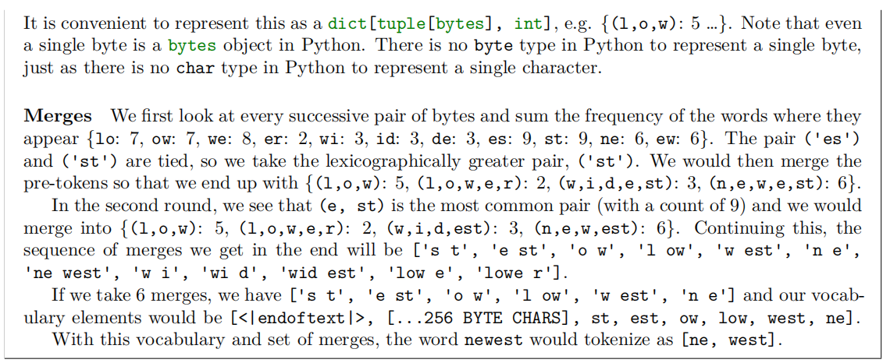

## Lab1 Building a Transformer LM

>Version 1.0.4 at 2025.8.1

### 1 Assignment Overview

这个实验要求的 implementation

-  Byte-pair encoding（BPE）tokenizer
- Transformer language model（LM）
- cross-entropy loss function and AdamW optimzer
- The training loop, with support for serializing and loading model and optimizer state

实验运行

- Train a BPE tokenizer on the **TinyStories dataset**
- Run your trained toknerizer on the dataset to convert it into a sequence of integer IDs.
- Train a Transformer LM on the **TinyStories dataset**
- **Generate samples and evaluate perplexity** using the trained Transformer LM
- Train models on OpenWebText.

实验禁止

- 禁止使用一些来自 `torch.nn`, `torch.nn.functional`, `torch.optim`的内容
- 允许 `torch.nn.Parameter`, `torch.nn`中的一些容器，比如 Module，ModuleList，Sequential和基于 `torch.optim.Optimzer`的基类

允许使用对话性大模型提问一些概念性和编程技巧的问题。鼓励不适用Cursor/Copilot这种工具进行开发

实验目录

- cs336_basics/*：进行开发的具体目录，可以在这里完成transformer和BPE的开发等
- adapters.py：代码必须具有的功能，需要完成这些代码的功能
- test_*.py：包含所有代码必须通过的pass

### 2 Byte-Pair Encoding（BPE） Tokenizer

>这一部分首先将实现一个 BPE tokenizer，将 Unicode strings 转换为 一系列的 bytes，然后用这些bytes sequence训练BPE tokenizer。而后，用这个tokenizer编码 一个text(string)成tokens（一串整数）
>
>实际上要完成一个 
>
>字符 $\rightarrow$  字节 $\rightarrow$ 整数序列 的转换，为后续模型训练提供可训练数据集

#### 2.1 The Unicode Standard

Unicode 是一个 文本编码标准，将字符映射成整数（integer code points）

- python中可以通过 `ord()`将 Unicode character 转换成一个整数表达
- `chr()`将一个整数转换成唯一的字符表达

>Problem:
>
>(a) What Unicode character does chr(0) return ?
>
>返回的是 null character，即 NULL。这是一个 控制字符，通常不可打印，在C语言风格的编程语言中经常用作字符串终止符
>
>(b) How does this character's string representation (`__repr__()`) differ from its printed representation?
>
>chr(0)的字符串表示和打印有明显的区别，字符串表示是转义后的可见形式，打印出来是空白的，实际上是一个null字符
>
>(c) What happens when this character occurs in text? It may be helpful to play around with the following in your Python interpreter and see if it matches your expectations:
>
>

#### 2.2 Unicode Encodings

Unicode Standard 定义了一种将字符转换为 code points(整数)的映射方式，但直接在朴素的 unicode 字符集上训练是不现实的，毕竟这个vocabulary太大了，并且太稀疏了（少部分频繁出现的字符占据了大部分字符集）因此，我们选择用 unicode encoding将一个unicode 字符转换成一列bytes。Unicode standard自己定义了三种编码方式：

- UTF-8：最主流的编码方式，超过98%的webpages在用这种编码方式
- UTF-16
- UTF-32

Python中可以使用 `encode()`将一个Unicode string编码成 UTF-8，并且可以使用 `decode()`将一个 UTF-8 byte string 转换为 Unicode string。

通过将Unicode codepoints 转换为 一系列 bytes，我们可以将一个 [0, 154997]区间范围的数字集转换为 [0,255]，256-length的vocabulary就更好控制了。然后使用byte-level tokenization就可以将unicode表示为0-255的一系列数字了

>Problem(unicode2): Unicode Encodings
>
>(a) What are some reasons to prefer training our tokenizer on UTF-8 encoded bytes, rather than UTF-16 or UTF-32? It may be helpful to compare the output of these encodings for various input strings.
>
>从存储效率来讲，UTF-8更紧凑，对于ASCII字符只用1字节，可以大大降低词表大小。并且互联网大部分文本都是UTF-8编码
>
>(b) Consider the following (incorrect) function, which is intended to decode a UTF-8 byte string into a Unicode string. Why is this function incorrect? Provide an example of an input byte string that yields incorrect results.
>
>```python
>def decode_utf8_bytes_to_str_wrong(bytestring: bytes):
>	return "".join([bytes([b]).decode("utf-8") for b in bytestring])
>```
>
>这个问题最主要的原因是UTF-8是变长编码，对于ASCII字符，确实1byte，对于其他字符是2-4字符。逐字符生成会有问题
>
>```python
># 测试包含非ASCII字符的情况
>test_input = "你好".encode("utf-8")
>print(f"输入字节: {test_input}")  # b'\xe4\xbd\xa0\xe5\xa5\xbd'
>
>try:
>    result = decode_utf8_bytes_to_str_wrong(test_input)
>    print(f"结果: {result}")
>except Exception as e:
>    print(f"错误: {e}")
>```
>
>UTF-8需要将完整的字节序列作为整体进行解码，而不能逐个字节处理。任何包含非ASCII字符的UTF-8字节串都会导致这个函数失败。
>
>(c) Give a two byte sequence that does not decode to any Unicode character(s).
>
>```python
>invalid_bytes = b'\x80\x80'
>```

#### 2.3 Subword Tokenization

byte-level tokenization可以缓解 word-level tokenizers面临的out-of-vocabulary问题，但是将文本编码成bytes会导致输入sequences很长。同时，在语言模型中，byte sequences太长会导致长文本数据依赖过长，难以进行训练。

subword tokenization是一个 介于 word-level tokenizers和 byte-level tokenizers的折中选择。如果一个byte sequence在原始预料文本中出现太多次，就会将其由多个token变成1个token

BPE算法实际上是一个压缩算法，迭代替换多次出现的byte-pair去最大化压缩输入序列。

#### 2.4 BPE Tokenizer Training

BPE tokenizer 训练过程主要包括 3个步骤

##### 2.4.1 Vocabulary initialization

tokenizer vocabulary是 bytestring token和integer ID 的一对一映射。初始的 vocabulary大小是256

##### 2.4.2 Pre-tokenization 

一旦拥有了一个vocabulary，你可以统计每个byte和他临近的byte出现了多少次，然后merge，但是这个过程有些过于废时间了。

直接跨语料库合并字节可能会导致仅标点符号不同的toekn（dog!和dog.），这些标记会获得完全不同的token，但是他们在语义上有高度相似性。

为了避免这种问题，我们对语料库进行了预分词处理，可以视为一种粗粒度的分词方法，用于统计字符对出现的频率。

可以使用类似 `regex` 库中的 `findall` 这样的接口做这件事。有些时候单纯的用空白符隔开。

##### 2.4.3 Compute BPE merges

##### 2.4.4 Special tokens




#### 2.5 Experimenting with BPE Tokenizer Training

Parallelizing pre-toeknization

Removing special tokens before pre-tokenization

Optimizing the merging step

