## Lecture 3 Everything you didn't want to know about LM architecture and training

### Outline and goals

#### standard transformer 

- what do most of the large LMs have in common?

#### What are common variations to the architecture / training process？

Common architecture variations

- Activations, FFN
- Attention variants
- Position embeddings

Hyperparameters that(do or don't) matter

- What is ff_dim? Do multi_head dims always sum to model_dim?
- How many vocab elements?

Stability tricks

### PartA：Common architecture variations

#### Norm

##### Pre vs Post norm

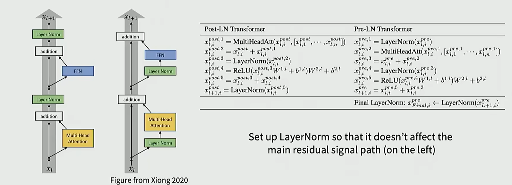

将layernorm前置到 MHA 之前，并在残差计算内。

post-norm会降低模型训练的稳定性，需要仔细设置 learning rate warmup 策略

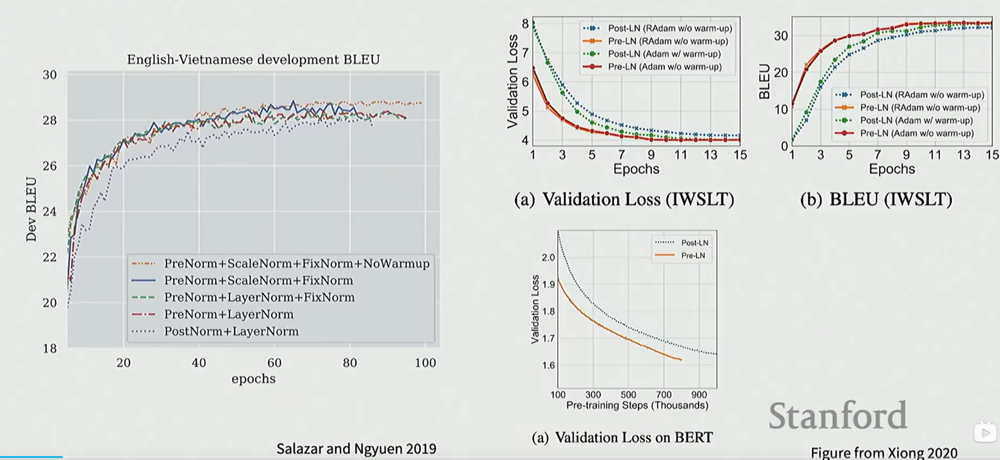

pre-norm本身就是一个更稳定的训练架构

>New things：double norm
>
>将post-norm放在residual stream之外，并且两次
>
>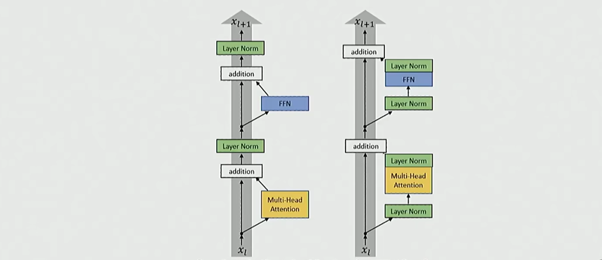
>
>Recent models：Grok Gemmma 2，Olmo 2

##### LayerNorm vs RMSNorm

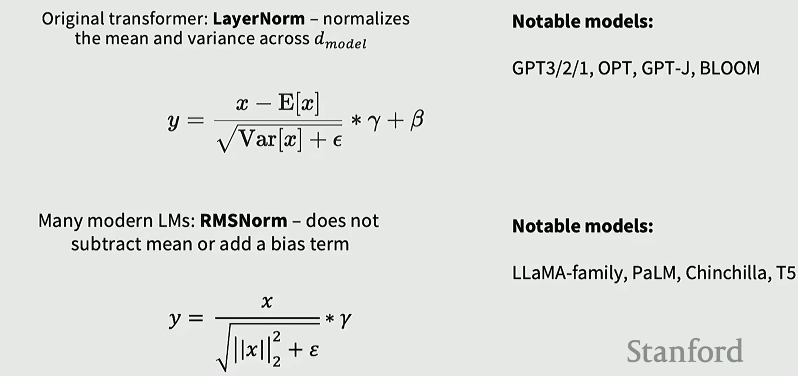

###### Why RMSNorm

用RMSNorm取得模型训练的效果与LayerNorm接近，但速度更快。

Modern explanation：fater and just as good

- 更少的操作：没有均值计算
- 更少的参数：不需要存储偏置项$\beta$

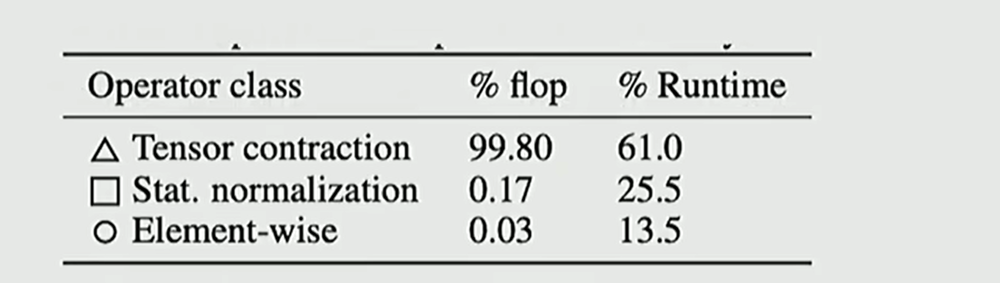

不仅仅需要考虑flops，还需要考虑**data movement**，RMSNorm在这方面有显著优化

##### Dropping bias terms

大多数现代transformer都没有bias了

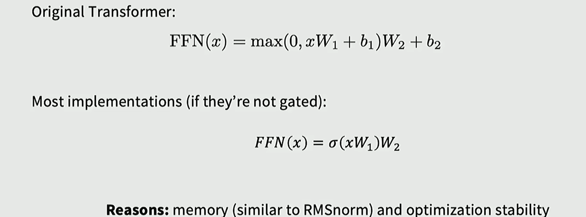

reasons：memory和 优化模型训练稳定性

#### Activations

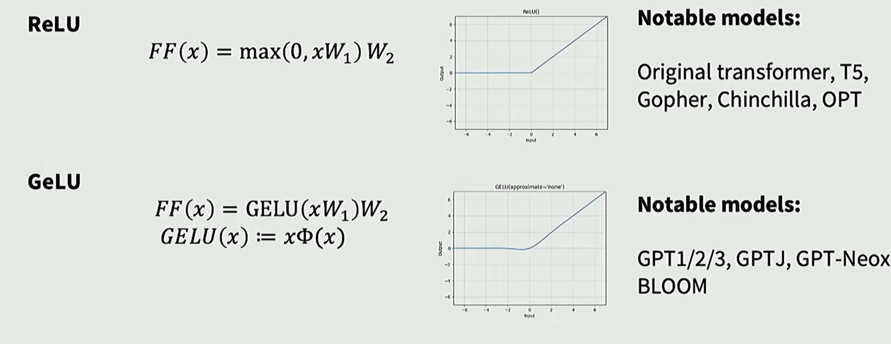

##### Gated activations

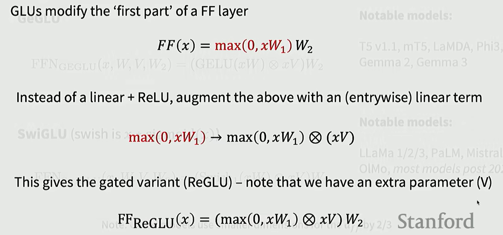

加一个门控函数，选择FFN层的一部分输出与W2进行矩阵乘

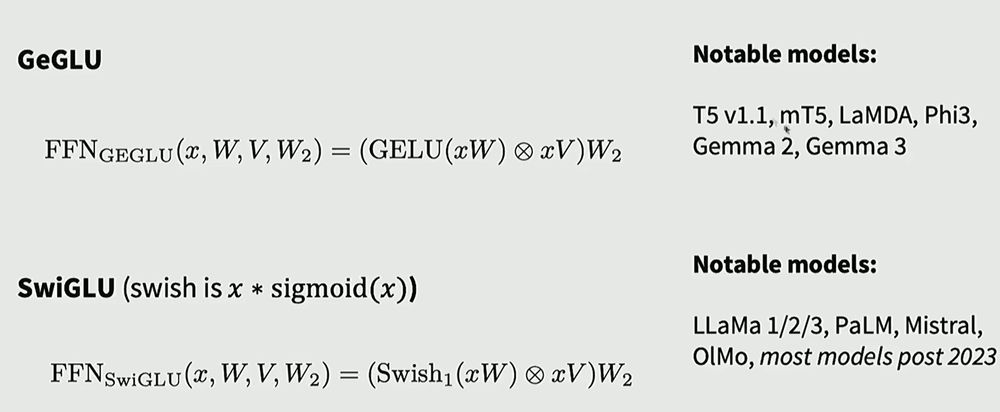

#### Serial vs Parallel layers

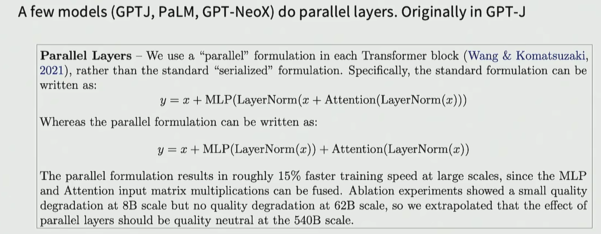

但是这种并行结构目前并不流行，大部分还是使用串行结构

#### Variations in position embeddings

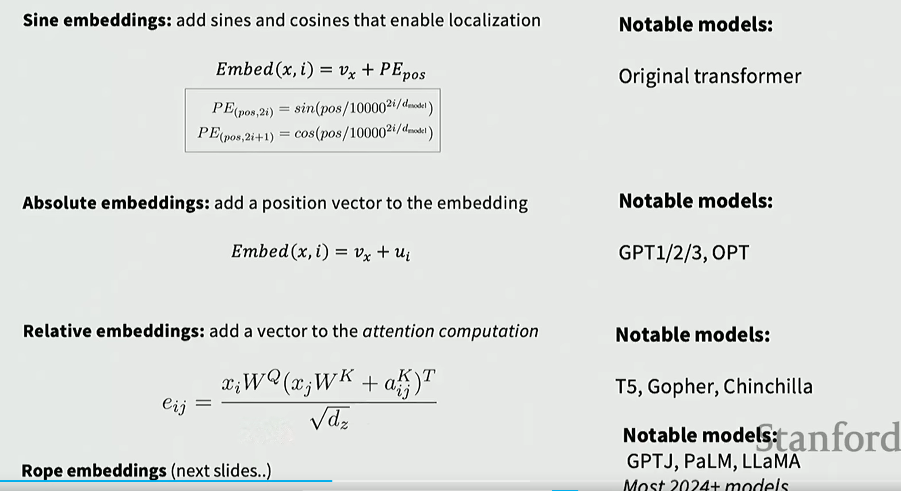

目前主要用RoPE

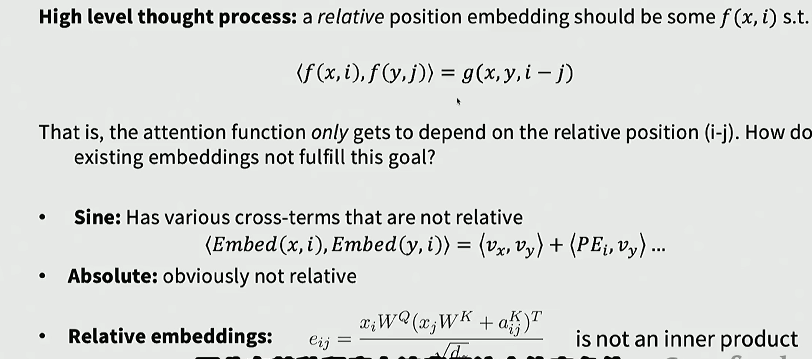

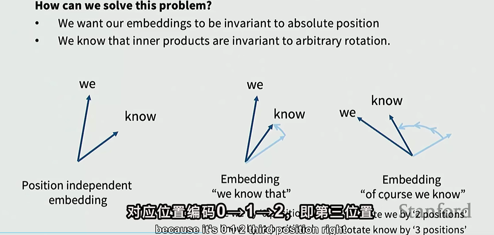

主要是旋转可以保证内积不变。

