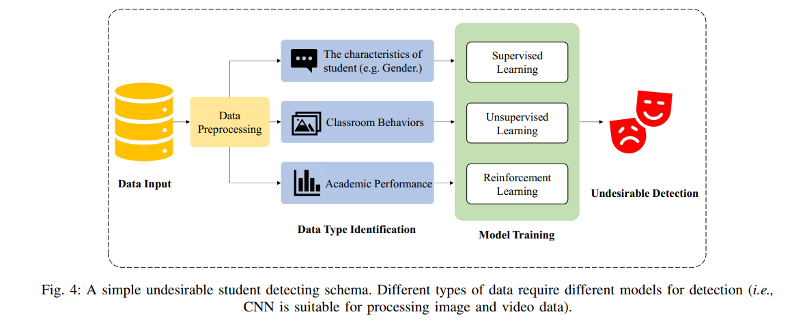

# 							文献调研报告

PB21111653 李宇哲

## 1.0 题目

选题：单文献调研，一篇EDM领域的综述，想要较为系统地了解DL模型在EDM领域的应用

A Comprehensive Survey on Deep Learning Techniques in Educational Data Mining

(Yuanguo lin, Hong Chen, Wei Xia...)

## 1.1 调研结果综述

### 1.1.1Abstract

EDM（Educational Data Mining）利用计算技术去分析教育学中的数据。这篇综述系统地EDM与深度学习的前沿技术。

下面是这篇综述介绍的outline

- 先介绍EDM和深度学习是什么
- 在EDM领域深度学习的应用（包括knowledge tracing， undesirable student detecting， performance prediction， and personalized recommedation）
- EDM提供对公开数据集处理的工具
- 这个领域的前沿方向

### 1.1.2 Introduction

#### Deep learning

深度学习：是机器学习的一种形式，依赖于人工神经网络去发现层次特征，提高模式识别的能力。

- 与机器学习的不同：不需要手动特征工程，通过用多层抽象自动发现数据集中的复杂结构
- 三类算法：suprevised learning ，unsupervised learning and reinforcement learning（强化学习）

#### EDM & LA（Learning Analytics）

- EDM：包含利用计算机技术和工具实现(atuomated identification, extraction of meaningful patterns and valuable information from extensive datasets)
- LA：包含系统采集，检查，呈现与学习者有关的数据和环境

#### EDM scenarios

- knowledge tracing
  - DKT(Deep Knowldege tracking)
  - DKT based on Memory networks, Attention mechanisms and Graph structures
- undersiable student detection
  - Student Dropout Prediction(SDP), applying (Complex neural network)
- performance prediction
  - neural networks can provide quite reliable accuracy
- personalized recommendation
  - hybrid techiques based recommendation algorithms

#### Advantage of Deeping learning compared with traditional machine learning models

- automatic learning of hierarchical representations from raw data, **eliminating the need for manual feature engineering**
- the capability of DP models to detecting complex connections and intricate patterns within the data leads to **more accurate predictions** and **personalized recommendation**

#### Contribution of this paper

- provide a structured and in-depth analysis of the wide range of research conducted on the intersection of Deep Learning and education
- includes a discussion of relevant datasets and data tools
- put forward some promising areas for further reaserch in Deep Learning-based EDM.

### 1.1.3 Methodology（方法论）

Deep Learning mimics the structure and working mode of human brain neural network. Realizing the recognition and classification task through model training.

#### A. Supervised Learning(监督学习)

The requirement of large amounts of labeled historical data makes supervised learning suitable for knowledge tracing and performance prediction.

>These data can be used to train supervised learning models to establish mappings between inputs and outputs and predict students' knowledege mastery and future performance.

##### CNN(卷积神经网络)

extract and feature and reduce the dimension of image through 

- convolution
- pooling operations

high-dimensional image -> one-dimensional vector data

###### activation function ReLU

a non-linear function

- help improve the nonlinear ability of the model

$ReLU:f(x) = max(0,x)$

- x refer to the input data

##### RNN

handing sequential data(text and speech)

- the neural nodes of RNN are able to receive the former status information to realize the memorability

###### a basic RNN equation

$h_t = \sigma(W_{ih}x_t +W_{hh}h_{t-1}+b_h)$

- $x_t$ refers to input vector
- $h_t$ is the hidden state vector
- $W_{ih}, W_{hh}$ are the weight matrices connecting the input to the hidden state and the hidden state to the hidden state
- $b_h$ is the bias vector
- $\sigma$ is the nonlinear activation function

##### DKT(Deep Knowledge Tracing model)

employs  a significant number of artificial neuron vectors to represent potential knowledge states and temporal dynamics

##### LSTM(Long Short-Term Memory) 

contains three gate units and a memory cell

the forgetting gate control whether previous moment's memory cell state is forgotten

$f_t = \sigma(W_f \cdot[h_{t-1},x_t]+b_f)$

- $f_t$ denotes the state of the forgotten gate
- $W_f$ is the weight matrix
- [$h_{t-1}, x_t$] denotes the connection between the output from the previous and the input from the current moment
- $b_f$ is the bias vector
- $\sigma$ is the sigmoid function

##### GNN(Graph Neural Network)

process image data

- use the information of nodes and edges in graph to calculate
- learns and deduces the features of nodes and edges

##### Recursive Neural Network(Recursive NN)

modeling natural language

- use a bottom-up approach to represent input sentences as vectors
- the core principle of Recursive NN is the recursive computation based on a tree structure
  - allows for the representation of learning components as trees with nodes containing multiple concepts or knowledge points

##### Attention

enhance the model's focus and understanding of key information

- the core idea is to assign weights to different parts of the input according to task requirements

- the typical Self-Attention mechanism can be expressed by the following formula

  $Attention(Q,K,V) = Softmax(\frac{QK^T}{\sqrt{d_k}})V$

  - Q means a matrix packaged from queries
  - K refers to the key
  - V means value 
  - $d_k$ is the key dimension

  by calculating the similarity between the query and the key and normalizing it, the attention weight distribution is calculated and ultimately used to weight the sum values to obtain the final representation.

#### B. Unsupervised Learning(非监督学习)

Unsupervised learning is a good approach to solving undesirable student detection, since the task relies more on **discovering latent patterns and clustering structures** in student behavior data **without the need for explicit labeling.**

- identify differences between student groups
- detect students who behave abnormally by clustering, dimensionality reduction and other techniques.

##### GAN(Generative Adversarial Network)(生成对抗网络)

a combination of generator neural network and discrimination neural network.

The target of GAN is to learn and generate samples that resemble real data, with a high degree of diversity.

The loss function of discriminator and discriminator is 

The most common use is personalized recommendation

##### DBN

a DNN made of multiple Restricted Boltzmann Machines(RBM).

The core formula used in DBN is te Boltzmann distribution formula

- describe the joint distribution relationship between the hidden and vsiible layers.

- v denotes the state of the visible layer
- h denotes the state of the hidden layer
- E(v,h) denotes the energy function
- Z is the normalization constant

#####VAE

the marginal likelihood lower bound estimator based on mini-batches

- $\theta，\phi$ are two sets of parameters in the VAE model that control the structure and parameters of the encoder and decoder respectively.
- X is the training dataset, each sample $x^i$ is a D-dimensional vector, i is the index of the sample, and N is the total number of samples in the dataset
- M is the mini-batch size used in VAE

##### DBN and VAE comparison

DBN is more suitable for classification tasks

VAE is more appropriate for generative tasks

DBNLS(Deep Belief Network for Large-Scale Online Education) model is used in identifying and classifying the various types of learning styles among students.

#### C. Reinforcement Learning(强化学习)

the training data used in reinforcement learning is traditionally generated through the intercation of an intelligent body with its environment.

- suitable for personalized recommendation

In reinforcement learning

- an intelligent body takes a specific action by observing the state of the environment and evaluates its behavior based on the reward or punishment given by the environment.

##### 1.Value Function Approach

achieve the global optimal payoff(全局最优收益) by obtaining the best action

>the optimal gain is produced through the optimal action a* under the optimal strategy $\pi$*
>
>

the ability of the value function to take into account long-term benefits allows the model to make more informed decisions.

##### 2.Policy Search Method

maximizes the expected return in a direct optimization of strategies that are influenced by a set of policy parameters $\theta_t$

- the gradient-based policy search method(基于梯度的搜索策略) uses the Gradient Ascent method, which maximizes the strategy performance J with respect to the parameter $\theta$ by iteratively updating the strategy parameters

  $\theta_{t+1} = \theta_t + \alpha \nabla J(\theta)$

  - $\theta_{t+1}$ refers to the parameter of policy at time t + 1
  - $\nabla J(\theta)$ is the gradient of $\theta_t$ -based policy's performance
  - $\alpha$ is a learning rate which controls the step size of each parameter update.

- Monte Carlo policy gradient-based method(RE-INFORCE) 

  estimates the policy gradient by Monte Carlo sampling and uses the gradient ascent method to update the policy parameters

  the REINFORCE algorithm can be implemented by the following equation:

  

##### 3.Actor-Critic Algorithm

solve problem of learning optimal policies in unknown environments

The core idea

- guide Actor's policy improvement through the estimation of value functions provided by Critic, which in turn estimates the value of  a state action pair based on the current policy and environment interaction data Critic then evalutates the merit of a policy based on the cruuent policy and environment interaction data.

the equation of $\theta$ update can be expressed as:

### 1.1.4 Educational scenarios and corresponding algorithms

#### A. Knowledge Tracing 

Knowledge tracing is an educational assessment technology that tracks students' learning process and predicts their mastery of knowledge points.

##### students' learning process

- learning time
- answer status
- homework completion
- etc.

##### the problem of knowledge tracing in intelligent education systems

- the student S
- the exercise E
- the corresponding knowledge concept C

The interactions X among these elements are the main activities in such systems.

given a student's historical exercise interactions $s \in S$, where each interaction $X_t \in X$ corresponds to an exercise $e \in E$ and denotes the correctness $a_t \in \{0,1\}$ of the result obtained at step t, the knowledge tracing task aims to predict the next interaction $X_{t+1}$ for a specific concept $c \in C$

the correct rate of a student in a certain exercise on a specific knowledge point can affect the model's judgment of the proficiency level of students on this knowledge point.

##### 1.Supervised Learning

mainly focused on various kinds of neural networks

- LSTM

  manage the forgetting and learning behaviors of student to update knowledge state

  - A GFLDKT model, use a Gating-controlled Forgetting and Learning mechanism to effectively update the knowledge state and facilitate accurate prediction of subsequent student responses.

  - DFKT model: consider forgetting processes of student

    apply LSTM and NFM

    - LSTM:used to represent knowledge state of student as low dimensional dense vectors
    - NFM:combines student knowledge states and other related information include relevant forgetting data to predict student performance

- CNN

  be able to process the spatial sequence data

  - DKT-STDRL model: employs CNN to extract spatial features from students' learning sequences and LSTM to process temporal features

- GNN

  - a heterogenous graph(异构图 based algorithm called HHKST, utilizes a GNN-based  base feature extractor(BFE) to extract interaction and knowledge structure features from the heterogenous graph

- RNN

  designed for handling sequential data

###### Knowledge Graph(KG)

accounts for the interplay between a student's learning history and specific areas of expertise.

- models can more accurately capture learning trajectories and interactions between different points of knowledge.

###### application of Attention mechanisms

Context-Aware Attentive Knowledge Tracting(AKT) 

- attention mechanism is used to dynamically adjust predictions based on contextual information about learners.
- allows the model to adapt its predictions according to the specific context of each learner.

Self-Attentive Knowledge Tracing model(SKAT)

- identify and predict the mastery level of students for specific knowledge points

##### 2.Unsupervised Learning

###### basic information

use relatively little in this field

- unsupervised learning requires dealing with a large amount of unlabeled data, while in knowledge tracing there is usually only a limited amount of label data, making it difficult to train accurate models using unsupervised learning methods.

some researchers started to explore the use of unsupervised learning in knowledge tracing

###### one application example

- Autoencoder based DKT which combines knowledge tracing and transfer learning.

  Autoencoder here is used to convert question text to a high-level semantic embedding

##### 3.Reinforccement Learning

###### basic information

able to learn the **knowledge statu**s and **level of students** by rewarding or punishing trhough decisions and actions they make without pre-labeled data.

consider the learning process as **a sequential decision problem**

- student need to make different decisions according to different knowledge points which might affect the future learning process.

###### two application example

- RL-KTNet algorithm

  adopt reinforcement learning to automatically generate recurrent neural nework cells used in knowledge tracing.

- Individual Estimation Knowledge Tracing(IEKT)

  incorporates reinforcement learning for auxiliary model training.

#### B. Undesirable Student Detecting

The objective is to identify undesirable students' behaviours like

- low motivation
- low engagement
- cheating
- dropout
- procrastination

A simple process of undesirable student detection

##### 1.Supervised Learning

###### basic information

The application of supervised learning in this field are **relatively diverse**.

###### 5 application example

- ATGCN

  based on CNN to detect students' undesirable behaviours in the classroom such as napping etc.

- Tree-Based model

  applies if-then-else rule to detect the probability of student dropout

  employ three classifier model : Decision Tree, Logisic Regression and SVM

- LR-KNN-RF model

  analyzing the dropout rate of MOOC from learners won characteristics and learning behaviours.

- DPBN

  based on Bayesian Network(BN) , constructed by mutal information and pruning, also generate parameters by MLE(最大似然估计) 

  the model is relatively explainable because it can demonstrate the effect of individual features on dropout rates.

- CFIN(Context-aware Feature Interaction Network) model

  predict user dropout behaviors in MOOCs

##### 2.Unsupervised Learning

###### basic information

In addition to the **K-means algorithm**, which is similar to the classification model described above and detects student misbehavior by **clustering behaviors,** there is an unsupervisied learning that can be appiled to this field.

###### 1 application example

FTGAN

- Fine-Tuning GAN to predict the attrition rate of student.

##### 3.Reinforcement Learning

###### basic information

reinforcement learning may not be the most appropriate method for predicting student dropout rates or detecting undesirable behavior

- students' behavior is often influenced by many factors, which are difficult to describe in terms of simple states and actions
- difficult to define the rewards and punishments for students behaviors that lead to dropout outcomes.

did not collect literature on the detection of student undesirable behaviors by reinforcement learning.

#### C. Performance Prediction

test scores, academic performance, course completion rates, etc are areas may used data and analytic techniques to predict student performance

the difference between performance prediction and course completion is that 

- the performance prediction focuses on **predicting students’ overall future task** or **test performance based on historical learning data**
- the knowledge tracing focuses on **students’ understanding and mastery of specific knowledge concepts** during the learning process

By predicting student performance, teachers and educational institutions can better understand students’ learning and needs in order to provide more effective support and guidance.

cognitive diagnosis is a related concept wherein the aim is to **identify students’ level of mastery in specific knowledge domains** by analyzing their performance on exercise records.

##### 1.Supervised Learning

###### basic information 

provide teachers and students with useful information to help them better understand student performance and needs.

###### application example

- a hybird model called CRN(combination of CNN and Recurrent NN) to predict the students’ grade, and improves the performance by **tunning hyper parameters** through GRSO algorithms

- Decision Tree as a predicitive model is attributed to its decision mechanism

  the output are wrong if more than half the decision trees(DT) yield incorrect judgements

- SDPNN model

  apply a linear classifier based DNN to prediction student academic performance.

  two hidden layers with 300 neurons be defined.

  Activation function is ReLU and Softmax

  

  - $z_i$ represents the $i_{th}$ element of the input vector
  - K is the number of categories

- SAPP system 

  utilize four layers stacked LSTM, Random Forest and Gradient Boosting.

  - LSTM: extract features
  - Random Forest and Gradient Boosting: predict

##### 2.Unsupervised Learning

###### basic information

GAN can perform grade prediction by taking a student’s historical grades as input and using generators and discriminators to generate predicted values for future grades.

- the generator can use the student’s prior grades and other relevant factors to generate predicionts of future grades
- the discriminator is used to determine whether the generated predictions are similar to the true grades.

###### application example

a model combined with Conditional GAN（CGAN） and Deep-Layer-Based SVM to predict students’ grade according to school or home tutoring

- CGAN was used to generate performance score data to address the issue of small dataset size

##### 3.Reinforcement Learning

###### basic information

not suitable for student performance prediction.

reinforcement learning can set reward stragies based on student behavior to optimize the student’s learning path. 

- In this case, reinforcement learning also needs to assess the current performance of students and predict the optimized performance for the purpose.

###### application example

ADSLS model to automatically detect and precisely adjust students’ learning styles

- the model predicts and assesses student performance on a point and rewards performance while updating learning strategies.

NCAT model utilizes reinforcement learning to enhance the effectiveness of e-testing system.

- employs deep reinforcement learning to dynamically optimize test terms based on given condition.

#### D. Personalized Recommendation

a detailed definition of a recommendation system is

- Assuming the presence of M users and N items, we denote the interaction matrix and predicted interaction matrix as R and $\hat{R}$ respectively.

  The user preference for item i is represented as $r_{ui}$, while the predicted score is denoted by $\hat{r_{ui}}$ 

- There will also be two partially observed vector, one represents a specific user u

  $r^{(u)} = \{r^{u1},...,r^{uN}\}$, another one represents a specific item i, i.e $r^{(i)} = \{r^{1i},...,r^{Mi}\}$

In the education scenarios, item is replaced with educational resources such as courses.

The primary objective of a course recommendation system is to suggest the most suitable course to a user at time t+1, taking into account their past learning activities and learner profiles prior to time t.

The primary challenge faced by such recommendation systems is to provide personalized recommendations by precisely depicting and conceptualizing user inclinations through analysis of user data.

##### 1.Supervised learning

###### basic information

can better handle user behavior sequences and nonlinear features.

neural networks can automatically extract features from the data to more accurately predict users’ interests in the recommendation process

###### application example

SODNN:

a novel model consist of  **synchronous sequences**, **heterogeneous features** and DNN

and the author try to concatenate additional features to overcome **cold-start problem**.

>cold-start:
>
>for example, large errors caused by missing user data during the initialization

CSEM-BCR model:

adopts negative sequence modeling: constructs the course-learning sequence as a negative sequence pattern.

the negative sequence pattern is then processed using CNN for feature learning, which generates a list of recommended courses for each user.

KG can address the sparsity issue in recommender systems

GNN as a neural network model specifically for processing graph structures, has also been applied by many scholars to deal with recommender systems.

Full-path Recommendation System(FRS) based on LSTM:

LSTM is employed for predicting learning performance, and if the result is unstisfactory, the system will select the most relevant learning path for users based on their individual learning features.

KNN-NCF model:

KNN is used here to cluster courses that have different coments for the purpose of optimizing the output.

##### 2.Unsupervised Learning

###### Basic information

In recommender systems, user preferences and behaviors are often incomplete and inaccurate, and tagging data is very difficult and expensive to collect.

Unsupervised learning is a great means to achieve personalized recommendation.

- can extract potential interests and preferences from user’s historical behaviors 
- infer the similarity and interest relevance of users through clustering.

###### application example

RecGAN model:

based on GAN and Recurrent NN.

the generator is allowed to play a Mini-Max game with the discriminator to minimize the generation error of the generator while maximizing the discriminator’s ability to distinguish false ratings from true ratings.

DBN-based DBNLS model

detect and classify learning styles.

##### 3.Reinforcement Learning

###### Basic information

Reinforcement learning algorithms can learn the optimal recommendation strategy based on students’ feedback to improve the recommendation effect, and can be optimized based on different evaluation metrics.

###### application example

A cognitive structure enhanced framework fro adaptive learning named CSEAL was proposed to achieve personalized learning path recommendation.

- views learning path as a Markov Decision Process(MDP,马尔科夫过程) and applies actor-critic to identify appropriate learning projects for individual learners.

MEUR based on Graph Convolution Network and reinforcement learning

The attention mechanism also serves other purposes.

- a user has enrolled in multiple courses can become challenging to identify the most pertinent historical course.

HRRL algorithm applies  Attention-based recommend system and Recurrent Reinforcement Learning. By sharing the embeddings of user profiles during training, the model is able to reconstruct user profiles that enhance the accuracy of the recommendation system.

- have drawbacks such as a decrease in the accuracy of the recommendation model when a user is interested in multiple courses simultaneously

KG can also assist reinforcement learning in course recommnedation.

### 1.1.5 Datasets and Processing tools

#### A. Datasets

this paper classify the collected datasets by source into three categories

- Datasets used for competitions
- Datasets from online education platforms
- Open data repository

##### Datasets Used for competitions

ASSISTments

KDD Cup 2010

##### Datasets from online education platforms

junyi academy online learning activity dataset

canvas network dataset

learn moodle

xuetangX

EdNet

##### Open Data Repository

MOOCCube

xAPI-Educational Mining Dataset

#### B. Processing Tools

LOCO-Analyst, Datashop, SNAPP, GISMO and Meerkat-ED etc.

### 1.1.6 Future Directions

here are several potential insights into successful techniques for EDM using Deep Learning.

#### Learning analysis and Intervention

future work could investigate the use of real-time learning algorithms

We can combine Multi-Task Learning with Attention mechanisms to analyze student interaction data from learning management systems or other educational platforms, providing knowledge tracing and option tracing into engagement and learning patterns.

#### Social Network Analysis and Collaboration

By learning directly from the graph structure and node features, GCNs can capture complex patterns in social networks, helping to analyze social networks within educational settings, revealing patterns of collaboration and communication among students.

#### Explainable AI in EDM

create more transparent and interpretable models

future research could aim to develop or improve methods for generating understandable explanations of model predictions.

#### Large Language Models for Education

LLMs could be used to generate personalized educational content tailored to each learner’s needs, interests, and proficiency level.

LLMs could help create advanced Intelligent Tutoring systems(ITSs) that can understand and respond to student queries in a contextually appropriate manner.

It would be interesting that GPT-based architectures are employed to automatically score student  essays or assess written responses.

#### Multimodal Learning Analytics

Many current EDM methods primarily rely on structured data.

Educational experiences produce a wealth of unstructured and semi-structured data which provide a more comprehensive understanding of student learning experiences.

#### Benchmark Datasets and Evaluation Metrics

There’s a lack of universally accepted benchmark datasets in EDM. Future work should focus on creating large, diverse , and representative datasets that cover various aspects of the educational process.

#### Fairness and Privacy

Dealing with student data brings ethical considerations and privacy concerns to the forefront.

- ensuring that EDM models do not perpetuate or amplify biases is a significant challenge.
- to protect students’ privacy, the development and application of privacy-preserving data mining techniques should be a key focus.
- future work could explore the implementation and optimization of federated learning algorithm in EDM

## 1.2 学习心得与思考

选择这篇综述的原因是，个人对于Data Dining的各个领域和CNN,RNN等深度学习模型的了解太少了，因此选择了一篇EDM领域的综述，想系统的了解一下Educational Data Dining和各个DL的模型在其中的应用。

1.1 部分对paper中的一些标题下的关键信息做了些摘要和summary

这篇综述介绍了三种深度学习的方法

- 监督式学习

  包括CNN, RNN, DKT, LSTM, GNN, Recursive NN 等

- 非监督式学习

  GAN(生成对抗网络) ，DBN ，VAE

- 强化学习

  Value Function Approach， Policy Search Method，Actor-Ctrtic Algorithm

然后阐述了4种教育数据挖掘领域的应用前景，并分别介绍了三种深度学习的方法在其中的应用，和一些模型改进的实例。

- Knowledge tracing
- Undesirable Student Detecting
- Performance Prediction
- Peronalized Recommendation

此外，还介绍了三类数据集

- Dataset used for competitions 
- Dataset from online education
- Open data repository

和一些处理数据的工具

最后，介绍了一些未来EDM领域的潜在研究方向和研究课题

其中隐私方向的差分隐私，k-anaoymous，l-diversity和t-closensss等隐私定义，能对公开的数据集起到一定的保护作用。教育领域的数据集包含很多学生的信息，而则这部分信息需要很严格的privacy protection，因此会和EDM领域产生交集。

现在大致对EDM领域有了一个基本的了解，有更浓厚的兴趣去了解基本的DL模型和其中的Peronalized Recommendation领域，决定从李宏毅老师的机器学习课程开始，逐步了解学习。

## 1.3 参考文献 

A Comprehensive Survey on Deep Learning Techniques in Educational Data Mining  （Yuanguo Lin1, Hong Chen1, Wei Xia, Fan Lin∗, Pengcheng Wu, Zongyue Wang∗, Yong Liu  ）

Deep knowledge tracing based on spatial and temporal representation learning for learning performance prediction （L. Lyu, Z. Wang, H. Yun, Z. Yang, and Y. Li  ）