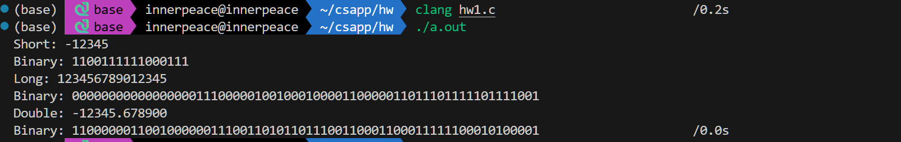

## 计算机系统 HW1 

>SA25011049 李宇哲

### T1 2.58

```c
#include <stdio.h>
#include <string.h>


void show_short(short x) {
    // 输出 x 的二进制表示
    for (int i = sizeof(short) * 8 - 1; i >= 0; i--) {
        putchar((x & (1 << i)) ? '1' : '0');
    }
    putchar('\n');
}

void show_long(long x) {
    for (int i = sizeof(long) * 8 - 1; i >= 0; i--) {
        putchar((x & (1L << i)) ? '1' : '0');
    }
    putchar('\n');
}

void show_double(double x) {
    unsigned long long bits;
    memcpy(&bits, &x, sizeof(double));
    for (int i = sizeof(double) * 8 - 1; i >= 0; i--) {
        putchar((bits & (1ULL << i)) ? '1' : '0');
    }
    putchar('\n');
}
int main() {
    short s = -12345;
    long l = 123456789012345;
    double d = -12345.6789;
    printf("Short: %d\nBinary: ", s);
    show_short(s);
    printf("Long: %ld\nBinary: ", l);
    show_long(l);
    printf("Double: %f\nBinary: ", d);
    show_double(d);
    return 0;
}
```

由于我手头只有一种机器，在当前主机上结果如下

>



### T2 2.61

```c
int get_result(int x) {
    return !(~x) | !x | !((x & 0xFF) ^ 0xFF) | !(((unsigned)x >> 24) & 0xFF);
}
```

### T3 2.77

```c
#include <stdio.h>
#include <stdlib.h>

int main(void) {
    int x = 5;

    // A
    int a = (x << 4) + x;
    printf("A: %d\n", a);

    // B
    int b = x - (x << 3);
    printf("B: %d\n", b);

    // C
    int c = (x << 6) - (x << 2);
    printf("C: %d\n", c);

    // D
    int d = (x << 4) - (x << 7);
    printf("D: %d\n", d);

    return 0;
}
```

### T4 2.84

```c
#include <stdio.h>
#include <stdlib.h>
unsigned f2u(float f) {
    return *((unsigned*)&f);
}

int float_le(float x, float y) {
    unsigned ux = f2u(x);
    unsigned uy = f2u(y);

    unsigned sx = ux >> 31;
    unsigned sy = uy >> 31;


    return (sx != sy) ? (sx > sy) : ((sx == 0) ? (ux <= uy) : (ux >= uy));
}
int main(void) {

    // test
    float x = -1.5f;
    float y = 2.5f;
    int result = float_le(x, y);
    printf("Result of float_le(%f, %f): %d\n", x, y, result);
    return 0;
}
```


### T5 2.89

#### A

总是成立，都是将同一个整数值转换为float

#### B

反例：x = 2147483647， y = -1

#### C

总是为1，dx，dy和hz都是从int精确转换，整数的double表示满足结合律

#### D

反例：

```
int x = 2000000000;
int y = 2000000000;
int z = 2;
```

### T6 2.91

A.

11.0010010000111111011011

B.

`11.001001001001...₂`（循环）

C.

小数点后8位

