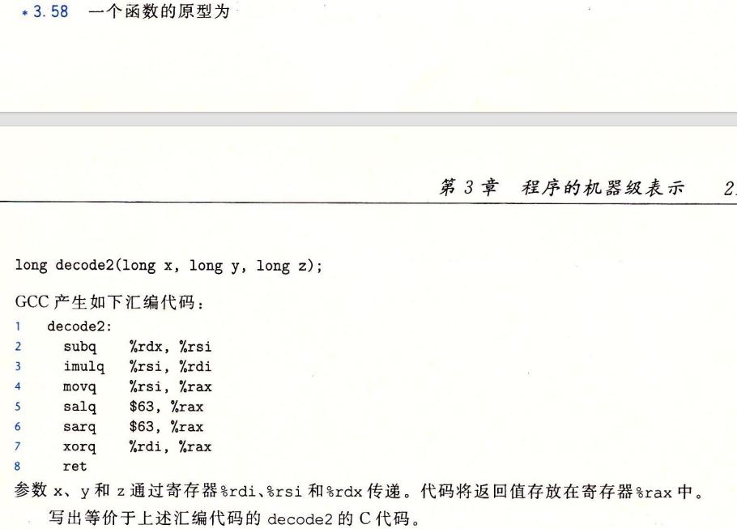

## 计算机系统 HW2

>SA25011049 李宇哲
>
>《深入理解计算机系统-第三版》书本第三章
>
>3.58  3.60  3.63  3.69  3.70

### T1（3.58）

>

```c
long decode(long x, long y, long z){
    y = y - z;
    x = x * y;
    long temp = (y << 63) >> 63;
    return temp ^ x;
}
```

### T2（3.60）

```c
long loop(long x, int n)
{
    long result = 0;
    long mask;
    for (mask = 1; mask != 0; mask = mask << n) {
        result |= x & mask;
    }
    return result;
}
```

### T3（3.63）

```c
long switch_prob(long x, long n){
    long result = x;
   	n = n - 0x3c;
    switch (n) {
        case 0:
        case 2:
            result *= 8;
            break;
        case 3:
            result >>= 3;
            break;
        case 4:
            result *= 15;
        case 5:
            x = result * result;
        default:
            result = x + 0x4b;
    }
    return result;
}
```

### T4（3.69）

A. CNT=7

B.

```c
typedef struct {
    long idx;
    long x[4];
} a_struct;
```

### T5（3.70）

A.

```
e1.p 0
e1.y 8
e2.x 0
e2.next 8
```

B.

16

C

```c
void proc(union ele* up) {
    up->e2.x = *(up->e2.next->e1.p) - up->e2.next->e1.y;
}
```

