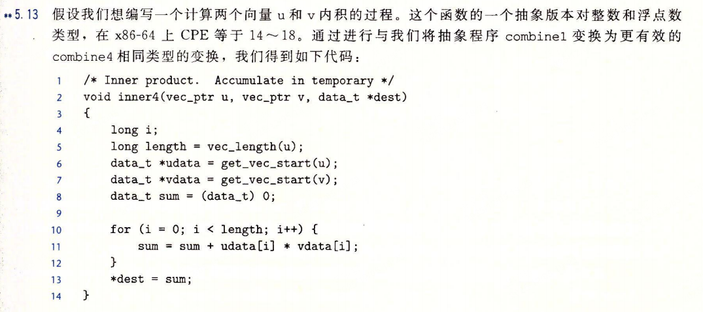
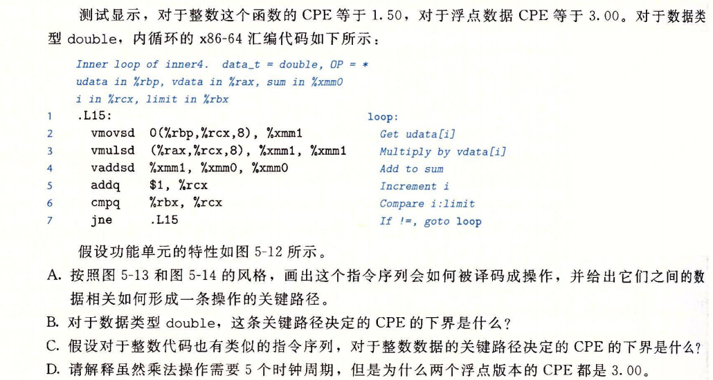
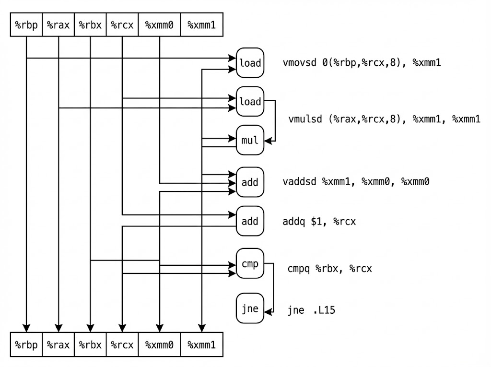
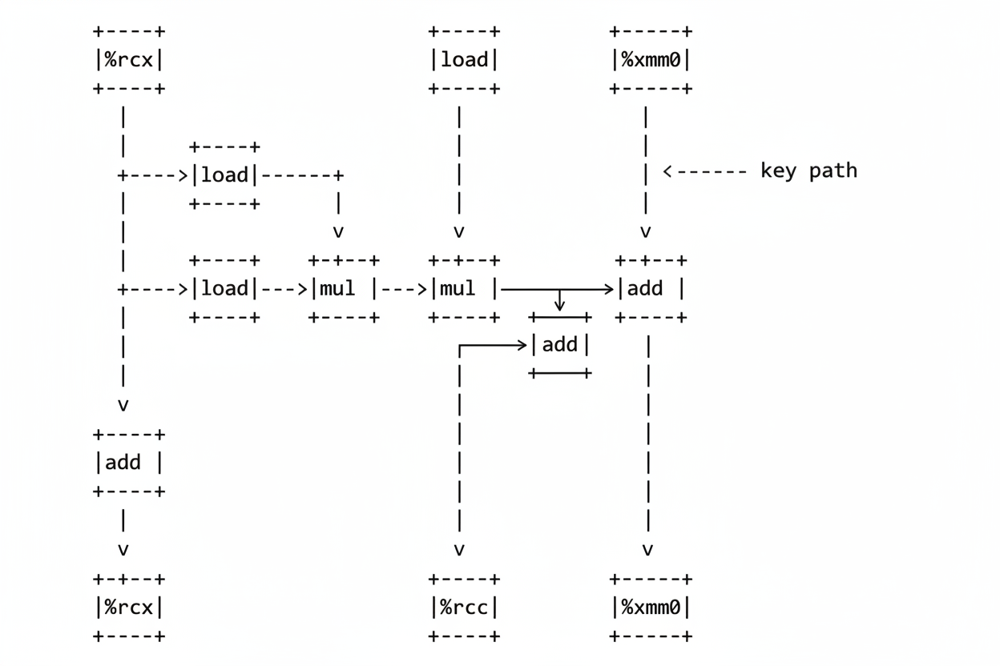
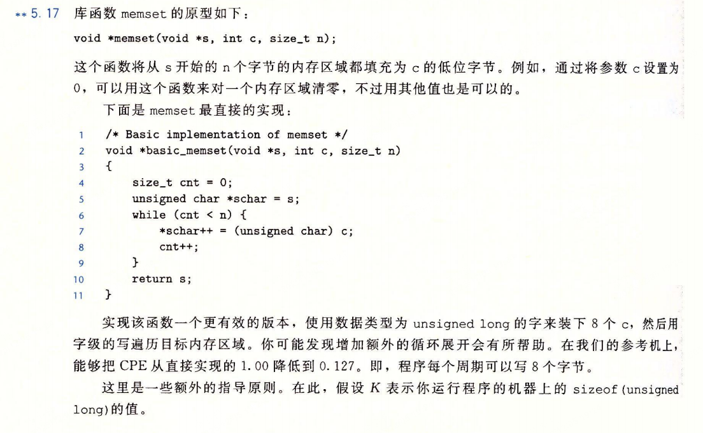
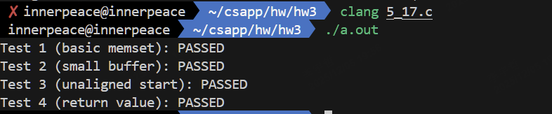

## 计算机系统 HW 3

>SA25011049 李宇哲

### T1（5.13）





#### A.





#### B.

CPE 的下界由浮点加法的延迟决定，CPE 是 3.0

#### C.

CPE 的下界由整数加法的延迟决定。CPE 是 1.0

#### D.

浮点乘法不在循环所在的关键路径上，每一轮迭代中乘法操作只依赖于当前轮加载的数据，不依赖于上一轮的计算结果。所以 cpu 可以利用流水线并行蛆执行多个 乘法操作，因此CPE与浮点乘无关，还是跟浮点加有关

### T2（5.17）




```c
#include <stddef.h> // for size_t
#include <stdint.h> // for uintptr_t
#include <stdio.h>  // for printf
#include <string.h> // for memcmp

void *effective_memset(void *s, int c, size_t n) {
    unsigned char *schar = (unsigned char *)s;
    unsigned char uc = (unsigned char)c;
    size_t K = sizeof(unsigned long); 
    
    // Alignment
    while (n > 0 && ((uintptr_t)schar % K != 0)) {
        *schar++ = uc;
        n--;
    }
    if (n >= K) {
        unsigned long c_long = 0;
        for (size_t i = 0; i < K; i++) {
            c_long |= ((unsigned long)uc << (8 * i)); 
        }
        unsigned long *slong = (unsigned long *)schar;
        size_t cnt = n / K; 
        size_t limit = cnt - 7; 
        while (cnt >= 8) {
            *slong++ = c_long;
            *slong++ = c_long;
            *slong++ = c_long;
            *slong++ = c_long;
            *slong++ = c_long;
            *slong++ = c_long;
            *slong++ = c_long;
            *slong++ = c_long;
            cnt -= 8;
        }
        // Remain
        while (cnt > 0) {
            *slong++ = c_long;
            cnt--;
        }
        schar = (unsigned char *)slong;
        n = n % K;
    }
    while (n > 0) {
        *schar++ = uc;
        n--;
    }

    return s;
}
```

对上述函数我进行了 4 个 testcase 的 测试，结果如下

```c
// Test main function
int main() {
    // Test 1: Basic functionality
    char buf1[100];
    effective_memset(buf1, 0xAA, 100);
    int test1_passed = 1;
    for (int i = 0; i < 100; i++) {
        if ((unsigned char)buf1[i] != 0xAA) {
            test1_passed = 0;
            break;
        }
    }
    printf("Test 1 (basic memset): %s\n", test1_passed ? "PASSED" : "FAILED");
    
    // Test 2: Small buffer
    char buf2[5] = {1, 2, 3, 4, 5};
    effective_memset(buf2, 0xCC, 5);
    int test2_passed = 1;
    for (int i = 0; i < 5; i++) {
        if ((unsigned char)buf2[i] != 0xCC) {
            test2_passed = 0;
            break;
        }
    }
    printf("Test 2 (small buffer): %s\n", test2_passed ? "PASSED" : "FAILED");
    
    // Test 3: Alignment test (unaligned start)
    char buf3[100];
    char *unaligned = buf3 + 3;
    effective_memset(unaligned, 0xBB, 50);
    int test3_passed = 1;
    for (int i = 0; i < 50; i++) {
        if ((unsigned char)unaligned[i] != 0xBB) {
            test3_passed = 0;
            break;
        }
    }
    printf("Test 3 (unaligned start): %s\n", test3_passed ? "PASSED" : "FAILED");
    
    // Test 4: Return value
    char buf4[10];
    void *ret = effective_memset(buf4, 0xDD, 10);
    printf("Test 4 (return value): %s\n", (ret == buf4) ? "PASSED" : "FAILED");
    
    return 0;
}
```

测试结果：

