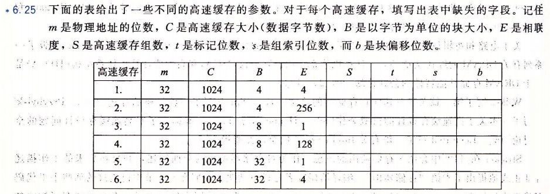
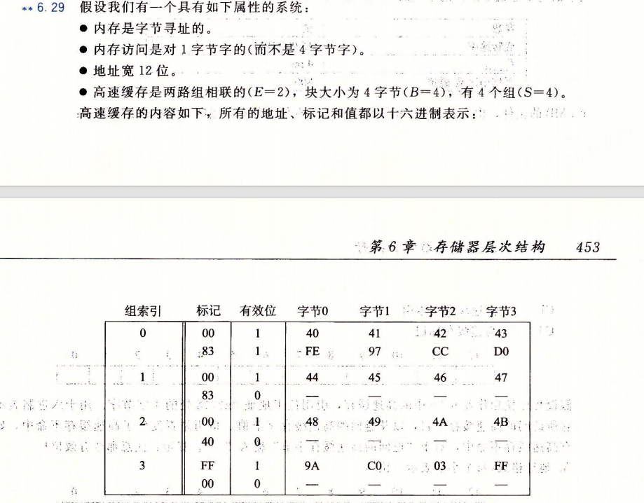
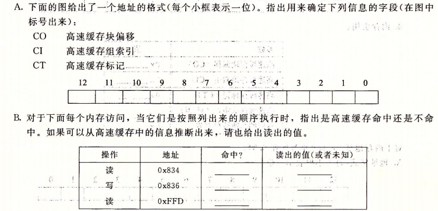

# 计算机系统 HW 4

>SA25011049 李宇哲
>
>

## T1 （6.25）



| 高速缓存 | m    | C    | B    | E    | S    | t    | s    | b    |
| -------- | ---- | ---- | ---- | ---- | ---- | ---- | ---- | ---- |
| 1        | 32   | 1024 | 4    | 4    | 64   | 24   | 6    | 2    |
| 2        | 32   | 1024 | 4    | 256  | 1    | 30   | 0    | 2    |
| 3        | 32   | 1024 | 8    | 1    | 128  | 22   | 7    | 3    |
| 4        | 32   | 1024 | 8    | 128  | 1    | 29   | 0    | 3    |
| 5        | 32   | 1024 | 32   | 1    | 32   | 22   | 5    | 5    |
| 6        | 32   | 1024 | 32   | 4    | 8    | 24   | 3    | 5    |

## T2（6.29）





### A.

```
  11   10    9    8    7    6    5    4    3    2    1   0
+----+----+----+----+----+----+----+----+----+----+----+----+
| CT | CT | CT | CT | CT | CT | CT | CT | CI | CI | CO | CO |
+----+----+----+----+----+----+----+----+----+----+----+----+

```

### B.

| 操作 | 地址  | 命中? | 读出的值（或者未知） |
| :--- | :---- | :---- | :------------------- |
| 读   | 0x834 | No    | -                    |
| 写   | 0x836 | Yes   | 未知                 |
| 读   | 0xFFD | Yes   | 0xC0                 |

## T3（6.34）

src 数组

| c0   | c1   | c2   | c3   |      |
| :--- | :--- | :--- | :--- | ---- |
| r0   | m    | m    | h    | m    |
| r1   | m    | h    | m    | h    |
| r2   | m    | m    | h    | m    |
| r3   | m    | h    | m    | h    |

dst数组

| c0   | c1   | c2   | c3   |      |
| :--- | :--- | :--- | :--- | ---- |
| r0   | m    | m    | m    | m    |
| r1   | m    | m    | m    | m    |
| r2   | m    | m    | m    | m    |
| r3   | m    | m    | m    | m    |

## T4（6.38）

### A.

4 * 16 * 16 = 1024

### B.

sizeof(point_color) == 16, B = 32

```
square[i][j].c = 0
```

miss, cache 2 point_color

```
square[i][j].m = 0
square[i][j].y = 0
square[i][j].k = 0
square[i][j+1].c = 0
square[i][j+1].m = 0
square[i][j+1].y = 0
square[i][j+1].k = 0
```

全部命中

因此 miss hit 总数为 $ 4 * 16 * 16 *1/8 = 128$

### C.

不命中率为 $1/8 = 12.5\%$

## T5（6.41）

每次循环中 $buffer[i][j].r = 0$，因此永远会 miss，

$buffer[i][j].g = 0; buffer[i][j].b = 0; buffer[i][j].a = 0;$ 永远命中

因此 miss rate 为 $1/4 = 25\%$

