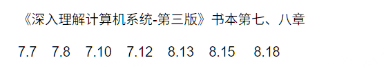

# 计算机系统 HW 5

>SA25011049 李宇哲
>
>

## T1（7.7）

```c
/*
 * bar5.c
 */
double x;

void f() {
  /*x = -0.0;*/
}
```

删除 `x = -0.0;`

## T2（7.8）

### A.

main.1

main.2

### B.

未知

未知

### C.

错误

错误

## T3（7.10）

### A.

gcc p.o libx.a

### B.

gcc p.o libx.a liby.a libx.a

### C.

gcc p.o libx.a liby.a libx.a libz.a

## T4（7.12）

### A.

```
ADDR(s) = ADDR(.text) = 0x4004e0
ADDR(r.symbol) = ADDR(swap) = 0x4004f8
refaddr = ADDR(s) + r.offset = 0x4004ea
*refptr = (unsigned) (ADDR(r.symbol) + r.addend - refaddr) = 0xa
```

### B.

```
ADDR(s) = ADDR(.text) = 0x4004d0
ADDR(r.symbol) = ADDR(swap) = 0x400500
refaddr = ADDR(s) + r.offset = 0x4004da
*refptr = (unsigned) (ADDR(r.symbol) + r.addend - refaddr) = 0x22
```

## T5（8.13）

```
x=4
x=3
x=2
```

## T6（8.15）

5个

## T7（8.18）

整个程序可能的输出树如下：

```
                        c
                    +-------+---------+
                    |      "0"     exit "2"
                    |    
                c   |   p
            +-------+-------+---------+
            |     fork     "1"     exit "2"
            |   (atexit)
            |           c
            |       +-------+---------+
            |       |      "0"      exit
            |       |    
            |   p   |   p    
     +------+-------+-------+---------+
    main  fork    fork     "1"      exit

```

2 一定在 0/1 之前，因此可能的输出是 B 或者 D