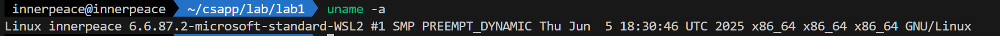
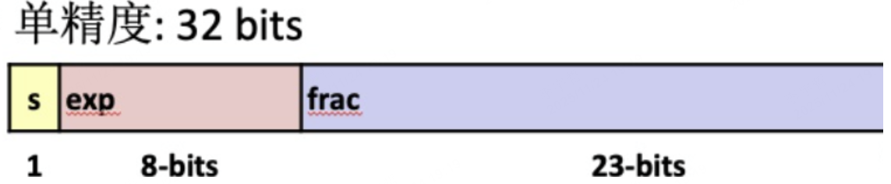
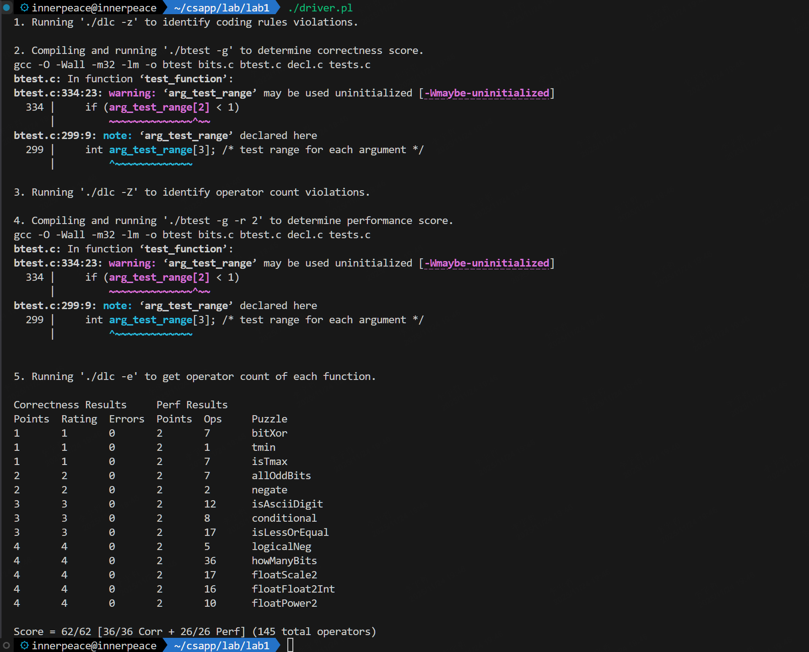

## Lab1 datalab 

>notes：这个 Lab 源自 CMU 的 CSAPP 中的 datalab，源实验中的 `bits.c`只有 13 个 test ，我发现提供的压缩包的源文件也只有 13 个 test，因此我按照 13 个 test 进行实验
>
>姓名：李宇哲
>
>学号：SA25011049

### 1.1Environment Setup

在我的 wsl 下进行实验，具体机器配置如下：



一些相关 编译环境版本

- gcc：12.3.0
- GNU Make：4.3

其他信息并不重要

### 1.2 Coding and Solution explanation

#### 1.2.1 bitXor

可以用德摩根律轻松解决这个问题
$$
A \oplus B = \overline{(\overline{A}\overline{B})} \cap \overline{(AB)}
$$

```c
int bitXor(int x, int y) {
  return ~(~x&~y)&~(x&y);
}
```

#### 1.2.2 tmin

求有符号数二进制补码最小值

```c
int tmin(void) {
  return 0x1<<31;
}
```

#### 1.2.3 isTmax

在移位操作 illegal 下，可以利用的性知识，tmax可以+1移除得到 tmin，tmin的一个性知识 相反数和本身相等

同时用这种逻辑的时候需要排除 -1，因为 -1 + 1 = 0 = ~(-1)

```c
int isTmax(int x) {
  int y = x + 1;
  return !(~(x ^ y)) & !!y;
}
```

#### 1.2.4 allOddBits

可以设计一个掩码 `0xAAAAAAAA`， 同时因为 不让用 `==`，可以用 `a==b <=> !(a^b)`，来实现这个逻辑

```c
int allOddBits(int x) {
  int a = 0xAA;
  int b = a << 8 | a;
  int c = b << 16 | b;
  return !((x & c) ^ c);
}
```

#### 1.2.5 negate

取反+1秒了

```c
int negate(int x) {
  return ~x + 1;
}
```

#### 1.2.6 isAsciiDigit

本质上就是为了实现 `0x30 <= x <= 0x39`，可以理解为一个范围，确定 `0x3x`

- 先确定高四位是0011
- 然后再确定低4位，可以用-A是否为负数判断是否是0-9，1000就超了

```c
int isAsciiDigit(int x) {
  int t = !((x >> 4) ^ 3);
  int lower = 0xF & x;
  int minus = ~0xA + 1;
  int mask = 0x80 << 24;
  int result = !!((lower + minus) & mask);
  return t & result;
}
```

#### 1.2.7 conditional

本质上就是实现一个mux，x非0选y，否则选z，用逻辑表达式

(y \& (x)) | (z \& (~x))

```c
int conditional(int x, int y, int z) {
  int a = !!x;
  int b = ~a + 1;
  return (b & y) | (~b & z);
}
```

#### 1.2.8 isLessOrEqual

有符号数的比较大小，可以先判断符号位，区分两种符号不同的情况，然后将 y - x 做正负判断

```c
int isLessOrEqual(int x, int y) {
  int a = x >> 31 & 0x1;
  int b = y >> 31 & 0x1;
  int c1 = a & ~b;
  int c2 = ~a & b;
  int e = (y + (~x + 1)) >> 31 & 0x1;
  return c1 | (!c2 & !e);
}
```

#### 1.2.9 logicalNeg

- 0的相反数还是0
- 其他数和其相反数一正一负，负数算术右移31位可以得到最低位为1

因此，将一个数x和其相反数取或，结果右移31位，为1说明证书不为0，否则为0

这里用算术移位而不能用逻辑移位，因为 -1 + 1 = 0，算术位移可以让最高位为1的数变成全1

```c
int logicalNeg(int x) {
  return ((x | (~x + 1)) >> 31) + 1;
}
```

#### 1.2.10 howManyBits

一个正数，最少的位数可以由从左往右第一位为1的数决定，一个负数，最少用的位数由从左往右第一个为0的数决定。

所以一个naive的实现思路是

- 先提取符号位，将负数转换成正数同一处理
- 用一种类似二分查找的思路，查找高16位，8位，4位，2位是否有1，有1则右移，并累加计数器，最后+1表示计数器

```c
int howManyBits(int x) {
  int b16, b8, b4, b2, b1, b0;
  int flag = x >> 31;
  x = (flag & ~x) | (~flag & x);
  b16 = !!(x >> 16) << 4;
  x = x >> b16;
  b8 = !!(x >> 8) << 3;
  x = x >> b8;
  b4 = !!(x >> 4) << 2;
  x = x >> b4;
  b2 = !!(x >> 2) << 1;
  x = x >> b2;
  b1 = !!(x >> 1);
  x = x >> b1;
  b0 = x;
  return b16 + b8 + b4 + b2 + b1 + b0 + 1;
}
```

#### 1.2.11 floatScale2

这个算法就是将浮点数*2



对情况进行分类

- exp = 255， *2 没有一，return本身
- exp = 0，表示 非规格化，只需要 frac 左移 1 位
- exp不属于以上两种情况，exp + 1即可

可以先通过 mask 将符号位 sign，exp 和 frac 分离，然后在具体讨论

```c
unsigned floatScale2(unsigned uf) { 
  unsigned exp = (uf & 0x7f800000) >> 23;
  unsigned sign = (uf >> 31) & 0x1;
  unsigned frac = uf & 0x007fffff;
  if (exp == 0xff) {
    return uf;
  }
  else if (exp == 0) {
    frac <<= 1;
    return (sign << 31) | (exp << 23) | frac;
  } 
  else {
    exp = exp + 1;
    return (sign << 31) | (exp << 23) | frac;
  }
}
```

#### 1.2.12 floatFloat2Int

这个函数要做的是将一个 32 bit 的浮点数 转换为相应的 int，对于 NaN 和 INF，返回 0x8000000

bias 为 127，我们可以先计算 $E = exp - bias$

E < 0，直接返回0

exp = 255，返回特殊值

其他情况用公式正常输出

$V = (-1)^s \times M \times 2^E$

```c
int floatFloat2Int(unsigned uf) {
  unsigned con = 0x80000000u;
  int sign = (uf >> 31) & 0x1;
  unsigned exp = (uf & 0x7f800000) >> 23;
  unsigned frac = uf & 0x7fffff;
  int E = exp - 127;
  if (E < 0) 
    return 0;
  else if (E >= 31) 
    return con;
  else {
    frac = frac | 1 << 23;
    if (E < 23) 
      frac = frac >> (23 - E);
    else 
      frac = frac << (E - 23);
  }
  if (sign)
    return -frac;
  else
    return frac;
}
```

#### 1.2.13 floatPower2

先给指数 x 确定一个范围

- x > 127，返回NaN
- x < -148，返回0
- x >= -126，规格数
- 非规格化数

```c
unsigned floatPower2(int x)
{
  // if too large, return INF
  if (x > 127)
    return 0xFF << 23;
  else if (x < -148)
    return 0;
  else if (x >= -126)
  {
    int exp = x + 127;
    return exp << 23;
  }
  else
  {
    int t = 148 + x;
    return (1 << t);
  }
}
```

### 1.3 Evaluation

根据 readme 的要求，可以通过 

```bash
make btest
```

编译，并通过

```bash
./btest # 测试正确性
./dlc bits.c # 测试语法正确性
```

而后 readme 还提到，可以通过 

```bash
./driver.pl
```

一键测试，测试结果如下



可以看到我通过了所有测试点，并且每个测试点的操作都是规范的，并没有超出限制的 operator 的使用范围和数量。

