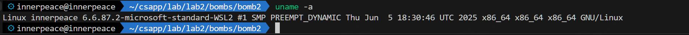
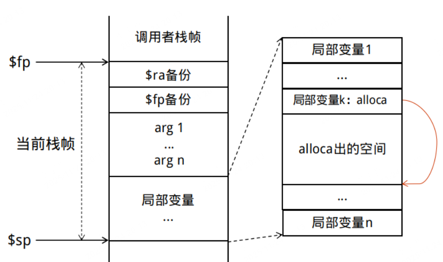
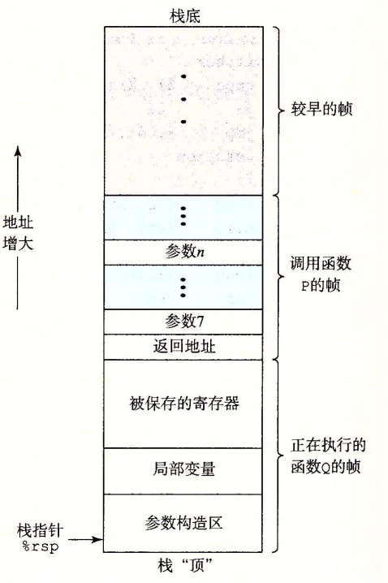
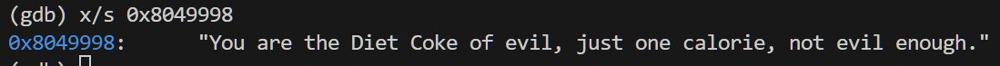
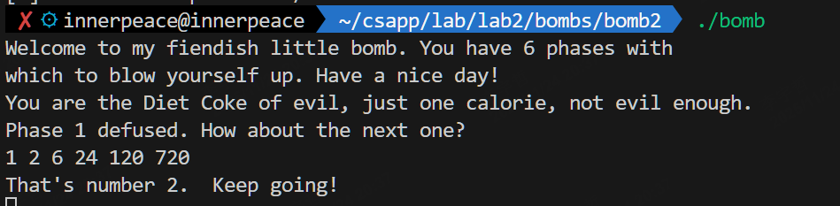
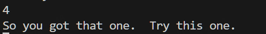
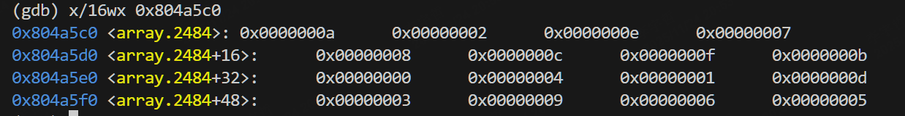
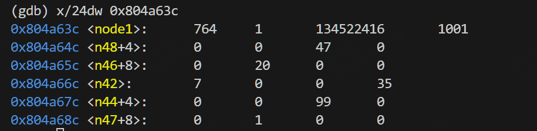
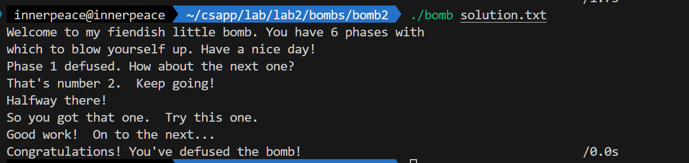

## Lab2 Bomblab

>notes：这个 Lab 源自 CMU 的 CSAPP 中的 bomblab，根据 PPT 要求，我的学号后三位 049 % 47 = 2，因此我将选择 bomb2 进行实验
>
>姓名：李宇哲
>
>学号：SA25011049

### 2.1 Environment Setup

> 题外话：
>
> 实验 slides 给出了一点基本的反汇编思路和要求，可以说对实现这个实验毫无帮助，完全不如 bomblab 官方手册中提供的有效帮助，希望最后一次修改是 08 年的 ppt 不要再出现在明年的 计算机系统课程实验上了。

在我的 wsl 下进行实验，具体机器配置如下：



一些相关 编译环境版本

- gcc：12.3.0
- GNU Make：4.3

其他信息并不重要

### 2.2 Coding and Solution

拆炸弹，先把可执行文件反汇编一下，得到一个汇编文件，然后通过 read 汇编文件去思考每个 phase 应该怎么去通过字符串注入的方式区拆解。

```bash
objdump -d ./bomb >> bomb.s  
```

通过`bomb.c` 的 `main` 函数可以得知，主要有 6 个 phase，并通过 `phase6` 后的，注释，可能存在一个 secret phase，但这是后话了。

>notes：
>
>本科在 吴俊敏老师的 《计算机系统详解》 一课 完成过 CSAPP 的全部实验。因此在重新做这个 lab 的时候，我已经知道了 secret phase 的存在。

okay，然后来一点一点看每个 phase 的汇编代码，来判断是如何拆解的

再次之前，借用一下本科时上的一门课程和CSAPP书中对于栈帧的描述图





有了这两张图，就可以基本理解汇编函数段的基本执行逻辑

#### phase1 

```assembly
08048b80 <phase_1>:
 8048b80:	55                   	push   %ebp
 8048b81:	89 e5                	mov    %esp,%ebp
 8048b83:	83 ec 08             	sub    $0x8,%esp
 8048b86:	c7 44 24 04 98 99 04 	movl   $0x8049998,0x4(%esp)
 8048b8d:	08 
 8048b8e:	8b 45 08             	mov    0x8(%ebp),%eax
 8048b91:	89 04 24             	mov    %eax,(%esp)
 8048b94:	e8 3e 05 00 00       	call   80490d7 <strings_not_equal>
 8048b99:	85 c0                	test   %eax,%eax
 8048b9b:	74 05                	je     8048ba2 <phase_1+0x22>
 8048b9d:	e8 fc 0a 00 00       	call   804969e <explode_bomb>
 8048ba2:	c9                   	leave  
 8048ba3:	c3                   	ret    
```

直接读这段源码，开辟了一个 8 byte 的 栈帧，然后将 `0x8049998` 地址放入第二个参数（esp + 4），从栈帧取出 input 到 eax，将这个input 与 一个字符串比较，相等则拆除成功，否则爆炸。这个字符串就是 地址 `0x8049998` 对应的值，所以可以通过gdb调试去看这个地址值是多少从而解决这个问题



得到结果后那 phase1 通过键入这个字符串就可以拆除

```text
You are the Diet Coke of evil, just one calorie, not evil enough.
```

结果如下：


#### phase2 

`phase2` 反汇编得到

```assembly
08048ba4 <phase_2>:
 8048ba4:	55                   	push   %ebp
 8048ba5:	89 e5                	mov    %esp,%ebp
 8048ba7:	83 ec 28             	sub    $0x28,%esp
 8048baa:	8d 45 e4             	lea    -0x1c(%ebp),%eax
 8048bad:	89 44 24 04          	mov    %eax,0x4(%esp)
 8048bb1:	8b 45 08             	mov    0x8(%ebp),%eax
 8048bb4:	89 04 24             	mov    %eax,(%esp)
 8048bb7:	e8 88 04 00 00       	call   8049044 <read_six_numbers>
 8048bbc:	8b 45 e4             	mov    -0x1c(%ebp),%eax
 8048bbf:	83 f8 01             	cmp    $0x1,%eax
 8048bc2:	74 05                	je     8048bc9 <phase_2+0x25>
 8048bc4:	e8 d5 0a 00 00       	call   804969e <explode_bomb>
 8048bc9:	c7 45 fc 01 00 00 00 	movl   $0x1,-0x4(%ebp)
 8048bd0:	eb 22                	jmp    8048bf4 <phase_2+0x50>
 8048bd2:	8b 45 fc             	mov    -0x4(%ebp),%eax
 8048bd5:	8b 4c 85 e4          	mov    -0x1c(%ebp,%eax,4),%ecx
 8048bd9:	8b 45 fc             	mov    -0x4(%ebp),%eax
 8048bdc:	48                   	dec    %eax
 8048bdd:	8b 54 85 e4          	mov    -0x1c(%ebp,%eax,4),%edx
 8048be1:	8b 45 fc             	mov    -0x4(%ebp),%eax
 8048be4:	40                   	inc    %eax
 8048be5:	0f af c2             	imul   %edx,%eax
 8048be8:	39 c1                	cmp    %eax,%ecx
 8048bea:	74 05                	je     8048bf1 <phase_2+0x4d>
 8048bec:	e8 ad 0a 00 00       	call   804969e <explode_bomb>
 8048bf1:	ff 45 fc             	incl   -0x4(%ebp)
 8048bf4:	83 7d fc 05          	cmpl   $0x5,-0x4(%ebp)
 8048bf8:	7e d8                	jle    8048bd2 <phase_2+0x2e>
 8048bfa:	c9                   	leave  
 8048bfb:	c3                   	ret    
```

开一个 40 字节的 栈帧，然后调用 一个 函数 `read_six_numbers` 去读取 6 个 数字，然后，比较这两个参数是否跟输入相符，相符就继续，否则就爆了

用户输入 array[6] 分别存放在内存 `ebp - 0x1c` 到 `ebp - 0x18`。

```assembly
 8048bbc:	8b 45 e4             	mov    -0x1c(%ebp),%eax
 8048bbf:	83 f8 01             	cmp    $0x1,%eax
```

这里要求 array[0] = 1，而后逻辑是一个循环，array[i] = (i+1) * array[i-1]

可以计算出

```
1 2 6 24 120 720
```

其实就是一个累乘，这里可能做的改动是把官方的2的幂次改为对i的累乘了，因此键入这6个数字就可以通过 phase 2



#### phase3

反汇编得到

```assembly
08048bfc <phase_3>:
 8048bfc:	55                   	push   %ebp
 8048bfd:	89 e5                	mov    %esp,%ebp
 8048bff:	83 ec 28             	sub    $0x28,%esp
 8048c02:	c7 45 f8 00 00 00 00 	movl   $0x0,-0x8(%ebp)
 8048c09:	c7 45 fc 00 00 00 00 	movl   $0x0,-0x4(%ebp)
 8048c10:	8d 45 f0             	lea    -0x10(%ebp),%eax
 8048c13:	89 44 24 0c          	mov    %eax,0xc(%esp)
 8048c17:	8d 45 f4             	lea    -0xc(%ebp),%eax
 8048c1a:	89 44 24 08          	mov    %eax,0x8(%esp)
 8048c1e:	c7 44 24 04 da 99 04 	movl   $0x80499da,0x4(%esp)
 8048c25:	08 
 8048c26:	8b 45 08             	mov    0x8(%ebp),%eax
 8048c29:	89 04 24             	mov    %eax,(%esp)
 8048c2c:	e8 37 fc ff ff       	call   8048868 <sscanf@plt>
 8048c31:	89 45 fc             	mov    %eax,-0x4(%ebp)
 8048c34:	83 7d fc 01          	cmpl   $0x1,-0x4(%ebp)
 8048c38:	7f 05                	jg     8048c3f <phase_3+0x43>
 8048c3a:	e8 5f 0a 00 00       	call   804969e <explode_bomb>
 8048c3f:	8b 45 f4             	mov    -0xc(%ebp),%eax
 8048c42:	89 45 ec             	mov    %eax,-0x14(%ebp)
 8048c45:	83 7d ec 07          	cmpl   $0x7,-0x14(%ebp)
 8048c49:	77 54                	ja     8048c9f <phase_3+0xa3>
 8048c4b:	8b 55 ec             	mov    -0x14(%ebp),%edx
 8048c4e:	8b 04 95 e0 99 04 08 	mov    0x80499e0(,%edx,4),%eax
 8048c55:	ff e0                	jmp    *%eax
 8048c57:	c7 45 f8 d7 02 00 00 	movl   $0x2d7,-0x8(%ebp)
 8048c5e:	eb 44                	jmp    8048ca4 <phase_3+0xa8>
 8048c60:	c7 45 f8 4c 01 00 00 	movl   $0x14c,-0x8(%ebp)
 8048c67:	eb 3b                	jmp    8048ca4 <phase_3+0xa8>
 8048c69:	c7 45 f8 7e 02 00 00 	movl   $0x27e,-0x8(%ebp)
 8048c70:	eb 32                	jmp    8048ca4 <phase_3+0xa8>
 8048c72:	c7 45 f8 e5 01 00 00 	movl   $0x1e5,-0x8(%ebp)
 8048c79:	eb 29                	jmp    8048ca4 <phase_3+0xa8>
 8048c7b:	c7 45 f8 c4 01 00 00 	movl   $0x1c4,-0x8(%ebp)
 8048c82:	eb 20                	jmp    8048ca4 <phase_3+0xa8>
 8048c84:	c7 45 f8 c7 03 00 00 	movl   $0x3c7,-0x8(%ebp)
 8048c8b:	eb 17                	jmp    8048ca4 <phase_3+0xa8>
 8048c8d:	c7 45 f8 d5 03 00 00 	movl   $0x3d5,-0x8(%ebp)
 8048c94:	eb 0e                	jmp    8048ca4 <phase_3+0xa8>
 8048c96:	c7 45 f8 74 00 00 00 	movl   $0x74,-0x8(%ebp)
 8048c9d:	eb 05                	jmp    8048ca4 <phase_3+0xa8>
 8048c9f:	e8 fa 09 00 00       	call   804969e <explode_bomb>
 8048ca4:	8b 45 f0             	mov    -0x10(%ebp),%eax
 8048ca7:	39 45 f8             	cmp    %eax,-0x8(%ebp)
 8048caa:	74 05                	je     8048cb1 <phase_3+0xb5>
 8048cac:	e8 ed 09 00 00       	call   804969e <explode_bomb>
 8048cb1:	c9                   	leave  
 8048cb2:	c3                   	ret    
```

这里意思是要通过 ssanf 读取两个数字，第一个数期望的范围是 `0 <= num <= 7`，然后会用第一个数当作 index 进入一个 跳转表

根据索引 0-7 的不同，执行不同的赋值，即第二个参数期望的值，这里有一个简单的对应

```
0 -> 727
1 -> 332
2 -> 638
3 -> 485
4 -> 452
5 -> 967
6 -> 981
7 -> 116
```

上述任意一对输入都可以解决这个phase


#### phase4

反汇编之后这一段的汇编代码为 

```assembly
08048ce7 <phase_4>:
 8048ce7:	55                   	push   %ebp
 8048ce8:	89 e5                	mov    %esp,%ebp
 8048cea:	83 ec 28             	sub    $0x28,%esp
 8048ced:	8d 45 f4             	lea    -0xc(%ebp),%eax
 8048cf0:	89 44 24 08          	mov    %eax,0x8(%esp)
 8048cf4:	c7 44 24 04 00 9a 04 	movl   $0x8049a00,0x4(%esp)
 8048cfb:	08 
 8048cfc:	8b 45 08             	mov    0x8(%ebp),%eax
 8048cff:	89 04 24             	mov    %eax,(%esp)
 8048d02:	e8 61 fb ff ff       	call   8048868 <sscanf@plt>
 8048d07:	89 45 fc             	mov    %eax,-0x4(%ebp)
 8048d0a:	83 7d fc 01          	cmpl   $0x1,-0x4(%ebp)
 8048d0e:	75 07                	jne    8048d17 <phase_4+0x30>
 8048d10:	8b 45 f4             	mov    -0xc(%ebp),%eax
 8048d13:	85 c0                	test   %eax,%eax
 8048d15:	7f 05                	jg     8048d1c <phase_4+0x35>
 8048d17:	e8 82 09 00 00       	call   804969e <explode_bomb>
 8048d1c:	8b 45 f4             	mov    -0xc(%ebp),%eax
 8048d1f:	89 04 24             	mov    %eax,(%esp)
 8048d22:	e8 8c ff ff ff       	call   8048cb3 <func4>
 8048d27:	89 45 f8             	mov    %eax,-0x8(%ebp)
 8048d2a:	81 7d f8 61 09 00 00 	cmpl   $0x961,-0x8(%ebp)
 8048d31:	74 05                	je     8048d38 <phase_4+0x51>
 8048d33:	e8 66 09 00 00       	call   804969e <explode_bomb>
 8048d38:	c9                   	leave  
 8048d39:	c3                   	ret   
```

大致意思是 通过 `scanf` 读取一个 num，然后要求这个 数 是一个 正整数

然后要求 令 func4(num) = 2401，也就是说将num当成输入 输入进 `func4`，需要得到返回值 2401

接下来再看 `func4` 是个什么情况

```assembly
08048cb3 <func4>:
 8048cb3:	55                   	push   %ebp
 8048cb4:	89 e5                	mov    %esp,%ebp
 8048cb6:	83 ec 08             	sub    $0x8,%esp
 8048cb9:	83 7d 08 00          	cmpl   $0x0,0x8(%ebp)
 8048cbd:	7f 09                	jg     8048cc8 <func4+0x15>
 8048cbf:	c7 45 fc 01 00 00 00 	movl   $0x1,-0x4(%ebp)
 8048cc6:	eb 1a                	jmp    8048ce2 <func4+0x2f>
 8048cc8:	8b 45 08             	mov    0x8(%ebp),%eax
 8048ccb:	48                   	dec    %eax
 8048ccc:	89 04 24             	mov    %eax,(%esp)
 8048ccf:	e8 df ff ff ff       	call   8048cb3 <func4>
 8048cd4:	89 c2                	mov    %eax,%edx
 8048cd6:	89 d0                	mov    %edx,%eax
 8048cd8:	c1 e0 03             	shl    $0x3,%eax
 8048cdb:	89 c1                	mov    %eax,%ecx
 8048cdd:	29 d1                	sub    %edx,%ecx
 8048cdf:	89 4d fc             	mov    %ecx,-0x4(%ebp)
 8048ce2:	8b 45 fc             	mov    -0x4(%ebp),%eax
 8048ce5:	c9                   	leave  
 8048ce6:	c3                   	ret   
```

`func4` 从汇编代码上看，会先判断输入 x ，如果是 <=0 ，返回1，如果不是 ，执行 func4(x-1)，然后将结果 乘7次（通过左移3减-1实现）

因此大致可以理解以为一个递归函数

```
func4(x) = 7 * func4(x - 1)
```

简单写个程序算一下，func4(4) = 2401 ，所以这里应该键入 4



成功拆除

#### phase5

`phase5` 经过 反汇编得到

```assembly
08048d3a <phase_5>:
 8048d3a:	55                   	push   %ebp
 8048d3b:	89 e5                	mov    %esp,%ebp
 8048d3d:	83 ec 38             	sub    $0x38,%esp
 8048d40:	8d 45 e8             	lea    -0x18(%ebp),%eax
 8048d43:	89 44 24 0c          	mov    %eax,0xc(%esp)
 8048d47:	8d 45 ec             	lea    -0x14(%ebp),%eax
 8048d4a:	89 44 24 08          	mov    %eax,0x8(%esp)
 8048d4e:	c7 44 24 04 da 99 04 	movl   $0x80499da,0x4(%esp)
 8048d55:	08 
 8048d56:	8b 45 08             	mov    0x8(%ebp),%eax
 8048d59:	89 04 24             	mov    %eax,(%esp)
 8048d5c:	e8 07 fb ff ff       	call   8048868 <sscanf@plt>
 8048d61:	89 45 fc             	mov    %eax,-0x4(%ebp)
 8048d64:	83 7d fc 01          	cmpl   $0x1,-0x4(%ebp)
 8048d68:	7f 05                	jg     8048d6f <phase_5+0x35>
 8048d6a:	e8 2f 09 00 00       	call   804969e <explode_bomb>
 8048d6f:	8b 45 ec             	mov    -0x14(%ebp),%eax
 8048d72:	83 e0 0f             	and    $0xf,%eax
 8048d75:	89 45 ec             	mov    %eax,-0x14(%ebp)
 8048d78:	8b 45 ec             	mov    -0x14(%ebp),%eax
 8048d7b:	89 45 f8             	mov    %eax,-0x8(%ebp)
 8048d7e:	c7 45 f0 00 00 00 00 	movl   $0x0,-0x10(%ebp)
 8048d85:	c7 45 f4 00 00 00 00 	movl   $0x0,-0xc(%ebp)
 8048d8c:	eb 16                	jmp    8048da4 <phase_5+0x6a>
 8048d8e:	ff 45 f0             	incl   -0x10(%ebp)
 8048d91:	8b 45 ec             	mov    -0x14(%ebp),%eax
 8048d94:	8b 04 85 c0 a5 04 08 	mov    0x804a5c0(,%eax,4),%eax
 8048d9b:	89 45 ec             	mov    %eax,-0x14(%ebp)
 8048d9e:	8b 45 ec             	mov    -0x14(%ebp),%eax
 8048da1:	01 45 f4             	add    %eax,-0xc(%ebp)
 8048da4:	8b 45 ec             	mov    -0x14(%ebp),%eax
 8048da7:	83 f8 0f             	cmp    $0xf,%eax
 8048daa:	75 e2                	jne    8048d8e <phase_5+0x54>
 8048dac:	83 7d f0 0b          	cmpl   $0xb,-0x10(%ebp)
 8048db0:	75 08                	jne    8048dba <phase_5+0x80>
 8048db2:	8b 45 e8             	mov    -0x18(%ebp),%eax
 8048db5:	39 45 f4             	cmp    %eax,-0xc(%ebp)
 8048db8:	74 05                	je     8048dbf <phase_5+0x85>
 8048dba:	e8 df 08 00 00       	call   804969e <explode_bomb>
 8048dbf:	c9                   	leave  
 8048dc0:	c3                   	ret    
```

输入阶段要输入两个 num1 和 num2

取第一个整数的 低4位，初始化两个计数器，然后进入一个循环逻辑，可以大致用c代码理解一下为

```c
index = num1 & 0xF;
int i = 0, sum = 0, cnt = 0;
do {
    cnt +;
    index = table[nidex];
    sum += index;
} while (index != 0xF);
```

同时通过这段代码

```assembly
cmp $0xb,-0x10(%ebp)      
jne bomb

mov -0x18(%ebp),%eax     
cmp %eax,-0xc(%ebp)      
je  ok
call explode_bomb
```

大致确定总共跳转 11 次，第二个输入 `num2` 必须等于累加的索引值和，即sum

有一个地址 `0x804a5c0`这里存放了一个`int[16]`数组，存放在索引号，所以我们只要打印出这个表的内容就可以 fix 这个 phase



通过 gdb 得到这个 table的内容

```
index[0] = 10
index[1] = 2
index[2] = 14
index[3] = 7
index[4] = 8
index[5] = 12
index[6] = 15
index[7] = 11
index[8] = 0
index[9] = 4
index[10] = 1
index[11] = 13
index[12] = 3
index[13] = 9
index[14] = 6
index[15] = 5
```

然后根据之前分析的算法逻辑，从 num1 index 开始，调表刚好遇到 15，并且正好循环 11 次，然后所有经过的索引值就是 `num2`

大致模拟一下，从 index = 11 开始可以满足这个要求

所以 num1=11， num2 = （13 + 9 + 4 +8 + 0 + 10 + 1 +2 +14 + 6 + 15）= 82

因此一个可行的结果应该是 

```
11 82
```

>这个phase是最麻烦的一个，为了确定一些index到底是怎么算的，我用gdb python 打印了所有输入和具体index，sum的可能，最终确定了结果。
>
>```
> start | count | sum 
>-----------------------
>    0   |    6  |   48
>    1   |    4  |   37
>    2   |    3  |   35
>    3   |   13  |  100
>    4   |    8  |   56
>    5   |   15  |  115
>    6   |    1  |   15
>    7   |   12  |   93
>    8   |    7  |   48
>    9   |    9  |   60
>   10   |    5  |   38
>   11   |   11  |   82
>   12   |   14  |  103
>   13   |   10  |   69
>   14   |    2  |   21
>   15   |    0  |    0
>```

#### phase6

phase6 反汇编结果如下

```assembly
08048dc1 <phase_6>:
 8048dc1:	55                   	push   %ebp
 8048dc2:	89 e5                	mov    %esp,%ebp
 8048dc4:	83 ec 48             	sub    $0x48,%esp
 8048dc7:	c7 45 f0 3c a6 04 08 	movl   $0x804a63c,-0x10(%ebp)
 8048dce:	8d 45 d8             	lea    -0x28(%ebp),%eax
 8048dd1:	89 44 24 04          	mov    %eax,0x4(%esp)
 8048dd5:	8b 45 08             	mov    0x8(%ebp),%eax
 8048dd8:	89 04 24             	mov    %eax,(%esp)
 8048ddb:	e8 64 02 00 00       	call   8049044 <read_six_numbers>
 8048de0:	c7 45 f8 00 00 00 00 	movl   $0x0,-0x8(%ebp)
 8048de7:	eb 48                	jmp    8048e31 <phase_6+0x70>
 8048de9:	8b 45 f8             	mov    -0x8(%ebp),%eax
 8048dec:	8b 44 85 d8          	mov    -0x28(%ebp,%eax,4),%eax
 8048df0:	85 c0                	test   %eax,%eax
 8048df2:	7e 0c                	jle    8048e00 <phase_6+0x3f>
 8048df4:	8b 45 f8             	mov    -0x8(%ebp),%eax
 8048df7:	8b 44 85 d8          	mov    -0x28(%ebp,%eax,4),%eax
 8048dfb:	83 f8 06             	cmp    $0x6,%eax
 8048dfe:	7e 05                	jle    8048e05 <phase_6+0x44>
 8048e00:	e8 99 08 00 00       	call   804969e <explode_bomb>
 8048e05:	8b 45 f8             	mov    -0x8(%ebp),%eax
 8048e08:	40                   	inc    %eax
 8048e09:	89 45 fc             	mov    %eax,-0x4(%ebp)
 8048e0c:	eb 1a                	jmp    8048e28 <phase_6+0x67>
 8048e0e:	8b 45 f8             	mov    -0x8(%ebp),%eax
 8048e11:	8b 54 85 d8          	mov    -0x28(%ebp,%eax,4),%edx
 8048e15:	8b 45 fc             	mov    -0x4(%ebp),%eax
 8048e18:	8b 44 85 d8          	mov    -0x28(%ebp,%eax,4),%eax
 8048e1c:	39 c2                	cmp    %eax,%edx
 8048e1e:	75 05                	jne    8048e25 <phase_6+0x64>
 8048e20:	e8 79 08 00 00       	call   804969e <explode_bomb>
 8048e25:	ff 45 fc             	incl   -0x4(%ebp)
 8048e28:	83 7d fc 05          	cmpl   $0x5,-0x4(%ebp)
 8048e2c:	7e e0                	jle    8048e0e <phase_6+0x4d>
 8048e2e:	ff 45 f8             	incl   -0x8(%ebp)
 8048e31:	83 7d f8 05          	cmpl   $0x5,-0x8(%ebp)
 8048e35:	7e b2                	jle    8048de9 <phase_6+0x28>
 8048e37:	c7 45 f8 00 00 00 00 	movl   $0x0,-0x8(%ebp)
 8048e3e:	eb 34                	jmp    8048e74 <phase_6+0xb3>
 8048e40:	8b 45 f0             	mov    -0x10(%ebp),%eax
 8048e43:	89 45 f4             	mov    %eax,-0xc(%ebp)
 8048e46:	c7 45 fc 01 00 00 00 	movl   $0x1,-0x4(%ebp)
 8048e4d:	eb 0c                	jmp    8048e5b <phase_6+0x9a>
 8048e4f:	8b 45 f4             	mov    -0xc(%ebp),%eax
 8048e52:	8b 40 08             	mov    0x8(%eax),%eax
 8048e55:	89 45 f4             	mov    %eax,-0xc(%ebp)
 8048e58:	ff 45 fc             	incl   -0x4(%ebp)
 8048e5b:	8b 45 f8             	mov    -0x8(%ebp),%eax
 8048e5e:	8b 44 85 d8          	mov    -0x28(%ebp,%eax,4),%eax
 8048e62:	3b 45 fc             	cmp    -0x4(%ebp),%eax
 8048e65:	7f e8                	jg     8048e4f <phase_6+0x8e>
 8048e67:	8b 55 f8             	mov    -0x8(%ebp),%edx
 8048e6a:	8b 45 f4             	mov    -0xc(%ebp),%eax
 8048e6d:	89 44 95 c0          	mov    %eax,-0x40(%ebp,%edx,4)
 8048e71:	ff 45 f8             	incl   -0x8(%ebp)
 8048e74:	83 7d f8 05          	cmpl   $0x5,-0x8(%ebp)
 8048e78:	7e c6                	jle    8048e40 <phase_6+0x7f>
 8048e7a:	8b 45 c0             	mov    -0x40(%ebp),%eax
 8048e7d:	89 45 f0             	mov    %eax,-0x10(%ebp)
 8048e80:	8b 45 f0             	mov    -0x10(%ebp),%eax
 8048e83:	89 45 f4             	mov    %eax,-0xc(%ebp)
 8048e86:	c7 45 f8 01 00 00 00 	movl   $0x1,-0x8(%ebp)
 8048e8d:	eb 19                	jmp    8048ea8 <phase_6+0xe7>
 8048e8f:	8b 45 f8             	mov    -0x8(%ebp),%eax
 8048e92:	8b 54 85 c0          	mov    -0x40(%ebp,%eax,4),%edx
 8048e96:	8b 45 f4             	mov    -0xc(%ebp),%eax
 8048e99:	89 50 08             	mov    %edx,0x8(%eax)
 8048e9c:	8b 45 f4             	mov    -0xc(%ebp),%eax
 8048e9f:	8b 40 08             	mov    0x8(%eax),%eax
 8048ea2:	89 45 f4             	mov    %eax,-0xc(%ebp)
 8048ea5:	ff 45 f8             	incl   -0x8(%ebp)
 8048ea8:	83 7d f8 05          	cmpl   $0x5,-0x8(%ebp)
 8048eac:	7e e1                	jle    8048e8f <phase_6+0xce>
 8048eae:	8b 45 f4             	mov    -0xc(%ebp),%eax
 8048eb1:	c7 40 08 00 00 00 00 	movl   $0x0,0x8(%eax)
 8048eb8:	8b 45 f0             	mov    -0x10(%ebp),%eax
 8048ebb:	89 45 f4             	mov    %eax,-0xc(%ebp)
 8048ebe:	c7 45 f8 00 00 00 00 	movl   $0x0,-0x8(%ebp)
 8048ec5:	eb 22                	jmp    8048ee9 <phase_6+0x128>
 8048ec7:	8b 45 f4             	mov    -0xc(%ebp),%eax
 8048eca:	8b 10                	mov    (%eax),%edx
 8048ecc:	8b 45 f4             	mov    -0xc(%ebp),%eax
 8048ecf:	8b 40 08             	mov    0x8(%eax),%eax
 8048ed2:	8b 00                	mov    (%eax),%eax
 8048ed4:	39 c2                	cmp    %eax,%edx
 8048ed6:	7d 05                	jge    8048edd <phase_6+0x11c>
 8048ed8:	e8 c1 07 00 00       	call   804969e <explode_bomb>
 8048edd:	8b 45 f4             	mov    -0xc(%ebp),%eax
 8048ee0:	8b 40 08             	mov    0x8(%eax),%eax
 8048ee3:	89 45 f4             	mov    %eax,-0xc(%ebp)
 8048ee6:	ff 45 f8             	incl   -0x8(%ebp)
 8048ee9:	83 7d f8 04          	cmpl   $0x4,-0x8(%ebp)
 8048eed:	7e d8                	jle    8048ec7 <phase_6+0x106>
 8048eef:	c9                   	leave  
 8048ef0:	c3                   	ret    
```

一开始要读入 6 个 整数，然后将这两个整数存入临时数组

```
[-0x28(%ebp)], [-0x24], [-0x20], [-0x1c], [-0x18], [-0x14]
```

首先这6个数字必须是 1-6 的不重复排列，然后会建立一个链表节点，每个node在内存上是连续的，通过gdb得



然后会生成一个中间数组，每个输入数字代表取原先链表的第n个节点

然后会重新链接链表形成新的纯刚需，检查节点是否是递增的

也就是说我需要输入6个数字，对应链表中的编号能够从大到小排序，就是对应的顺序

通过 gdb 得到一个数据，然后最后变成一个降序

最后这个 `phase` 实在是太复杂了，反正通过前面的step我已经确定了输入一定是一个 1到6的排列，那我就暴力遍历 1到6 的全排列就结束了

我写的 python 脚本如下：

```python
import itertools
import subprocess

prefix = """You are the Diet Coke of evil, just one calorie, not evil enough.
1 2 6 24 120 720
1 332
4
11 82
"""

nums = [1, 2, 3, 4, 5, 6]

for perm in itertools.permutations(nums):
    content = prefix + " ".join(map(str, perm)) + "\n"
    with open("solution.txt", "w") as f:
        f.write(content)

    result = subprocess.run(
        ["./bomb", "solution.txt"],
        stdout=subprocess.PIPE,
        stderr=subprocess.STDOUT,
    )
    out = result.stdout.decode(errors="ignore")

    if "BOOM" not in out and "Bomb" not in out and "explode" not in out:
        print("可能正确的排列:", perm)
        print(out)
        break
```

最终得到一个正确的排列为  `5 6 4 1 3 2`，ok，fine，这样 6 个 phase 都结束了

#### Secret Phase

我从 secret phase 的代码中没有看到任何可以进入 secret phase 的入口，而在官方的 bomb 可以通过 phase 4 键入不同的输入进入 secret phase，所以我怀疑本课程魔改的这个实验并没有 secret phase，所以我无视了这个pahse

###2.3 Evaluation

最后我的 `solution.txt` 长这个样子

```txt
You are the Diet Coke of evil, just one calorie, not evil enough.
1 2 6 24 120 720
1 332
4
11 82
5 6 4 1 3 2
```

运行得到如下结果



成功拆解了所有的 bomb

