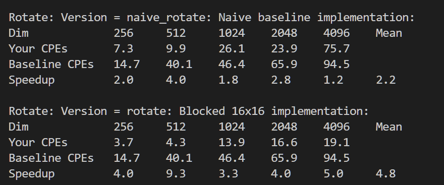
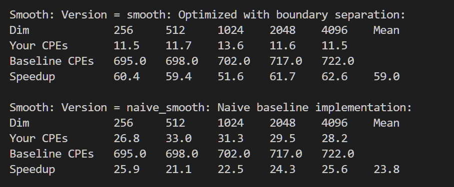
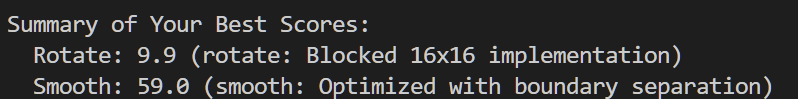

## Lab4  Performance Lab

>notes：这个 Lab 源自 CMU 的 CSAPP 中的 perflab
>
>姓名：李宇哲
>
>学号：SA25011049

这个 Lab 主要要完成对 rotate 和 smooth 的优化，然后与 baseline 比较，最终看得到的分数。

### rotate

naive 版本的 rotate 实现如下：

```c
 void naive_rotate(int dim, pixel *src, pixel *dst) 
 {
     int i, j;
 
     for (i = 0; i < dim; i++)
     for (j = 0; j < dim; j++)
         dst[RIDX(dim-1-j, i, dim)] = src[RIDX(i, j, dim)];
 }
```

#### Optimization 1：blocking 16x16

原始代码按行读取 src，按列写入 dst，按列写这里 step 太大了，容易出现 cache miss，可以使用 blocking 将一个原始 图像分成 16x16或者 32x32 的block，然后每次加载一个block的数据到 L1 Cache，在 Cache 内完成 rotate。

实现如下：16x16 block 小块

```c
 char rotate_descr[] = "rotate: Blocked 16x16 implementation";
 void rotate(int dim, pixel *src, pixel *dst) 
 {
     int i, j, ii, jj;
     int bsize = 16; // Block size
 
     for (i = 0; i < dim; i += bsize) {
         for (j = 0; j < dim; j += bsize) {
             // Processing a small block
             // Adding boundary check (ii < dim) just in case dim is not multiple of 16
             for (ii = i; ii < i + bsize && ii < dim; ii++) {
                 for (jj = j; jj < j + bsize && jj < dim; jj++) {
                     dst[RIDX(dim-1-jj, ii, dim)] = src[RIDX(ii, jj, dim)];
                 }
             }
         }
     }
 }
```


在这种优化下，取得了 9.9 的性能分数

#### Optimization 2：blocking 32x32

将 block 的粒度改为 32

```c
 char rotate_descr[] = "rotate: Blocked 16x16 implementation";
 void rotate(int dim, pixel *src, pixel *dst) 
 {
     int i, j, ii, jj;
     int bsize = 32; // Block size
 
     for (i = 0; i < dim; i += bsize) {
         for (j = 0; j < dim; j += bsize) {
             // Processing a small block
             // Adding boundary check (ii < dim) just in case dim is not multiple of 16
             for (ii = i; ii < i + bsize && ii < dim; ii++) {
                 for (jj = j; jj < j + bsize && jj < dim; jj++) {
                     dst[RIDX(dim-1-jj, ii, dim)] = src[RIDX(ii, jj, dim)];
                 }
             }
         }
     }
 }
```

得到了相对更差的性能分



因此，这里我的最佳实现就是 16x16 blockng

### smooth

naive 版本的 smooth 实现如下：

```c
 void naive_smooth(int dim, pixel *src, pixel *dst) 
 {
     int i, j;
 
     for (i = 0; i < dim; i++)
     for (j = 0; j < dim; j++)
         dst[RIDX(i, j, dim)] = avg(dim, i, j, src);
 }
```

naive 的实现对每个 pixel 都调用 avg，avg 内部又有循环和 min/max 判断，函数调用开销比较大，同时条件判断会影响 CPU 的分支预测

可以使用 inline，一个常见的编译优化方式，直接在循环内计算 avg，去掉函数调用开销

同时，图像中的大部分刑诉都有 9 个 邻居，不需要做边界检查，从而减小边界检查的开销，对于4个角和4个碧娜，可以单独写代码处理，去掉 if 判断，避免分支预测。

```c
void smooth(int dim, pixel *src, pixel *dst) 
 {
     int i, j;
     int dim0 = dim;
     int dim1 = dim - 1;
     int dim2 = dim - 2;
     // No boundary checks needed here, always 9 neighbors.
     for (i = 1; i < dim1; i++) {
         for (j = 1; j < dim1; j++) {
             int r = 0, g = 0, b = 0;
             int idx;
             
             // Row i-1
             idx = RIDX(i-1, j-1, dim);
             r += src[idx].red; g += src[idx].green; b += src[idx].blue;
             r += src[idx+1].red; g += src[idx+1].green; b += src[idx+1].blue;
             r += src[idx+2].red; g += src[idx+2].green; b += src[idx+2].blue;
             
             // Row i
             idx = RIDX(i, j-1, dim);
             r += src[idx].red; g += src[idx].green; b += src[idx].blue;
             r += src[idx+1].red; g += src[idx+1].green; b += src[idx+1].blue;
             r += src[idx+2].red; g += src[idx+2].green; b += src[idx+2].blue;
             
             // Row i+1
             idx = RIDX(i+1, j-1, dim);
             r += src[idx].red; g += src[idx].green; b += src[idx].blue;
             r += src[idx+1].red; g += src[idx+1].green; b += src[idx+1].blue;
             r += src[idx+2].red; g += src[idx+2].green; b += src[idx+2].blue;
             
             dst[RIDX(i, j, dim)].red = (unsigned short)(r / 9);
             dst[RIDX(i, j, dim)].green = (unsigned short)(g / 9);
             dst[RIDX(i, j, dim)].blue = (unsigned short)(b / 9);
         }
     }
     
     // Top-Left (0,0) -> 4 neighbors
     dst[0].red = (src[0].red + src[1].red + src[dim].red + src[dim+1].red) >> 2;
     dst[0].green = (src[0].green + src[1].green + src[dim].green + src[dim+1].green) >> 2;
     dst[0].blue = (src[0].blue + src[1].blue + src[dim].blue + src[dim+1].blue) >> 2;
 
     // Top-Right (0, dim-1) -> 4 neighbors
     i = 0; j = dim1;
     dst[RIDX(i, j, dim)].red = (src[RIDX(0, dim2, dim)].red + src[RIDX(0, dim1, dim)].red + 
                                 src[RIDX(1, dim2, dim)].red + src[RIDX(1, dim1, dim)].red) >> 2;
     dst[RIDX(i, j, dim)].green = (src[RIDX(0, dim2, dim)].green + src[RIDX(0, dim1, dim)].green + 
                                   src[RIDX(1, dim2, dim)].green + src[RIDX(1, dim1, dim)].green) >> 2;
     dst[RIDX(i, j, dim)].blue = (src[RIDX(0, dim2, dim)].blue + src[RIDX(0, dim1, dim)].blue + 
                                  src[RIDX(1, dim2, dim)].blue + src[RIDX(1, dim1, dim)].blue) >> 2;
 
     // Bottom-Left (dim-1, 0) -> 4 neighbors
     i = dim1; j = 0;
     dst[RIDX(i, j, dim)].red = (src[RIDX(dim2, 0, dim)].red + src[RIDX(dim2, 1, dim)].red + 
                                 src[RIDX(dim1, 0, dim)].red + src[RIDX(dim1, 1, dim)].red) >> 2;
     dst[RIDX(i, j, dim)].green = (src[RIDX(dim2, 0, dim)].green + src[RIDX(dim2, 1, dim)].green + 
                                   src[RIDX(dim1, 0, dim)].green + src[RIDX(dim1, 1, dim)].green) >> 2;
     dst[RIDX(i, j, dim)].blue = (src[RIDX(dim2, 0, dim)].blue + src[RIDX(dim2, 1, dim)].blue + 
                                  src[RIDX(dim1, 0, dim)].blue + src[RIDX(dim1, 1, dim)].blue) >> 2;
 
     // Bottom-Right (dim-1, dim-1) -> 4 neighbors
     i = dim1; j = dim1;
     dst[RIDX(i, j, dim)].red = (src[RIDX(dim2, dim2, dim)].red + src[RIDX(dim2, dim1, dim)].red + 
                                 src[RIDX(dim1, dim2, dim)].red + src[RIDX(dim1, dim1, dim)].red) >> 2;
     dst[RIDX(i, j, dim)].green = (src[RIDX(dim2, dim2, dim)].green + src[RIDX(dim2, dim1, dim)].green + 
                                   src[RIDX(dim1, dim2, dim)].green + src[RIDX(dim1, dim1, dim)].green) >> 2;
     dst[RIDX(i, j, dim)].blue = (src[RIDX(dim2, dim2, dim)].blue + src[RIDX(dim2, dim1, dim)].blue + 
                                  src[RIDX(dim1, dim2, dim)].blue + src[RIDX(dim1, dim1, dim)].blue) >> 2;
     
     // Top Edge (Row 0, cols 1 to dim-2)
     for (j = 1; j < dim1; j++) {
         dst[j].red = (src[j-1].red + src[j].red + src[j+1].red + 
                       src[dim+j-1].red + src[dim+j].red + src[dim+j+1].red) / 6;
         dst[j].green = (src[j-1].green + src[j].green + src[j+1].green + 
                         src[dim+j-1].green + src[dim+j].green + src[dim+j+1].green) / 6;
         dst[j].blue = (src[j-1].blue + src[j].blue + src[j+1].blue + 
                        src[dim+j-1].blue + src[dim+j].blue + src[dim+j+1].blue) / 6;
     }
 
     // Bottom Edge (Row dim-1, cols 1 to dim-2)
     for (j = 1; j < dim1; j++) {
         int idx = RIDX(dim1, j, dim);
         int idx_up = RIDX(dim2, j, dim);
         dst[idx].red = (src[idx_up-1].red + src[idx_up].red + src[idx_up+1].red + 
                         src[idx-1].red + src[idx].red + src[idx+1].red) / 6;
         dst[idx].green = (src[idx_up-1].green + src[idx_up].green + src[idx_up+1].green + 
                           src[idx-1].green + src[idx].green + src[idx+1].green) / 6;
         dst[idx].blue = (src[idx_up-1].blue + src[idx_up].blue + src[idx_up+1].blue + 
                          src[idx-1].blue + src[idx].blue + src[idx+1].blue) / 6;
     }
 
     // Left Edge (Col 0, rows 1 to dim-2)
     for (i = 1; i < dim1; i++) {
         int idx = RIDX(i, 0, dim);
         dst[idx].red = (src[idx-dim].red + src[idx-dim+1].red + 
                         src[idx].red + src[idx+1].red + 
                         src[idx+dim].red + src[idx+dim+1].red) / 6;
         dst[idx].green = (src[idx-dim].green + src[idx-dim+1].green + 
                           src[idx].green + src[idx+1].green + 
                           src[idx+dim].green + src[idx+dim+1].green) / 6;
         dst[idx].blue = (src[idx-dim].blue + src[idx-dim+1].blue + 
                          src[idx].blue + src[idx+1].blue + 
                          src[idx+dim].blue + src[idx+dim+1].blue) / 6;
     }
 
     // Right Edge (Col dim-1, rows 1 to dim-2)
     for (i = 1; i < dim1; i++) {
         int idx = RIDX(i, dim1, dim);
         dst[idx].red = (src[idx-dim-1].red + src[idx-dim].red + 
                         src[idx-1].red + src[idx].red + 
                         src[idx+dim-1].red + src[idx+dim].red) / 6;
         dst[idx].green = (src[idx-dim-1].green + src[idx-dim].green + 
                           src[idx-1].green + src[idx].green + 
                           src[idx+dim-1].green + src[idx+dim].green) / 6;
         dst[idx].blue = (src[idx-dim-1].blue + src[idx-dim].blue + 
                          src[idx-1].blue + src[idx].blue + 
                          src[idx+dim-1].blue + src[idx+dim].blue) / 6;
     }
 }
```

由此得到的性能提升如下：



由此得到了 59.0 的加速比，性能分为 59

因此我的最佳性能表现为：

