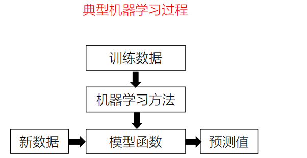
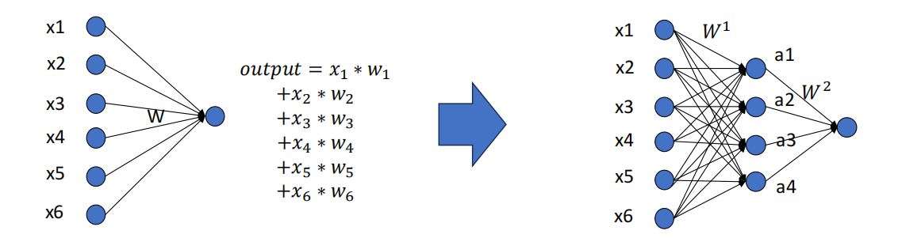
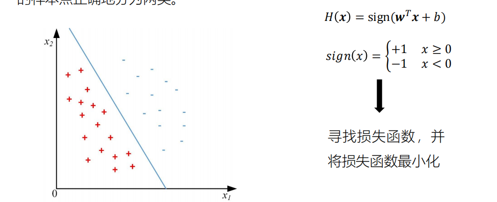
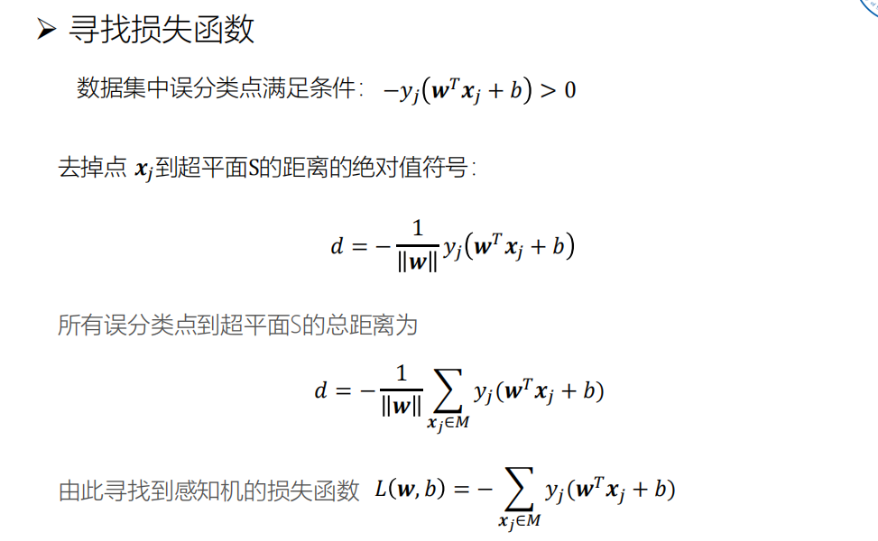
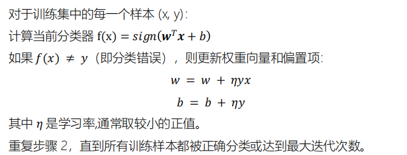
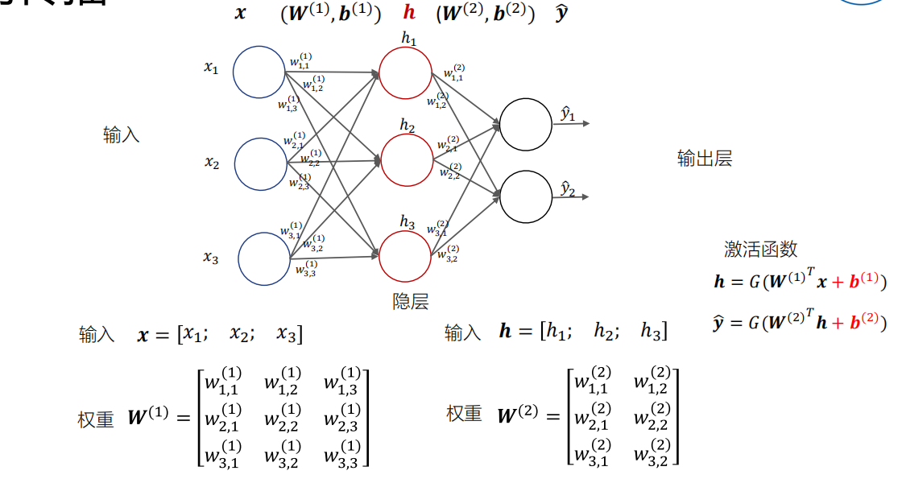
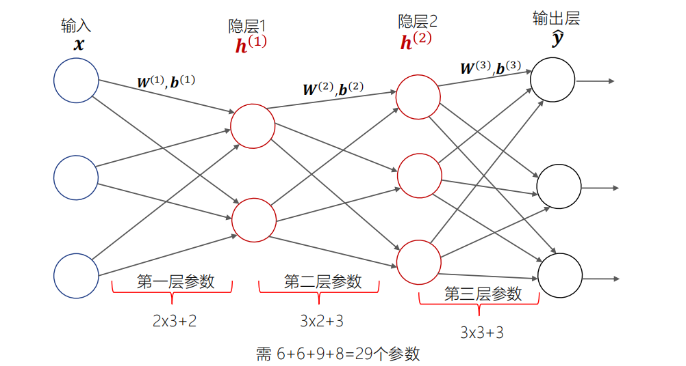

# Chapter 2 神经网络基础理论

## 2.0 Overview

## 2.1 机器学习

机器学习：通过数据与机器学习方法，对数据内在规律（假设）进行优化和验证，从而获得对数据/任务模式最为准确的函数建模

### 线性回归

线性回归可以找到一些点的集合背后的规律：一个点集可以用一条直线来拟合。

#### 单变量线性回归模型

$H_W(x) = w_0 + wx$

- x: Feature
- H(x): hypothesis

#### 多变量线性回归模型

考虑多个特征会影响 预测结果H(x)
$$
H_w(x) = w_0 +w_1x_1 + w_2x_2 = \sum_{i=0}^{n}w_ix_i = \hat{w}^{T} x\\
x = [x_0;x_1;...x_n],x_0 = 1
$$

#### 评价拟合效果

定义损失函数，修正模型权重向量，使得误差尽可能减少

$L(\hat{w}) = \frac{1}{2}\sum_{j=1}^{m}(H_w(x_j) - y_j)^2 = \frac{1}{2}\sum_{j=1}^m (\hat{w}^T x_j - y_j)^2$

求出参数 $\hat{w}$，使得损失函数取值最小

#### 线性假设的偏差

- 模型假设：特征x与标签y之间的线性关系
- 当数据过于复杂时，将会引起明显偏差。

线性回归模型的模型假设过于简单，导致其无法很好的建模复杂问题（高偏差）。因此，研究者基于权重加和这个简单操作，不断叠加，构建能够近似复杂函数的神经网络

## 2.2 神经网络

#### 感知机（Perceptron）模型

感知机模型 $H(x) = sign(w^Tx _ b)$对应一个超平面 $w^Tx + b = 0$，模型参数是（w，b）。感知机的目标是找到一个 （w, b)，将线性可分的数据集T中的所有的样本点正确地分为两类。

>分类问题的损失函数：
>
>考虑一个训练数据集 $D = \{(x_1,y_1),(x_2,y_2),...,(x_m,y_m)\}$，如果存在某个超平面S，能将正负样本分到S两侧，则说明数据集可分，如何求出这个超平面S的表达式？
>
>策略：假设误分类的点为数据集M，使用误分类点到超平面的总距离来寻找损失函数
>
>
>
>

#### 感知机算法

得到 模型函数和损失函数之后，问题转换为 一组(w, b)使得损失函数最小化，具体算法流程如下

#### 多层感知机（MLP）

将大量的神经元模型进行组合，用不同的方法进行连接并作用在不同的激活函数上，就构成了人工神经网络模型

##### 正向传播

计算多层神经网络的参数量

这里主要考虑的就是w和b

随着网络层数的增加，每一层相对于前一层次的抽象表示更深入，每一层神经元学习到的是前一层神经元更抽象的表示

通过抽取更抽象的特征来对事物继续宁区分，从而获得更好的区分和分类能力

>

激活函数有简单的sign，sigmoid，relu等等

#### Why Go Deeper？

理论上两层神经网络足以拟合任意函数

- 但局限性在于对复杂函数的表示效率有限，训练效率很低
- 多层神经网络：训练难以收敛，梯度回传容易爆炸或者消失

## 2.3 神经网络训练方法

模型训练的目的，就是调整参数使得模型计算值尽可能与真实值逼近

### 2.4 神经网络设计基础

## 2.5 过拟合与正则化

## 2.6 交叉验证

## 2.6 Conclusion