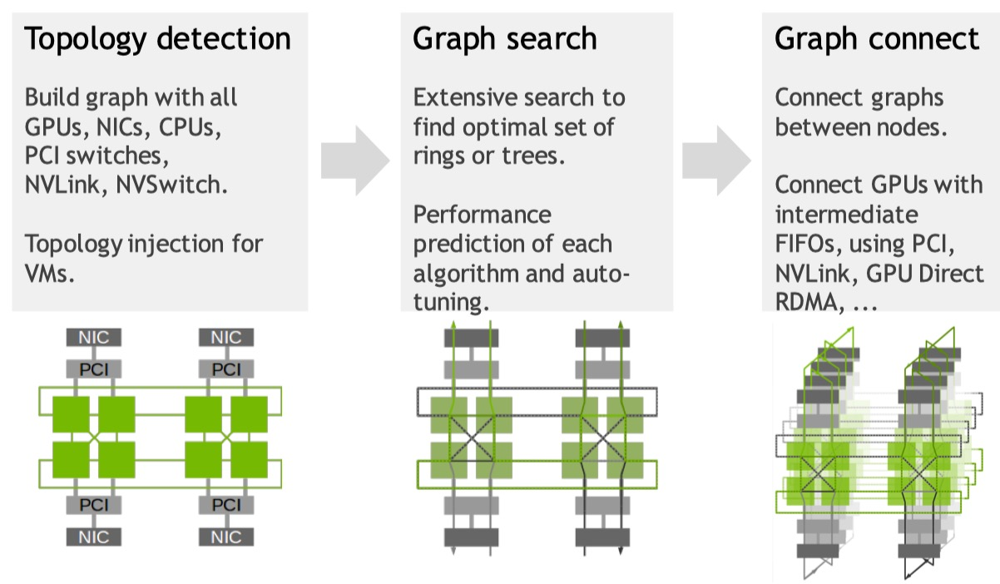
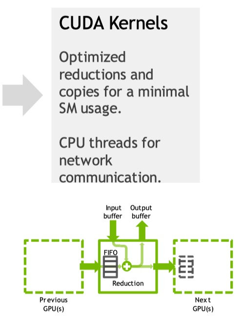
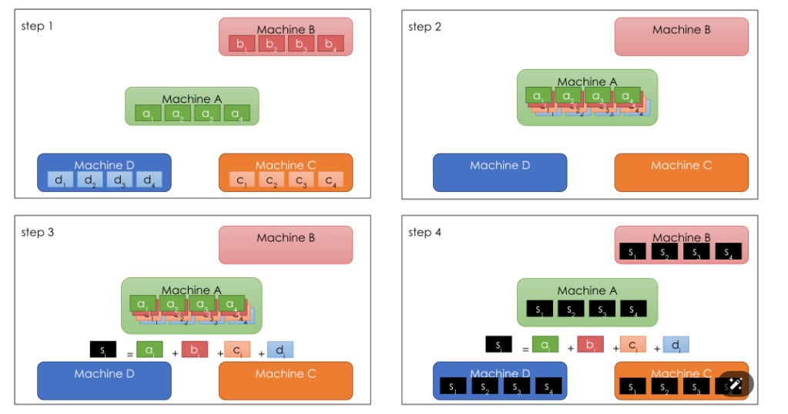

# Chapter 6 分布式大模型训练系统

## 6.0 Overview

- NCCL 通讯库：通讯原语，通讯机制
- 分布式训练

## 6.1 NCCL（NVIDIA Collective Communications Library）

NCCL 是 NVIDIA 推出的一个用于高性能 GPU 分布式计算的通信库。

​                                                   

NCCL 负责 CUDA Devices 之间的通讯

- 主流深度学习框架等待分布式实现目前都提供对 NCCL 的支持。

>这张图的意思是说，NCCL 和 CUDNN， CUBLAS  是平级的关系，他们都是  GPU分布式计算的通信库

### 机内/机间通讯

在分布式计算中，**机内通信（Intra-node）** 和 **机间通信（Inter-node）** 是两个重要的通信层次，分别处理不同的通信需求。使用的链路、通信方式以及对系统性能的影响所有不同。

#### 机内通信（Intra-node）

**定义**：机内通信指的是同一台服务器或计算节点内不同处理单元（例如GPU、CPU、内存等）之间的通信。通常在同一台机器内，多个处理器（如多个GPU或多个CPU）需要共享数据或进行同步。

**链路**：机内通信使用的链路通常是节点内部的高速总线或总线技术，常见的有：

- PCie（peripheral Component Interconnect Express）：用于连接CPU与GPU之间，当前大多数系统的主流链路，带宽可以达到32 GB/s（PCIe Gen 4）或更高（PCIe Gen 5）。
- **NVLink**：NVIDIA推出的一种专为GPU间通信优化的高带宽连接技术，带宽比PCIe高，可以达到100 GB/s（在NVLink 2.0下）。
- **CUDA-aware MPI/Gloo**：在多个GPU之间进行数据并行时，使用CUDA-aware的MPI（Message Passing Interface）或Gloo等库来实现高效的GPU间通信。
- **NVSwitch**：NVIDIA的集群级GPU互联交换机，专门用于支持大规模GPU之间的高速通信，通常用于大规模GPU集群的机内通信。

**通信模式**：机内通信一般需要频繁地进行高带宽、低延迟的数据交换，尤其是在多GPU并行计算时。典型的操作包括**AllReduce**、**AllGather**等集体通信操作，常用于神经网络训练中进行梯度的同步和数据的合并。

#### 机间通信（Inter-node）

**定义**：机间通信是指跨多个计算节点（即不同的机器或服务器）之间的通信。在分布式计算和分布式深度学习中，多个机器上运行的处理单元需要通过网络交换数据。

**链路**：机间通信主要依赖网络连接，常见的链路和协议包括：

- **以太网（Ethernet）**：这是最常见的网络连接类型，尤其是在数据中心内部，带宽从1Gbps到100Gbps不等。
- **InfiniBand**：一种高速、低延迟的网络互联技术，通常用于高性能计算（HPC）集群。InfiniBand的带宽可达到200Gbps甚至更高，且延迟非常低，适合大规模的分布式计算任务。
- **RDMA（Remote Direct Memory Access）**：远程直接内存访问协议，允许计算机直接访问远程主机的内存，绕过操作系统的干预，提供低延迟和高带宽的通信，常用于InfiniBand网络上。

**通信模式**：机间通信通常用于跨节点的数据交换和同步。例如，在分布式训练中，多个节点之间需要进行数据同步操作，如**AllReduce**、**Broadcast**、**Reduce**等。NCCL、MPI、Gloo等通信库会根据硬件架构和网络环境选择合适的通信策略。

### NCCL架构

在设计和实现过程中，NCCL采用了多种技术来优化GPU间的通信，包括 拓扑检测，图搜索，图连接和 CUDA内核

##### 1.拓扑检测（Topology Detection）

**拓扑检测**是NCCL的一个关键部分，它通过识别不同GPU之间的硬件连接方式，帮助NCCL选择最优的通信路径和通信策略。不同的硬件架构（如PCIe、NVLink、InfiniBand等）对通信的性能有显著影响，因此理解节点间的连接结构对于选择合适的通信算法至关重要。

#### 拓扑检测的步骤：

- **硬件检测**：NCCL首先需要扫描系统中的GPU设备并检测它们之间的物理连接。例如，在单个服务器内，可能有多个GPU通过NVLink或PCIe进行连接。在多个节点的系统中，NCCL需要了解GPU如何通过网络（如InfiniBand或以太网）互联。
- **链路分析**：NCCL分析每个GPU之间的链路类型（如NVLink、PCIe、Ethernet等），并计算每个链路的带宽和延迟。这一过程决定了NCCL后续如何安排通信。
- **拓扑图构建**：基于硬件和连接的信息，NCCL构建一个拓扑图，图中的节点代表GPU，边代表GPU之间的物理连接。拓扑图将帮助NCCL选择最佳的通信模式（如环形、树形等）。

#### 拓扑检测的意义：

- **性能优化**：通过了解GPU的连接方式，NCCL可以减少通信延迟，选择带宽更高的路径进行数据交换。例如，使用NVLink代替PCIe可以显著提高带宽。
- **自适应性**：NCCL能够根据硬件和网络环境动态调整通信策略，不同系统配置会选择不同的优化方案。

1. **数据源收集**

- **CPU架构与供应商（cpuid/arch）**：通过CPU架构与供应商信息，NCCL可以了解CPU的具体型号和架构，有助于优化计算任务的调度。
- **PCI拓扑、速度和CPU亲和性（/sys）**：通过获取系统中PCI总线的拓扑结构、带宽和速度信息，以及每个GPU与CPU的亲和性，可以帮助NCCL做出更高效的通信决策。
- **NVLink信息（NVML）**：通过NVIDIA的管理库（NVML），NCCL可以获取关于GPU之间连接的信息，特别是使用NVLink的系统。这对于多GPU通信至关重要。
- **InfiniBand（IB）速度、多端口、插槽直接（IB Verbs）**：对于使用InfiniBand作为网络连接的系统，NCCL会收集其带宽、端口数量和连接拓扑。
- **虚拟机拓扑信息（XML file）**：如果在云环境中运行，NCCL也能通过云虚拟机管理器提供的拓扑信息来优化通信。

2. **拓扑图构建**

- 所有收集到的数据用于**构建拓扑图**，这就是如何将硬件资源（如GPU、CPU和网络连接）表示为图形结构。在这个阶段，NCCL通过这些信息自动确定每个设备的连接方式，从而确定最优的通信路径。
- **图形表示**：图中显示了PCI、DGX-1、DGX-2和DGX A100等不同硬件配置，展示了设备之间的物理连接，例如GPU、NIC（网络接口卡）和NV Switch。

3. **生成原始XML拓扑**

- **NCCL_Topo_Dump_File**：NCCL将所收集的信息和构建的拓扑图保存为XML格式，这个XML文件（NCCL_Topo_Dump_File）可以用来记录当前系统的拓扑结构。
- 这个XML文件可以用于后续的调试、分析或在其他系统中复用，以确保NCCL能够在不同系统环境下准确地识别并优化数据通信。

4. **具体硬件示例**

- 图中展示了不同硬件配置的拓扑示例：
  - **PCI**：标准PCI总线拓扑，可能适用于较低端的硬件系统。
  - **DGX-1**：NVIDIA的DGX-1系统，其内有多个GPU和高带宽的网络连接。
  - **DGX-2**：比DGX-1更高性能的系统，具有更多的GPU和增强的NVSwitch连接。
  - **DGX A100**：采用A100 GPU的高端系统，使用了NVSwitch来增强GPU之间的通信带宽。

##### 2.图搜索

构建环/树路径（communication topology）

集合通讯主要通过NCCL在不同的计算设备之间构建的环/树路径来实现。

机内局部通讯拓扑搜索

>NIC:
>
>**NIC**（Network Interface Card，网络接口卡）是计算机或其他设备中用于连接网络的硬件组件。它允许设备通过有线或无线的方式与局域网（LAN）或广域网（WAN）进行通信。NIC提供了物理连接到网络的端口，并负责网络协议的实现，如以太网协议、Wi-Fi协议等。
>
>### 主要功能
>
>1. **数据传输**：NIC的基本功能是接收和发送数据包。它将数据从计算机内部的操作系统和应用程序转换为网络传输格式，并通过物理链路发送到网络上的其他设备。
>2. **物理层接口**：NIC提供物理连接点（例如RJ45端口、光纤端口等），使设备能够通过有线或无线方式连接到网络。
>3. **处理网络协议**：NIC通常包括硬件和固件，用来处理网络协议的低层次操作（例如Ethernet协议、IP协议、ARP协议等）。它能够执行一些数据包的封装和解封装工作。
>4. **网络地址管理**：每个NIC都有一个唯一的硬件地址，称为MAC地址（媒体访问控制地址）。它在局域网内部进行设备的唯一标识。
>
>### 类型
>
>1. **有线NIC**：通过网线连接到网络。常见的有线连接是以太网接口（Ethernet NIC），使用RJ45连接器。
>2. **无线NIC**：通过无线技术（如Wi-Fi）连接到网络。这类网络接口卡可以通过无线频段（如2.4GHz或5GHz）与路由器或无线接入点进行通信。
>
>### 在NCCL中的作用
>
>在NCCL中，**NIC**（网络接口卡）通常指的是用于连接计算机的网络部分，特别是当多个计算节点（如多个服务器或GPU集群）进行机间通信时，NCCL会利用NIC进行数据传输。具体来说：
>
>- **InfiniBand**、**Ethernet**等都是常见的NIC连接方式，尤其在数据中心、HPC集群中，它们用于多个节点之间的高速数据传输。
>- 在多个服务器的集群中，NCCL可能会通过NIC连接的网络（例如以太网或InfiniBand）来实现GPU之间的通信。这些网络连接的速度和带宽会直接影响到NCCL的通信效率。
>
>### 总结
>
>NIC是网络通信的基础硬件，它提供了设备与网络之间的接口，允许数据交换。在分布式计算或集群环境中，NCCL通过NIC来进行跨节点的数据传输，这对于多GPU通信和分布式训练至关重要

##### 3.图连接

机间全局通讯拓扑搜索

节点之间的相同序号的NIC（不同节点的同序号的GPU/NIC被称为同一个rail）之间有高速连接。以便实现”rail-optimized”网络设计，为每个rail使用各自的交换机。

树结构的通讯拓扑搜索

在机间通讯层面上，可以使用树形通讯拓扑来大大减少集合通讯的延迟。机间使用的网络拓扑（如fat-tree）往往也和这种树结构的通讯拓扑更加亲和。

Dual binary tree 以平衡流量分布

>**二叉树的基本结构**：
>
>- 在一个二叉树中，每个节点都有两个子节点，并且每次数据交换都通过父子节点进行。树的深度越小，数据的传播速度就越快，理论上深度为log(n)的二叉树可以实现非常高效的通信。
>- 数据从叶节点开始，依次通过父节点向根节点汇聚，或从根节点开始分发到叶节点。每次交换都可以保证将数据传递给两个子节点，或将数据合并到父节点。
>
>**双重二叉树的工作**：
>
>- **第一棵树**：在双重二叉树结构中，第一棵树通常用于数据的**汇聚**操作，例如`AllReduce`中的求和或最大值等操作。数据从叶子节点开始，逐步合并到父节点。
>- **第二棵树**：第二棵树则通常用于数据的**分发**操作，尤其是在`Broadcast`或`AllGather`等操作中，数据从根节点分发到所有叶子节点。
>
>这样，通过使用两棵树，数据的传输负载被分摊到多个通信路径中，减轻了单一路径的负担，从而优化了整体的通信效率。
>
>**流量平衡**：
>
>- 通过双重二叉树结构，数据在树的每一层级都均匀地分配到不同的节点。每次通信负载被分配到两个子节点，这样保证了每个节点的负载大致相等，避免了某个节点承受过多流量的情况。
>- 每一层的通信都同时进行，减少了等待时间，使得整个系统的通信效率提高，避免了数据传输中的瓶颈问题。
>
>**对称性**：
>
>- 双重二叉树结构具有对称性，使得每个节点的通信负载是相似的。这种对称性非常重要，尤其在分布式系统中，需要避免出现通信瓶颈或部分节点成为单点故障。
>- 对称性也使得每个节点的工作量大致相同，有助于更均衡的资源利用和降低系统的负载波动。

##### CUDA Kernels

建立通讯（RDMA）

GPU->CPU->网络>CPU -> GPU  需要经过PCIE，带宽有限。

建立通讯（GPU Direct RDMA）

GPU-> GPU

### NCCL 实现了一系列的通讯原语

集合通讯：

- AllReduce
- Broadcast
- Reduce
- AllGather
- ReduceScatter

基于点对点通讯（ncclSend()，ncclRecv()）还能实现以下通讯原语：

- Scatter（One-to-all）
- Gather（All-to-one）
- All-to-all

#### AllReduce

Reduce指在某个/些维度上进行归约处理（sum, min, max…）。然后将结果写到所有参与

集合通讯的GPU中。

#### Broadcast

将结果从一个设备复制到所有的设备当中。

#### Reduce

将所有设备上的数据归约到一个设备当中。（没有All前缀意味着output只在一个位置）

#### Scatter（One-to-all）

将一个设备上的数据分割分发给不同的设备

点对点通信

不同于广播：发送的数据不同。

#### ReduceScatter

每个设备都有自己的数据。

在将每个设备的数据分割分发的过程当中同时完成归约操作。

#### Gather（All-to-one）

行变列

将分发到不同的设备上的数据收集到一个设备当中

和scatter互为逆操作

#### AllGather

在gather收集的基础上将收集结果复制到所有的设备当中。

#### All-to-All

行列互换

相当于Scatter和Gather同时发生。每一列是一个Scatter的结果，每一行是一个Gather的

结果。

### 通讯原语在实现上的可能优化：并行传输，管道传输

#### Broadcast

#### AllReduce

环形结构：所有参与的节点（比如GPU或计算机）形成一个环形拓扑结构，数据在环中沿着一个方向传递，直到每个节点都接收到全局合并后的数据。

计算过程：

- reduction phase：每个节点会将数据与其邻居的节点进行合并
- allgather phase：每个节点奖数据从环中的其他节点收集到本地

$Total~time = \frac{N}{kB} \times (k-1) \times 2 = \frac{2(k-1)N}{kB}$ 

##### Ring-based AllReduce：Reduce-Scatter + Allgather

##### Ring-based AllReduce：Reduce-Scatter + Allgather

## 6.2 分布式机器学习系统

Scaling law：模型越大，数据越多，计算越久，表现越好。

影响大模型性能的三大要素：计算量、数据集大小、模型参数量。当不受其他两个因素制约时，模型性能与每个单独的因素都存在幂律关系。

#### LLM增加维度：上下文大小

大语言模型在不同规模参数下，如何通过上下文示例数量（Numbers of Examples in Context）影响其准确率（Accuracy）

**横轴（Number of Examples in Context）**：

- 表示**上下文中的示例数量**，单位是千（K）。在训练过程中，模型会从提供的上下文示例中学习。横轴的值增加表示提供给模型的上下文示例增多。

**纵轴（Accuracy）**：

- 显示模型的**准确率**，单位是百分比（%）。模型通过理解给定的上下文示例来提高自己的准确性。

**曲线的分布**：

- 该图中有三条主要的曲线，分别代表不同规模的模型：
  - **175B Params（蓝色曲线）**：表示具有1750亿参数的大规模模型。
  - **13B Params（橙色曲线）**：表示具有130亿参数的中型模型。
  - **1.3B Params（绿色曲线）**：表示具有13亿参数的小型模型。

**Zero-shot、One-shot、Few-shot**：

- 图中标明了三种学习方式：

  Zero-shot、One-shot和 Few-shot，表示模型在没有任何示例（Zero-shot）、仅提供一个示例（One-shot）和提供少量示例（Few-shot）时的表现。

  - **Zero-shot**：模型没有上下文示例，只依赖其预训练的知识进行推理。
  - **One-shot**：模型只接收一个上下文示例来进行推理。
  - **Few-shot**：模型接收少量的上下文示例来进行推理。

#### 计算硬件的发展目前落户于大模型模型规模的发展。

#### 如何通过分布式承载越来越大的模型和数据？

并行策略

- data parallel
- pipeline parallel
- tensor parallel
- sequence parallel
- expert parallel

### 6.2.1 分布式训练

数据并行（Data Parallel）

模型并行（Model Parallel）

张量并行（Tensor Parallel）

管道并行（Pipeline Parallel）

序列并行（Sequence Parallel）

全切片数据并行（Fully Shared Data Parallel）

3D并行

专家混合模型（MOE）

并行的自动化搜索

#### 数据并行（Data Parallelism, DP）

对于一个batch的数据，可以继续分发给不同的设备做梯度计算，然后再聚合起来。该过程

与在一个计算设备上对原始batch进行梯度计算是等价的。

在每个GPU上，前向传播和反向传播的计算都是独立进行的。

每个GPU都为自己的子批量数据生成自己的梯度

在完成反向传播之后，所有GPU生成的梯度会被聚合并取平均（All-reduce操作）

数据并行计算，以加速batched data的训练过程

##### PS（Parameter Server）架构

Server：

- 存放机器学习任务的参数，接收客户端的梯度，对本地参数进行更新（update）。

Worker：

- 从服务器端获取当前最新的参数（pull）
- 使用本地或者远程节点的数据和从服务器端获取的参数，计算过于训练参数的梯度（compute），将梯度发送给服务器端（push）

问题：in-cast的数据传输

**in-cast 数据传输**（In-cast data transmission）通常指的是多个客户端或工作节点向一个单独的服务器（通常是一个参数服务器）发送数据的情况。这种通信模式在分布式计算、尤其是分布式机器学习（如深度学习）中是非常常见的，特别是在参数服务器模型中用于同步和更新全局模型的参数。

**多个Worker节点**向**参数服务器**发送更新的梯度或计算结果。这些Worker节点计算得到的梯度会传送给参数服务器，由参数服务器将这些梯度聚合并更新全局模型参数。

**Parameter Server**在接收来自多个客户端的数据时，可能会出现瓶颈，尤其是在有很多Worker节点同时向参数服务器发送数据时，导致接收的数据量远大于单个Worker节点的传输能力。

由于**In-cast数据传输**通常涉及多个客户端向一个中心服务器发送数据，下面是它带来的挑战：

- **带宽瓶颈**：当大量的客户端同时向一个参数服务器发送数据时，网络带宽可能成为限制因素。如果网络带宽不足，数据的传输速度就会受到影响，导致性能下降。
- **网络拥塞**：多个客户端并行发送大量数据到一个单一的接收点（即参数服务器）时，可能会造成网络拥塞，增加传输延迟。
- **不均衡的负载**：在某些情况下，客户端（如多个计算节点）向参数服务器发送的数据量可能不均衡，导致参数服务器成为性能瓶颈。

##### Ring-all-reduce的数据并行架构

梯度聚合（pull）+传播（push）的过程本质上就是AllReduce的过程。

基于Ring分片传输思路实现的AllReduce更容易满足流量传输均衡的需求。

在allreduce的逻辑拓扑中，所有的传输节点都是平等的。

具体算法见前Ring-all-reduce部分描述

树形AllReduce在某些网络拓扑下也有其优势。

##### Multiple Ring-AllReduce的数据并行架构

数据并行流量指示在所有设备上执行 加和 操作

因此，满足结合律和交换律，可以基于光交换机设计多个互质网络换进行分流传输，增加传输效率。

##### 数据并行一定要同步吗？

每轮iteration，原始SGD算法要求所有计算设备必须全部完成梯度计算、梯度聚合、更新模型、分发更新之后的模型之后，才能够进行下一个iteration的梯度计算

- BSP（Bulk Synchronous Parallel）同步
- SSP（Staleness Synchronous Parallel）部分异步
- ASP（Asynchronous Parallel）异步

###### ASP（Asynchronous Parallel）完全异步

每个worker异步的更新梯度，拿取参数，进行下一轮的梯度计算。

当PS和Worker传输代价较大的时候适合异步SGD

###### SSP（Staleness Synchronous Parallel）有限程度的异步

in SSP, **each worker**(such as a GPU or compute node) can use slightly outdated model parameters to perform computations, as long as the parameters are not too stale.

异步性越高，训练速度越快，准确度下降越明显。

有时候准确度的影响，本质上是收敛速度的影响：“训练越快，训练越慢！“

数据并行：

- 优点：简单容易实现
- 缺点：主要用于并行计算任务，每个副本需要的模型内存没有下降

#### 模型并行（Model Parallelism）

模型并行的核心原因：

- 模型在一个计算设备上放不下。
- 在batch_size之外进一步切分计算粒度：hidden size 上切分的可能性。

层间切分（1）：Pipeline Parallelism（管道并行）

层内切分（1,2）：Tensor Parallelism（张量并行）

#### 管道并行

Vertically slicing the model gives each  GPU its own subset of layers

- 数据并行：每一个GPU上面都要放置完整的模型副本，因此DP的内存占用在“模型层面上”并不会下降。
- 管道并行：模型被拆分到了不同的GPU/主机之间，从而减少其模型内存占用。

##### 纯粹的模型并行——> 管道并行

PP+DP：对应的stages之间交换梯度更新信息

##### Pipeling in PP：

将minibatch拆分成更小的批处理运算块，然后分块进入模型管道，从而实现PP上流水线的工作模式：每个GPU可以同时处理不同的小运算块。

通讯开销隐藏在计算开销之后。当网络状况极差时可能需要特别的并行调度设计。

- Batch size：ML算法要求的一个batch的大小（如2048）
- Mini-batch size：通过数据并行（DP）后，每一个模型副本分到的批处理大小（DP=2，minibatch_size = 2048/2 = 1024）
- Micro-batch size ：继续通过管道并行（PP）后，每一个GPU设备实际运行的批处理大小（和PP不一定相等，microbatch_size = 1024/4 = 256）

Microbatch数量和Stage数量可以不相等

#### 系统性能分析：

##### 1.激活内存（Activation Memory） 管理和Checkpointing

激活内存的公式，通常与 checkpointing结合使用。在使用checkpointing时，某些层的激活（intermediate activations）会被报错，并且可以在需要时按需重新计算。这使得内存开销得以减少，因为不是每一层的所有激活都需要保存在内存中

$O(N + \frac{L}{K} \times \frac{N}{M})$

- M：number of micro-batches
- K：number of stages/PP degree
- L：total number of layers
- N：minibatch size

>O(N)
>
>- 这一部分代表了每个mini-batch的输入数据所需的内存（或计算）。这是处理每个批次时所需的内存大小，它与每个mini-batch的大小直接相关。
>
>$\frac{L}{K} \times \frac{N}{M}$
>
>- 这一部分与模型的**并行化（Model Parallelism）**有关。模型被分割成 K 个阶段，因此每个阶段处理的层数是 $\frac{L}{K}$。
>- 每个微批次的大小是 $\frac{N}{M}$，这意味着每个阶段需要处理较小的批次，这样可以减少内存的消耗并提高计算效率。
>
>这部分的含义是：由于模型被分成多个阶段，且每个阶段可能只有一部分的层，因此每个阶段处理的样本量和层数都会减少，这可以帮助控制内存使用。

当你使用checkpointing时，不需要报错所有层的激活，只需在每个checkpoint带你保存部分激活，其他的激活可以在需要时重新计算。这减少了内存需求，但也带来了计算开销，因为需要额外的前向传播计算。

##### 2.Bubble Time 和 Idle Time

Bubble time 或 idle time 是在模型并行训练中常见的问题，特别是在并行训练多个阶段时：

Bubble Time（idle time/ idea time)

$O(\frac{K-1}{N})$

这表示并行度（K）与小批量大小（N）之间的关系，在不同阶段计算之间的等待时间（即Bubble time）会占用一部分计算时间

- K（并行度）：如果K较大，意味着模型的每个部分（如每个层）会分布到多个设备（如多个GPU），这样，更多的层可以并行计算，但这也可能导致各设备之间的同步延迟）
- Bubble time就是由于不同设备在等待其他设备的计算结果时，会出现的空闲时间。这是时间是“闲置”的，因为某些GPU的计算任务可能已完成，但它们必须等待其他GPU完成才能继续

#### 为什么Bubble Time与K和N有关：

- 当**K较小**（并行度较低）时，计算任务在每个GPU上会较重，导致GPU之间需要同步的时间增加，进而增加Bubble Time。
- 当**K较大**时，每个GPU分配的计算任务较小，导致设备之间的计算进度差异较小，减少了等待时间，从而减少了Bubble Time。

- bubble 是 PP开销最大的问题
- Bubble time（idle time/idea time）：$O(\frac{K-1}{N})$
- 因此，当K较小，M足够大的时候，bubble time的比例会忽略不计
- However，M过大会导致micro-batch size = N/M 太小，因此无法充分利用GPU计算资源

small micro-batch size also leads to GPU under-utilization and lesser throughput.

#### 实验结果

当M >>K时，增加AK可以观察到近乎线性的吞吐率的增长(Bubble-- ,GPU ++)

但是K不变的时候，M增加带来的吞吐率增长有限（Bubble--， GPU util--）

注意：PipeDream定义的minibatch

在Pipedream paper里，用minibatch称呼拆分在不同的管道并行的各个microbatch，原因是它采用了一步的更新模式：每个microbatch都会自己更新，因此即使在形式上类似microbatch，在功能上其实更接近minibatch

PP + 不规则DP：在PipeDream中，PP和DP的地位是不同的

#### PP应该如何设计

是否存在一个最优的active minibatches数量：理想情况所有workers都在忙

对于一个input stage replica来说：

NUM_OPT_ACTIVE_MINIBATCHES=(# workers) / (# of replicas in the input stage)

达到稳态之后：每进来一个minibatch，离开一个minibatch。

每个FP：为管道带来一个新的minibatch；每个BP：从管道送走一个完成的minibatch。

因此：one FP, one BP能够维持稳定的optimal active minibatch number!

PP上异步的更新方式

PipeDream vs. Data Parallel

- 优势：高效的并行机制，相比于DP更低的机间通讯
- 问题：异步数据并行（SSP）破坏训练语义，可能减慢收敛速度。

### 张量并行（Tensor Parallelism）

层内并行，本质上是对模型线性层做矩阵分块计算，目前主流的TP事专门针对Transformer架构优化的并行模式，即针对MLP和自注意力模块的张量并行。

#### MLP的张量并行

两种并行方式：

- 对模型矩阵A按照行还是按照列进行切分？
- 按照行进行切分：
- 要求先加（reduce）起来，在执行element-wise的非线性函数
- 按照列进行切分
- 可以分别进行非线性函数再合并
- 在MLP中，按照切分处理第一个矩阵乘法，然后按照列切分处理第二个

f的forward：把输入X**拷贝**到各worker上，以让worker独立做forward计算。

g的forward：每个worker上的forward的计算完毕，取得Z1和Z2后，GPU间做一次all-reduce，相加结果产生Z。

g的backward：把Z的梯度拷贝到各worker上，以让worker独立做backward梯度计算

f的backward：当前层的梯度计算完毕，需要传递到下一层继续做梯度计算时，我们需要求得对整个X的梯度。则此时各worker做一次all-reduce，把各自的梯度相加即可。

一个transformer layer由自注意力模块和MLP构成，从而整体包含forward的g对应**两次**

**allreduce**，backward的f对应**两次allreduce**。

张量并行

优点：

- reduces the amount of memory required per GPU
- keeps GPU utilizaiotn high compared to veritcal slicing

缺点：

- Very frequent synchronization (all-reduces) means we need extremely fast network connections to maintain high throughput
- Not as easy to implement as data parallelism -need to add the synchronization ops manually to your Attention module

因此一般用于机内告诉连接的计算设备之间

