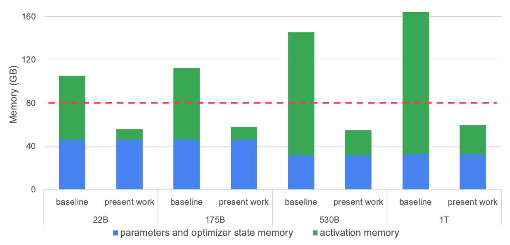
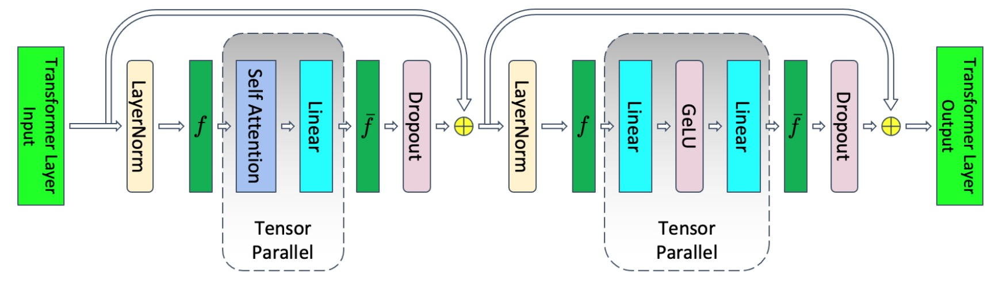
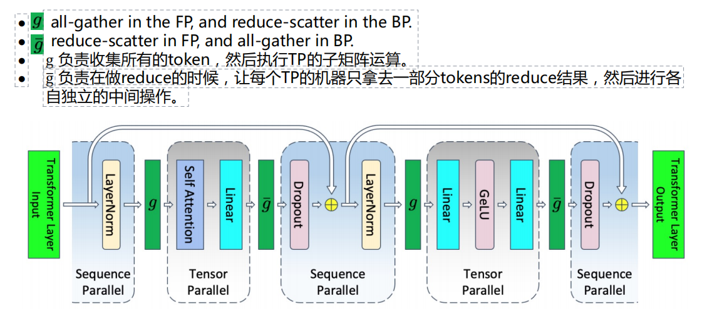
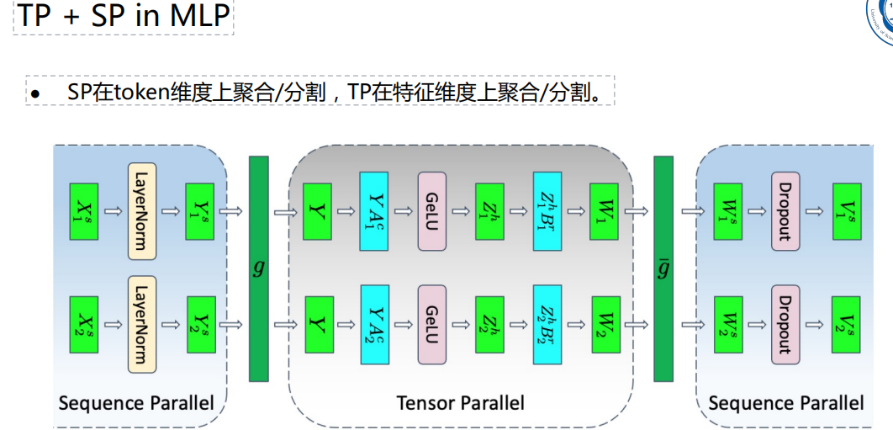
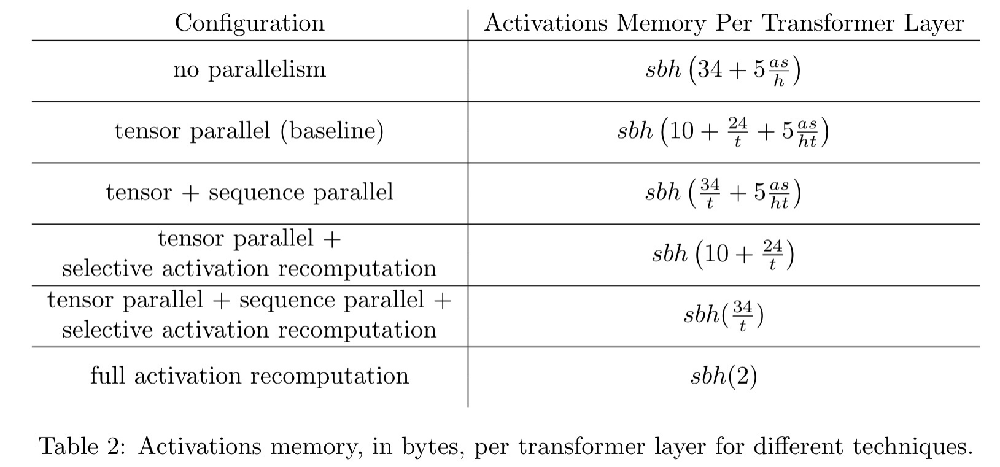
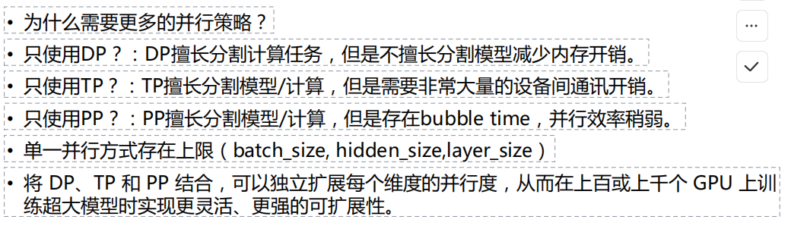
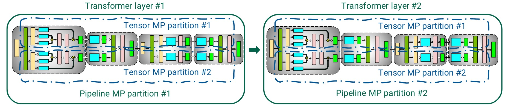
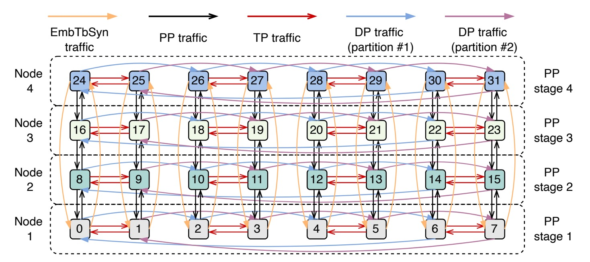

# Chapter 7 分布式大模型训练系统

## 7.0 Overview

序列并行（Sequence Parallel）

全切片数据并行（Fully Shared Data Parallel）

3D并行

专家混合模型(MOE)

并行的自动化搜索

## 7.1 序列并行

PP每个stage（特别是靠前的PP）仍然需要存储很多的FP临时结果帮助BP计算。

但切分更多的PP会使相对activations内存开销变高。

**激活内存**（activation memory）是指在前向传播过程中需要保存的激活值。在模型并行中，每个PP阶段都需要保存前向传播中计算得到的激活值，以便在反向传播时使用。

如果你将模型分成更多的PP阶段，意味着每个阶段的计算负担较小，但每个阶段所需要存储的临时激活值将会增加，因为每个阶段的输出激活值都必须存储下来供后续阶段使用。这会导致**激活内存的开销增加**。

#### Original TP

f: no opeartion in FP, all-reduce in BP.

$\hat{f}$：All-reduce in FP, no operation in BP.

层归一化(layer-norm)以及dropout计算并没有被拆分，而是在各个TP设备中重复进行计算。这些元素不需要太多的计算,但需要消耗大量的激活内存（activations）。

#### Tensor Parallelism + Sequence Parallelism

将层归一化(layer-norm)以及dropout的计算和存储工作也在TP的机器之间分割。

●Observation：不同的token独立进行layer-norm/dropout操作。

●Idea：在TP之间，引入sequence parallelism，让每个TP的设备只处理一部分token的layer-norm/dropout操作。

●做法：拆解All-reduce操作的“All”。(It is the “all”term that makes all devices receive all tokens.)

##### All-Reduce -> Reduce-scatter + All-gather

##### Activations memory分析

**s**：表示输入数据的**batch size**（批量大小）。

**b**：表示每个样本的特征数量，通常是每个样本的维度。

**h**：表示每个Transformer层的**隐藏层大小**。

**t**：表示**序列长度**（sequence length），即输入数据的时间步长或序列长度。

**a**：表示**激活**（activation）的某个量化因子。

**activation memory**：表示每个Transformer层需要的激活内存大小。

#### TP + PP

#### 三维并行

