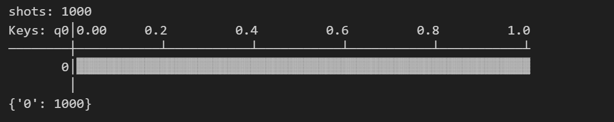

# 量子计算与机器学习 Lab1 Report  

>PB21111653
>
>李宇哲

## Part1 安装与部署

我尝试了多种环境，在wsl（windows for linux，ubuntu22.04）上按照教程配置时遇到了诸多问题，最终方案如下

windows + miniconda，开启 python3.9.7虚拟环境

- mindspore：2.4.0
- mindquantum，quafu，pypanda均在python3.9.7时可正常安装

## Part2 基本操作验证

### 2.1

>将一个量子态初始化为 |0⟩ 态，分别应用几种单比特门（X 或 Y 或 Z）将其变为终态，验证测量结果和预期结果的对比。

```python
# 环境依赖库
import numpy as npy
from mindquantum.core import X, Y, Z, H, RX, RY, RZ
from mindquantum.core import Circuit
from mindquantum.simulator import Simulator`
```

$∣0\rangle= \begin{pmatrix}  1  \\  0  \end{pmatrix}$

默认量子态的初始化是 |0>态，因此如下分别应用X, Y, Z三种单比特门，变成终态即可。

预期结果
$$
X|0\rangle = \begin{pmatrix}  0 & 1  \\  1 & 0  \end{pmatrix}\begin{pmatrix}  1  \\  0  \end{pmatrix} = |1\rangle
\\
Y|0\rangle = \begin{pmatrix}  0 & -i  \\  i & 0  \end{pmatrix}\begin{pmatrix}  1  \\  0  \end{pmatrix} = i|1\rangle
\\
X|0\rangle = \begin{pmatrix}  1 & 0  \\  0 & -1  \end{pmatrix}\begin{pmatrix}  1  \\  0  \end{pmatrix} = |0\rangle
$$
因此预期结果应该分别为 $|1 \rangle$, $|1\rangle$, $|0\rangle$

代码及运行结果分别如下

```python
# X
sim = Simulator('projectq', 1)
circuit = Circuit()
circuit += X.on(0)

circuit.measure(0)

result = sim.sampling(circuit,shots=1000)
print(result)
```


```python
# Y
sim = Simulator('projectq', 1)
circuit = Circuit()
circuit += Y.on(0)

circuit.measure(0)

result = sim.sampling(circuit,shots=1000)
print(result)
```


```python
sim = Simulator('projectq', 1)
circuit = Circuit()
circuit += Z.on(0)

circuit.measure(0)

result = sim.sampling(circuit,shots=1000)
print(result)
```



### 2.2

>将 |0⟩ 态通过 Z 门，H 门和 S 门转化为其他不同状态，观察和解释最终量子态的概率分布。

- 应用 Z 门后，$|0\rangle$ 不变，应用 H门后，变为 $\frac{1}{\sqrt{2}}(|0\rangle + |1\rangle)$
- 应用S门后，变为 $\frac{1}{\sqrt{2}} (|0\rangle + i|1\rangle)$

最终量子态中，$|0\rangle$和$|1\rangle$概率应该各位百分之50左右

>在实现中发现，mindquantum其实是没有 S门，需要用RZ设置角度获取

```python
import numpy as npy
from mindquantum.core import X, Y, Z, H, RX, RY, RZ
from mindquantum.core import Circuit
from mindquantum.simulator import Simulator
sim = Simulator('projectq', 1)
circuit = Circuit()
circuit += Z.on(0)
circuit += H.on(0)
S = RZ(npy.pi/2)
circuit += S.on(0)

print(circuit)

circuit.measure(0)

result = sim.sampling(circuit, shots=1000)
print(result)
```

运行结果如下


### 2.3

>初始化两个 |0⟩ 态的量子比特，编写代码使得第一个量子比特变为 |1⟩ 态，而第二个保持不变。

```python
import numpy as npy
from mindquantum.core import X, Y, Z, H, RX, RY, RZ
from mindquantum.core import Circuit
from mindquantum.simulator import Simulator
sim = Simulator('projectq', 2)
circuit = Circuit()
circuit += X.on(1)
circuit += Z.on(0)

circuit.measure_all()

result = sim.sampling(circuit, shots=1000)
print(result)
```

默认都是 $|0\rangle$态，将X变为 $|1\rangle$即可

结果如下

