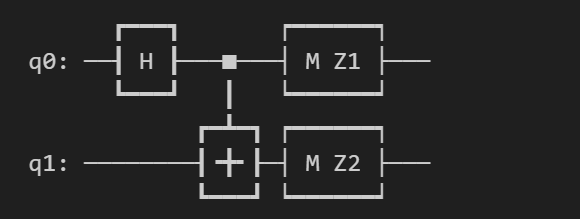
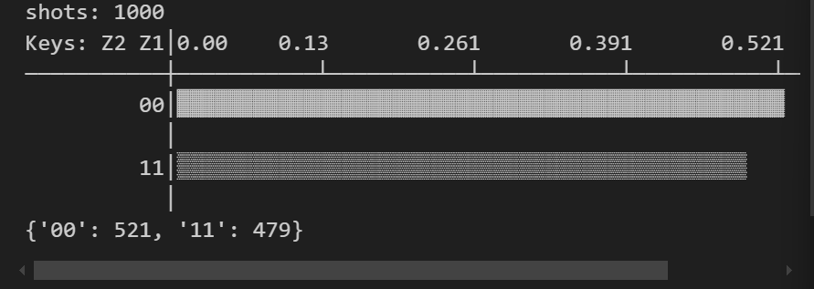
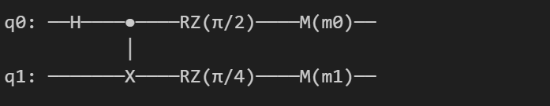
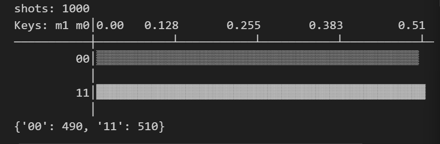
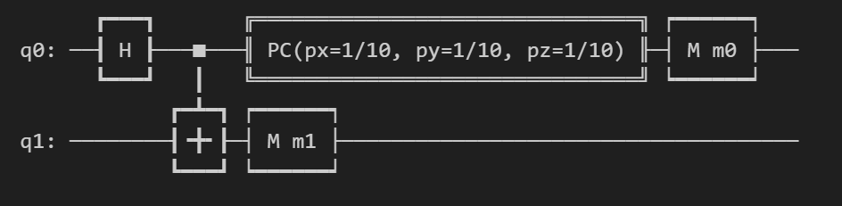
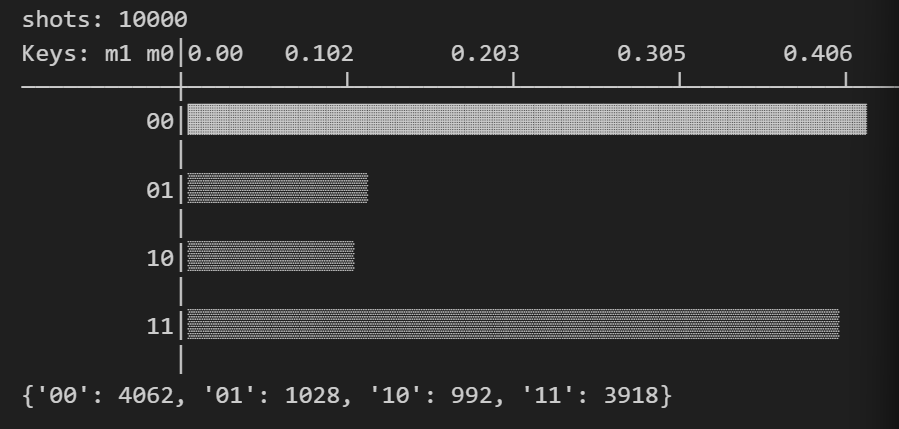

# 量子计算与机器学习 Lab1 Report

>PB21111653 
>
>李宇哲

## 环境依赖

```python
import numpy as npy
from mindquantum.core import X, Y, Z, H, RX, RY, RZ
from mindquantum.core import Circuit
from mindquantum.simulator import Simulator
from mindquantum.core import Measure
```

由于我原先的`mindquantum`版本落后，没有S门和T门，因此是手动用RZ门实现，而后在第三题遇到了必须更新版本的问题，重新配置了环境，更新的mindquantum版本

## 第1题 纠缠态操作

### 1-1

>使用 H 门和 CNOT 门创建两个比特的纠缠态（Bell态）

```python
circuit = Circuit()
circuit += H.on(0)      # Apply H gate on the first bit
circuit += X.on(1, 0)   # Apply CNOT gate on the second bit controlled by the first bit
circuit += Measure('Z1').on(0)
circuit += Measure('Z2').on(1)

print(circuit)
```




### 1-2

>验证 Bell 态的非局域性，即测量一个比特对另一个比特测量结果的影响（提示：进行多次测量并记录结果组合，观察两个比特之间的关系）。

```python
sim = Simulator('mqvector', circuit.n_qubits)
shots = 1000
result = sim.sampling(circuit, shots=shots)
print(result)
```



假设有两个Bell态 $|\Phi+\rangle = \frac{1}{\sqrt{2}}(|00\rangle+|11\rangle)$

对两个量子比特进行测量，在计算基 ($|0\rangle$和 $|1\rangle$)下测量第一个量子比特

经过多册验证，应该只有 00 和11两种情况，且概率大致相等，表明对一个量子比特的测量结果会影响另一个比特的测量结果，体现了Bell态的非局域性

## 第2题 量子比特与相位

```python
circuit = Circuit()
S = RZ(npy.pi/2)    # 创建S门
T = RZ(npy.pi / 4)  # 创建Z门
circuit += H.on(0)
circuit += X.on(1, 0)
circuit += S.on(0)
circuit += T.on(1)

circuit += Measure('m0').on(0)
circuit += Measure('m1').on(1)

print(circuit)
```



```python
sim = Simulator('projectq',  circuit.n_qubits)
shots = 1000
result = sim.sampling(circuit,shots=shots)
print(result)
```



相位门会改变量子态的相位，但不改变量子态振幅的模，因此相位变化不影响测量概率。

结果中00与11的概率分布相同，说明概率不收相位变化影响

## 第3题 探讨Bell态的稳定性

```python
from mindquantum.core.gates import PauliChannel
circuit = Circuit()
circuit += H(0)
circuit += X.on(1, 0)

circuit += PauliChannel(0.1, 0.1, 0.1).on(0)

# 添加测量操作
circuit += Measure('m0').on(0)
circuit += Measure('m1').on(1)

print(circuit)
```



```python
sim = Simulator('mqvector', circuit.n_qubits)
shots = 10000
result = sim.sampling(circuit, shots=shots)
print(result)
```



通过X门后的Bell态 $|\Phi^+\rangle = \frac{1}{\sqrt{2}} (|10\rangle + |01\rangle)$为例

测量第一个量子比特时，测量得到$|0\rangle$ 坍缩到$|01\rangle$，测量$|1\rangle$坍缩到 $|10\rangle$，概率均为0.5

没有噪声时，测量第一个量子比特得到$|0\rangle$，探索到 $|00\rangle$，另一个坍缩到 $|11\rangle$

因此，噪声改变了量子态，体现了量子纠缠的脆弱性