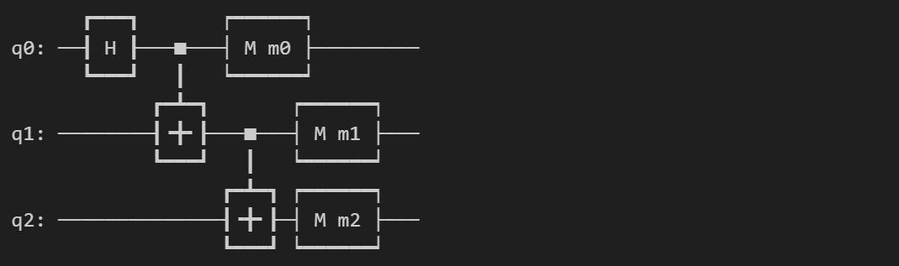
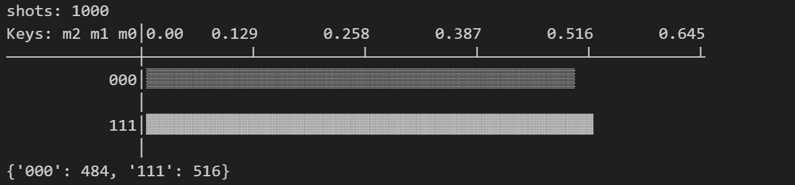
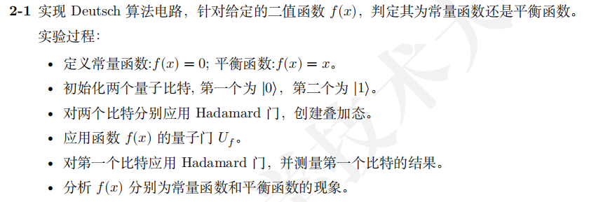

# 量子计算与机器学习 Lab3 Report

>PB21111653
>
>李宇哲

## 环境依赖

```python
import numpy as npy
from mindquantum.core import H, X, S, T
from mindquantum.core import Circuit
from mindquantum.simulator import Simulator
from mindquantum.core import Measure
```

## 第1题 GHZ 态的构成

>1-1 应用 H 门 和 CNOT 门构造 GHZ 态

代码部分

```python
circuit = Circuit()
circuit += H.on(0)
circuit += X.on(1, 0)
circuit += X.on(2, 1)

circuit += Measure('m0').on(0)
circuit += Measure('m1').on(1)
circuit += Measure('m2').on(2)

print(circuit)
```



```python
simulator = Simulator('mqvector', circuit.n_qubits)
shots = 1000
result = simulator.sampling(circuit, shots=shots)

print(result)
```



## 第2题 实现Deutsch算法

>

定义常量函数和平衡函数

初始化两个量子比特

```python
def deutsch(func):
    qvm = CPUQVM()
    qvm.init_qvm()

    qubit = qvm.qAlloc_many(2)
    cbit = qvm.cAlloc_many(1)

    qprog = QProg()
    qprog << X(qubit[1])
```

对两个比特分别应用H门，创建叠加态

```python
qprog << H(qubit[0]) << H(qubit[1])
```

应用函数 f(x) 的量子们

```python
if func == 1:
        pass
    elif func == 2:
        qprog << X(qubit[1])
    elif func == 3:
        qprog << CNOT(qubit[0], qubit[1])
    elif func == 4:
        qprog << X(qubit[0])
        qprog << CNOT(qubit[0], qubit[1])
        qprog << X(qubit[0])
    else:
        raise ValueError("error type!")
```

对第一个比特应用H门，并测量第一个比特的结果

```python
qprog << H(qubit[0])
qprog << Measure(qubit[0], cbit[0])
```

分析 f(x) 分别为常量函数和平衡函数的现象

```python
result = qvm.run_with_configuration(qprog, cbit, 1000)
    print(qprog)
    qvm.finalize()

    print(f"result: {result}")
    if '0' in result and result['0'] == 1000:
        print("constant function")
    elif '1' in result and result['1'] == 1000:
        print("balanced function")
    else:
        print("error function type")
    print('-' * 100)
```

结果如下

```

          ┌─┐ ┌─┐  ┌─┐ 
q_0:  |0>─┤H├ ┤H├ ─┤M├ 
          ├─┤ ├─┤  └╥┘ 
q_1:  |0>─┤X├ ┤H├ ──╫─ 
          └─┘ └─┘   ║  
 c :   / ═══════════╩═
                     0


result: {'0': 1000}
constant function
----------------------------------------------------------------------------------------------------

          ┌─┐ ┌─┐  ┌─┐   
q_0:  |0>─┤H├ ┤H├ ─┤M├── 
          ├─┤ ├─┤  └╥┼─┐ 
q_1:  |0>─┤X├ ┤H├ ──╫┤X├ 
          └─┘ └─┘   ║└─┘ 
 c :   / ═══════════╩═
                     0


result: {'0': 1000}
constant function
----------------------------------------------------------------------------------------------------

          ┌─┐            ┌─┐  ┌─┐ 
q_0:  |0>─┤H├ ─── ───■── ┤H├ ─┤M├ 
          ├─┤ ┌─┐ ┌──┴─┐ └─┘  └╥┘ 
q_1:  |0>─┤X├ ┤H├ ┤CNOT├ ─── ──╫─ 
          └─┘ └─┘ └────┘       ║  
 c :   / ══════════════════════╩═
                                0


result: {'1': 1000}
balanced function
----------------------------------------------------------------------------------------------------

          ┌─┐ ┌─┐        ┌─┐ ┌─┐  ┌─┐ 
q_0:  |0>─┤H├ ┤X├ ───■── ┤X├ ┤H├ ─┤M├ 
          ├─┤ ├─┤ ┌──┴─┐ └─┘ └─┘  └╥┘ 
q_1:  |0>─┤X├ ┤H├ ┤CNOT├ ─── ─── ──╫─ 
          └─┘ └─┘ └────┘           ║  
 c :   / ══════════════════════════╩═
                                    0


result: {'1': 1000}
balanced function
----------------------------------------------------------------------------------------------------
```

