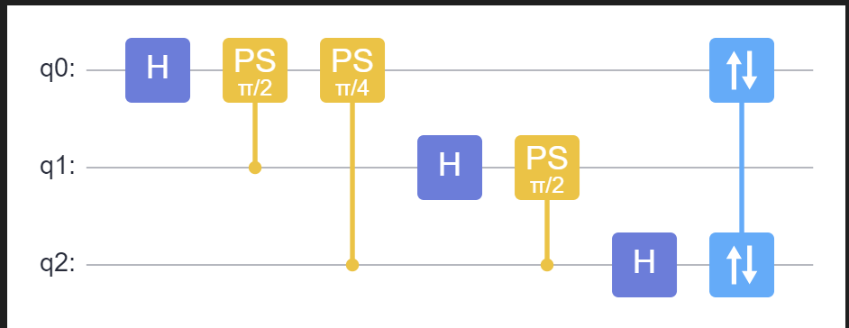
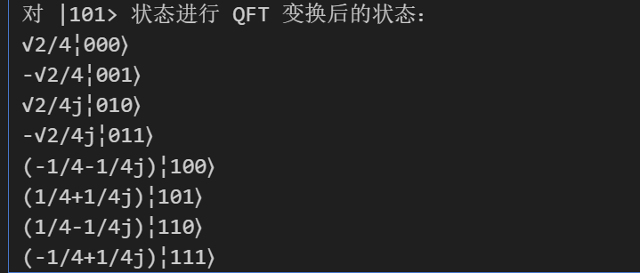
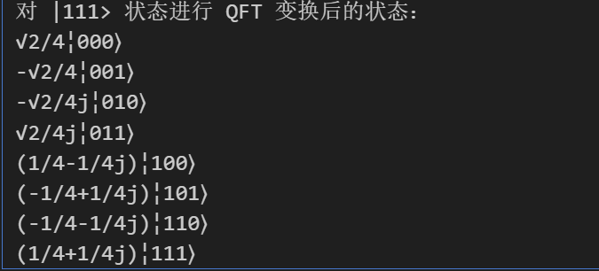
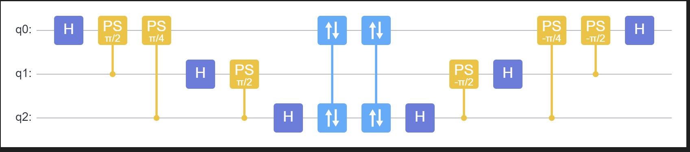
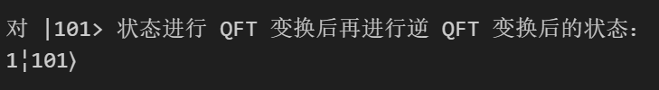
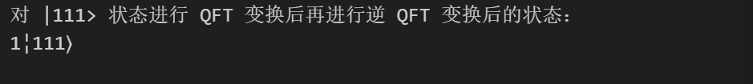

# 量子计算与机器学习 Lab4 Report

>PB21111653
>
>李宇哲

## 第 1 题 **编写并实现量子傅里叶变换电路**

### 1-1 

>使用3个量子比特，编写一个 QFT 的量子电路

#### 环境依赖

```python
import numpy as npy
from mindquantum.core import H, X, S, T
from mindquantum.core import Circuit
from mindquantum.simulator import Simulator
from mindquantum.core import Measure
from mindquantum.algorithm.library import qft
```

量子电路如下

```python
sim = Simulator('mqvector', 3)
qft_circuit = qft([0, 1, 2])
qft_circuit.svg()
```



### 1-2

>准备两个简单的输入量子态 |101⟩ 和 |111⟩ 并对其应用 QFT。(建议在实验过程中编写一个量子傅里叶变换的函数)

#### 环境依赖

```python
from mindquantum.core.circuit import Circuit, SwapParts
from mindquantum.core.gates import H, PhaseShift
from mindquantum.utils.type_value_check import _check_input_type
```

量子傅里叶变换函数如下

```python
def _rn(k):
    return PhaseShift(2 * npy.pi / (2 ** k))

def _qft_unit(qubits):
    circuit = Circuit(H.on(qubits[0]))
    for idx, ctrl_qubit in enumerate(qubits[1:]):
        circuit += _rn(idx + 2).on(qubits[0], ctrl_qubit)
    return circuit  

def qft(qubits):
    _check_input_type('qubits', (list, range), qubits)
    circuit = Circuit()
    n_qubits = len(qubits)
    for i in range(n_qubits):
        circuit += _qft_unit(qubits[i:])
    if n_qubits > 1:
        part1 = []
        part2 = []
        for j in range(n_qubits // 2):
            part1.append(qubits[j])
            part2.append(qubits[n_qubits - j - 1])
        circuit += SwapParts(part1, part2)
    return circuit
```

输入量子态为 |101>

``` python
input_state_101 = Circuit()
input_state_101 += X.on(0)
input_state_101 += X.on(2)

circuit_101 = input_state_101 + qft_circuit
sim.reset()
sim.apply_circuit(circuit_101)
state_101 = sim.get_qs(ket=True)
print("对 |101> 状态进行 QFT 变换后的状态：")
print(state_101)
```



输入量子态 |111> 状态

```python
# |111> 状态
input_state_111 = Circuit()
input_state_111 += X.on(0)
input_state_111 += X.on(1)
input_state_111 += X.on(2)
# 对 |111> 状态进行 QFT 变换
circuit_111 = input_state_111 + qft_circuit
sim.reset()
sim.apply_circuit(circuit_111)
state_111 = sim.get_qs(ket=True)
print("对 |111> 状态进行 QFT 变换后的状态：")
print(state_111)
```



## 第 2 题 实现 QFT 的逆变换（IQFT）

### 2-1

>在 QFT 电路后添加 IQFT 电路

IQFT 电路如下

```python
iqft_circuit = qft_circuit.hermitian()
qft_iqft_circuit = qft_circuit + iqft_circuit
qft_iqft_circuit.svg()
```



### 2-2

>验证输入态是否可以通过 QFT 和 IQFT 的组合完全恢复

|101>

```python
full_circuit_101 = input_state_101 + qft_iqft_circuit

sim.reset()
sim.apply_circuit(full_circuit_101)
final_state_101 = sim.get_qs(ket=True)

print("对 |101> 状态进行 QFT 变换后再进行逆 QFT 变换后的状态：")
print(final_state_101)
```



|111>

```python
full_circuit_111 = input_state_111 + qft_iqft_circuit

sim.reset()
sim.apply_circuit(full_circuit_111)
final_state_111 = sim.get_qs(ket=True)

print("对 |111> 状态进行 QFT 变换后再进行逆 QFT 变换后的状态：")
print(final_state_111)
```

