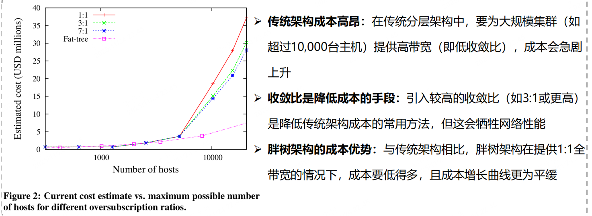
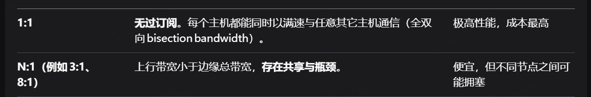
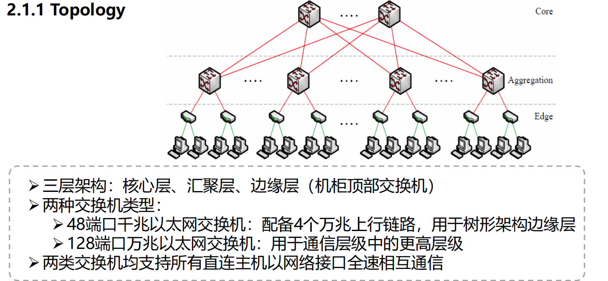
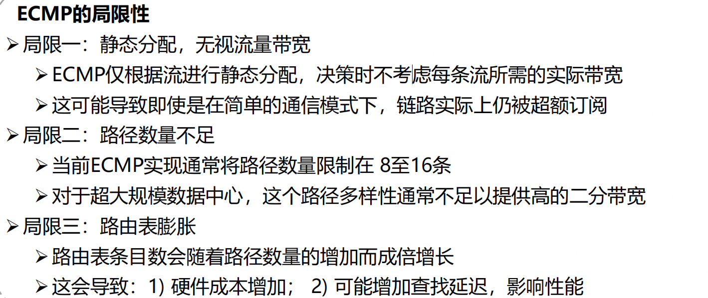
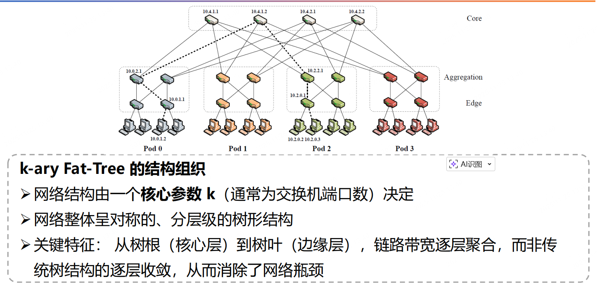
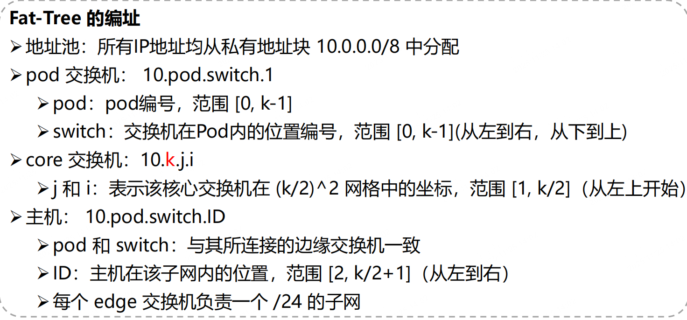

# A Scalable, Commodity Data Center Network Architecture

>

### Motivation

FatTree 虽然提供了多条等价最短路径，但是现实里的流量分配不均匀，静态 ECMP 无法保证链路利用率平衡。

- ECMP 并不感知负载，基于五元组 hash 会固定分配流到一条路径，无法根据链路拥塞情况调整，某条路径可能空闲，另一条链路过载
- 流量存在严重的长尾问题，往往 大流会占用大部分贷款资源，导致队列堆积
- 一旦多个大流被 hash 到同一条路径，就形成瓶颈
- 流调度缺乏全局协调，大流可能频繁切换路径产生乱序

### Challenge

**如何保证流的有序性和可扩展**：网络中每秒上千万的流，不能每次都改路径，同时同一流的包不能乱序

**如何全局感知负载、决定路径**：每个交换机只能看到局部链路状态，如何在全局层面实现负载均衡又不爆炸的控制开销

**如何快速、轻量地动态调整**：控制平面不能成为瓶颈，更新路径要细粒度、但全局一致。

### Contribution

这篇文章的核心贡献是利用 FatTree 的结构，提出了一种动态化的，二级路由，全局感知的流调度器的 DCN 路由方案，主要有 3 个核心贡献点

- 二级路由：通过引入极少的额外路由表开销从而实现 ECMP，保证多条等价链路都可以被用到
- 动态流分类器：通过对源/目的 IP 进行流分类，保证同一流保温从同一端口发出避免乱序，同时周期性的尝试重分类最多3个流的端口，最小化各输出端口总流容量的差异
- FlowScheduler（大流调度器）：检测大流并上报给中央调度器，为大流请求线性搜索出一条无冲突的路径，并通知相关交换机

#### Two-level routing

如何在不暴增路由表项的情况下支持 ECMP，同时让 ECMP 分流能力可以被上层算法动态控制

这时候 二级路由表 只需要增加很少的表项就能实现 ECMP

#### Dynamic Flow Classifier

要解决的问题：同一流路径稳定，根据端口负载轻微调整，使多个端口带宽利用趋于均衡

机制：

每个交换机维护一个本地的 Flow Classifier

基于 源/目的 IP 区分不同流

将每一条流固定地绑定到一个上行端口

会周期性的检查各 port 当前流量差异，如果部分端口过载

- 最多尝试重分配不超过 3 条流到其他端口
- 以最小干扰方式纠正不平衡

#### Flow Scheduler

**要解决的问题：**

- 小流多、但大流（>几 MB）占据大部分带宽；
- 单靠本地动态分类无法发现跨 Pod 的冲突；
- 需要全局协调但不能太慢。

**机制：**

- 在交换机层检测大流：例如监控流量速率超出阈值；
- 报告到中央调度器（Flow Scheduler）；
- 调度器利用全局链路状态：
  - 对每个新上报的大流，**线性搜索一条无冲突路径（空瓶颈路径）**；
  - 通知相关交换机更新特定流的转发表；
- 小流仍然继续采用本地 ECMP 或动态分流。

>**所以这篇论文的核心其实就是二级路由表的实现机制，实现了这个相当于把 ECMP 用最小的代价（很少的路由表表项）解决了，那在此基础上做动态ECMP调度，区分大小流，同一个目的/源 IP 保证 路径一致其实只需要简单调整二级路由表的表项并让全局调度器感知就可以了，开销都很小。**

### Background

#### Oversubscription

在 DCN 中，oversubscription ratio 表示，端主机之间可用的总通信带宽，相对于 网络理论上支持的**最大总带宽（bisection bandwidth）**的比例

正式定义：
$$
Oversubscription~ratio = \frac{edge~capacity}{uplink~capacity}
$$
假设你有一台交换机：

- 有 **48 个 1 Gbps 端口** 连接服务器；
- 有 **4 个 10 Gbps 上行口** 连接到上层交换机。

那么：

- 每台服务器 → 1 Gbps
   总下行带宽 = 48 × 1 = 48 Gbps
- 上行带宽总和 = 4 × 10 = 40 Gbps

Oversubscription = 48 : 40 ≈ **1.2 : 1**
 如果上行只有两个 10 G 口，那就变成 **48:20 = 2.4 : 1**。





#### 三层分层互连模型 (Three‑Tier Hierarchical Network Architecture)

通过将网络划分为三个功能明确的层级来实现架构优化

- Edge（Access Layer）：网络最外层，直接连接终端设备（如服务器、计算机）的层级
- Aggregation（Distribution Layer）：连接接入层与核心层的中间层级，负责流量聚合及实施网络策略（如路由策略、安全策略）
- Core（Core Layer）：网络骨干层，专用于在不同汇聚层之间进行极高速数据转发的层级

```
┌──────── Core Layer ────────┐
           │        高速骨干交换        │
           └────────────▲──────────────┘
                        │10 GbE 上行链路
              ┌─────────┴────────┐
              │     Aggregation Layer     │
              │     汇聚多个接入层流量     │
              └─────────▲────────┘
                        │1–10 GbE 链路
                ┌───────┴───────┐
                │   Access Layer   │
                │   连接具体服务器  │
                └─────────────────┘
```



#### ECMP

ECMP（Equal costMulti-path Routing）等价多路径路由：当网络中存在多条到达同一目的的地址、且（代价）相同的最短路径时，ECMP允许路由设备 同时使用多条路径进行负载分担

- 相同流：被一致地映射到同一路径（避免乱序）
- 不同流：可能映射到不同路径（复杂均衡）

示例：
 两台主机 A 和 B 之间通信，存在 **4 条等价最短路径**。

1️⃣ 每条路径通过不同的核心交换机
 2️⃣ ECMP 在发送端的汇聚交换机做一个哈希计算
 3️⃣ 每个流（如一条 TCP 连接）被固定分配到其中一条路径
 4️⃣ 整体上，**数百个并行流会均匀地分散到多条路径上**

这样，全网即可同时利用多条上行链路，实现接近 1:1 bisection bandwidth。
 这就是 Fat‑Tree 能在用普通以太网交换机的情况下获得高带宽的关键。



现有技术为大型集群提供高带宽成本极高，而基于 FatTree 的架构能以更合

理的成本提供可扩展带宽。规模集群成本仍可能极高（超$6.9亿），但至少技术上

可行（一个拥有**27,648** 节点、所有节点之间都可实现 **10 Gbps** 带宽的集群）

#### Fat-Tree



我理解一下：pod指的是 Aggregation和Edge这两层，然后每个Pod上连 core，下连主机，我们关心的是用多少个switch组合层的pod可以供给更多的主机

所以对于 一个 switch 有 k 个端口：

- 核心层：一共有 $(k/2)^2$ 个 switch
- Aggregation + edge 一共 k 个 pod，每个 pod 有 k 个，一共 $k^2$ 个 switch
- 每个 edge 有 k/2 个 switch，每个switch 有k/2个port可以连接主机，一共 k 个 pod，所以一共是 $k^3/4$个主机

也就是说，我用 $5k^2/4$个 switch 可以服务 $k^3/4$个主机，那么 k = 4 的时候，用20个switch可以服务 16 个host，同时可以看到这个的上行带宽和下行带宽完全一致

#### Addressing



encoder hash