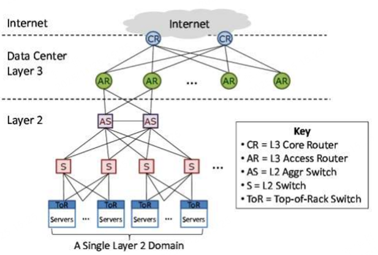
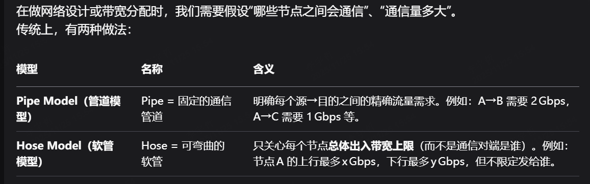
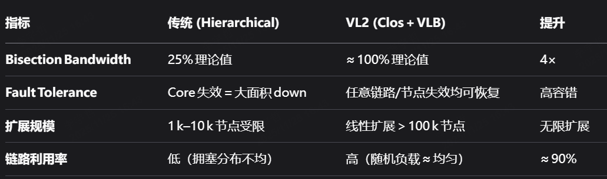
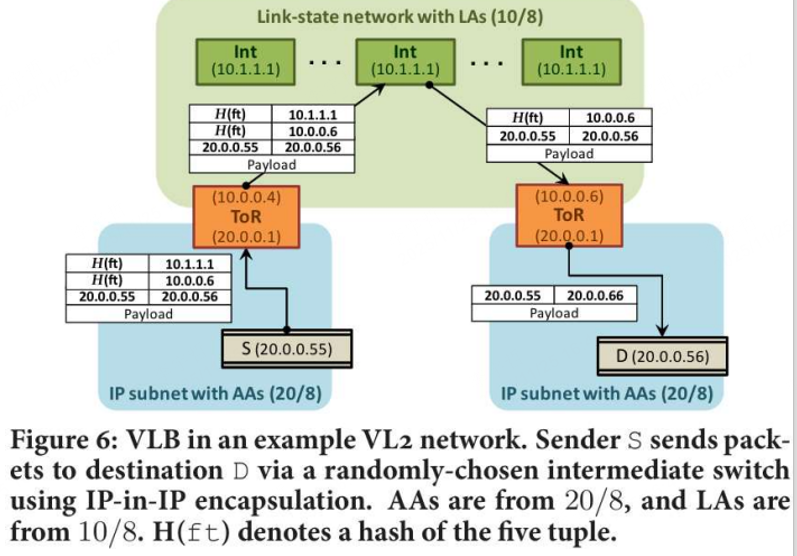

## VL2: A Scalable and Flexible Data Center Network

### BackGround

#### Conventional DCN arch



传统数据中心是树状的，有一个层级结构

- CR：核心路由器。位于最顶层，连接外部互联网与数据中心内部的出入口，同时管理数据中心内部的路由交换
- AR：Access Router（接入路由器）。位于核心层与汇聚层之间，负责汇聚更下层的流量上送
- AS：Aggregation Switch（汇聚交换机）：负责把多个机架（rack）之间的流量继续汇聚到更上层
- ToR：Top of Rack Switch（机架顶交换机）：直接连接每一个机架上的服务器，是服务器上行的第一个网络节点
- S：Switch（L2交换机）。局域网范围内的以太网交换机
- Server：主机/服务器节点。提供计算与存储服务的基础资源

**每个机架 (rack)** 通常包含 20~40 台服务器。
 每台服务器通过 **1G/10G** 链路连接到它所在架顶的 **ToR 交换机**。

**每个 ToR** 再向上连到两个 **AS（汇聚交换机）**，实现链路冗余与容错。

**AS** 再向上连接 **AR (接入路由器)**，进一步聚合带宽。

**AR** 则连接到最顶层的 **CR (核心路由器)**，
 核心负责整个数据中心不同子网、以及与外界的互联。

在任意一对 Access Routers 下的所有交换机共同构成一个 **Layer 2 域 (L2 Domain)**。也就是说，这个范围内用以太网（MAC + ARP）通信。

#### ARP 广播（Address Resolution Protocol）

在一个二层网络（Layer 2）里，主机只有 IP 地址，要发送以太网帧之前必须知道对方的 MAC 地址。
 于是它向整个局域网广播请求：

> “谁拥有 IP 10.0.0.5？请告诉我你的 MAC 地址。”

→ 这就是 **ARP 广播（ARP Broadcast）**。

**🔹代价：**
 当主机多达几千几万台时，这种广播会淹没整个网络，造成额外负载（Broadcast Storm）。

**🔹与 VL2 的关系：**
 VL2 在后面通过 “Directory System + IP-in-IP 封装” 完全取代了 ARP 广播，从而让大规模的“虚拟L2网络”仍可扩展。

#### VLAN（Virtual LAN，虚拟局域网）

物理上一台交换机上可能连着不同服务的机器。通过 VLAN ID（802.1Q标签），可以将同一台交换机逻辑上划分为多个“虚拟局域网”。

例如：

- VLAN 10 → 属于数据库服务器组
- VLAN 20 → 属于 Web 服务组

它们之间在二层上相互隔离。

**🔹为什么要有 VLAN：**

- 防止广播风暴扩散
- 隔离不同租户或业务流量

**🔹问题：**

- VLAN 数量有限（仅 4096 个 ID）；
- VLAN 与具体交换机、端口绑定 → 主机迁移必须重新配置；
- 这就是 VL2 想解决的“可迁移性问题”

#### Valiant Load Balancing

数据中心网络（特别是多层树形结构中），某些链路或交换机会因为服务局部流量集中而**过载（热点）**。

举个例子：
 如果某一批服务器间通信频繁，而它们恰好连接到同一条上行链路，那么这条链路很容易被“挤爆”，而别的链路却很空闲。

→ 问题：**如何在不知道未来流量模式（Traffic Matrix）的情况下，把流量平均地利用到所有网络路径？**

传统的办法：

- 静态路由（单路径） → 容易形成瓶颈；
- 动态流量工程（TE） → 太复杂，反应不及时；
- ECMP (Equal-Cost Multi-Path) → 只能在有限数量的“等价”路径间分摊。

所以，VL2 的作者选择了一个优雅而“概率性公平”的思路：
 👉 **Valiant Load Balancing (VLB)**。

VLB 可翻译为：**“瓦莲特负载均衡”**，来源于计算机体系结构大师 Leslie Valiant 的经典理论（1982年提出）。

**核心理念一句话概括：**

> **随机中转**。
>  不直接把数据从源发到目的，而是先随机选择一个“中间点”（Intermediate Node），让流量先绕到那里，再送达目标。

在 VLB 里，我们这样做：

1. **每个源** 先**随机**选择一个“中间交换机”（例如核心层的某个节点）；
2. 把要发给目标机架的流量**先发到中间节点**；
3. 再从中间节点**转发给目标机架**。

👉 这样，每条源–目的通信都经过不同的中间点，所有路径上的平均流量会被**随机均匀**摊开，从而避免热点。

#### VLB 与 Hose Model



### Motivation

传统网络结构无法支持 agility（跨服务，跨rack 的资源动态调度能力）

- Agility：让任何server可用于任何service：但是VLAN/IP与物理拓扑绑定，迁移困难
- 高带宽与低成本并存：Core贷款价格高昂，不能给每个server提供全带宽
- 随业务变化快速 reconfig：配置依赖人工干预，VLAN子网僵化

在甚至的数据中心进行流量测量之后，作者有两个 key observation

- 流量模式难以预测、种类繁多。这使得静态路由或者集中式流量工程无法适用
- 层次化结构导致可靠性与利用率低。
  - 核心层设备昂贵、数量有限
  - 一旦出故障，整个网络大面积宕机
  - 利用率低，大部分链路闲置，但核心扔拥塞

这需要一个新的设计，能够支持：**多租户 + 不可预测流量 + 高可用性 + 平坦带宽** 的网络。

### Challenge

- Unpredictable traffic：
  - 流量分布变化快，集中和分散程度都可能突然变化。
  - 目标：无论流量模式如何，网络都应保持高带宽与低拥塞
- VM mobility：
  - 虚拟机频繁迁移导致 IP、VLAN改动。
  - 目标：网络必须对迁移透明，不改变 IP
- Scalability：
  - 商业交换机端口有限、规模大
  - 目标：应支持数十万台主机，同时可线性扩展
- Reliability & manageability：
  - 核心设备单点引起大面积宕机，人工配置复杂
  - 目标：网络要分布式、无单点，自动发现与修复。

### Contribution

#### 使用 Clos 拓扑

为了解决 scalability 和 可靠性 问题，用 多根互联树结构取代原先的简单树状结构，每个 ToR 通过多条上行链路连接多层交换机，拓扑均匀对称。

传统 DCN 使用了一种 Core-Aggregation-Access 的三层结构

```
[ Core Switches ]
             ↑↓
      [ Aggregation Switches ]
             ↑↓
      [ ToR (Top of Rack) Switches ]
             ↑↓
          [ Servers ]
```

这种结构汇聚层和核心层链路少，上行端口有限。同时如果一台Core挂了，rack间通信受很大影响

现在使用 Clos （fat-tree）结构

```
[ Intermediate switches (根) ]
          /    /    \     \      \
      [ Aggregation/ToR switches (叶) ]
           \   |   /     /   \
          [ Servers in each rack ]
```

没有所谓 Aggregation和 core的分类抽象了，每个ToR有多条上行链路，连接到不同的上层中间层，将 通信矩阵 均摊到多条独立路径上



#### Valiant Load Balancing(VLB)

这个主要是为了解决 unpredicable traffic 的。所有流量在进入网路时随机选择一个中间节点作为中转点（indirection）

- 源 ToR 把数据包均匀分发给所有中间层（intermediate switches）；

- 中间层再转发到目标 ToR。

**流量与网络无关**：不需要知道目标或流量矩阵；

**随机化平均负载**：链接利用率接近均匀；

**理论证明无拥塞（under Hose Model）**；

支持大规模、频繁变化的流量。

#### 双地址体系（AA 与 LA）

为了解决 VM mobility

把地址逻辑分离成：

- **AA (Application-specific Address)**：表示虚拟机身份，随 VM 永不变；
- **LA (Location-specific Address)**：表示物理位置，网络内部转发使用。

#### 机制：

- 数据包双层封装（IP‑in‑IP）：内层用 AA，外层用 LA；
- 目录系统（Directory System）维护 AA→LA 的映射；
- 当 VM 迁移时，仅更新映射，不改变虚拟 IP。

#### Directory System + Name Resolution

进一步解决动态绑定问题

传统 ARP/Broadcast 获取 MAC/IP，在大规模环境中不适用。
 VL2 采用 **集中式目录服务**（Directory System, DS）存储 VM 映射信息。

#### 机制：

1. VM A 想与 VM B 通信时，查询 DS；
2. DS 返回目标 VM 的 LA；
3. 源 ToR 缓存映射并封装包；
4. 后续通信直到超时直接使用缓存。



###  **源端虚拟机构造数据包**

源虚拟机 **S (AA = 20.0.0.55)** 想发往目标 **D (AA = 20.0.0.56)**，
 在应用层看来它们就在同一个逻辑网络内。

因此，S 生成的原始数据包是：

```apache
源 IP：20.0.0.55  
目的 IP：20.0.0.56  
Payload（应用数据）
```


------

### **② ToR 查找目录系统，获取目标位置**

S 所在的 ToR（图中左下橙色框，LA = 10.0.0.4）
 会查询 **VL2 Directory System**（目录系统），
 得到 D 所在机架 ToR 的位置地址（LA）：

```accesslog
AA → LA 映射：
20.0.0.56  → 10.0.0.6
```


这意味着：目标的机架路由器（ToR_R）在物理世界中，
 其 **Location Address (LA)** 为 10.0.0.6。

------

### **③ 使用 VLB 选择“中间交换机”**

VL2 采用 **Valiant Load Balancing (VLB)**：

> 每次传输都随机选择一个“中间层交换机 (Intermediate switch)”作为中转节点。

假设现在选择的中间交换机是：

```ebnf
Intermediate Switch = 10.1.1.1
```


这样可以确保全网流量平均分布，不会出现拥塞热点。

------

### **④ 二层封装：IP-in-IP（外层 LA，内层 AA）**

ToR（10.0.0.4）要把包发到 10.1.1.1，再从那里转发到 10.0.0.6，
 因此它对原始包进行 **IP-in-IP 封装**：

| 封装层              | 源IP      | 目的IP    | 内容             |
| ------------------- | --------- | --------- | ---------------- |
| **外层 IP (LA 层)** | 10.0.0.4  | 10.1.1.1  | 中间节点转发路径 |
| **内层 IP (AA 层)** | 20.0.0.55 | 20.0.0.56 | 应用实际通信地址 |
| **Payload**         | 用户数据  |           |                  |

封装完毕的数据包就进入 “绿色区域” (LA 网络)。

------

### **⑤ 在 LA 层（绿色网络）中路由转发**

中间层交换机网络运行的是一个 **Link-State 协议**（如 OSPF / IS-IS 的简化版）。
 网络中所有交换机知道完整的 LA 拓扑结构。

- 当包进入 10.1.1.1 时，它看到外层目的地 10.0.0.6；
- 按最短路径把包发送到目标 ToR (10.0.0.6)。

此阶段的网络只看 “外层 LA 头部”，
 完全不关心内层的 AA 地址。

------

### **⑥ 到达目标 ToR，解封装并交付**

目标 ToR（10.0.0.6）收到包后：

1. 发现外层 IP 是自己的 LA；
2. 解封装 → 去掉外层头；
3. 内层包中是 (20.0.0.55 → 20.0.0.56)。

最终将该内层包投递给机架下的虚拟机 D (AA = 20.0.0.56)。

------

### **⑦ 目标虚拟机收到包**

从 D 的角度看：

- 它看到的源地址仍是 20.0.0.55；
- 完全感觉不到这个包中途被封装过、转发过；
- 网络对它而言是平滑的、扁平的二层结构。

------

## 🔁 小结：每一层的职责一目了然

| 组件                    | 主要职责                     | 地址类型 | 是否看内层包 |
| ----------------------- | ---------------------------- | -------- | ------------ |
| **虚拟机 (S/D)**        | 普通通信                     | AA       | 看内层       |
| **ToR 交换机**          | 查目录 AA→LA；封装/解封装    | LA + AA  | 全部         |
| **Intermediate 交换机** | 只路由外层包；提供多路径平衡 | LA       | 不看内层     |
| **Directory System**    | 存储和维护 AA → LA 映射      | -        | -            |

| 问题                       | 对应机制                              | 效果                 |
| -------------------------- | ------------------------------------- | -------------------- |
| **虚拟机迁移导致 IP 变化** | 双层地址 (AA/LA) + Directory          | 应用地址保持不变     |
| **流量分布不均**           | Valiant Load Balancing (随机中间节点) | 链路均衡、吞吐提升   |
| **网络扩展与容错**         | Clos 拓扑 + Link-State 路由           | 多路径冗余、扩展性强 |