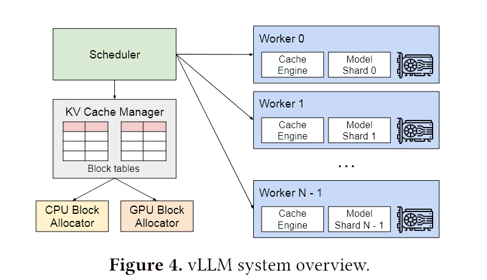
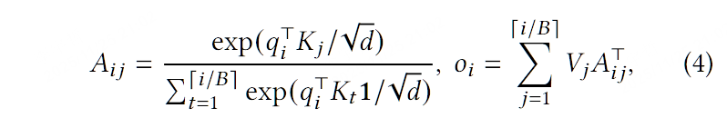

## Efficient Memory Management for Large Language Model Serving with PagedAttention

>SOSP 2023 的一篇文章，也是著名的 vllm 中核心内存管理engine PagedAttention 的提出者

我将按照一篇论文 target 的场景（scenario），对于这个场景中发现的 motivation 并提出可能可以解决的问题，具体问题会有哪些 Challenge，对于每个 Challenge，论文做了什么contribution，每个 contribution 的一些具体实现，并如何在 evaluation 论证对应的 contribution 确实解决了这篇论文抽象的 challenge 去理解一篇论文，并记录理解这一过程需要了解的 background ，最后对这论文的 core idea 做一些总结。因此，任何一篇读书笔记都会被我拆分成这几个部分

- scenario & motivation
- challenge
- background
- contribution
- evaluation
- conclusion & own thinking

### Scenario & Motivation

这篇工作主要针对的一个场景是 LLM inference 的具体部署。

LLM 模型的核心是 autogressive 的 Transformer 结构。多个用户 request 打过来之后，每个 request 经过具体的推理框架会被解释为一个 `prompt`，`prompt` 经过 `embedding` 得到具体的 token。对于推理过程，load model之后，大致会经过两个过程

- **Prefill**：用输入的prompt生成用户第一个 token，并得到整个 prompt 对于 token 的 KVCache
- **Decode**：利用之前的token和KVCache 做自回归的 token 生成

在这篇论文提出的时候，PD 分离的思想还没有被广泛引用（OSDI 24的DistServe提出），但普遍会认为 Prefill 是一个 **compute-bound** 的，而 Decode 是一个 **memory-bound** 的问题。因为 Decode 阶段需要不断的生成新的 KVCache，当输出 token 很多的时候自然需要存储大量的 KVCache，这可能达到了 GPU 显存的上线

这也是这篇论文针对的核心，当推理出现严重的 **memory-bound** 的时候，如何高效利用 GPU 内存空间，缓解自回归带来的 KVCache 显存爆炸问题。

一种 naive 的想法是同时处理多个 batch，将吞吐打上去，22年的 Orca 也基于 autogressive 问题 batch 提出了 continuous batching 的 思想，尽可能提升吞吐。、但即便如此，作者依然发现，模型推理的时候，KV Cache 的管理极为低效。

如图，只有 20-40%的内存是真实有效的，大量的显存被浪费在 内部/外部碎片化和为即将生成的token预料的空间，这也为优化提供了机会。

现有系统有两个重要的 limitation

- internal and external memory fragmentation

  内部碎片主要来自于，KVCache 是连续存储的，每个 request 对应的 Decode token自回归增长时，需要给他 pre-allocated 一块内存，这会带来碎片化。外部碎片化也很验证，每个预分配大小的size可能是不同的。

- cannot exploit the opportunities

  有些 场景比如 parallel sampling，beam search 这种，每一个 request 会产生很多个输出，那不同输出之间的 KVCache 是可以 share 的，目前的框架对这种 sharding 的支持还是有限。

### Challenge

我们可以把这篇文章要解决的问题大致抽象成几类

- KVCache 很大并且是动态变化的，如何管理并不 naive
- KVCache 管理的碎片化问题，预分配的方式并不合理
- 现有的方式缺少对 KVCache share 的可能

其实一个本质问题还是 tensor 这种数据抽象必须要是 连续内存，而 KVCache 本身也许并不适合通过连续内存来管理

### Background

这一篇论文的 background 主要会介绍 Transformer-Based 模型的基本计算模式，Prefill/Decode 两个 phase 和 LLM 的 Batching Techniques，我这里稍微记录一下 batching

#### Batching Techniques for LLMs

因为推理的时候所有的 request 对模型权重是共享的，所以天然不同 req 抽象为 batch 计算之后就是可以做batching的，但是这会有很多问题

- 前序请求等待后续请求，导致排队延迟
- 简单的批处理技术会填充 req 的输入和输出以平衡其长度，但是 req 的输入输出长度都是很不同的，这样填充会很浪费GPU计算和内存。

现有有一些工作会关注这个问题并一定程度上解决了这个问题，每次迭代后，已完成的请求会从批处理中移除，直接添加新的请求，会有一个类似占坑的做法来避免等待。然后从 GPU kernel 实现上去解决填充问题。

### Contribution

具体的vllm还有比如 model runner的抽象，但是最关键的就是负责计算的 model + layer 和 负责 kvcache management 的 BlockMnanager，和全局调取器 scheduler

#### PagedAttention

首先一个核心 contribution就是通过 paged attention，把传统 attention 计算分块化，这样利用就可以将 KVCache 切分为 固定大小的 KV Block（类似 OS 中的 Page），那么管理的时候就可以按 Block 粒度管理，内存上可以位于任何物理位置，attention 计算的时候按块读取，就不再需要连续。

这种类似 os 中 page 的管理方式显然就不会有 pre-allocate 的开销了，那就没有外部碎片了，而内部碎片也只会存在于最后一个token可能并没有打满整个block size，有很高的 KVCache 实际内存利用率。相当于解决了 challenge 中的 碎片化和动态变化的问题。

#### KVCache Manager

KVCache Manager 维护一个了 类似 页表的 Block Table，记录逻辑 KV 块 -> 实际物理块的映射，然后在这个过程中去维护这个 Block Table就可以。

同时这种设计天然支持 KVCache sharing，只需要让相同 prompt 对应的 KVCache 块指向同一个 index 就可以。

#### Scheduling

对于其他的部分，论文给出了多request的时候 vllm 的基本调度服务，比如 FCFS，然后如果有些 req 对应的 KVCache 要被换出显存，会使用一些 cpu offload 的技术将其 offload 到 CPU 上，等需要的时候再换回来，并通过一些 swapping 和 recomputation 的手段优化这一调度流程。

分布式支持上 vllm 继承了 标准 3D 并行，其中 Tensor paralle 是采用 Megatorn-LM 中的 TP 类似实现（那显然也没有经过一些特殊的 TP 优化，虽然这些手段在如今如日中天的 vllm 中已经实现了）

### Evaluation

evaluation 主要是要证明 vllm 和它的 paged attention 比当时的 SOTA baselien（Orca：continuous batching和最早的推理引擎 fasterTransformer）要更出色。具体的指标是 throughput，对于多个request来之后，latency和throughput都更好，并且memory 利用率更高。

两个模拟多请求的 workload选择的是

- ShareGPT
- Alpaca

这也是两个很经典的workload，都是文本语言书记，同时它在单机和多机上，不同request速率下测试 OPT 从13B小模型到175B大模型不断scaling的过程中，整个系统的latency。

- 在达到相同的 latency 下，vllm 都能有更好的 req/s，也就是能够服务更多的用户请求，吞吐更佳

同时在 memory 侧，vllm 均比 baseline 节约的更多的显存。

这两点证明了 vllm 的有效性。

### Conclusion

vLLM现在已经成为最主流的两个推理框架之一了，其 core idea 就是通过像 OS 管理 page 一样去管理 KVCache block，从而实现了更高效的 KV Cache 管理方式，在一定程度上解决了 memory bound 下的 Decode 阶段访存问题。但这只是一个 memory 管理的开端，毕竟 page 管理本身也只是操作系统一种较为 naive 的方式，后续基于 Radix Tree 的radix attention 对前缀的优化，还有 LMCache，MoonCake 等更多 memory 管理策略的出现也逐渐将 inference 场景的prompt 从 最早几K打到了如今 100K+。因此，如今要从事 LLM inference 相关的研究，Paged Attention 都是不得不品的一环。 