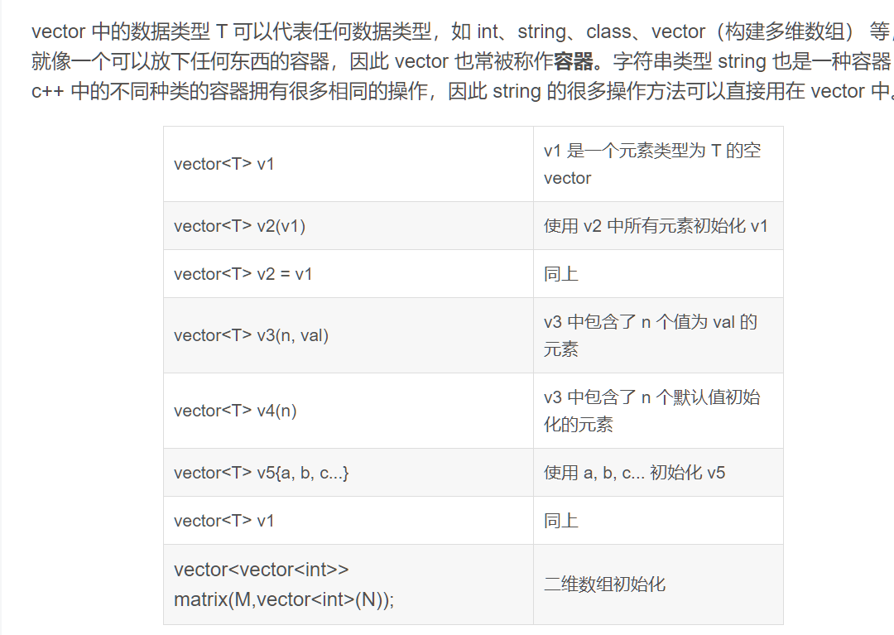
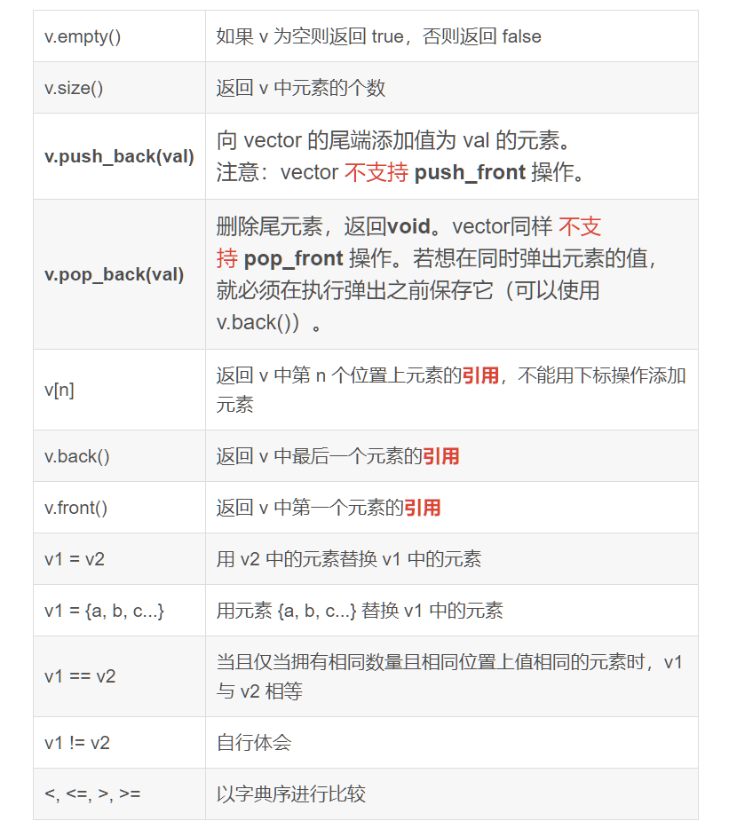
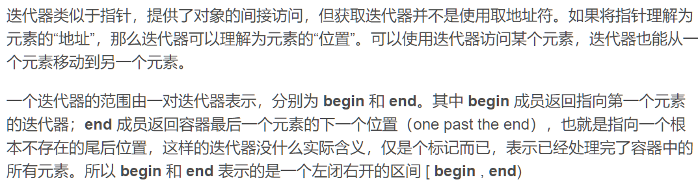

### C++ STL 简介

#### vector

vector, 变长数组，倍增的思想

- size()，返回元素个数
- empty()，返回是否为空
- clear(), 清空
- front()/back()，队头元素和队尾元素的引用
- push_back() / pop_back() 插入元素和删除元素
- begin() / end() ，迭代器的开始
- []
- 支持比较运算，按字典序

##### vector对象的定义和初始化方式



##### Vector常用基础操作



##### 使用迭代器的遍历、插入、删除操作



###### 遍历

```c++
#include<iostream>
#include<string>
#include<vector>
using namespace std;
int main(void)
{
    vector<string> a{"0", "1", "2", "3", "4", "5", "6", "7", "8"};
    auto it = a.begin();
    while(it != a.end())
    {
        cout << *it << " ";
        it ++;
    }
    return 0;
}
// 运行结果： 0 1 2 3 4 5 6 7 8
```

###### 插入

插入操作的函数：

v.insert(p, n, val)：在迭代器p之前插入n个值为val的元素，返回新添加的第一个元素的迭代器

```c++
#include<iostream>
#include<string>
#include<vector>
using namespace std;
int main(void)
{
    vector<int> a{1,2,3,};
    auto it1 = a.begin();
    auto it2 = a.insert((it+1), {6,7,8});
    cout << *it2 << endl;
    auto it = a.begin();
    while(it != a.end())
    {
        cout << *it << " ";
        it ++;
    }
    return 0;
}
// 输出结果
6 
1 6 7 8 2 3
```

###### 删除

删除操作的函数：

- V.erase(p) ： 删除迭代器p所指的元素，返回指向被删除元素之后元素的迭代器
- V.erase(b, e)：删除迭代器b，e之间的元素，返回指向最后一个被删除元素之后元素的迭代器

```c++
#include<iostream>
#include<string>
#include<vector>
using namespace std;
int main(void)
{
   	vector<int> a{1, 2, 3,};
    auto it1 = a.begin();
    auto it2 = a.erase(it+1);
    cout << *it2 << endl;
    auto it = a.begin();
    while(it != a.end())
    {
        cout << *it << " ";
        it ++;
    }
    return 0;
}
//运行结果
3
1 3
```

##### vector元素的重排操作（排序、逆序等）

容器的重排需要用到头文件 <algorithm> 中的算法

###### 排序sort（）

使用到的函数为 **sort()** ：按输入序列的字典序**升序**排序，原位操作，无返回值函数原型：

```c++
void std::sort<std::vector<int>::iterator>(std::vector<int>::iterator, std::vector<int>::iterator)
```

```c++
#include<iostream>
#include<vector>
#include<algorithm>
using namespace std;
int main(void)
{
    vector<int> a{2, 0, 2, 2, 0, 3, 0, 9};
    sort(a.begin(), a.end());
    for(int i:a)
        cout << i << " ";
    return 0;
}
// 输出结果
0 0 0 2 2 2 3 9
```

###### 消除相邻的重复元素unique（）

使用到的函数为 **unique()** ：将输入序列相邻的重复项“消除”，返回一个指向不重复值范围末尾的迭代器，一般配合 sort() 使用，函数原型：

```c++
std::vector<int>::iterator std::unique<std::vector<int>::iterator>(std::vector<int>::iterator, std::vector<int>::iterator)
```

```c++

#include <iostream>
#include <vector>
#include <algorithm>
using namespace std;
 
int main(void)
{
    vector<int> a{2, 0, 2, 2, 0, 3, 0, 9};
    sort(a.begin(), a.end());  // 先排序
    for(int i:a)   cout << i << " "; // 输出
    cout << endl;
    auto end_unique = unique(a.begin(), a.end());  //将输入序列相邻的重复项“消除”，返回一个指向不重复值范围末尾的迭代器
    a.erase(end_unique, a.end()); // 删除末尾元素
    for(int i:a)   cout << i << " "; // 输出
    return 0;
}
// 运行结果 //
0 0 0 2 2 2 3 9 
0 2 3 9
```

###### 逆序reverse()

方法1：使用到的函数为 **reverse****()** ：将输入序列按照下标逆序排列，原位操作，无返回值函数原型：

```c++
void std::reverse<std::vector<int>::iterator>(std::vector<int>::iterator, std::vector<int>::iterator)

```

 方法2：使用greater<int>() 作为参数（内置函数）

```c++
sort(nums.begin(), nums.end(), greater<int>());
```

```c++

#include <iostream>
#include <string>
#include <vector>
#include <algorithm>
using namespace std;
 
int main(void)
{
    vector<int> a{2, 0, 2, 2, 0, 3, 0, 9};
    reverse(a.begin(), a.end());  // 原位逆序排列
    for(int i:a)   cout << i << " "; // 输出
    return 0;
}
// 运行结果 //
9 0 3 0 2 2 0 2
```

##### vector中找最值

容器的重排同样需要用到头文件 <algorithm> 中的算法。

1、最大值 auto it = max_element(v.begin, v,end())，返回最大值的迭代器，函数原型如下：

```c++
constexpr std::vector<int>::iterator std::max_element<std::vector<int>::iterator>(std::vector<int>::iterator, std::vector<int>::iterator)
```

2、最小值 auto it = min_element(v.begin, v,end())，返回最小值的迭代器，函数原型如下：

```c++
constexpr std::vector<int>::iterator std::min_element<std::vector<int>::iterator>(std::vector<int>::iterator, std::vector<int>::iterator)
```

3、相对位置大小 auto b = distance(x, y)，x、y 是迭代器类型，返回 x、y 之间的距离，可以用来获取最大/小值的索引，函数原型如下：

```c++
std::ptrdiff_t std::distance<std::vector<int>::iterator>(std::vector<int>::iterator __first, std::vector<int>::iterator __last)
```

```c++
#include <iostream>
#include <vector>
#include <algorithm>
using namespace std;
 
int main(void)
{
    vector<int> a({0,1,-2,3});
    auto b = distance(a.begin(), min_element(a.begin(), a.end()));
    cout << a[b] << endl;
    return 0;
}
// 输出 //
-2
```

##### 改变vector大小 及其 内存分配机制

与内置数组一样，vector 的所有元素必须存放在一片连续的内存中，但 vector 的大小可变性使得其所占用的内存大小也是可变的。

为了避免每次改变 vector 时重新分配内存空间再将原来的数据从新拷贝到新空间的操作，标准库实现者采用了减少容器空间重新分配次数的策略：当不得不获取新空间时，vector（string 也是如此）通常会分配比需求更大的空间作为预留的备用空间，这样就减少了重新分配空间的次数。

改变 vector 的大小可以使用 v.resize(n, t) 函数，调整 v 的大小为 n 个元素，任何新添加的元素都初始化为值 t 。


```c++
#include <iostream>
#include <vector>
using namespace std;
 
int main(void)
{
    vector<vector<int>> a;
    a.resize(3, vector<int>(3));
    cout << "row : " << a.size() << endl;
    cout << "col : " << a[0].size() << endl;
    return 0;
}
// 输出 //
row : 3
col : 3

```

##### vector数组 与 内置数组 的选择问题

一般来说，我们在使用 C++ 编程时会将 vector 类型的数据与类似于使用 a[N] 定义的内置数组统称为数组，两者是很类似的数据结构，在一般的任务中使用 vector数组 与使用内置数组通常没有什么区别。两者的区别主要如下：

vector数组 是 C++ 的标准库类型，即使用 vector 定义的变量本质上是定义了一个 vector 类的对象。而类似于使用 a[N] 定义的数组是内置数组，类似于 int、float 等内置类型的变量。
vector数组 的大小可变，而内置数组类型在定义时必须明确定义大小，之后大小不能变化。因为内置数组的大小固定，因此对某些特殊的应用来说程序运行时的性能较好，但是也失去了一定的灵活性。

#### pair<int, int>

first，第一个元素

second，第二个元素

支持比较运算，以first为第一关键字，以second为第二关键字

#### string：字符串

size()/length()：返回字符串的长度

empty()

clear()

