## 动态规划问题(DP)

### 1.1 背包问题

基本思想：

Dp

- 状态表示f(i,j)
  - 集合：
    - 这个集合包括所有选法
    - 集合成立的条件
  - 属性：max，min，数量等等
- 状态计算：集合划分

#### 1.1.1 0-1背包问题

##### 问题描述

有 N 件物品和一个容量是 V 的背包。每件物品只能使用一次。

第 i 件物品的体积是 vi，价值是 wi。

求解将哪些物品装入背包，可使这些物品的总体积不超过背包容量，且总价值最大。
输出最大价值。

##### 分析

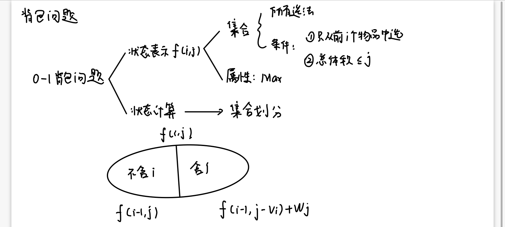

因此代求的最大价值即为f(N,V)

##### 状态转移方程

$f(i,j) = max\{f(i-1,j), f(i-1,j-v_i) + w_i\}$

##### 代码实现

```c++
#include<iostream>
#include<algorithm>
using namespace std;
const int N = 1010;
int f[N][N];
int w[N];
int v[N];
int main(void)
{
    int n, m;
    // input
    cin >> n >> m;
    for(int i = 1; i <= n ;i++ ) cin >> v[i] >> w[i];
    // dp
    for(int i = 1; i <= n; i++)
    {
        for(int j = 0; j <= m; j++)
        {
            f[i][j] = f[i-1][j];
            if(j >= v[i]) f[i][j] = max(f[i][j], f[i-1][j - v[i]] + w[i]);
        }
    }
    cout << f[n][m] << endl;
}
```

##### 优化

我们定义的状态f[i][j]可以求得任意合法的i与j最优解，但题目只需要求得最终状态f[n]\[m]，因此我们只需要一维的空间来更新状态。

- f[j]定义：N件物品，背包容量j下的最优解（总价值最大的选法）
- 逆序枚举，从m开始枚举到v[i]，如果正序枚举，f[j]与f[j-v[i]]并不是独立的状态，由状态转移方程我们是需要f[i]\[j] = f[i-1]\[j-v[i]]，正确枚举时，f[j-v[i]]已经被更新成了f[i]\[j-v[i]]，因此不满足状态转移方程，而逆序枚举时，前面的状态还没有在第i层循环被更新，因此还是第i-1层循环的状态，所以满足状态转移方程
- 实际上用到了一个滚动数组的思想，当前层的状态只需要用到前一层的状态，对更靠前的状态不需要存储，同时上一层的状态可以通过逆序的方式保证更新时刻的独立，因此只需要一个1维数组即可

``` c++
#include<iostream>
#include<algorithm>
using namespace std;
const int N = 1010;
int n, m;
int f[N], w[N], v[N];
int main(void)
{
    cin >> n >> m;
    for(int i = 1 ; i <= n; i++) cin >> v[i] >> w[i];
    for(int i = 1; i <= n; i++)
    {
        for(int j = m; j >= v[i]; j--)
            f[j] = max(f[j], f[j-v[i]] + w[i]);
    }
    cout << f[m] << endl;
    return 0;
}
```

#### 1.1.2 完全背包问题

##### 问题描述

有N种物品和一个容量是V的背包，每种物品都无限件可用。第i种物品的体积是$v_i$，价值是$w_i$

求解将哪些物品装入背包，可使这些物品的总体积不超过背包的容量，且总价值最大，输出最大价值

##### 分析

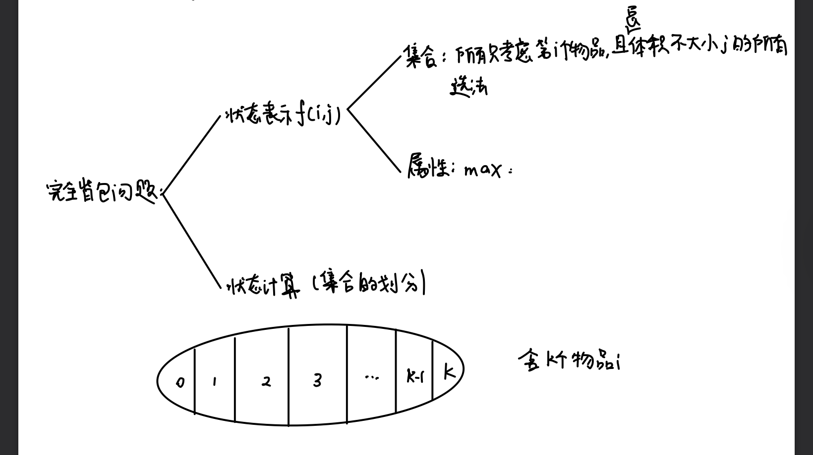

##### 状态转移方程

$f(i,j) = max\{f(i-1,j),f(i-1,j-k\cdot v[i])+k\cdot w[i]\},k=1,2,...保证j \geq kv[i]$

##### 代码实现

```c++
#include<iostream>
#include<algorithm>
using namespace std;
const int N = 1010;
int f[N][N];
int v[N], w[N];
int main(void)
{
    int n, m;
    cin >> n >> m;
    for(int i = 1 ; i <= n; i++) cin >> v[i] >> w[i];
    for(int i = 1; i <= n; i++)
    {
        for(int j = 0; j <= m; j++)
        {
            for(int k = 0 ; k*v[i] <= j; k++)
            {
                f[i][j] = max(f[i][j], f[i-1][j-k*v[i]] + k*w[i]);
            }
        }
    }
    cout << f[n][m] << endl;
    return 0;
}
```

但是这种实现循环次数太多了，对数据量大的测试数据一定会超时

时间复杂度为$O(nv^2)$

##### 优化

$f[i,j] = max(f[i-1,j],f[i-1,j-v]+w,f[i-1,j-2v]+2w,...)$

$f[i,j-v] = max(f[i-1,j-v],f[i-1],j-2v]+w,...)$

可以观察到

$f[i,j] = max(f[i-1,j],f[i,j-v]+w)$

这样就不需要第三重对k循环了，因为f[i,j]的信息只是建立在f[i,j-v]这个状态上，而这个状态已经在前面的状态迭代中计算完毕

因此可以做一层优化，注意这时候是从f[i,j-v]转移过来的
```c++
#include<iostream>
#include<algorithm>
using namespace std;
const int N = 1010;
int f[N][N];
int v[N], w[N];
int main(void)
{
    int n, m;
    cin >> n >> m;
    for(int i = 1 ; i <= n; i++) cin >> v[i] >> w[i];
    for(int i = 1; i <= n; i++)
    {
        for(int j = 0; j <= m; j++)
        {
            f[i][j] = f[i-1][j];
            if(j >= v[i])
                f[i][j] = max(f[i][j], f[i][j-v[i]] + w[i]);
        }
    }
    cout << f[n][m] << endl;
    return 0;
}
```

第二层优化：从二维降低成一维，而且不需要从大到小枚举，因为是从同一层状态转移过来

```c++
#include<iostream>
#include<algorithm>
using namespace std;
const int N = 1010;
int f[N], w[N], v[N];
int main(void)
{
    int n, m;
    cin >> n >> m;
    for(int i = 1; i <= n; i++) cin >> v[i] >> w[i];
    for(int i = 1; i <= n; i++) 
    {
        for(int j = v[i]; j <= m; j++)
        {
            f[j] = max(f[j], f[j-v[i]] + w[i]);
        }
    }
    cout << f[m] << endl;
    return 0;
}
```

#### 1.1.3 多重背包问题

##### 问题描述

有N种物品和一个容量是V的背包

第i种物品最多有$s_i$件，每件体积是$v_i$，价值是$w_i$

求解将哪些物品装入背包，可使物品体积总和不超过背包容量，且价值总和最大

输出最大价值

##### 分析

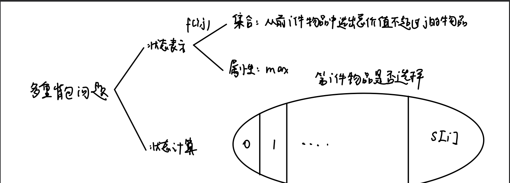

##### 状态转移方程

$f[i,j] = max(f[i-1,j-k*v[i]]+k*w[i]),k = 0,1,..s[i]$

##### 代码实现

```c++
#include<iostream>
#include<algorithm>
using namespace std;
const int N = 110;
int f[N][N], w[N], v[N], s[N];
int main(void)
{
    int n,m ;
    cin >> n >> m;
    for(int i = 1; i <= n; i++) cin >> v[i] >> w[i] >> s[i];
    for(int i = 1; i <= n; i++)
    {
        for(int j = 0; j <= m; j++)
        {
            for(int k = 0; k <= s[i] && k*v[i] <= j; k++)
            {
                f[i][j] = max(f[i][j], f[i-1][j-k*v[i]] + k * w[i]);
            }
        }
    }
    cout << f[n][m] << endl;
    return 0;
}
```

##### 优化

二进制优化

对于任意s个第i个物品，$2^k \leq s < 2^{k+1}$，s可以用$1,2,4,...,2^k$这k+1个自由组合表示，因此我们可以把第i个物品视为有$1,2,4,...2^k$个第i个物品的k+1组，每组由0-1背包问题决定选择或者不选择，这样就可以把一个$O(NVS)$的算法降低为$O(NVlgS)$的0-1背包问题，以此来优化

一个小细节是，最后一组应该是$s[i]-2^k$个第i个物品，这样就可以恰好凑到s[i]个物品而不会超过s[i]个物品

```c++
#include<iostream>
#include<algorithm>
using namespace std;
const int N = 25000, M = 2010;
int f[N];
int w[N], v[N];
int main(void)
{
    int n, m;
    cin >> n >> m;
    int cnt = 0;
    for(int i = 1; i <= n; i++)
    {
        int a, b ,s;
        cin >> a >> b >> s;
        int k = 1;
        while(k <= s)
        {
            cnt++;
            v[cnt] = a * k;
            w[cnt] = b * k;
            s -= k;
            k = k * 2;
        }
        if(s > 0)
        {
            cnt ++;
            v[cnt] = a * s;
            w[cnt] = b * s;
        }
    }
    n = cnt;
    for(int i = 1; i <= n ;i++)
    {
        for(int j = m; j >= v[i]; j--)
        {
            f[j] = max(f[j], f[j-v[i]] + w[i]);
        }
    }
    cout << f[m] << endl;
    return 0;
}
```

#### 1.1.4 分组背包问题

##### 问题描述

有N组物品和一个容量是V的背包

每组物品有若干个，同一组内的物品只能最多选一个

每件物品的体积是$v_{ij}$，价值是$w_{ij}$，其中i是组好，j是组内编号

求解将哪些物品装入背包，可使物品总体积不超过背包容量，且总价值最大

输出最大价值

##### 分析

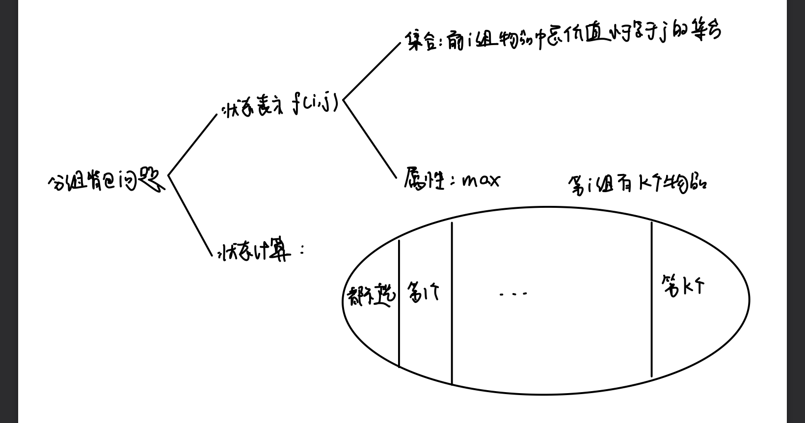

##### 状态转移方程

$f[i,j] = max(f[i-1,j],f[i-1,j-v[i,k]]+w[i,k]),k=1,...,s[i]$

##### 代码实现

```c++
#include<iostream>
#include<algorithm>
using namespace std;
const int N = 110;
int f[N][N];
int s[N], w[N][N], v[N][N];
int main(void)
{
    int n, m;
    cin >> n >> m;
    for(int i = 1 ;i <= n; i++)
    {
        cin >> s[i];
        for(int j = 1; j <= s[i]; j++)
        {
            cin >> v[i][j] >> w[i][j];
        }
    }
    for(int i = 1; i <= n; i++)
    {
        for(int j = 0; j <= m; j++ )
        {
            f[i][j] = f[i-1][j];
            for(int k = 1; k <= s[i];k ++)
            {
                if(v[i][k] <= j)
                    f[i][j] = max(f[i][j], f[i-1][j-v[i][k]] + w[i][k]);
            }
        }
    }
    cout << f[n][m] << endl;
    return 0;
}
```

优化成一维的

```c++
#include<iostream>
#include<algorithm>
using namespace std;
const int N = 110;
int f[N];
int s[N], w[N][N], v[N][N];
int main(void)
{
    int n, m;
    cin >> n >> m;
    for(int i = 1 ;i <= n; i++)
    {
        cin >> s[i];
        for(int j = 1; j <= s[i]; j++)
        {
            cin >> v[i][j] >> w[i][j];
        }
    }
    for(int i = 1; i <= n; i++)
    {
        for(int j = m; j >= 0; j--)
        {
            for(int k = 1; k <= s[i];k ++)
            {
                if(v[i][k] <= j)
                    f[j]= max(f[j], f[j-v[i][k]] + w[i][k]);
            }
        }
    }
    cout << f[m] << endl;
    return 0;
}
```

### 1.2 线性DP

#### 1.2.1 数字三角形

##### 问题描述

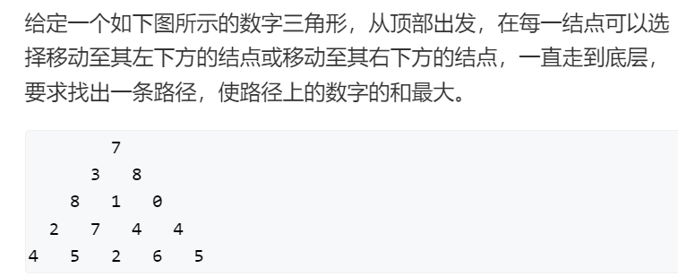

##### 分析

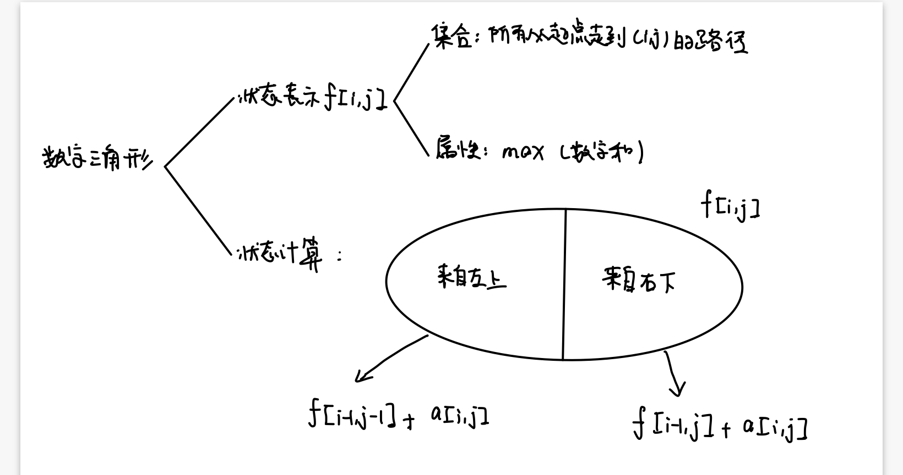

##### 状态转移方程

$f[i,j] = max(f[i-1,j-1]+a_{ij}， f[i-1,j]+a_{ij})$

动态规划问题的时间复杂度为：状态数*转移数量，因此时间复杂度为$O(n^2)$

##### 代码实现

```c++
#include<iostream>
#include<algorithm>
using namespace std;
const int INF = 1e9;
const int N = 510;
int f[N][N];
int a[N][N];
int main(void)
{
    int n;
    cin >> n;
    for(int i = 1; i <= n; i++)
    {
        for(int j = 1; j <= i ;j++)
        {
            cin >> a[i][j];
        }
    }
    for(int i = 0; i <= n; i++)
    {
        for(int j = 0; j <= i + 1 ;j++)
        {
            f[i][j] = -INF;
        }
    }
    f[1][1] = a[1][1];
    for(int i = 2; i <= n; i++)
    {
        for(int j = 1; j <= i; j++ )
        {
            f[i][j] = max(f[i-1][j-1] + a[i][j], f[i-1][j] + a[i][j]);
        }
    }
    int max_value = f[n][1];
    for(int i = 2 ; i <= n; i++)
    {
        if(f[n][i] > max_value)
            max_value = f[n][i];
    }
    cout << max_value << endl;
    return 0;
}
```

注意边界，需要将边界向左向右向上都初始化为负无穷，这样不会干扰到正常边的最值判断

#### 1.2.2 最长上升子序列问题

##### 问题描述

给定一个长度为N的数列，求数值严格单调递增的子序列的长度最长是多少

##### 分析

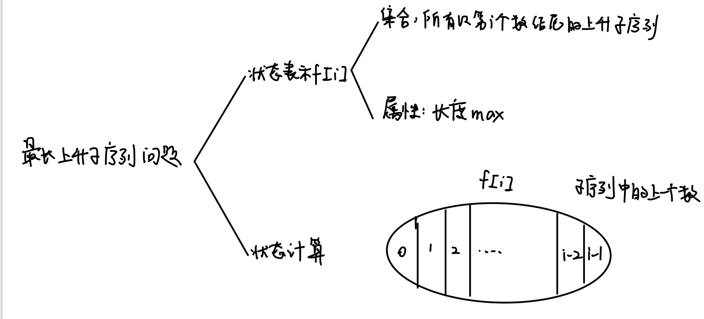

##### 状态转移方程

$f[i] =max(f[j] + 1),j=0,1,...,i-1$

##### 代码实现

```c++
#include<iostream>
#include<algorithm>
using namespace std;
const int N = 1010, INF = 1e9;
int f[N];
int a[N];
int main(void)
{
    int n;
    cin >> n;
    for(int i = 1; i <= n; i++)
    {
        cin >> a[i];
    }
    for(int i = 1; i <= n; i++)
    {
        f[i] = 1;   // 只有a[i]自己时的序列长度为1
        for(int j = 0; j <= i-1 ;j++)
        {
            if(a[i] > a[j])
                f[i] = max(f[i], f[j] + 1);
        }
    }
    int res = 0;
    // 枚举以n个不同数结尾的子序列长度，找出最大的那一个
    for(int i = 1; i <= n; i++)
        res = max(res, f[i]);
    cout << res << endl;
    return 0;
}
```

##### 优化

每个长度的上升子序列只需要存一个结尾最小的，得到一个递增的序列，然后二分找到合适的位置插入

```c++
#include <iostream>
#include <algorithm>

using namespace std;

const int N = 100010;

int n;
int a[N];
int q[N];

int main()
{
    scanf("%d", &n);
    for (int i = 0; i < n; i ++ ) scanf("%d", &a[i]);

    int len = 0;
    for (int i = 0; i < n; i ++ )
    {
        int l = 0, r = len;
        while (l < r)
        {
            int mid = l + r + 1 >> 1;
            if (q[mid] < a[i]) l = mid;
            else r = mid - 1;
        }
        
        len = max(len, r + 1);
        q[r + 1] = a[i];
    }

    printf("%d\n", len);

    return 0;
}
```


#### 1.2.3 最长公共子序列

##### 问题描述

给定两个长度为N和M的字符串A和B，求既是A的子序列又是B的子序列的字符串长度最长是多少

##### 分析

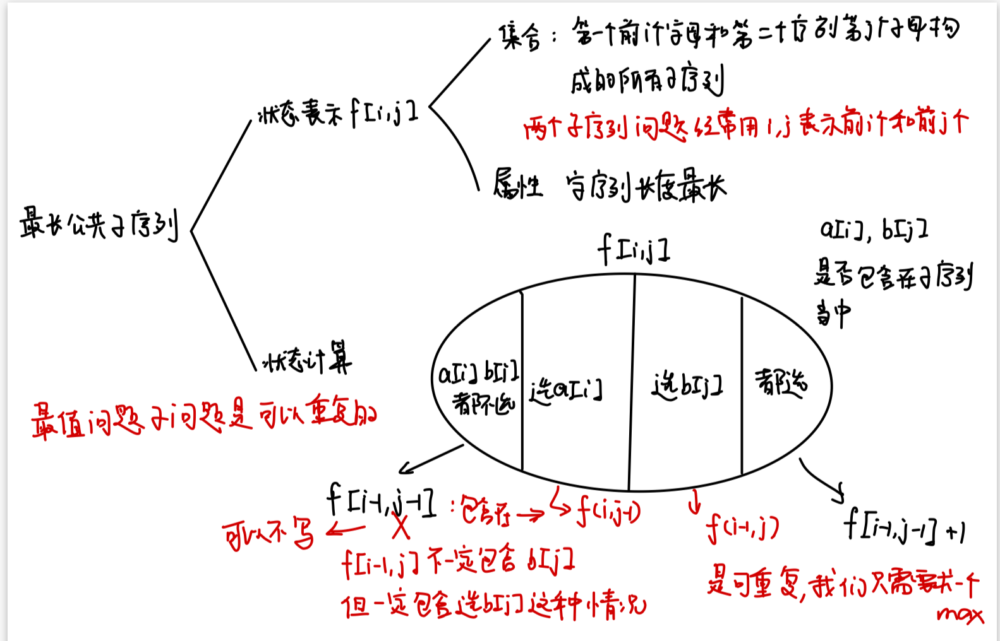

##### 状态转移方程

$f[i,j] = max(f[i-1,j], f[i,j-1],f[i-1,j-1]+1)$

##### 代码实现

```c++
#include<iostream>
#include<algorithm>
using namespace std;
const int N = 1010;
char a[N], b[N];
int n, m;
int f[N][N];
int main(void)
{
    cin >> n >> m;
    scanf("%s%s", a + 1, b + 1);
    for(int i = 1; i <= n; i++)
    {
        for(int j = 1; j <= m; j++)
        {
            f[i][j] = max(f[i-1][j] ,f[i][j-1]);
            if(a[i] == b[j])
                f[i][j] = max(f[i-1][j-1] + 1, f[i][j]);
        }
    }
    cout << f[n][m] << endl;
    return 0;
}
```

#### 1.2.4 最短编辑距离

##### 问题描述

给定两个字符串A和B，现在要将A经过若干操作变为B，可进行的操作有

- 删除：将字符串A的某个字符删除
- 插入：在字符串A的某个位置插入某个字符
- 替换：将字符串A中的某个字符替换为另一个字符

求出：将A变为B至少需要进行多少次操作

##### 分析

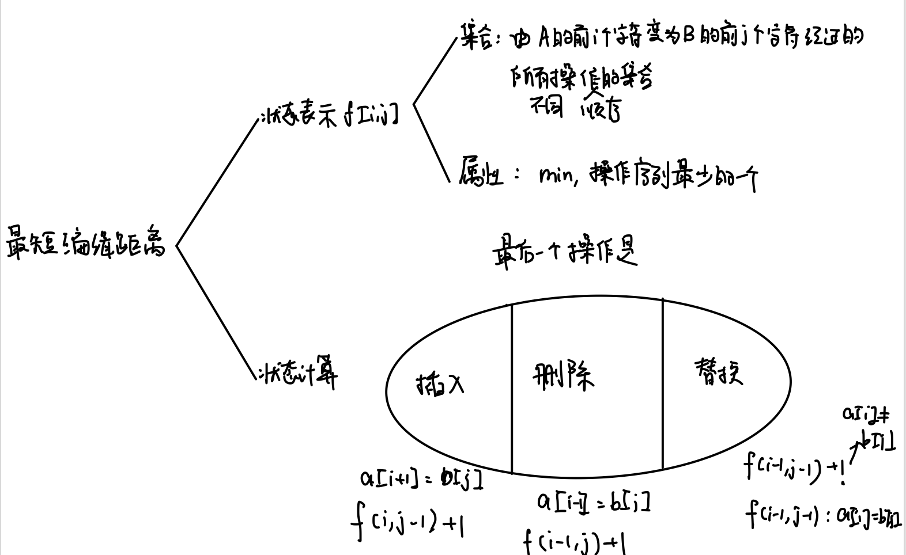

##### 状态转移方程

$f[i,j] = max(f[i-1,j]+1,f[i,j-1]+1,f[i-1,j-1]+1(if~a[i] \ne a[j]),f[i-1,j-1](ifa[i]=a[j]))$

##### 代码实现

先考虑有哪些初始化嘛
1.你看看在for遍历的时候需要用到的但是你事先没有的
（往往就是什么0啊1啊之类的）就要预处理 
2.如果要找min的话别忘了INF
  要找有负数的max的话别忘了-INF

```c++
#include<iostream>
#include<algorithm>
using namespace std;
const int N = 1010;
char a[N], b[N];
int f[N][N];
int main(void)
{
    int n, m;
    cin >> n;
    scanf("%s", a + 1);
    cin >> m;
    scanf("%s", b + 1);
    // 必须要有两行初始化，保证边界
    for(int i = 0; i <= n; i++) f[i][0] = i;
    for(int i = 0; i <= m; i++) f[0][i] = i;
    for(int i = 1; i <= n; i++)
    {
        for(int j = 1; j <= m; j++)
        {
            f[i][j] = min(f[i-1][j] + 1, f[i][j-1] + 1);
            if(a[i] == b[j])
                f[i][j] = min(f[i-1][j-1], f[i][j]);
            else
                f[i][j] = min(f[i-1][j-1] + 1, f[i][j]);
        }
    }
    cout << f[n][m] << endl;
    return 0;
}
```

#### 1.2.5 编辑距离

##### 问题描述

给定n个长度不超过10的字符串以及m次询问，每次询问给出一个字符串和一个操作次数上限

对于每次询问，请你求出给定的n个字符串中有多少个字符串可以在上限操作次数内经过操作变成询问给出的字符串

每个队字符串进行的单个字符的插入、删除或替换算作一次操作

##### 分析

把边界距离求n次即可

##### 代码实现

```c++
#include<iostream>
#include<algorithm>
#include<string.h>
using namespace std;
const int N = 1010;
int n, m;
char a[N][11];
char b[N][11];
int query[N];
int f[11][11];
int main(void)
{
    cin >> n >> m;
    for(int i = 1; i <= n; i++)
    {
        scanf("%s", a[i] + 1);
    }
    for(int i = 1; i <= m; i++)
    {
        scanf("%s", b[i] + 1);
        cin >> query[i];
    }
    // 每次询问
    for(int i = 1; i <= m ; i++)
    {
        int cnt = 0;
        int len_b = strlen(b[i] + 1);
        for(int j = 1; j <= n; j ++)
        {
            int len_a = strlen(a[j] + 1);
            // 初始化
            for(int k = 0; k <= len_a; k++)
            {
                for(int l = 0; l <= len_b;l++)
                    f[k][l] = 0;
            }
            for(int k = 0; k <= len_a; k++) f[k][0] = k;
            for(int k = 0; k <= len_b; k++) f[0][k] = k;
            // dp
            for(int k = 1; k <= len_a; k++)
            {
                for(int l = 1; l <= len_b; l++)
                {
                    f[k][l] = min(f[k-1][l] + 1, f[k][l-1] + 1);
                    if(a[j][k] == b[i][l]) 
                        f[k][l] = min(f[k-1][l-1], f[k][l]);
                    else
                        f[k][l] = min(f[k-1][l-1] + 1, f[k][l]);
                }
            }
            if(f[len_a][len_b] <= query[i])
                cnt ++;
        }
        cout << cnt << endl;
    }
    return 0;
}
```

### 1.3 区间DP

#### 1.3.1 石子合并

##### 问题描述

设有N堆石子排成一排，其编号为1,2,3,4,...,N

每堆石子有一定的质量，可以用一个整数来描述，现在要将这N堆石子合并成一堆

每次只能合并相邻的两堆，合并的代价为这两堆石子的质量之和，合并后与这两堆石子相邻的石子将和新堆相邻，合并时由于选择的顺序不同，合并的总代价也不相同

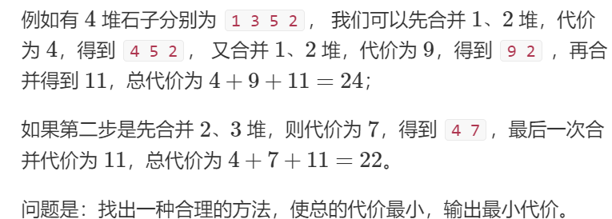

##### 分析

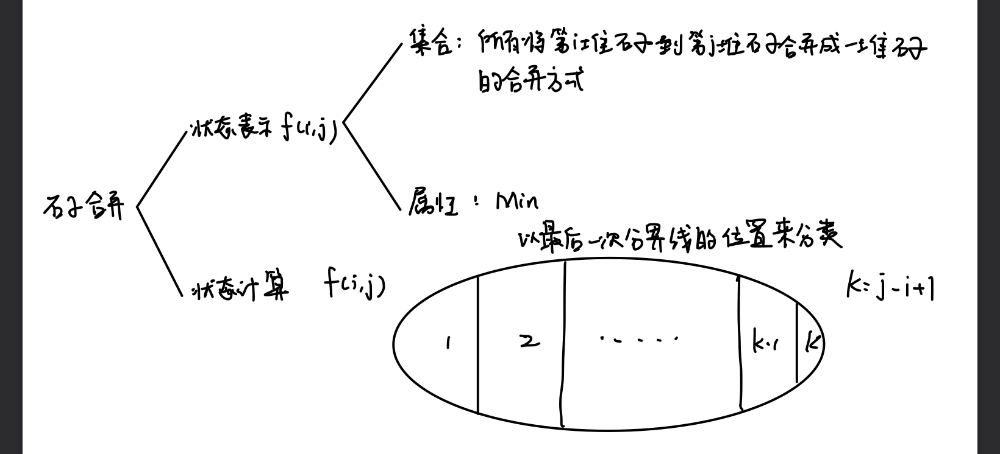

##### 状态转移方程

$f[i,j] = max(f(i,k)+f(k+1,j) + s[j]-s[i-1]),k=i,i+1,...,j-1$

##### 代码实现

注意对于区间dp是要枚举区间长度，这样才能保证后面要用到的状态已经被计算

```c++
#include<iostream>
#include<algorithm>
using namespace std;
const int N = 310;
const int INF = 1e9;
int f[N][N];
int s[N];
int main(void)
{
    // 输入
    int n ;
    cin >> n;
    for(int i = 1; i <= n; i++)
    {
        cin >> s[i];
    }
    // 前缀和
    for(int i = 1; i <= n ;i++)
    {
        s[i] += s[i-1];
    }
    // dp, 枚举区间长度
    for(int len = 2; len <= n; len++)
    {
        for(int i = 1; i + len - 1 <= n; i++)
        {
            int l = i, r = i + len - 1; // 区间左右端点
            f[l][r] = INF;
            for(int k = l; k < r; k++)
            {
                f[l][r] = min(f[l][r], f[l][k] + f[k+1][r] + s[r] - s[l-1]);
            }
        }
    }
    cout << f[1][n] << endl;
    return 0;
}
```

### 1.4 数位统计DP

#### 1.4.1 计数问题

##### 问题描述

给定两个整数a和b，求a和b之间的所有数字中0~9的出现次数

数据范围：

$0 < a,b <1e8$

##### 分析

以[1, abcdefg]中1出现的个数为例子，先求1在每个位置上出现的次数

比如找第4位上出现的1的数有多少个，就是1在第4位出现的所有次数

找满足$1 \leq xxx1yyy \leq abcdefg$

- $xxx \in [000,abc-1],yyy \in [000, 999], ans += abc *1000$

  前三位没填满，后三位可以随便填

- $xxx == abc,yyy \in ?$

  if(d < 1) yyy不存在，ans += 0

  if(d == 1) $yyy \in [000,efg]$, ans += efg + 1

  if(d > 1) $yyy \in [000, 999]$ , ans += 1000

  如果前三位填满了，后三位怎么填取决于当前这一位

对每一位都是这样讨论，最终累加起来的就是总共出现的次数

求出[1,n]的所有情况后，用前缀和就可以求出任意区间上的情况

一些特殊情况

- x在第一位上出现的次数（不用考虑前半段）

  $bcdefg \in [000000,bcdefg], ans += bcdefg + 1$

- x在最后一位上出现的次数（不用考虑后半段）

  ```
  如果g<x，那么不存在这样的数，ans += 0
  如果g==x，那么有一个这样的数，ans += 1
  如果g>x，yyyyyy∈[000000,abcdef] , ans += abcdef+1
  ```

- 枚举的数是0的情况下

  ```
  正确理解“前导零”：
  这个题里面，如果我要找一个数x在[1,n]中出现了几次
  这里我们假设n是个五位数
  要想找x在[1,n]中的一位数、两位数、三位数、四位数中出现的次数，
  都是通过前面有那么一个没有实际作用的前导零来完成的
  那么如果我们执着于“不能有前导零”，
  则我们找出来的数只可能是个五位数，就不能正确完成了
  
  说到这里，大家应该明白为什么从100到abc-1不对了吧
  从100开始的话我们凑出来的数全是五位数啊
  所以该有0的时候前面是可以有0的
  
  我们在这里说的没有前导零，
  指的是我们枚举x=0在哪一位上时，不考虑0做当前这个数的第一位
  举个例子：
  如果我们要找[1,1234]中0出现次数
  那么首先0不可以做第一位
  然后当0做第二位的时候，第一位不能是0
  （因为第一位如果是0的话这个数就是00xx，还是不含有0的）
  然后0做第三位的时候前两位不能同时为0
  （因为前两位都是0那这个数就是000x，还是不含有0）
  最后0做第4位的时候前三位不能是000
  （因为这样最后这个数就是0，而我们要从[1,1234]中找）
  
  这跟我们故意弄上去几个0当空气是有区别的，在询问0的个数的时候才有这种特殊情况
  ```

##### 代码实现

```c++
#include <iostream>
#include <algorithm>
#include <vector>

using namespace std;

const int N = 10;

/*

001~abc-1, 999

abc
    1. num[i] < x, 0
    2. num[i] == x, 0~efg
    3. num[i] > x, 0~999

*/

int get(vector<int> num, int l, int r)
{
    int res = 0;
    for (int i = l; i >= r; i -- ) res = res * 10 + num[i];
    return res;
}

int power10(int x)
{
    int res = 1;
    while (x -- ) res *= 10;
    return res;
}

int count(int n, int x)
{
    if (!n) return 0;

    vector<int> num;
    while (n)
    {
        num.push_back(n % 10);
        n /= 10;
    }
    n = num.size();

    int res = 0;
    for (int i = n - 1 - !x; i >= 0; i -- )
    {
        if (i < n - 1)
        {
            res += get(num, n - 1, i + 1) * power10(i);
            if (!x) res -= power10(i);
        }

        if (num[i] == x) res += get(num, i - 1, 0) + 1;
        else if (num[i] > x) res += power10(i);
    }

    return res;
}

int main()
{
    int a, b;
    while (cin >> a >> b , a)
    {
        if (a > b) swap(a, b);

        for (int i = 0; i <= 9; i ++ )
            cout << count(b, i) - count(a - 1, i) << ' ';
        cout << endl;
    }

    return 0;
}
```

### 1.5 状态压缩DP

#### 1.5.1 蒙德里安的梦想

##### 问题描述

##### 分析

核心：先放横着的，再放竖着的

总方案数，等于只放横着的小方块的合法方案数

如何判断，当前方案是否合法？

- 所有剩余的位置能否填充满竖着的小方块，可以按列来看，每一列内部所有连续的空着的小方块，需要是偶数个

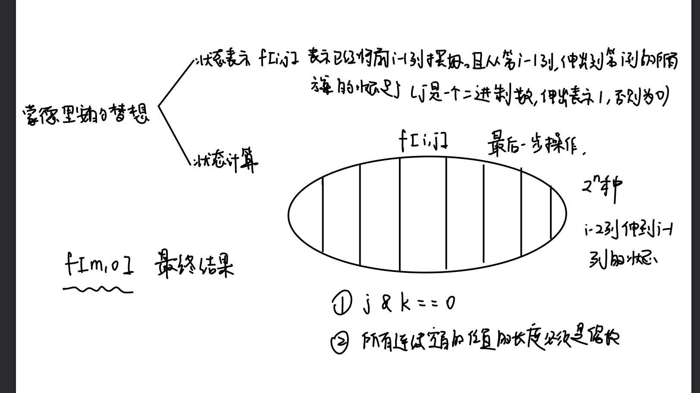

##### 代码实现

```c++
#include <cstring>
#include <iostream>
#include <algorithm>

using namespace std;

const int N = 12, M = 1 << N;

int n, m;
long long f[N][M];
bool st[M];

int main()
{
    while (cin >> n >> m, n || m)
    {
        for (int i = 0; i < 1 << n; i ++ )
        {
            int cnt = 0;
            st[i] = true;
            for (int j = 0; j < n; j ++ )
                if (i >> j & 1)
                {
                    if (cnt & 1) st[i] = false;
                    cnt = 0;
                }
                else cnt ++ ;
            if (cnt & 1) st[i] = false;
        }

        memset(f, 0, sizeof f);
        f[0][0] = 1;
        for (int i = 1; i <= m; i ++ )
            for (int j = 0; j < 1 << n; j ++ )
                for (int k = 0; k < 1 << n; k ++ )
                    if ((j & k) == 0 && st[j | k])
                        f[i][j] += f[i - 1][k];

        cout << f[m][0] << endl;
    }
    return 0;
}
```


