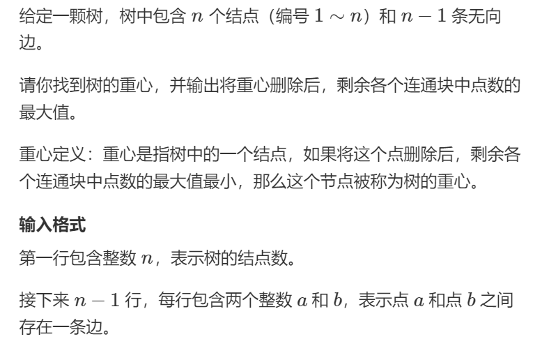
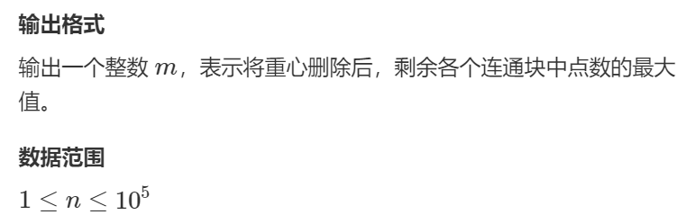
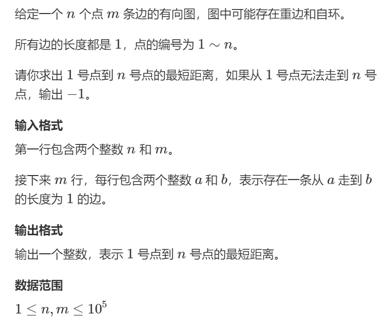
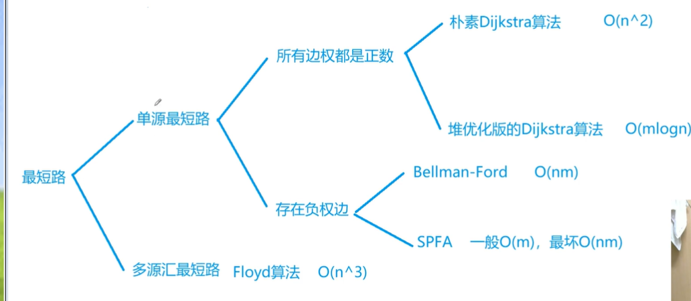
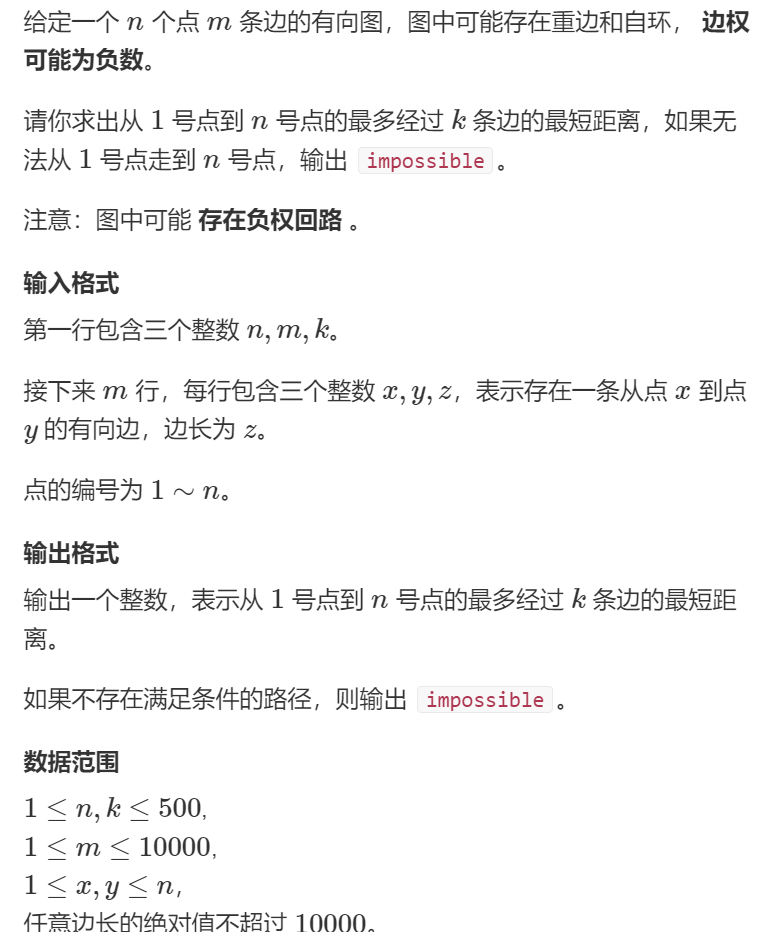
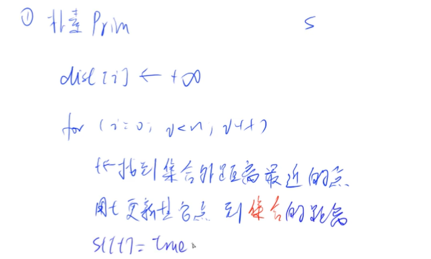

### 广度优先搜索BFS

#### 迷宫问题

手写队列

```c++
#include<iostream>
#include<algorithm>
#include<cstring>
using namespace std;
const int N = 110;
typedef pair<int, int> PII;

int map[N][N], dis[N][N];
int m, n;
int dx[4] = {-1, 0, 1, 0};
int dy[4] = {0, 1, 0, -1};
PII que[N * N];
int bfs()
{
    int hh = 0, tt = 0;
    que[0] = {0, 0};
    memset(dis, -1, sizeof(dis));
    dis[0][0] = 0;
    while(hh <= tt)
    {
        PII t = que[hh++];
        for(int i = 0 ; i< 4; i++)
        {
            int x = t.first + dx[i], y = t.second + dy[i];
            if(x >= 0 && x < m && y >= 0 && y < n && map[x][y] == 0 && dis[x][y] == -1)
            {
                dis[x][y] = dis[t.first][t.second] + 1;
                que[++tt] = {x, y};
            }
        }
    }
    return dis[m-1][n-1];
}

int main(void)
{
    cin >> m >> n;
    for(int i = 0 ; i < m ;i++)
        for(int j = 0; j < n; j++)
            cin >> map[i][j];
    cout << bfs() << endl;
    return 0;
}

```

调用queue

```c++
#include<iostream>
#include<algorithm>
#include<cstring>
#include<queue>
using namespace std;
const int N = 110;
typedef pair<int, int> PII;
int map[N][N], dis[N][N];
int m, n;
int bfs()
{
    queue<PII> q;
    int dx[4] = {-1, 0, 1, 0};
    int dy[4] = {0, 1, 0, -1};
    q.push({0, 0});
    memset(dis, -1, sizeof(dis));
    dis[0][0] = 0;
    while(!q.empty())
    {
        PII temp = q.front();
        q.pop();
        for(int i = 0; i < 4; i++)
        {
            int x = temp.first + dx[i], y = temp.second + dy[i];
            if(x >= 0 && x < m && y >= 0 && y < n && map[x][y] == 0 && dis[x][y] == -1)
            {
                dis[x][y] = dis[temp.first][temp.second] + 1;
                q.push({x, y});
            }
        }
    }
    return dis[m-1][n-1];
}
int main(void)
{
    cin >> m >> n;
    for(int i = 0; i < m ; i++)
        for(int j = 0; j < n;j++)
            cin >> map[i][j];
    cout << bfs() << endl;
    return 0;
}
```

#### 八数码

```c++
#include<iostream>
#include<queue>
#include<algorithm>
#include<string>
#include<unordered_map>
using namespace std;
// 每个string 对应着一个状态，每个状态相当于图中的一个结点，状态的转移是通过找到x对应在字符串中的下标，然后转化为3*3的矩阵后交换x和上下左右中的一个元素，得到一个新的字符串
// 初始状态通过输入获得，结束状态就是"12345678x"
// 对于bfs需要一个队列，存放状态，因此是一个queue<string>
// 对于距离distance的存储，用到了unordered_map这个hash表，将不同状态到起始状态的距离存入hash表，然后在需要的时候提取
// 转移依然是上下左右四种可能，因此定义一个dx和一个dy
int bfs(string start)
{
    string end = "12345678x";
    queue<string> q;
    unordered_map<string, int> dis;
    int dx[4] = {-1, 0, 1, 0} ,dy[4] = {0, 1, 0, -1};
    q.push(start);
    dis[start] = 0;
    // 队列不为空时进入循环
    while(!q.empty())
    {
        // 每次对头元素出队，作为当前状态开始bfs
        auto temp = q.front();
        q.pop();
        // 如果这时队头元素恰好为结束状态，bfs结束，从hash表中提取关键字值即可
        if(temp == end)
        {
            return dis[temp];
        }
        // 找到x位于当前状态string中的下标，然后转化为3*3格局中的x和y
        int distance = dis[temp];
        int k = temp.find('x');
        int x = k / 3, y = k % 3;
        // 状态转移
        for(int i = 0; i < 4; i ++)
        {
            int a = x + dx[i], b = y + dy[i];
            if(a >=0 && a<3 && b >= 0 && b < 3)
            {
                //	建立新状态入队
                swap(temp[a * 3 + b], temp[k]);
                // dis.count(temp)说明temp还没存到dis中
                if(!dis.count(temp))
                {
                    dis[temp] = distance + 1;
                    q.push(temp);
                }
                swap(temp[a * 3 + b], temp[k]);
            }
        }
    }
    return -1;
}

int main(void)
{
    string start;
    for(int i = 1 ; i <= 9; i++)
    {
        char c;
        cin >> c;
        start += c;
    }
    cout << bfs(start) << endl;
    return 0;
}
```

### 树和图的存储结构

#### 单链表

```c++
int head;	//头结点指针 
int e[N];	// 所有结点值的数组
int ne[N];	// 所有结点的next域
int idx;	// 全局计数器，idx表示当前用到的哪个结点
// 初始化
void init()
{
    head = -1;
    idx = 0;
}
// 将值a插入链表头
void insert(int a)
{
    e[idx] = a;
    ne[idx] = head;
    head = idx++;
}
void remove()
{
    head = ne[head];
}
```

#### 邻接表

```c++
int h[N];	// 头结点数组
int e[N];	// 所有结点值的集合
int ne[N];	// next指针域
int idx;	// 表示当前用到的结点
// 添加一条边
void add(int a, int b)
{
    e[idx] = b;
    ne[idx] = h[a];
    h[a] = idx++;
}
// 初始化
idx = 0;
memest(h, -1, sizeof(h));
```

#### 树与图的遍历

时间复杂度$O(n+m)$，n表示点数，m表示边数

##### （1）深度优先遍历

```c++
void dfs(int u)
{
    visit[u] = true;	//表示点u已经被遍历过
    for(int i = h[u];i != -1; i = ne[i])
    {
        j = e[i];
        if(!visit[j]) dfs(j);
    }
}
```

##### （2）广度优先遍历

```c++
queue<int> q;
visit[1] = true;
q.push(1);
while(q.size())
{
    int t = q.front();
    q.pop();
    for(int i = h[t]; i != -1 ; i = ne[i])
    {
        int j = e[i];
        if(!visit[j])
        {
            visit[j] = true;
            q.push(j);
        }
    }
}
```

#### 树的重心





```c++
#include<iostream>
#include<cstring>
#include<algorithm>
#include<cstdio>
using namespace std;
// 由于是无向图，要存储边的数量是n的两倍
const int N = 1e5 + 10, M = 2 * N;
// 分别代表头结点数组，边的集合，指针，当前可用结点
int h[N], e[M], ne[M],idx;
// 	结果
int ans = N;
int n;
// 标记数组
bool visit[N];
// 在a和b之间建立一条边
void add(int a, int b)
{
    e[idx] = b;
    ne[idx] = h[a];
    h[a] = idx++;
}
// dfs, 访问结点u, 因为只需要访问所有结点一遍，而不是多条路径，因此不需要恢复现场
int dfs(int u)
{
   	// 表明结点u已经被访问
    visit[u] = true;
    // size表示结点u的所有子树中点数最多的大小
    // sum 表示其所有孩子数
    int size = 0, sum = 0;
    // 从u开始访问所有u的边，对每个边的终点dfs
    for(int i = h[u]; i != -1; i = ne[i])
    {
        int j = e[i];
        // 由于无向图，如果已经访问到了，就不再访问
        if(visit[j]) continue;
        int s = dfs(j);
        // 更新size和sum
        size = max(s, size);
        sum += s;
    }
    // size表示删除u后，剩下的几部分中点数最大的
    size = max(size, n - sum - 1);
    // 如果当前size比ans小，跟新ans
    ans = min(ans, size);
    return sum + 1;
}
int main(void)
{
    cin >> n;
    memset(h, -1, sizeof(h));
    // 建立图(邻接表形式)
    for(int i = 0; i < n-1 ;i ++)
    {
        int a, b;
        cin >> a >> b;
        add(a, b);
        add(b, a);
    }
    dfs(1);
    cout << ans << endl;
    return 0;
}
```

#### 图中点的层次



```c++
#include<iostream>
#include<algorithm>
#include<cstring>
#include<queue>
using namespace std;
const int N = 1e5 + 10, M = 1e5 + 10;
int h[N], e[M], ne[M], idx;
int n, m;
bool visit[N];
int dis[N];
void add(int a, int b)
{
    e[idx] = b, ne[idx] = h[a], h[a] = idx++;
}
void bfs(int u)
{
    queue<int> q;
    visit[u] = true;
    q.push(u);
    dis[u] = 0;
    while(q.size())
    {
        int temp = q.front();
        q.pop();
        for(int i = h[temp]; i != -1; i = ne[i])
        {
            int j = e[i];
            if(!visit[j])
            {
                visit[j] = true;
                q.push(j);
                dis[j] = dis[temp] + 1;
            }
            
        }
    }
}
int main(void)
{
    cin >> n >> m;
    memset(h, -1, sizeof(h));
    memset(dis, -1, sizeof(dis));
    for(int i = 0 ; i < m; i++)
    {
        int a, b;
        cin >> a >> b;
        add(a, b);
    }
    bfs(1);
    cout << dis[n] << endl;
    return 0;
}
```

### 有向图的拓扑序列

手动模拟队列

```c++
#include<iostream>
#include<cstring>
#include<algorithm>
using namespace std;
const int N = 1e5 + 10;
int h[N], e[N], ne[N], idx;
int q[N], d[N];
int n, m;
void add(int a, int b)
{
    e[idx] = b, ne[idx] = h[a], h[a] = idx++;
}
bool toposort()
{
    int hh = 0, tt = -1;
    for(int i = 1 ; i <= n; i++)
    {
        if(!d[i])
            q[++t] = i;
    }
    while(hh <= tt)
    {
        int t = q[hh++];
        for(int i = h[t]; i != -1; i = ne[i])
        {
            int j = e[i];
            d[j]--;
            if(d[j] == 0) q[++tt] = j;
        }
    }
    return tt == n-1;
}
int main(void)
{
    cin >> n >> m;
    memset(h , -1, sizeof(h));
    for(int i = 0; i < m; i++)
    {
        int a, b;
        cin >> a >> b;
        add(a, b);
        d[b]++;
    }
    if(toposort())
    {
        for(int i = 0; i < n; i++)
            cout << q[i] << " ";
        cout << endl;
    }
    else 
        puts("-1");
    return 0;
}
```

stl中的queue实现

```c++
#include<iostream>
#include<algorithm>
#include<queue>
#include<cstring>
using namespace std;
const int N = 1e5 + 10;
int h[N], e[N], ne[N], idx;
int n, m;
int degree[N];
int q[N], cnt;
queue<int> que;
void add(int a, int b)
{
  	e[idx] = b, ne[idx] = h[a], h[a] = idx++;
}
bool toposort()
{
    for(int i = 1; i <=n ; i++)
    {
        if(!degree[i])
        {
         	que.push(i);
            q[cnt++] = i;
        }
    }
    while(que.size())
    {
        int temp = que.front();
        que.pop();
        for(int i = h[temp]; i != -1; i = ne[i])
        {
            int j = e[i];
            degree[j]--;
            if(!degree[j])
            {
                que.push(j);
                q[cnt++] = j;
            }
        }
    }
    return cnt == n;
}
int main(void)
{
    cin >> n >> m;
    memset(h , -1, sizeof(h));
    for(int i = 0; i < m; i++)
    {
        int a, b;
        cin >> a >> b;
        add(a, b);
        degree[b]++;
    }
    if(toposort())
    {
       	for(int i = 0 ; i < n; i++)
            cout << q[i] << " ";
        cout << endl;
    }
    else
        puts("-1");
   	return 0;
}
```

## 最短路算法



### 朴素Dijkstra算法

稠密图，用邻接矩阵存储

```c++
#include<isotream>
#include<algorithm>
#include<cstring>
using namespace std;
const int N = 510;
const int M = 1e5 + 10;
int n, m;
int g[N][N];
int dist[N];
bool visit[N];
int dijkstra()
{
    memset(dist, 0x3f, sizeof dist);
    dist[1] = 0;
    for(int i = 0; i < n - 1; i++)
    {
        int t = -1;
        // 找到一个distance最小的点作为新的起点
        for (int j = 1; j <= n; j++)
            if(!visit[j] && (t == -1 || dist[t] > dist[j]))
                t = j;
        // 标记为已经访问
       	visit[t] = true;
        // 更新从这个新起点到所有其他定点的最短距离
        for(int j = 1; j <= n;j ++)
            dist[j] = min(dist[j], dist[t] + g[t][j]);
    }
    // 没有找到一条最短路
    if(dist[n] == 0x3f3f3f3f) return -1;
    return dist[n];
}
int main(void)
{
    cin >> n >> m;
    memset(g, 0x3f, sizeof g);
    while(m--)
    {
        int a, b, c;
        cin >> a >> b >> c;
        g[a][b] = min(g[a][b], c);
    }
    int t = dijkstra();
    cout << t << endl;
   	return 0;
}
```

### 堆优化的dijkstra算法

```c++
#include<iostream>
#include<cstring>
#include<algorithm>
#include<queue>
using namespace std;
typedef pair<int, int> PII;
const int N = 2e5 + 10;
int h[N], e[N], ne[N], w[N], idx;
bool visit[N];
int n, m;
int dist[N];
void add(int a, int b, int c)
{
    e[idx] = b, w[idx] = c,ne[idx] = h[a], h[a] = idx ++;
}
int dijkstra()
{
    memset(dist, 0x3f, sizeof dist);
    dist[1] = 0;
    priority_queue<PII, vector<PII>, greater<PII>> heap;
    heap.push({0, 1})
    while(heap.size())
    {
        auto t = heap.top();
        heap.pop();
        int vertice = t.second, distance = t.first;
        if(visit[vertice]) continue;
        visit[vertice] = true;
        for(int i = h[vertice]; i != - 1; i = ne[i])
        {
            int j = e[i];
            if(dist[j] > distance + w[i])
            {
                dist[j] = distance + w[i];
                heap.push({dist[j], j});
            }
        }
    }
    if(dist[n] == 0x3f3f3f3f) return -1;
    return dist[n];
}
int main(void)
{
    cin >> n >> m;
    memset(h, -1, sizeof h);
    while(m--)
    {
        int a, b, c;
        cin >> a >> b >> c;
        add(a, b, c);
    }
    cout << dijkstra() << endl;
    return 0;
}

```

对于dijkstra算法

```c++
int dijkstra()
{
	// 初始化 dist数组，和小根堆(堆优化版本)
    // dist[1] = 0，将起始点的distance标为0
    // 首元素进堆
    while(heap 非空)
    {
        // 找到一个新的起始点（离起始点距离最小的）
        // 堆优化版本
        取堆顶即为此时distance最小的点作为新的起始点
        // 朴素版本
        遍历n个点，找到最小的j
        查看这个点是否被访问过，被访问过跳过，否则标记为访问，然后更新dist数组
       	// 堆优化版本注意松弛的时候进堆
    }
    如果dist == infty,说明不存在路径，返回-1
    否则返回dist[n]即可
}
```

### Bellman-ford算法

不能有负权回路，有负权回路可能求不出最短路径

时间复杂度为O（nm）

通用模版

```c++
int n, m; 	// n表示点数，m表示边数
int dist[N];	// dist[x]存储1到x的最短路距离
struct edge	//边，a表示出点，b表示入点，w表示边的权重
{
    int a, b, w;
}edges[M];
int bellman_ford()
{
    memset(dist, 0x3f, sizeof dist);
    dist[1] = 0;
    for(int i = 0; i < n; i++)
    {
        for(int j = 0; j < m; j++)
        {
            int a = edges[j].a, b = edges[j].b, w = edges[j].w;
            if(dist[b] > dist[a] + w)
                dist[b] = dist[a] + w;
        }
    }
    if(dist[n] > 0x3f3f3f3f / 2) return -1;
    return dist[n];
}
```





```c++
#include<iostream>
#include<cstring>
#include<algorithm>
using namespace std;
const int N = 510, M = 10010;
int n, m, k;
int dist[N], backup[N];	// backup存的是上一次的结果
struct edge
{
    int a, b, w;
}edges[M];
int bellman_ford()
{
    memset(dist, 0x3f, sizeof dist);
    dist[1] = 0;
    for(int i = 0; i < k; i++)
    {
        memcpy(backup, dist, sizeof(dist));
        for(int j = 0;j < m; j++)
        {
            int a = edges[j].a, b= edges[j].b, w = edges[j].w;
            dist[b] = min(dist[b], backup[a] + w);
        }
    }
    if(dist[n] > 0x3f3f3f3f / 2) return -1;
    return dist[n];
    
}
int main(void)
{
	cin >> n >> m >> k;
    for(int i = 0; i < m; i++)
    {
        int a, b, w;
        cin >> a >> b >> w;
        edges[i] = {a, b, w};
    }
    int t = bellman_ford();
    if(t == -1)
     	puts("impossible");
    else
        cout << t << endl;
    return 0;
}

```

### SPFA

“关于SPFA，它死了“

队列优化的Bellman_ford算法

时间复杂度 平均情况下 $O(m)$, 最坏情况下$O(nm)$，n表示点数，m表示边数

通用板子

#### SPFA求最短路

```c++
int n;
int h[N], w[N], e[N], ne[N], idx;
int dist[N];
bool visit[N];
int spfa()
{
    memset(dist, 0x3f, sizeof dist);
    dist[1] = 0;
    queue<int> q;
    q.push(1);
    visit[1] = true;
    while(q.size())
    {
        auto t = q.front();
        q.pop();
        visit[t] = false;
        for(int i = h[t]; i != -1; i = ne[i])
        {
            int j = e[i];
            if(dist[j] > dist[t] + w[i])
            {
                dist[j] = dist[t] + w[i];
               	if(!visit[j])
                {
                    q.push(j);
                    visit[j] = true;
                }
            }
        }
    }
    if(dist[n] == 0x3f3f3f3f) return -1;
    return dist[n];
}
```

#### SPFA判断负环

```c++
#include<iostream>
#include<queue>
#include<algorithm>
#include<cstring>
using namespace std;
const int N = 2010, M = 10010;
int h[N], e[M], w[M], ne[M], idx;
int dist[N], cnt[N];
bool visit[N];
int n, m;
void add(int a, int b, int c)
{
    e[idx] = b, w[idx] = c, ne[idx] = h[a], h[a] = idx++;
}
bool spfa()
{
    memset(dist, 0x3f, sizeof dist);	// 可省略
    queue<int> q;
    for(int i = 1; i <= n; i++)
    {
        q.push(i);
        visit[i] = true;
    }
    while(q.size())
    {
        int t = q.front();
        q.pop();
        visit[t] = false;
        for(int i = h[t]; i != -1; i = ne[i])
        {
            int j = e[i];
            if(dist[j] > dist[t] + w[i])
            {
                dist[j] = dist[t] + w[i];
                cnt[j] = cnt[t] + 1;
                if(cnt[j] >= n) return true;
                if(!visit[j])
                {
                    visit[j] = true;
                    q.push(j);
                }
            }
        }
    }
    return false;
}
int main(void)
{
    cin >> n >> m;
    memset(h, -1, sizeof h);
    for(int i = 0; i < m; i++)
    {
        int a, b, c;
        cin >> a >> b >> c;
        add(a, b, c);
    }
    if(spfa()) puts("Yes");
    else puts("No");
    return 0;
}
```

### Floyd算法

从i点出发，只经过k个点到达j点的最短距离

```c++
#include<iostream>
#include<cstring>
#include<algorithm>
using namespace std;
const int N = 210, INF = 1e9;
int g[N][N];
int n, m, Q;
void floyd()
{
    for(int k = 1; k <= n; k++)
    {
        for(int i = 1; i <= n; i++)
        {
            for(int j = 1; j <= n; j++)
                g[i][j] = min(g[i][j], g[i][k] + g[k][j]);
        }
    }
}
int main(void)
{
    cin >> n >> m >> Q;
    // 初始化
    for(int i = 1; i <= n; i++)
    {
        for(int j = 1; j <= n; j++)
        {
            if(i == j) g[i][j] = 0;
            else g[i][j] = INF;
        }
    }
    while(m--)
    {
        int a, b, c;
        cin >> a >> b >> c;
        g[a][b] = min(g[a][b], c);
    }
    floyed();
    for(int i = 0 ;i < Q; i++)
    {
        int a, b;
        cin >> a >> b;
        if(g[a][b] > INF / 2) puts("impossible");
        else cout << g[a][b] << endl;
    }
    return 0;
}
```

## 最小生成树


稠密图用朴素版prim

稀疏图用kruskal

### prim算法

#### 朴素prim算法



通用模版

时间复杂度为$O(n^2 +m)$，n表示点数，m表示边数

```c++
int n;	// 表示点数
int g[N][N];	//邻接矩阵，存储所有边
int dist[N];	// 存储其他点到当前最小生成树的距离
bool visit[N];	// 存储每个点是否已经在生成树中
int prim()
{
    memset(dist, 0x3f, sizeof dist);
    int res = 0;
    for(int i = 0 ; i < n; i++)
    {
        int t = -1;
        for(int j = 1; j <= n; j++)
        {
            if(!visit[j] && (t == -1 || dist[t] > dist[j]))
                t = j;
        }
        if(i && dist[t] == INF) return INF;
        if(i) res += dist[t];
        visit[t] = true;
        for(int j = 1; j <= n; j++)
            dist[j] = min(dist[j], g[t][j]);
    }
    return res;
}
```

```c++
#include <cstring>
#include <iostream>
#include <algorithm>

using namespace std;

const int N = 510, INF = 0x3f3f3f3f;

int n, m;
int g[N][N];
int dist[N];
bool st[N];


int prim()
{
    memset(dist, 0x3f, sizeof dist);

    int res = 0;
    for (int i = 0; i < n; i ++ )
    {
        int t = -1;
        for (int j = 1; j <= n; j ++ )
            if (!st[j] && (t == -1 || dist[t] > dist[j]))
                t = j;

        if (i && dist[t] == INF) return INF;

        if (i) res += dist[t];
        st[t] = true;

        for (int j = 1; j <= n; j ++ ) dist[j] = min(dist[j], g[t][j]);
    }

    return res;
}


int main()
{
    scanf("%d%d", &n, &m);

    memset(g, 0x3f, sizeof g);

    while (m -- )
    {
        int a, b, c;
        scanf("%d%d%d", &a, &b, &c);
        g[a][b] = g[b][a] = min(g[a][b], c);
    }

    int t = prim();

    if (t == INF) puts("impossible");
    else printf("%d\n", t);

    return 0;
}
```


### Kruskal 算法

通用模版

```c++
int n, m;	//n是点数,m是边数
int p[N];	//并查集的父节点数组
struct Edge{
    int a, b, w;
    bool operator< (const Edge &W) const
    {
        return w < W.w;
    }
}edges[M];
int find(int x)	//	并查集核心操作
{
    if(p[x] ! = x) p[x] = find(p[x]);
    return p[x];
}
int kruskal()
{
    sort(edges, edges + m);
    for(int i = 1; i <= n; i++) p[i] = i;
    int res = 0, cnt = 0;
    for(int i = 0; i < m; i++)
    {
        int a = edges[i].a, b = edges[i].b, w = edges[i].w;
        a = find(a), b = find(b);
        if(a != b)
        {
            p[a] = b;
            res += w;
            cnt ++;
        }
    }
    if(cnt < n - 1) return INF;
    return res;
}
```

算法实现

```c++
#include <cstring>
#include <iostream>
#include <algorithm>

using namespace std;

const int N = 100010, M = 200010, INF = 0x3f3f3f3f;

int n, m;
int p[N];

struct Edge
{
    int a, b, w;

    bool operator< (const Edge &W)const
    {
        return w < W.w;
    }
}edges[M];

int find(int x)
{
    if (p[x] != x) p[x] = find(p[x]);
    return p[x];
}

int kruskal()
{
    sort(edges, edges + m);

    for (int i = 1; i <= n; i ++ ) p[i] = i;    // 初始化并查集

    int res = 0, cnt = 0;
    for (int i = 0; i < m; i ++ )
    {
        int a = edges[i].a, b = edges[i].b, w = edges[i].w;

        a = find(a), b = find(b);
        if (a != b)
        {
            p[a] = b;
            res += w;
            cnt ++ ;
        }
    }

    if (cnt < n - 1) return INF;
    return res;
}

int main()
{
    scanf("%d%d", &n, &m);

    for (int i = 0; i < m; i ++ )
    {
        int a, b, w;
        scanf("%d%d%d", &a, &b, &w);
        edges[i] = {a, b, w};
    }

    int t = kruskal();

    if (t == INF) puts("impossible");
    else printf("%d\n", t);

    return 0;
}
```


## 二分图


### 染色法

判断一个图是不是二分图

一个图是二分图当且仅当图中不含奇数环（奇圈）

```c++
int n;	 //	n表示点数
int h[N], e[M], ne[M], idx;
int color[N];
bool dfs(int u, int c)
{
    color[u] = c;
    for(int i = h[u]; i != -1 ;i = ne[i])
    {
        int j = e[i];
        if(color[j] == -1)
        {
           if(!dfs(j, !c)) return false;
        }
        else if (color[j] == c) return false;
    }
    return true;
}
bool check()
{
    memset(color, -1, sizeof color);
    bool flag = true;
    for(int i = 1 ; i <= n; i++)
        if(color[i] == -1)
            if(!dfs(i ,0))
            {
                flag = false;
                break;
            }
   	return flag;
}
```

```c++
#include <iostream>
#include <cstring>
#include <algorithm>

using namespace std;

const int N = 100010 * 2;
int e[N], ne[N], idx;//邻接表存储图
int h[N];
int color[N];//保存各个点的颜色，0 未染色，1 是红色，2 是黑色
int n, m;//点和边

void add(int a, int b)//邻接表插入点和边
{
    e[idx] = b, ne[idx]= h[a], h[a] = idx++;
}

bool dfs(int u, int c)//深度优先遍历
{
    color[u] = c;//u的点成 c 染色

    //遍历和 u 相邻的点
    for(int i = h[u]; i!= -1; i = ne[i])
    {
        int b = e[i];                   
        if(!color[b])//相邻的点没有颜色,则递归处理这个相邻点
        {
            if(!dfs(b, 3 - c)) return false;//（3 - 1 = 2， 如果 u 的颜色是2，则和 u 相邻的染成 1）
                                            //（3 - 2 = 1， 如果 u 的颜色是1，则和 u 相邻的染成 2）
        }
        else if(color[b] && color[b] != 3 - c)//如果已经染色，判断颜色是否为 3 - c
        {                                     
            return false;//如果不是，说明冲突，返回                   
        }
    }
    return true;
}

int main()
{
    memset(h, -1, sizeof h);//初始化邻接表
    cin >> n >> m;
    for(int i = 1; i <= m; i++)//读入边
    {
        int a, b;
        cin >> a >> b;
        add(a, b), add(b, a);
    }
    for(int i = 1; i <= n; i++)//遍历点
    {
        if(!color[i])//如果没染色
        {
            if(!dfs(i, 1))//染色该点，并递归处理和它相邻的点
            {
                cout << "No" << endl;//出现矛盾，输出NO 
                return 0;
            }

        }
    }
    cout << "Yes" << endl;//全部染色完成，没有矛盾，输出YES
    return 0;
}
```

### 匈牙利算法

```c++
int n1, n2;
int h[N], e[M], ne[M], idx;
int match[N];
bool visit[N];
bool find(int x)
{
    for(int i = h[x]; i != -1; i = ne[i])
    {
        int j = e[i];
        if(!visit[j])
        {
            visit[j] = true;
            if(match[j] == 0 || find(match[j]))
            {
                match[j] = x;
                return true;
            }
        }
    }
    return false;
}
int res = 0;
for(int i = 1; i <= n1; i++)
{
    memset(visit, false, sizeof visit);
    if(find(i)) res ++;
}
```

```c++
#include <cstring>
#include <iostream>
#include <algorithm>

using namespace std;

const int N = 510, M = 100010;

int n1, n2, m;
int h[N], e[M], ne[M], idx;
int match[N];
bool st[N];

void add(int a, int b)
{
    e[idx] = b, ne[idx] = h[a], h[a] = idx ++ ;
}

bool find(int x)
{
    for (int i = h[x]; i != -1; i = ne[i])
    {
        int j = e[i];
        if (!st[j])
        {
            st[j] = true;
            if (match[j] == 0 || find(match[j]))
            {
                match[j] = x;
                return true;
            }
        }
    }

    return false;
}

int main()
{
    scanf("%d%d%d", &n1, &n2, &m);

    memset(h, -1, sizeof h);

    while (m -- )
    {
        int a, b;
        scanf("%d%d", &a, &b);
        add(a, b);
    }

    int res = 0;
    for (int i = 1; i <= n1; i ++ )
    {
        memset(st, false, sizeof st);
        if (find(i)) res ++ ;
    }

    printf("%d\n", res);

    return 0;
}
```

