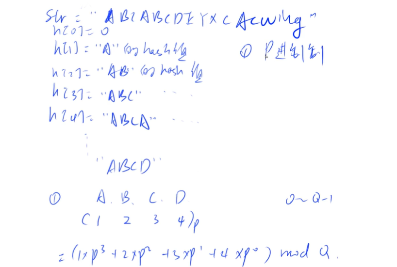

## chapter2 数据结构

### 课堂笔记

#### （一）

以数组模拟为主

##### 链表与邻接表

动态链表（笔试题一般不用）

```c++
struct Node {
	int val;
	Node* next;
};
new Node(); 	//非常慢
```

数组模拟链表

- 单链表：邻接表：存储树和图

  

  ```
  val: e[N];
  next指针:ne[N];
  e和ne用下标关联
  空节点下标用-1表示
  ```

  

  静态链表

  算法题不需要考虑内存泄漏问题，工程需要考虑内存问题

  ```c++
  #include<iostream>
  using namespace std;
  const int N = 1E5+10;
  // head表示头结点的下标
  // e[i]表示节点i的值是多少
  // ne[i]表示节点i的next下标是多少
  // idx当前已经用到了哪个点
  int head, e[N], ne[N], idx;
  // 链表初始化
  void init()
  {
      idx = 0;
      head = -1;
  }
  // 头插法(将x插入到头结点)
  void add_to_head(int x)
  {
      // e[idx] = x, ne[idx] = head, head = idx++;
      ne[idx] = head;	// 待插入的节点指向头结点
      head = idx;	// head 指向当前待插入的节点
      e[idx] = x;	// 更新值
      idx++;	// 更新下一个可用的节点的位置
  }
  // 将x插入到下标为k的后面
  void add_to_k(int x, int k)
  {
      // e[idx] = x, ne[idx] = ne[k], ne[k] = idx++;
      ne[idx] = ne[k];	
      ne[k] = idx;
      e[idx] = x;
      idx++;
  }
  // 将下标是k的点的后面的点删掉
  void remove(int k)
  {
      ne[k] = ne[ne[k]];	//令k指向k->next->next
  }
  int main()
  {
      int m;
      cin >> m;
      init();
      while(m--)
      {
          int x;
          char op;
          cin >> op;
          if(op == 'H')
          {
              cin >> x;
              add_to_head(x);
          }
          else if(op == 'D')
          {
              cin >> k;
              if(k == 0)
              {
                  head = ne[head];
              }
              remove(k-1);
          }
          else 
          {
              cin >> k >> x;
              add(k-1, x);
          }
      }
      for(int i = head; i!=-1; i = ne[i]) cout<<e[i]<<' ';
      cout<<endl;
      return 0;
  }
  ```

  

- 双链表：优化某些问题

  

  ```C++
  下表为0表示head，下标1表示tail
  int e[N], l[N],r[N],idx;
  ```

  ```c++
  #include<iostream>
  using namespace std;
  const int N = 100010;
  int m;
  int e[N], l[N], r[N], idx;
  // 初始化
  void init()
  {
      // 0表示左端点，1表示右端点
      r[0] = 1;
      l[1] = 0;
      idx = 2;
  }
  // 插入一个点到k的右边
  void add_k_right(int x, int k)
  {
      e[idx] = x;
      r[idx] = r[k];
      l[idx] = k;
      l[r[k]] = idx;	//这里不能换顺序，必须先处理r[k]的左指针
      r[k] = idx;
      idx++;
  }
  // 插入一个点到k的左边 其实就是 add_k_right(x, l[k]);
  void add_k_left(int x, int k)
  {
      e[idx] = x;
      r[idx] = k;
      l[idx] = l[k];
      r[l[k]] = idx;
      l[k] = idx;
      idx++;
  }
  // 删除第k个点
  void remove(int k)
  {
      r[l[k]] = r[k];
      l[r[k]] = l[k];
  }
  
  ```

  邻接表：n个单链表

  

##### 栈与队列

栈：先进后出（先插入的元素会最后被弹出）

队列：先进先出FIFO


###### 栈stack

```c++
#include<iostream>
using namespace std;

const int N = 100010;
int stk[N], tt;
//插入
stk[++tt] = x;
// 删除
tt--;
// 判断是否为空
if(tt > 0) 不空
else empty
// 取栈顶
stk[tt];
```

###### 队列queue

```c++
#include<iostream>
using namespace std;
const int N = 100010;
// hh 表示队头，在队头弹出元素，tt表示队尾，在队尾插入元素
int q[N], hh, tt = -1 ;
// 插入
q[++tt] = x;
// 弹出
hh ++;
// 空
if(hh <= tt) not empty
    else empty
// 取队头元素
q[hh];
// 取队尾
q[tt];

```

###### 单调栈

序列左边离它最近的比他小的数

```c++
#include<iostream>
using namespace std;
const int N = 100010;
int n;
int stk[N], tt = 0;
int main(void)
{
    // scanf("%d", &n);
    cin.tie(0);
    ios::sync_with_stdio(false);
    cin >> n;
    for(int i = 0; i< n;i++)
    {
     	int x;
        cin >> x;
        while(tt && stk[tt] >= x) tt--;
        if(tt) cout << stk[tt] << endl;
        else cout << -1;
        stk[++tt] = x;
    }
    return 0;
}
```

scanf和printf要比cin，cout快不少

这个算法是O（n）的

###### 单调队列

求滑动窗口的最大值和最小值

先考虑怎么用栈和队列来模拟这个问题，然后再考虑朴素暴力算法下，栈和队列中哪些元素是没有用到的，是否可以删去，再看一下是否有单调性，如果有单调性，取最值可以直接取端点，找值可以用二分。

```c++
#include<iostream>
using namespace std;
const int N = 100010;
int stk[N], tt = 0;
int a[N], q[N];
int main(void)
{
    scanf("%d%d", &n, &k);
    for(int i = 0;i < n; i++)
        scanf("%d", &a[i]);
    int hh = 0, tt = -1;
    for(int i = 0;i < n;i++)
    {
        // 判断队头是否已经滑出窗口
        if(hh <= tt&& i-k+1 > q[hh]) hh++;
        while(hh <= tt&& a[q[tt]] >= a[i]) tt--;
         q[++tt] = i;
        if(i >= k-1) printf("%d ", a[q[hh]]);
    }
    puts("");
    int hh = 0, tt = -1;
    for(int i = 0;i < n;i++)
    {
        // 判断队头是否已经滑出窗口
        if(hh <= tt&& i-k+1 > q[hh]) hh++;
        while(hh <= tt&& a[q[tt]] <= a[i]) tt--;
         q[++tt] = i;
        if(i >= k-1) printf("%d ", a[q[hh]]);
    }
    puts("");
    return 0;
}
```

##### KMP

朴素做法


#### （二）

#### Trie 树

快速存储和查找字符串集合的数据结构


都是小写字母，或者都是大写，或者是数字等等

存储的方式：

有一个根节点root


会在每次单词结尾的地方打上一个标记，表示结尾

trie树的查找

存储一个字符串+查询一个字符串出现了多少次

```c++
#include<iostream>
using namespace std;
const int N = 1e5+10;
int son[N][26], cnt[N], idx; 	//下标是0的点，既是根节点又是空节点
// son[N][26] 表示一个节点最多有26个子节点（对应26个字母），cnt[p]表示节点p处有多少个结尾的单词,存的是数组模拟的指针
void insert(char str[])
{
    int p = 0;
    for(int i = 0; str[i];i++)
    {
        int u = str[i] - 'a';
        if(!son[p][u]) son[p][u] = ++idx;
        p = son[p][u];
    }
    cnt[p] ++;
}
int query(char str[])
{
    int p = 0;
    for(int i = 0; str[i]; i++)
    {
        int u = str[i] - 'a';
        if(!son[p][u]) return 0;
        p = son[p][u];
    }
    return cnt[p];
}
int main(void)
{
    int n ;
    scanf("%d", &n);
    while(n--)
    {
        char op[2];
        scanf("%s%s", op, str);
        if(op[0] == '1') insert(str);
        else printf("%d ", query(str));
    }
    return 0;
}
```


#### 并查集

快速处理

- 将两个集合合并
- 询问两个元素是否在一个集合当中

belong[x] = a；

if（belong[x] == belong[y]） O(1)

将合并集合的时间从O（n）降到近乎O（1）

基本原理

用树的形式维护每一个集合，每个集合的编号是根节点的编号

对每个节点存储父节点是谁（father） p[x]表示x的父节点

求每个节点属于某个集合只需要往回遍历father，直到树根就是集合的编号

- 判断树根：p[x] == x，令树根的father为它本身

- 求x的集合编号：while(p[x]!= x) x = p[x];

- 如何合并两个集合：

  将右边树的根节点插入左边树的某个位置

  p[x] = y

并查集的优化：（路径压缩）

一旦找到了根节点，把整个路径上的点都指向根节点

```c++
#include<iostream>
using namespace std;
const int N = 100010;
int p[N];	//father数组 p[x] = x 表示树根
int n, m;
int find(int x )	// 返回x的祖宗节点 + 路径压缩
{
    if( p[x] != x) p[x] = find(p[x]);
    return p[x];
}
int main(void)
{
    scanf("%d%d", &n, &m);
    for(int i = 1; i<= n; i++) p[i] = i;
    while(m--)
    {
        char op[2];
        int a, b;
        scanf("%s%d%d",op, &a, &b);
        if(op[0] =='M') p[find(a)] = find(b);
        else 
        {
            if(find(a) == find(b))
                printf("YES\n");
            else printf("NO\n");
        }
    }
    return 0;
}
```

scanf读取字符串的时候会自动忽略，如果用%c，可能输入会在行末加一个空格导致错误

##### 有额外信息的并查集


#### 堆

如何手写一个堆？

下标从1开始，从零开始不是很方便

- 插入一个数

  ```c++
  head[++size] = x;
  up(size);
  ```

- 求集合中的最小值

  ```c++
  heap[1]
  ```

  

- 删除最小值

  ```
  heap[1] = heap[size]; size--;
  down(1);
  ```

- 删除任意一个元素

  ```
  heap[k] = heap[size]; size--;
  down(k); 
  up(k);
  ```

  

- 修改任意一个元素

  ```c++
  heap[k] = x; down(k);
  ```

  


每一个点的值都是小于等于孩子节点的值。

存储

用一个一维数组存储

1号点是根节点

- 2x是左儿子
- 2x+1是右儿子


```c++
#include<iostream>
#include<algorithm>
using namespace std;
const int N = 100010;
int n, m;
int hp[N] ,ph[N];
int size;
void down(int u)
{
    int t = u;
    if(u*2 <=size && h[u*2] < h[t]) t = 2*u;
    if(u*2 + 1 <= size && h[u*2 + 1] < h[t]) t = 2*u + 1;
    if(u != t)
    {
        swap(h[u],h[t]);
        down(t);
    }
}
void up(int u)
{
    while( u/2 && h[u/2] > h[u]) 
    {
        swap(h[u/2], h[u]);
    }
}
void heap_swap(int a, int b)
{
    swap(ph[hp[a]], ph[hp[b]]);
    down(t);
}
int main(void)
{
    scanf("%d", &n);
    for(int i = 1; i <= n; i++) scanf("%d", &n);
    size = n;
    for(int i = n/2 ;i;i --) down(i);
    while(m--)
    {
        printf("%d ", h[1]);
        h[1] = h[size];
        size--;
        down(1);
    }
    return 0;
}
```


#### （三）

#### 哈希表

哈希表

- 存储结构
  - 开放寻址法
  - 拉链法
- 字符串哈希的方式

哈希表：把一个比较大的值域映射到比较小的空间

哈希函数$h(x) \in (0,10^5)$

- $x~mod~10^5$
- 冲突：两种方式，开放寻址法和拉链法

拉链法


算法题只有添加和查找这两个操作

- 删除可以开一个bool变量标记，而不是真正删除

代码

mod的数要取成一个质数，离2的整数幂尽可能远

```c++
#include<iostream>
#include<cstring>
using namespace std;
const int N = 100003;
int h[N], e[N], ne[N], idx;
void insert(int x)
{
    int k = (x % N + N) % N;
    e[idx] = x, ne[idx] = h[k], h[k] = idx++;
}
bool find(int x)
{
    int k = (x % N + N) % N;
    for(int i = h[k]; i != -1; i = ne[i])
        if(e[i] == x)
            return true;
    return false;
}
int main(void)
{
    // 查找大于100000的第一个质数
    for(int i = 100000;i ++)
    {
        bool flag = true;
        for(int j = 2; j*j <= i ;j++)
            if(i %j == 0)
            {
                flag = false;
                break;
            }
        if(flag){
          cout << i << endl;
          break;
        } 
    }
    int n;
    scanf("%d", &n);
    memset(h, -1, sizeof(h));
    while(n--)
    {
        char op[2];
        int x;
        scanf("%s%d",op, &x);
        if(*op == 'I') insert(x);
        else
        {
            if(find(x)) puts("Yes");
            else puts("No");
        }
    }
}
```

开放寻址法

字符串的哈希方式

- 字符串的前缀哈希法




不能映射成0，从1开始比较好

假定不存在冲突，p = 131或13331， Q = $2^{64}$


### 算法模版

#### 单链表

数组实现
单链表需要有一个head表示头结点的指向，而后需要两个数组e[n]和ne[n]分别存储每个节点的value和next指针，还有一个idx表示当前可用的指针在数组中的位置。

这是一个静态链表，在算法中只需要考虑速度，而不需要考虑内存泄漏，因此删除节点也不需要回收数组中可用的位置，这样可以在链表任意一个位置k插入节点，前提是需要直到这个节点在数组中的下标。

```c++
//head存储表头，e[i]存储节点i的值，ne[i]存储节点i的next指针，idx表示当前用到了哪个节点
const int N =100010;
int head, e[N], ne[N], idx;
void init()
{
    head = -1;
    idx = 0;
}
void insert_to_head(int x)
{
   	e[idx] = x;
    ne[idx] = head;
    head = idx;
    idx ++;
}
// 将x插入在第k个节点之后
void insert_to_k(int x, int k)
{
    e[idx] = x;
    ne[idx] = ne[k];
    ne[k] = idx++;
}
// 将头结点删除
void remove_head()
{
    head = ne[head];
}
// 将第k个节点之后的节点删除
void remove_k(int k)
{
    ne[k] = ne[ne[k]];
}
```

#### 双链表

数组实现，需要e[N]数组表示value， l[N]左指针，r[N]表示右指针，idx表示当前可用的节点在数组中的位置

```c++
const int N = 100010;
int e[N], r[N], l[N], idx;
void init()
{
	// 规定0是左端点，1是右端点
    r[0] = 1;
    l[1] = 0;
    idx = 2;
}
// 在节点k的右边插入一个数x
void insert_k_right(int k, int x)
{
    e[idx] = x;
    l[idx] = k;
    r[idx] = r[k];
    l[r[k]] = idx;
    r[k] = idx++;
}
// 在节点k的左边插入一个数x，其实可以用 insert_k_right(l[k], x);
void insert_k_left(int k, int x)
{
    e[idx] = x;
    l[idx] = l[k];
    r[idx] = k;
    r[l[k]] = idx;
    l[k] = idx++;
}
// 删除节点k
void remove(int k)
{
    l[r[k]] = l[k];
    r[l[k]] = r[k];
}
```

#### 栈

```c++
// tt表示栈顶
int stk[N], tt = 0;
// 入栈
stk[++tt] = x;
// 出栈
tt--;
// 栈顶的值（top)
stk[tt];
// 栈是否为空
if(tt > 0) not empty
    else empty
```

##### 应用

计算中缀表达式

计算机通过使用两个栈（操作数栈和操作符栈）来计算中缀表达式的方法。以下是计算机求解中缀表达式的具体步骤，对照着代码学会非常清晰：
1. 从左到右扫描中缀表达式。
2. 如果遇到操作数（数字），则将其压入操作数栈。
3. 如果遇到操作符（如 +, -, *, /），执行以下操作：
a. 如果操作符栈为空或栈顶元素为左括号 (，则将操作符压入操作符栈。
b. 如果新操作符的优先级高于操作符栈顶的操作符，也将新操作符压入操作符栈。
c. 如果新操作符的优先级小于或等于操作符栈顶的操作符，从操作数栈中弹出两个操作数，从操作符栈中弹出一个操作符，执行相应的计算，并将结果压入操作数栈。然后，将新操作符压入操作符栈。重复此过程，直到新操作符可以被压入操作符栈。
4. 如果遇到左括号 (，将其压入操作符栈。
5. 如果遇到右括号 )，重复执行以下操作，直到遇到左括号 (：
a. 从操作数栈中弹出两个操作数。
b. 从操作符栈中弹出一个操作符。
c. 执行相应的计算，并将结果压入操作数栈。
d. 在执行完这些操作后，弹出操作符栈顶的左括号 (。
6. 当扫描完整个中缀表达式后，如果操作符栈仍然包含操作符，重复执行以下操作，直到操作符栈为空：
a. 从操作数栈中弹出两个操作数。
b. 从操作符栈中弹出一个操作符。
c. 执行相应的计算，并将结果压入操作数栈。
7. 操作数栈中剩余的最后一个元素就是中缀表达式的计算结果。

```c++
#include <iostream>
#include <cstring>
#include <algorithm>
#include <stack>
#include <unordered_map>

using namespace std;

stack<int> num;
stack<char> op;

void eval()
{
    auto b = num.top(); num.pop();
    auto a = num.top(); num.pop();
    auto c = op.top(); op.pop();
    int x;
    if (c == '+') x = a + b;
    else if (c == '-') x = a - b;
    else if (c == '*') x = a * b;
    else x = a / b;
    num.push(x);
}

int main()
{
    unordered_map<char, int> pr{{'+', 1}, {'-', 1}, {'*', 2}, {'/', 2}};
    string str;
    cin >> str;
    for (int i = 0; i < str.size(); i ++ )
    {
        auto c = str[i];
        if (isdigit(c))
        {
            int x = 0, j = i;
            while (j < str.size() && isdigit(str[j]))
                x = x * 10 + str[j ++ ] - '0';
            i = j - 1;
            num.push(x);
        }
        else if (c == '(') op.push(c);
        else if (c == ')')
        {
            while (op.top() != '(') eval();
            op.pop();
        }
        else
        {
            while (op.size() && op.top() != '(' && pr[op.top()] >= pr[c]) eval();
            op.push(c);
        }
    }
    while (op.size()) eval();
    cout << num.top() << endl;
    return 0;
}
```

#### 队列

##### 普通队列

```c++
// hh 表示队头， tt表示队尾
int q[N], hh = 0, tt = -1;
// 向队尾插入一个数
q[ ++ tt] = x;
// 从队头弹出一个数
hh ++;
// 队头的值
q[hh];
// 判断队列是否为空，如果 hh <= tt ，则表示不为空
```

##### 循环队列

```c++
// hh 表示队头，tt表示队尾的最后一个位置
int q[N], hh = 0, tt = 0;
// 向队尾插入一个数
q[tt ++ ] = x;
if(tt == N) tt = 0;
// 从队头弹出一个数
hh ++;
if(hh == N) hh = 0;
// 队头的值
q[hh];
// 判断队列是否为空，如果hh != tt, 则表示不为空
if( hh != tt)
{
    
}
```

#### 单调栈

```c++
常见模型：找出每个数左边理它最近的比它大/小的数
int tt = 0;
for(int i = 1; i <= n ;i++)
{
    while(tt && check(stk[tt], i)) tt --;
    stk[++ tt] = i;
}
```

```c++
#include <iostream>

using namespace std;

const int N = 100010;

int stk[N], tt;

int main()
{
    int n;
    cin >> n;
    while (n -- )
    {
        int x;
        scanf("%d", &x);
        while (tt && stk[tt] >= x) tt -- ;
        if (!tt) printf("-1 ");
        else printf("%d ", stk[tt]);
        stk[ ++ tt] = x;
    }

    return 0;
}
```

#### 单调队列

```c++
常见模型：找出滑动窗口中的最大值/最小值
int hh = 0, tt = -1;
int q[N];
for(int i = 0; i < n; i++)
{
    while(hh <= tt && check_out(q[hh])) hh++;// 判断队头是否滑出窗口
    while(hh <= tt && check(q[tt]), i) tt--;
    q[ ++ tt] = i;
}
```

#### KMP

```c++
// s[]是长文本， p[]是模式串，n是s的长度，m是p的长度，求模式串的next数组
for(int i = 2, j = 0; i <= m;i++)
{
    while(j && p[i] != p[j+1]) j = ne[j];
    if(p[i] == p[j+1]) j++;
    ne[i] = j;
}
// 匹配
for(int i = 1, j = 0; i <= n; i++)
{
    while(j && s[i] != p[j+1]) j = ne[j];
    if(s[i] == p[j+1]) j++;
    if(j == m)
    {
        j = ne[j];
        // 匹配成功后的逻辑
    }
}
```

```c++
#include<iostream>
using namespace std;
const int N = 1e5 + 10;
const int M = 1e6 + 10;
int ne[N];
char p[N], s[M];
int n, m;
int main(void)
{
    cin >> n >> p+1 >> m >>s+1 ;
    for(int i = 2, j = 0; i<= n; i++)
    {
        while(j && p[i] != p[j+1]) j = ne[j];
        if(p[i] == p[j+1])j++;
        ne[i] = j;
    }
    for(int i = 1, j = 0;i<= m; i++)
    {
        while(j && s[i]!=p[j+1]) j = ne[j];
        if(s[i] == p[j+1]) j++;
        if(j == n) {
            printf("%d ",i-n);
            j = ne[j];
        }
    }
    return 0;
}
```


#### Trie 树

```c++
int son[N][26], cnt[N], idx;
// 0号点既是根节点，又是空节点
// son[][]存储树中每个节点的子节点
// cnt[] 存储以每个节点结尾的单词数量

// 插入一个字符串
void insert(char *str)
{
    int p = 0;
    for(int i = 0; str[i]; i++)
    {
        int u = str[i] - 'a';
        if(!son[p][u]) son[p][u] = ++idx;
        p = son[p][u];
    }
    cnt[p] ++;
}
int query(char * str)
{
    int p = 0;
    for(int i = 0; str[i]; i++)
    {
        int u = str[i] - 'a';
        if(!son[p][u]) return 0;
        p = son[p][u];
    }
    return cnt[p];
}
```

最大异或对

```c++
#include <iostream>
#include <algorithm>

using namespace std;

const int N = 100010, M = 3100010;

int n;
int a[N], son[M][2], idx;

void insert(int x)
{
    int p = 0;
    for (int i = 30; i >= 0; i -- )
    {
        int &s = son[p][x >> i & 1];
        if (!s) s = ++ idx;
        p = s;
    }
}

int search(int x)
{
    int p = 0, res = 0;
    for (int i = 30; i >= 0; i -- )
    {
        int s = x >> i & 1;
        if (son[p][!s])
        {
            res += 1 << i;
            p = son[p][!s];
        }
        else p = son[p][s];
    }
    return res;
}

int main()
{
    scanf("%d", &n);
    for (int i = 0; i < n; i ++ )
    {
        scanf("%d", &a[i]);
        insert(a[i]);
    }

    int res = 0;
    for (int i = 0; i < n; i ++ ) res = max(res, search(a[i]));

    printf("%d\n", res);

    return 0;
}
```

#### 并查集

```c++
（1）朴素并查集
int p[N]; 	//存储每个点的祖宗节点
// 返回x的祖宗节点
int find(int x)
{
    if(p[x]!= x) p[x] = find(p[x]);
    return p[x];
}
// 初始化，假定节点编号是1~n
for(int i = 1; i<= n; i++) p[i] = i;
// 合并a和b所在的两个集合
p[find(a)] = find(b);
(2) 维护size的并查集：
int p[N], size[N];
//p[] 存储每个点的祖宗节点，size[]只有祖宗节点的有意义，表示祖宗节点所在集合中的点的数量
// 返回x的祖宗节点
int find(int x)
{
    if(p[x] != x) p[x] = find(p[x]);
    return p[x];
}
// 初始化，假定节点编号是1~n
for(int i = 1; i <= n; i++)
{
    p[i] = i;
    size[i] = 1;
}
// 合并a和b所在的两个集合
size[find(b)] += size[find(a);
p[find(a)] = find(b);
(3)维护到祖宗节点距离的并查集：
int p[N], d[N];
//p[]存储每个点的祖宗节点，d[x]存储x到p[x]的距离
// 返回x的祖宗节点
int find(int x)
{
    if(p[x]!=x){
        int u = find(p[x]);
        d[x] += d[p[x]];
        p[x] = u;
    }
    return p[x];
}
// 初始化，假定节点编号是1~n
for(int i = 1;i <= n; i++){
    p[i] = i;
    d[i] = 0;
}
// 合并a和b所在的两个集合：
p[find(a)] = find(b);
d[find(a)] = distance;
```

食物链问题（第三种并查集）

动物王国中有三类动物 A,B,C�,�,�，这三类动物的食物链构成了有趣的环形。

A� 吃 B�，B� 吃 C�，C� 吃 A�。

现有 N� 个动物，以 1∼N1∼� 编号。

每个动物都是 A,B,C�,�,� 中的一种，但是我们并不知道它到底是哪一种。

有人用两种说法对这 N� 个动物所构成的食物链关系进行描述：

第一种说法是 `1 X Y`，表示 X� 和 Y� 是同类。

第二种说法是 `2 X Y`，表示 X� 吃 Y�。

此人对 N� 个动物，用上述两种说法，一句接一句地说出 K� 句话，这 K� 句话有的是真的，有的是假的。

当一句话满足下列三条之一时，这句话就是假话，否则就是真话。

1. 当前的话与前面的某些真的话冲突，就是假话；
2. 当前的话中 X� 或 Y� 比 N� 大，就是假话；
3. 当前的话表示 X� 吃 X�，就是假话。

你的任务是根据给定的 N� 和 K� 句话，输出假话的总数。

输入范围

第一行是两个整数 N� 和 K�，以一个空格分隔。

以下 K� 行每行是三个正整数 D，X，Y�，�，�，两数之间用一个空格隔开，其中 D� 表示说法的种类。

若 D=1�=1，则表示 X� 和 Y� 是同类。

若 D=2�=2，则表示 X� 吃 Y�。

输出格式

只有一个整数，表示假话的数目。

数据范围

1≤N≤500001≤50000,
0≤K≤100000

```c++
#include <iostream>

using namespace std;

const int N = 50010;

int n, m;
int p[N], d[N];

int find(int x)
{
    if (p[x] != x)
    {
        int t = find(p[x]);
        d[x] += d[p[x]];
        p[x] = t;
    }
    return p[x];
}

int main()
{
    scanf("%d%d", &n, &m);

    for (int i = 1; i <= n; i ++ ) p[i] = i;

    int res = 0;
    while (m -- )
    {
        int t, x, y;
        scanf("%d%d%d", &t, &x, &y);
		// 假话2
        if (x > n || y > n) res ++ ;
        else
        {
            int px = find(x), py = find(y);
            // 第一种说法
            if (t == 1)
            {
                // d[x] - d[y] % 3 ！= 0表示冲突
                if (px == py && (d[x] - d[y]) % 3) res ++ ;
                else if (px != py)
                {
                    p[px] = py;
                    d[px] = d[y] - d[x];
                }
            }
            // 第二种说法
            else
            {
                if (px == py && (d[x] - d[y] - 1) % 3) res ++ ;
                else if (px != py)
                {
                    p[px] = py;
                    d[px] = d[y] + 1 - d[x];
                }
            }
        }
    }

    printf("%d\n", res);

    return 0;
}

```

#### 堆

```c++
// h[N]存储堆中的值，h[1]是堆顶，x的左儿子是2x，右儿子是2x+1
// ph[k]存储第k个插入的点在堆中的位置
// hp[k]存储堆中下标是k的点是第几个插入的
int h[N], ph[N], hp[N], size;
// 交换两个点，及其映射关系
void heap_swap(int a, int b)
{
    swap(ph[hp[a]], ph[hp[b]]);
    swap(hp[a], hp[b]);
    swap(h[a], [b]);
}
void down(int u)
{
    int t = u;
    if( 2*u <= size && h[2*u] < h[t]) t = 2*u;
    if(2*u+1 <= size && h[2*u + 1] < h[t]) t= 2*u + 1;
    if(u != t)
    {
        heap_swap(u, t);
        down(t);
    }
}
void up(int u)
{
    while(u/2 && h[u] < [u/2])
    {
        heap_swap(u, u/2);
        u >>= 1;
    }
}
// O(n) 建堆
for(int i = n/2; i; i--) down(i);
```

#### 哈希

##### 一般哈希

开放寻址法

```c++
#include <cstring>
#include <iostream>

using namespace std;

const int N = 200003, null = 0x3f3f3f3f;

int h[N];

int find(int x)
{
    int t = (x % N + N) % N;
    while (h[t] != null && h[t] != x)
    {
        t ++ ;
        if (t == N) t = 0;
    }
    return t;
}

int main()
{
    memset(h, 0x3f, sizeof h);

    int n;
    scanf("%d", &n);

    while (n -- )
    {
        char op[2];
        int x;
        scanf("%s%d", op, &x);
        if (*op == 'I') h[find(x)] = x;
        else
        {
            if (h[find(x)] == null) puts("No");
            else puts("Yes");
        }
    }

    return 0;
}
```

拉链法

```c++
#include <cstring>
#include <iostream>

using namespace std;

const int N = 100003;

int h[N], e[N], ne[N], idx;

void insert(int x)
{
    int k = (x % N + N) % N;
    e[idx] = x;
    ne[idx] = h[k];
    h[k] = idx ++ ;
}

bool find(int x)
{
    int k = (x % N + N) % N;
    for (int i = h[k]; i != -1; i = ne[i])
        if (e[i] == x)
            return true;

    return false;
}

int main()
{
    int n;
    scanf("%d", &n);

    memset(h, -1, sizeof h);

    while (n -- )
    {
        char op[2];
        int x;
        scanf("%s%d", op, &x);

        if (*op == 'I') insert(x);
        else
        {
            if (find(x)) puts("Yes");
            else puts("No");
        }
    }

    return 0;
}
```


```c++
// 拉链法
int h[N], e[N], ne[N], idx;
// 向hash表中插入一个数
void insert(int x)
{
    int k = (x % N + N) % N;
    e[idx] = x;
    ne[idx] = h[k];
    h[k] = idx++;
}
// 在hash表中查询某个数是否存在
bool find(int x)
{
    int k = (x % N + N) % N；
    for(int i = h[k];i != -1;i = ne[i])
        if(e[i] == x)
            return true;
   	return false;
}
// 开放寻址法
int h[N];
// 如果x在hash表中，返回x的下标，如果x不在hash表中，返回x应该插入的位置
int find(int x)
{
    int t = (x % N + N) % N;
    while(h[t] != null && h[t] != x)
    {
        t ++;
        if(t == N) t = 0;
    }
    return t;
}
```

##### 字符串hash

```c++
核心思想：将字符串看成P进制数，P的经验值是131或13331，取这两个值的冲突概率低
小技巧：取模的数用2^64，这样直接用unsigned long long存储，溢出的结果就是取模的结果
typedef unsigned long long ULL;
ULL h[N], p[N];
p[0] = 1;
for(int i = 1; i <= n; i++)
{
    h[i] = h[i-1] * P + str[i];
    p[i] = p[i-1] * P;
}
// 计算子串str[l~r]的hash值
ULL get(int l, int r)
{
    return h[r] - h[l-1] * p[r - l + 1]
}
```

```c++
#include <iostream>
#include <algorithm>

using namespace std;

typedef unsigned long long ULL;

const int N = 100010, P = 131;

int n, m;
char str[N];
ULL h[N], p[N];

ULL get(int l, int r)
{
    return h[r] - h[l - 1] * p[r - l + 1];
}

int main()
{
    scanf("%d%d", &n, &m);
    scanf("%s", str + 1);

    p[0] = 1;
    for (int i = 1; i <= n; i ++ )
    {
        h[i] = h[i - 1] * P + str[i];
        p[i] = p[i - 1] * P;
    }

    while (m -- )
    {
        int l1, r1, l2, r2;
        scanf("%d%d%d%d", &l1, &r1, &l2, &r2);

        if (get(l1, r1) == get(l2, r2)) puts("Yes");
        else puts("No");
    }

    return 0;
}
```

