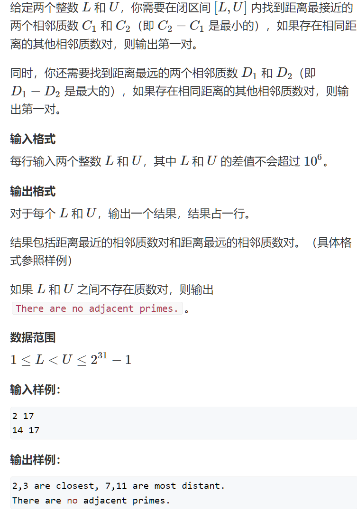

## 筛质数

#### 质数距离

##### 问题描述



##### 代码实现

```c++
#include<iostream>
#include<cstring>
#include<algorithm>
using namespace std;
const int N = 1e6 +10;
typedef long long LL;
int primes[N], cnt;
bool visit[N];
void init(int n)
{
    memset(visit, false, sizeof(visit));
    cnt = 0;
    for(int i = 2; i <= n; i++)
    {
        if(!visit[i]) primes[cnt++] = i;
        for(int j = 0; primes[j] * i <= n; j++)
        {
            visit[i * primes[j]] = true;
            if(i % primes[j] == 0) break;
        }
    }
}
int main(void)
{
    while(cin >> l >> r)
    {
        init(50000);
        memest(visit, false, sizeof(visit));
        for(int i = 0; i < cnt; i++)
        {
            LL p = primes[i];
            for(LL j = max(p * 2, (l + p - 1) / p * p); j <= r;j += p) 
                visit[j-1] = true;
        }
        cnt = 0;
        for(int i = 0; i <= r - 1 ;i++)
            if(!visit[i] && i + l >= 2)
                primes[cnt++] = i + l;
        if(cnt < 2) puts("There are no adjacent primes.");
        else 
        {
            int minp = 0, maxp = 0;
            for(int i = 0; i + 1 < cnt ; i++)
            {
                int d = primes[i + 1] - primes[i];
                if(d < primes[minp + 1]- primes[minp]) minp = i;
                if(d > primes[maxp + 1]- primes[maxp]) maxp = i;
            }
            printf("%d, %d are closest, %d,%d are most distant.\n",primes[minp], primes[minp+1], primes[maxp], primes[maxp + 1]);
        }
    }
    return 0;
}
```

