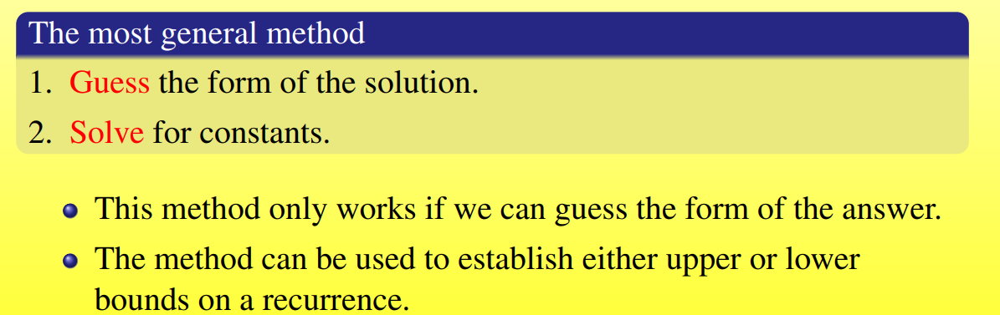

## Asymptotic Mark and Recursive Equation

### 1.1 渐进标记（Asymptotic Notation）

#### O-notation(upper bounds)

$$
We~write~f(n) = O(g(n))~if~there~exist~constants~c>0,n_0>0~\\
such~that~0 \leq f(n) \leq cg(n)~for~all~n > n_0
$$

- O(g(n))是一个f(n)的不严格上界
- 需要找到一个$c$和一个$n_0$

#### $\Omega-$notation(lower bounds)

$$
\Omega(g(n))=\{f(n):there ~exist ~constants~c>0,n_>0~such~that\\
0 \leq c\cdot g(n) \leq f(n)~ for ~all~n>n_0\}
$$

- $\Omega(g(n))$是一个不严格下界
- 同样需要找到一个c和一个$n_0$
- 例如：$\sqrt{n} = \Omega(lg~n)$

#### $\Theta$-notation(tight bounds)

$$
We~write~f(n)=\Theta(g(n)) ~if ~there ~exist~constants~c_1>0,c_2>0,n_0>0\\
such~that c_2g(n) \geq f(n) \geq c_1g(n) \geq 0~for~all~n>n_0
$$

$\Theta(g(n)) = O(g(n)) \cap \Omega(g(n))$

- 一个很好的界，把f(n)完全限制在了中间
- 需要$c_2,c_1$,n

#### Other Asymptotic Notations

#### A helpful Analogy

##### 传递性（Transitivity）

##### 自反性（Reflexivity）

##### Transpose Symmerty & Symmetry

##### Non-completeness

### 1.2 Standard Notations and Common Functions

#### Floors and Ceilings

斯特林近似公式

$n! = \sqrt{2\pi n}(\frac{n}{e})^n(1+\Theta(\frac{1}{n}))$

#### functional iteration

### 1.3 Recurrences

- substitution method: guess a bound and use mathemtical induction to prove the guess correct

- recursion-tree method: converts the recurrence into a tree and use techniques for bounding summations

- master method: provides bounds of the form

  $T(n) = a \cdot T(\frac{n}{b}) + f(n)$

#### 1.3.1 Substitution Method

example:

#### 1.3.2 Recursion-tree Method

A recursion-tree method can be unreliable.

The recursion tree method is good for genrating guesses for the substitution method.

example:

#### 1.3.3 The Master Method

##### three common cases

>In particular, for every constan $\epsilon > 0$ ，we have $n^{\epsilon} = \omega(lg n)$

注意：

- $a \geq 1, b > 1$

- 注意是否能比较

- a和b需要是常数

- 必须满足f(n)渐进为正

- 

  一个特殊的例子

- 

  

#### 主定理习题：

