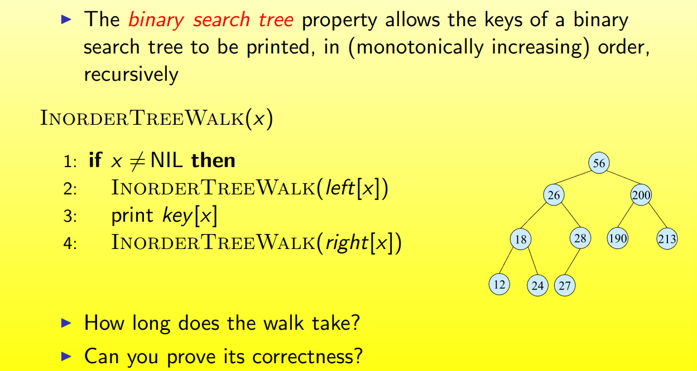

## BST and Red-Black Trees(二叉搜索树和红黑树)

### 1.0 Overview

#### Binary Trees


data structures can support **dynamic set operations**

- Search
- Minimum
- Maximum
- Predecessor
- Successor
- Insert
- Delete

### 1.1 Binary Search Trees

#### BST Representation


#### Binary Search Tree Property


#### Inorder Traversal



##### Correctness of Inorder-Walk


#### Preorder Traversal


#### Postorder Traversal


#### Querying a Binary Search Tree


#### Tree Search


#### Iterative Tree Search


```
IterativeTreeSearch(x, k)
while x != NIL and k != key[x] do
	if k < key[x] then
		x <- left[x]
	else
		x <- right[x]
return x
```

#### Finding Min & Max


#### Predecessor and Successor


#### Insertion and Deletion


##### BST insertion 

```
TreeInsert(T,z)
y <- NIL
x <- root[T]
while x != NIL do
	y <- x
	if key[z] < key[x] then
		x <- left[x]
	else
		x <- right[x]
p[z] <- y
if y = NIL then
	root[T] <- z
else if key[z] < key[y]
then
	left[y] <- z
else 
	right[y] <- z
```


##### Sorting using BSTs


##### BST Deletion


```
TreeDelete(T,z)
if left[z] = NIL or right[z] = NIL then
	y <- z
else
	y <- TreeSuccessor[z]
if left[y] != NIL then
	x <- left[y]
else 
	x <- right[y]
if x != NIL then
	p[x] <- p[y]
if p[y] = NIL then
	root[T] <- x
else if y <- left[p[i]] then
	left[p[y]] <- x
else
	right[p[y]] <- x
if y != z then
	key[z] <- key[y]
return y
```

##### Correctness of TreeDelete


### 1.2 Red-Black Trees

#### Overview


Red-Black Tree

- Binary search tree + 1 bit per node: the attribute color, which is either red or black
- All other attributes of BSTs are inherited: key, left, right, and p
- All empty trees(leaves) are colored black
  - We use a single sentinel, nil, for all the leaves of red-black tree T, with color[nil] = black
  - The root's parent is also nil[T]


#### Red-Black Properties


##### Height of a Red-Black Tree


可以得到一个结论:

>$h \leq 2lg(n+1)$

##### RB Trees: Worst-Case Time


#### Rotation


#### Insertion


Case1:


Case2:


Case3:


#### Delete

##### Ordinary BST Delete


##### Bottom-up Deletion


Case1:


Case2:


Case3:


Case4:


### 1.3 Augmenting Data Structures

#### Overview


#### Dynamic Order Statistics


