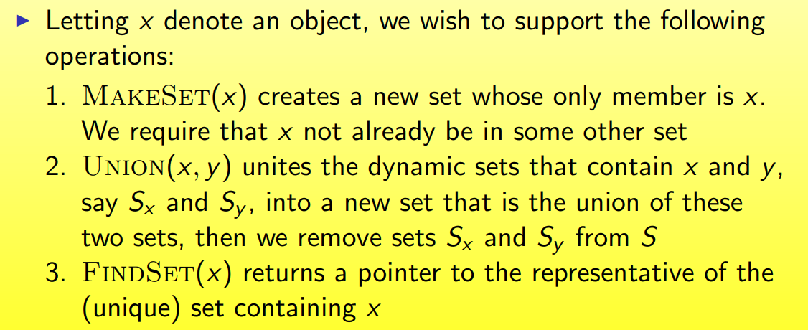
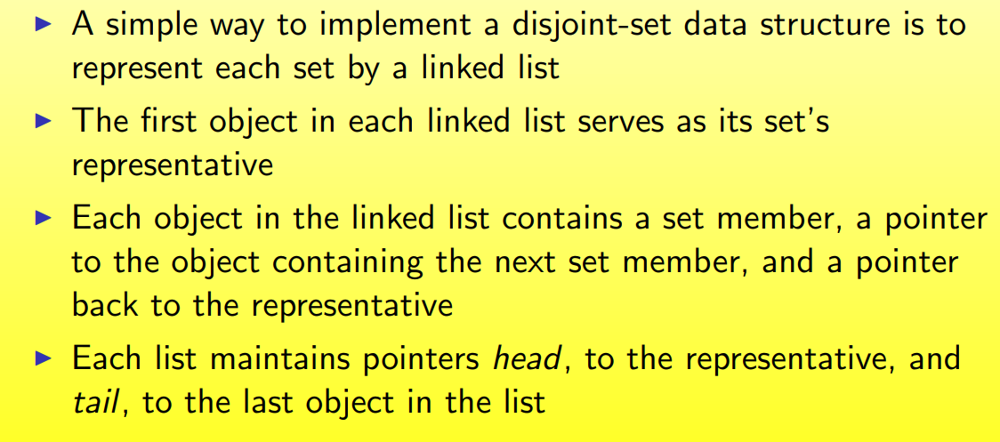
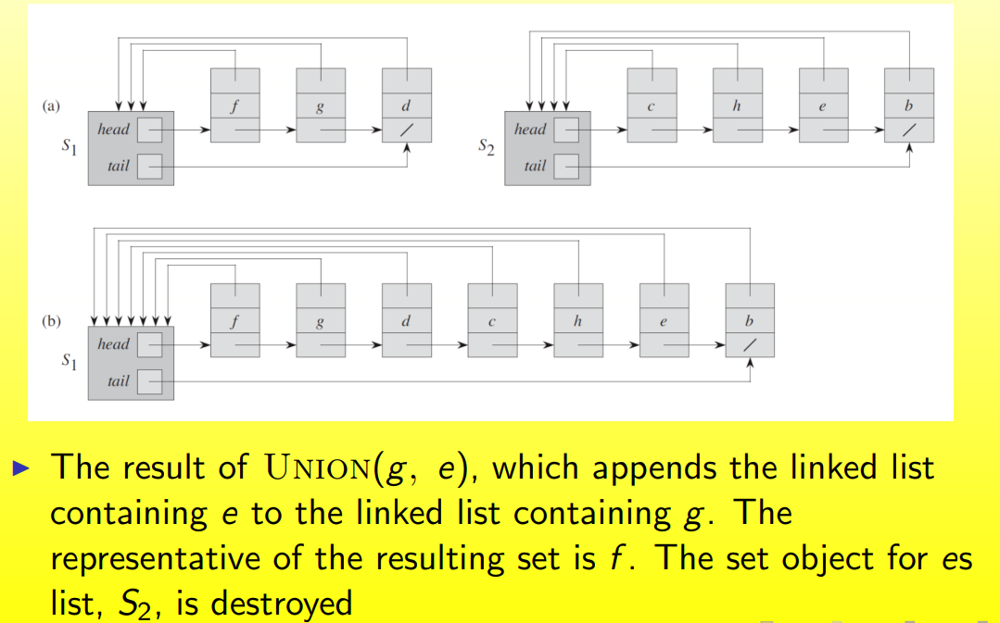

## 二项堆与斐波那契堆（Binomial Heaps and Fibonacci Heaps）

### 1.0 Overview

Mergeable Heap（可归并堆）

支持以下操作

- Make-heap（）：create and return a new heap containing no elements
- Insert()：Insert element x
- Minimum(H)：Return min element
- Extract-min（H）：Return and delete minimum element
- Union(H1,H2)：Create and return a new heap minimum element contains all the elements of heaps H1 and H2

一些其他操作

- 删除一个元素
- 将一个元素x降低为k

一些常见的堆的这些函数的渐进复杂度如下

### 1.1 Binomial Heaps

二项堆是二项树的集合，先对二项树进行介绍

#### Binomial Tree（二项树）

可以看出来，$B_0$有1个结点，$B_1$有两个结点，$B_2$有两个$B_1$构成，因此是4个结点...

对二项树$B_k$来说

- 结点总数是$2^k$
- 树的高度是k
- 根节点的度数（degree）是k，因为根节点连着从$B_0,B_1,...B_{k-1}$一共k棵树
- 删除根结点root可以得到$B_{k-1},...B_1,B_0$等k棵树
- 

#### Binomial Heap：Overview

二项堆是一个二项树的序列，满足

- 每一棵树都是一个最小堆序
- 对于$B_k$只能有一棵或者没有

#### 实现方式（Implementation）

#### 二项堆的性质（Properties）

#### Union

##### Analysis of Union

#### Delete Min

#### Decrease Key

#### Delete

#### Insert

>二项堆最重要的两个操作就是delete-min和union
>
>insert就是建堆+union，delete就是将xdecrease到$-\infty$，而后delete-min

### 1.2 Fibonacci Heaps

#### Structure

#### Implementation

>每个结点有一个指向父节点和其中一个孩子节点的指针，然后该层是一个循环链表

#### Potential Function

##### Insert

##### Union

##### Delete Min

##### Delete Min Analysis

#### Decrease Key

##### Decrease Key Analysis

#### Delete

#### Bounding Max Degree

### 1.3 Data Structures for Disjoint Sets

#### Overview

#### Operations

##### Running time analysis

#### Link-List Representation

##### Example

##### Running time analysis

