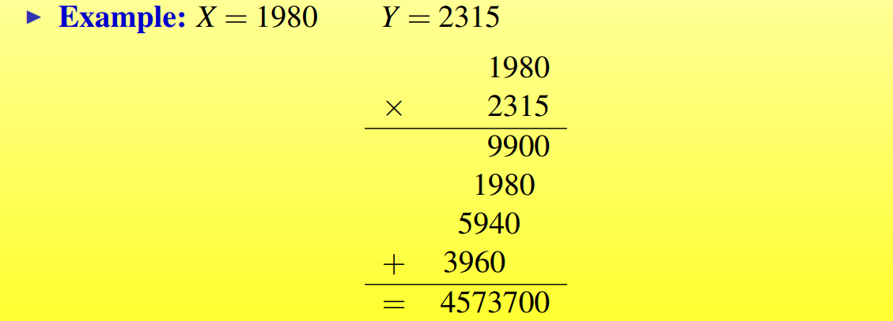

## Divide and Conquer

### Overview

#### Basic information

Divide and conquer approach divides a problem into smaller ones which can be solved independently, and finally the solutions of smaller problems are combined into a solution for the large problem

- Divide

  Divide the problem into a number of sub-problems that are **smaller instances** of the same problem

- Conquer

  Conquer the sub-problems by solving them **recursively**. If they are **small enough**, solve the sub-problems as **base cases**

- Combine

  Combine the solutions to the sub-problems into the solution for the original problem

#### 优点（Pros）

可以并行处理子问题，因此可以支持多处理机系统或者让不同的机器同时工作（分布式系统）

#### 缺点（Cons）

大部分分治算法用到了递归，内存开销很严重，

### Large Number Mulitiplication

#### Problem Description（问题描述）

Input：two  n-bits integers X and Y

Output：product of X and Y

两数相乘的朴素算法时间复杂度为$O(n^2)$的

#### Solution

一种分治的策略如下

将X 拆分成等长的高位a和低位b，Y拆分成等长的高位c和低位d

$X = a \cdot 2^{n/2} + b$

$Y = c \cdot 2^{n/2} + d$

$XY = ac \cdot 2^n + (ad+bc)\cdot2^{n/2} + bd$

但是这种算法依然需要4次$n/2$规模的乘法，因此时间复杂度的递推公式为

$T(n) = 4 T(n/2) + O(n)~n>1$

$T(n) = O(1)~n = 1$

由主定理可以计算，时间复杂仍然为$T(n) = O(n^2)$

因此如果想要降低时间复杂度，需要减少乘法运算的次数，两种可行的变形如下

这样的时间复杂度递推公式为

$T(n) = 3T(n/2) + O(n)~n>1$

由主定理计算得$T(n) = O(n^{log3}) = O(n^{1.59})$

- 前一种（a-b）（c-d）要优于后一种，因为减法不会引起进位

因此，通过分治的思想，我们得到一种较好的分治算法为

$XY = ac \cdot 2^n + ((a-b)(c-d)-ac-bd) \cdot 2^{n/2} + bd$

时间复杂度为$T(n) = O(n^{log3})$

>通过快速傅里叶变换（FFT），large integer multiplication 可以在$O(n log n)$的时间内解决
>
>同时，如果将大整数分成更多的片段，然后用更复杂的方式结合，可以得到一个时间复杂比$O(n^{log3})$好的算法

### Strassen's Algorithm for Matrix Multiplication

#### Problem Description

考虑两个矩阵A和B ，计算$C = A \times B$

常规做法是

$A = (a_{ij}), B = (b_{ij})$都是$n \times n$的矩阵，$C = A \cdot B$，

$c_{ij} = \sum_{k=1}^n a_{ik}\cdot b_{kj}$

时间复杂度是$O(n^3)$的

#### Solution

##### Simple Divide and Conquer

对于常规的分治，将一个$n \times n$的矩阵分成4个$ n/2 \times n/2$的矩阵

还是需要8次矩阵乘法

递推式为

$T(n) = 8 T(n/2) + O(n^2)$

由主定理得到的时间复杂度是 $O(n^3)$的

##### Strassens Matrix Multiplication

Strassen算法的思想是将小矩阵乘法的次数降低到7，这样递推式得到的时间复杂度就是一个小于$O(n^3)$的结果

因此采取了下列做法

递推式为$T(n) = 7 T(n/2) + O(n^2)$

得到的$T(n) = O(n^{log7}) = O(n^{2.8074})$

>7 次乘法操作是$2\times 2$ 的分割方式的最少乘法次数，$3\times 3 $或者$5 \times 5$ 的矩阵可能获得更好的算法，目前该算法的一个界是 $O(n ^{2.376})$

### Defective Chessboard

#### Problem Description

Defective Chessboard Problem 是 用用以下4种图形能够在不冲突的情况下覆盖住整个棋盘

#### Solution
