# Dynamic Programming

### 动态规划的基本思想

#### 求解最优化问题

组合子问题的解来求解原问题，对每个子问题只求解一次，保存求解的结果，降低求解的重复次数

动态规划算法步骤

- 刻画一个最优解的结构特征
- 递归的定义最优解的值
- 计算最优解的值，通常采用自底向上的方法
- 利用计算出的信息构造一个最优解

### 钢条切割问题（Rod cutting）

#### 问题描述

购买长钢条，切割为短钢条出售，切割本身没有成本支出，对不同长度的钢条价格不同，求解一个最优切割方案（总价值最大）

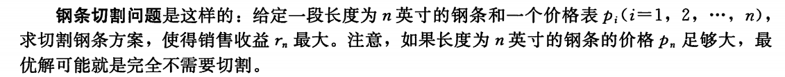

#### 暴力做法

长度为n的钢条有$2^{n-1}$种切割方法，

- 在距离钢条左端i的位置可以选择是否切割

遍历所有的方案找到最大的方案是一个 $O(2^n)$指数时间的算法

#### DP做法

将钢条从左边切割下长度为i的一段，对右边剩下的长度为 `n - i`的一段继续切割，找到一个长度为 `n - i`的最优切割方案

尤其得出一个状态转移方程

$r_n = max_{1 \leq i \leq n} (p_i + r_{n-i})$

- $r_n$为长度为n的钢条的最优切割方案，这个状态依赖于前面$r_1\rightarrow r_{n-1}$的所有状态
- 可以对长度n做第一轮循环，然后每轮循环根据状态转移方程找到一个最大值即可

#### DP 伪代码

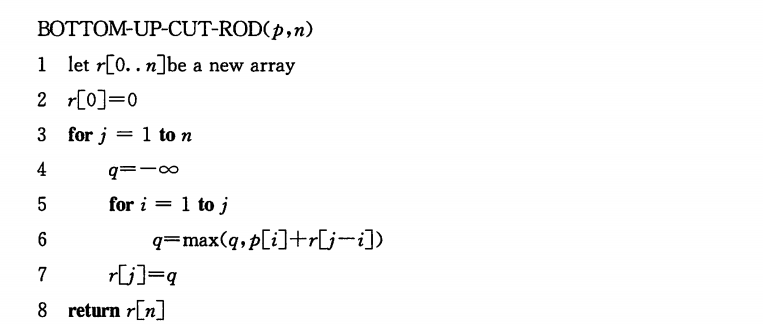

#### 保留方案的做法

使用一个数组s[n]，存储每一次$p_i$的i，表示切掉从最左端开始的长度为i的一段，然后再迭代的去索引后面一段的切割方案，就可以得到具体的切割方案

对于实现时，只需要在更新最值的时候更新s数组即可

#### C++实现

```c++
#include <iostream>
#include <algorithm>
using namespace std;
const int N = 1e5;
int p[N];  // 长度为i的钢条价格
int dp[N]; // 状态数组，表示长度为n的最佳方案的值
int s[N];  // 保留长度为n的钢条第一段的长度值
int n;     // 钢条长度
int main(void)
{
    // input
    cin >> n;
    for (int i = 1; i <= n; i++)
    {
        cin >> p[i];
    }
    dp[0] = 0; // 初始化
    // dp
    for (int i = 1; i <= n; i++)
    {
        int max_value = -1;
        for (int j = 1; j <= i; j++)
        {
            if (p[j] + dp[i - j] > max_value)
            {
                max_value = p[j] + dp[i - j];
                s[i] = j;
            }
        }
        dp[i] = max_value;
    }
    for (int i = 1; i <= n; i++)
    {
        cout << dp[i] << endl;
        int temp = i;
        while (temp > 0)
        {
            cout << s[temp] << " ";
            temp -= s[temp];
        }
        cout << endl;
    }
    return 0;
}
```

### 矩阵链乘法（ Matrix-chain Multiplication ）

#### 问题描述

给定一个n个矩阵$<A_1,A_2, ...,A_n>$，我们计算它们的乘积

$A_1 A_2A_3...A_n$

加括号的方式会严重影响矩阵链乘法的效率

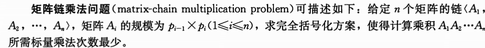

并不是真正进行矩阵相乘运算，只是确定代价最低的计算顺序。确定最优计算顺序所花费的时间通常要比随后真正进行矩阵相乘所节省的时间要少

#### 暴力做法

令 $P(n)$表示可供选择的括号化方案的数量

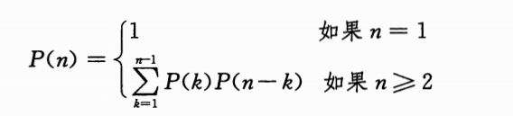

这个递归策略的括号化方案的数量与n呈指数关系

通过暴力搜索穷尽所有可能的括号化方案来寻找最优方案是一个糟糕的策略

#### DP做法

对n个矩阵 $A_i$，每个矩阵的规模为 $p_{i-1} \times p_i$，这个列表的长度为 $n+1$

用一个辅助表$m[n][n]$, $m[i][j]$表示计算矩阵$A_i \times A_{i+1}\times ...\times A_j$的最小代价，当然，$m[i][i] = 0$

另一个辅助表 $s[n][n]$, $s[i][j]$表示最优值$m[i][j]$的分割点k

状态转移方程为

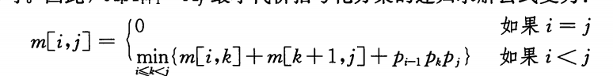

#### DP 伪代码

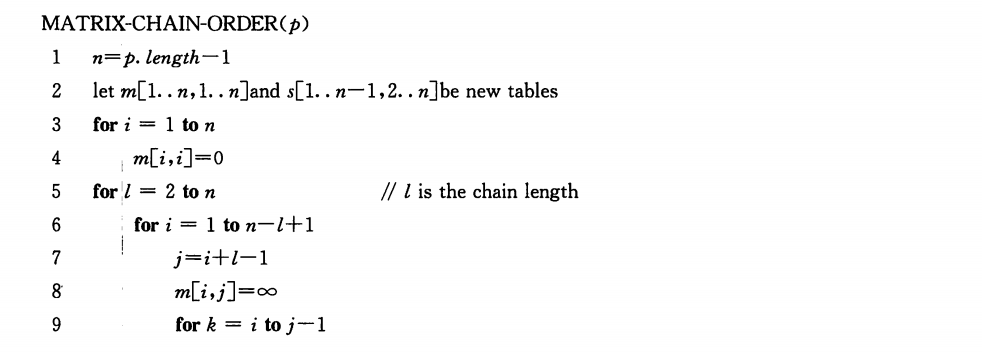

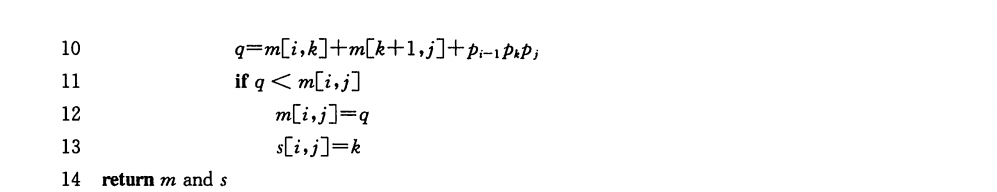

#### 保留方案的做法

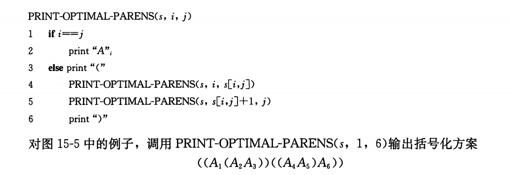

#### C++实现

```c++
#include <iostream>
#include <algorithm>
using namespace std;
const int N = 1e3;
const int INF = 0x3f3f3f3f;
int dp[N][N];
int s[N][N];
int p[N];
int n;
void print(int i, int j)
{
    if (i == j)
        cout << "A" << i << " ";
    else
    {
        cout << "("
            << " ";
        print(i, s[i][j]);
        print(s[i][j] + 1, j);
        cout << ")"
            << " ";
    }
}
int main(void)
{
    // 矩阵个数
    cin >> n;
    // 矩阵长度
    for (int i = 0; i <= n; i++)
    {
        cin >> p[i];
    }
    for (int i = 1; i <= n; i++)
    {
        for (int j = 1; j <= n; j++)
            dp[i][j] = INF;
    }
    for (int i = 1; i <= n; i++)
    {
        dp[i][i] = 0; // m[i][i] = 0;
    }
    for (int len = 2; len <= n; len++)
    {
        for (int i = 1; i <= n - len + 1; i++)
        {
            int j = i + len - 1;
            for (int k = i; k < j; k++)
            {
                if (dp[i][k] + dp[k + 1][j] + p[i - 1] * p[k] * p[j] < dp[i][j])
                {
                    dp[i][j] = dp[i][k] + dp[k + 1][j] + p[i - 1] * p[k] * p[j];
                    s[i][j] = k;
                }
            }
        }
    }
    for (int i = 1; i <= n; i++)
    {
        cout << dp[1][i] << endl;
        print(1, i);
        cout << endl;
    }
    return 0;
}

```

### 最长公共子序列 LCS problem

#### 问题描述

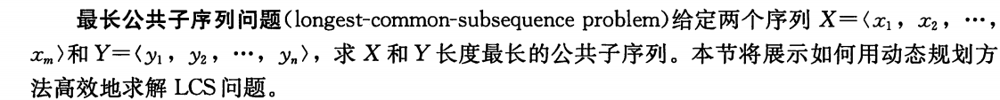

#### 暴力做法

穷举X的所有子序列，对于每个子序列检查它是否也是Y的子序列，记录找到的最长子序列

X一共有 $2^n$个子序列，因此算法的时间为指数阶

#### DP做法

LCS 的最优子结构

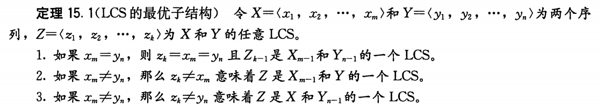

状态转移方程如下

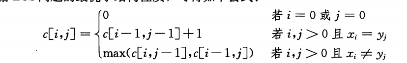

#### DP伪代码

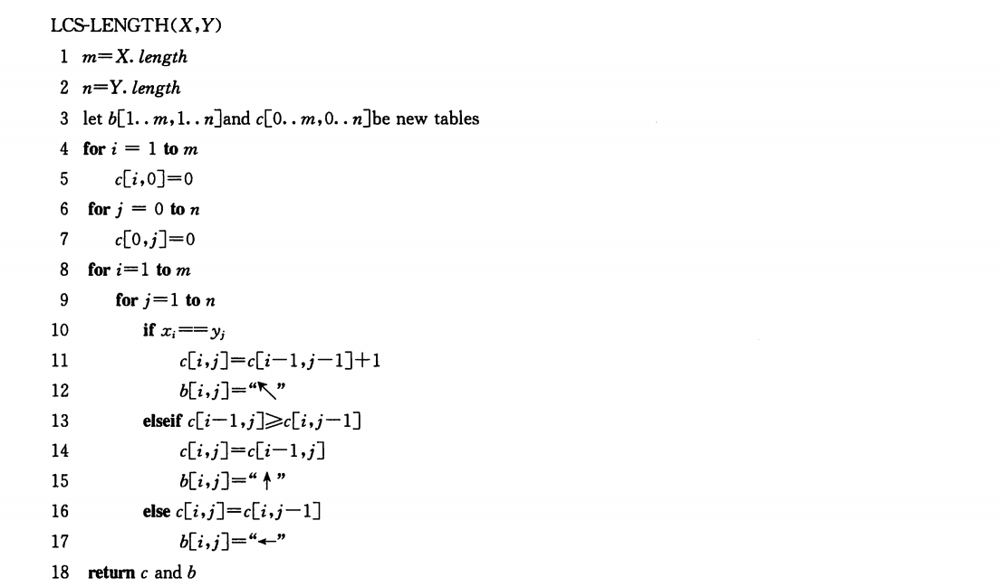

#### 保留方案的做法

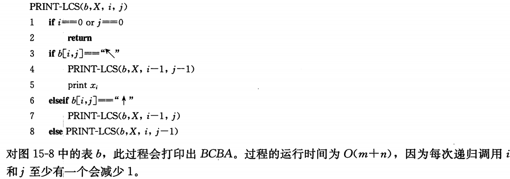

#### C++ 实现

```c++
#include <iostream>
#include <algorithm>
using namespace std;
const int N = 1e3;
char x[N], y[N];
int dp[N][N];
int s[N][N];
int n, m;
void print(int i, int j)
{
    if (i == 0 || j == 0)
        return;
    if (s[i][j] == 1)
    {
        print(i - 1, j - 1);
        cout << x[i];
    }
    else if (s[i][j] == 2)
    {
        print(i - 1, j);
    }
    else
        print(i, j - 1);
    return;
}
int main(void)
{
    cin >> n >> m;
    cin >> x + 1;
    cin >> y + 1;
    for (int i = 1; i <= n; i++)
    {
        for (int j = 1; j <= m; j++)
        {
            if (x[i] == y[j])
            {
                dp[i][j] = dp[i - 1][j - 1] + 1;
                s[i][j] = 1;
            }
            else if (dp[i - 1][j] >= dp[i][j - 1])
            {
                dp[i][j] = dp[i - 1][j];
                s[i][j] = 2;
            }
            else
            {
                dp[i][j] = dp[i][j - 1];
                s[i][j] = 3;
            }
        }
    }
    cout << dp[n][m] << endl;
    ;
    print(n, m);
    cout << endl;
    return 0;
}
```

### 最优二叉搜索树

#### 问题描述

