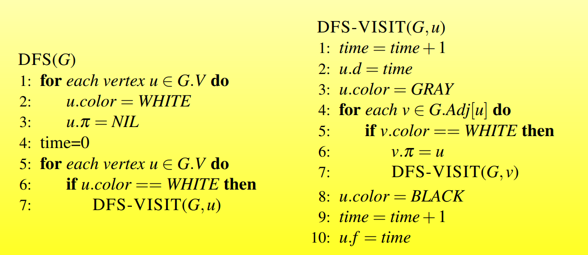
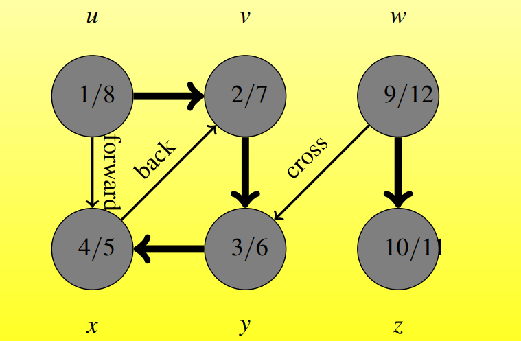
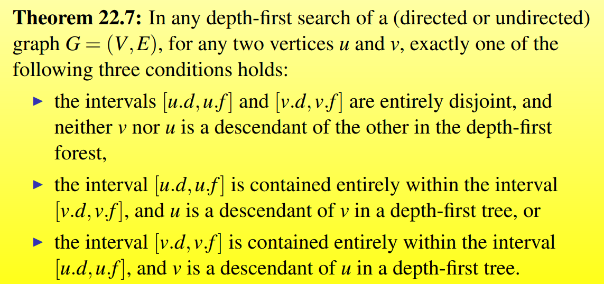
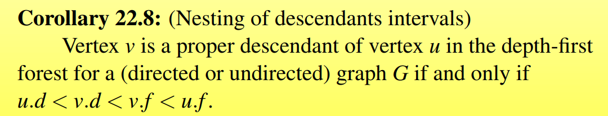
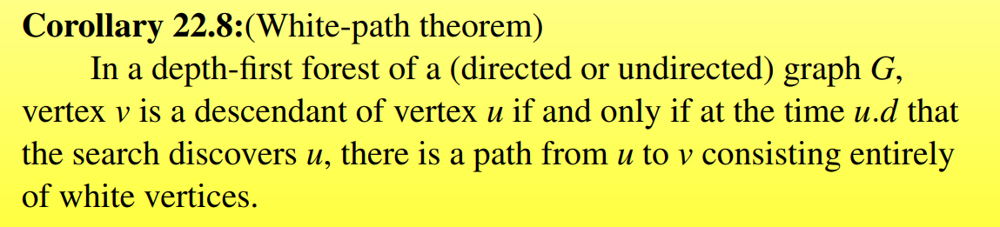

# Elementary Graph Algorithms

## Depth-first search

### basic information

#### 算法描述

每次尽量访问图中深度较高的地方

深度优先搜索对于当前访问的结点v，优先访问v的所有还没有被访问的边，然后以这条边的另一个顶点更新为当前结点，接着访问

直到访问到一个顶点，没有还没有被访问的边，然后回退到上一次访问的顶点，再按上述策略访问

直到所有可达的顶点都被访问过一遍。

如果剩下有没被访问的结点，以这些结点为新的起始点进行深度优先搜索

直到所有顶点都被访问过，算法结束

>这是一种回溯的策略


DFS会生成一个深度优先森林（如果是连通图则是深度优先搜索树），每条遍历过的边是森林（树）中的一条边

#### 访问中的染色策略

- 每个顶点一开始都是白色
- 在搜索中被访问到，标记为灰色
- 所有边都被访问到，被标记为黑色，表示访问完毕

#### 时间戳（timestamps）

每个顶点会有两个时间戳

- 首次被访问（标记为灰色的时候）
- 所有临边被检查完毕（标记为黑色）

时间戳的范围是

$(1,2|V|)$

对每一个顶点v

- v.d表示第一个时间戳
- v.f表示第二个时间戳

>对每个结点u而言，u.d之前是白色，u.d到u.f之间是灰色，u.f之后是黑色

### DFS伪代码





### Implementation in C++

```c++
void dfs(int u)
{
    visit[u] = true;
    for(int i = h[u]; i != -1; i = ne[i])
    {
        j = e[i];
        if(!visit[j]) dfs(j);
    }
}
```


### Analysis

#### time complexitity

时间复杂度为$\Theta(V+E)$

#### Properties

##### theorem 22.7 

根据染色的时间戳可以确定任意两个结点在生成森林中的关系



##### corollary 22.8





#### classification of Edge

深度优先搜索可以将输入图$G = (V,E)$的边分成四类

- tree edges：图G中在深度优先搜索森林$G_{\pi}$中的边，边edge（u，v）是一条tree edge当且仅当v是通过边edge（u，v）首次访问v
- back edges（回边）：边（u，v）将顶点u连接回了它在深度优先搜索树中的祖宗节点
- forward edges（前向边）：不是树中的边从u指向后继v
- cross edges：所有其他的边都是cross edges，包括顶点在同一棵树中，但是边不在；跨越不同树之间的边

DFS算法运行结束，这些边的分类可以根据染色情况做判断

对于边$(u,v)$，以首次访问这条边时，顶点v的颜色分为

- v为白色说明这是一条 tree edge
- 灰色：back edge
- 黑色：forward or cross edge
  - 如果u.d < v.d ：forward edge
  - u.d > v.d ：cross edge

在无向图中，边的分类可能会有歧义，因为(u,v) 和(v,u)是同一条边，这时规定首次分类的类型作为这条边的类型

- forward and cross edge不会在DFS一个无向图中出现

##### theorem 22.10

在深度优先搜索一个无向图G的时候，每条G的边要么是tree edge要么是back edge


