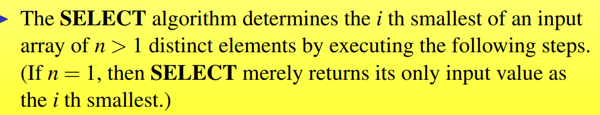

## Medians and Order Statistics

### 1.0 Selection Problem


选择一个序列中第i位的元素

### 1.1 Minimum and Maximum

#### Minimum

To determine the minimum a set of n elements, a lower bound of comparisons is n-1

```
MINIMUM(A)
min = A[1]
for i = 2 to A.length do
	if min > A[i] then
		min = A[i]
return min
```

#### Simultaneous Minimum and Maximum


$3 \lfloor n/2 \rfloor$ comparisons algorithm

```
MAX_MIN(A)
if A[1] > A[2] then min = A[2], max = A[1]
				else min = A[1], max = A[2]
for i = 2 to [n/2] do 
	if A[2i-1] > A[2i]
		then if A[2i] < min then min = A[2i]
			 if A[2i - 1] > max then max = A[2i-1]
	else if A[2i-1] < min then min = A[2i-1]
		if A[2i] > max then max = A[2i]
if n != 2[n/2] then if A[n] < min then min = A[n]
					if A[n] > max then max = A[n]
return (min, max)
	
```


### 1.2 Selection in Expected Linear Time

A divided-and-conquer algorithm for selection problem: RANDOMIZED-SELECT


```
Randomized-select(A,p,r,i)
if p == r then
	return A[p]
q = Randomized-partition(A, p, r)
k = q-p+1
if i == k then
	return A[q] // the pivot value is the answer
if i < k then
	return Randomized-select(A,p, q-1, i)
else 
	return Randomized-select(a,q + 1, r, i - k)
```


Analysis


### 1.3 Selection in Worst-case Linear Time

The algorithm SELECT finds the desired element by recursively partitioning the input array.




Analysis


