# Shortest-paths problem

## Single-source shortest-paths problem

### The Bellman-ford Algorithm

#### basic information

bellman-ford算法具有处理负权边的能力

- 但不具有处理负权环的能力

对于一个带权有向图 $G = (V,E)$，起点s（source），权值函数$w: E \rightarrow R$

Bellman-ford 可以判断从起点出发是否会到达一个负权环（如果有负权环说明算法失效，这是返回一个false）

如果没有负权环，则可以找到一条最短路径，并得到权值最小的结果

#### Bellman-ford 算法伪代码

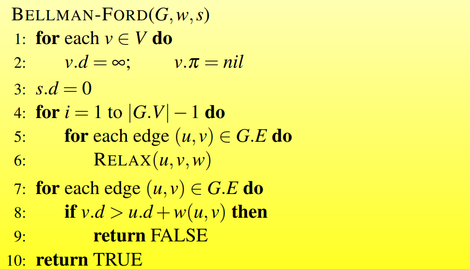

##### Relaxation on an edge(u, v)

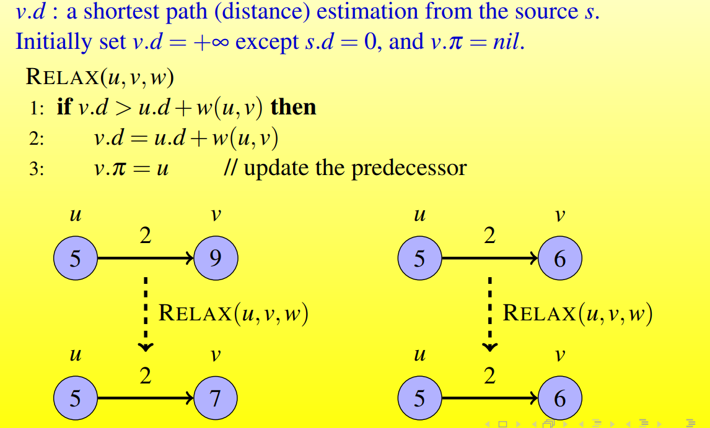

>更新从起点到v的距离，如果从起点到v的距离比 从起点先到w，再从w到v的距离长，那么可以更新路径和距离

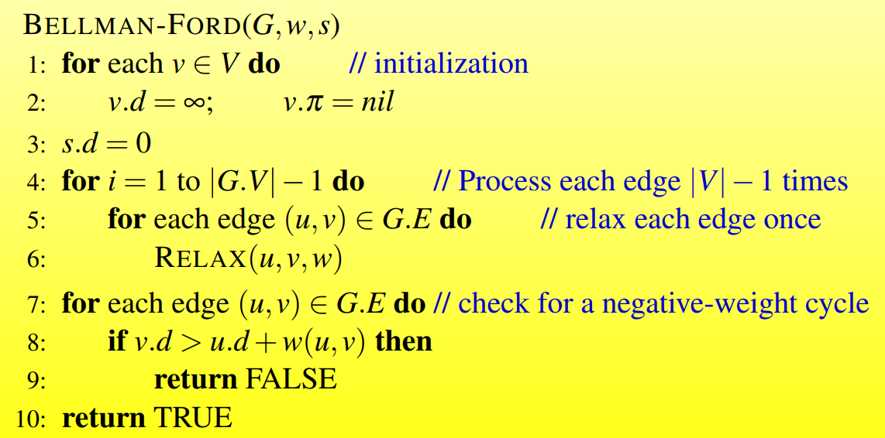


#### Analysis

Time Complexity = $O(VE)$

Bellman-ford算法是遍历所有的E边V轮，每次访问到一条边对这条边做一次松弛操作。

也就是一共会对每条边遍历V次

最后算法执行结束后，再遍历每条边一轮，如果这时还能更新起点到某个点的距离，说明存在负权环，Bellman-ford算法得不到一个正确的结果，返回false，如果没有更新，返回true

#### Implementation in C++

```c++
int n, m;	//n表示顶点个数,m表示边数
int dist[N];	// 距离数组，也即v数组
struct edge
{
    int a, b, w;
}edges[M];	//a->b 为一条边，权重为w
int bellman_ford()
{
    memset(dist, 0x3f, sizeof(dist));
    dist[1] = 0;
    for(int i = 0;i < n; i++)
    {
        for(int j = 0; j < m; j++)
        {
            int a = edges[j].a, b = edges[j].b, w = edges[j].w;
            if(dist[b] > dist[a] + w)
                dist[b] = dist[a] + w;
        }
    }
    // check for a negative-weight cycle
    if(dist[n] > 0x3f3f3f3f / 2) return -1;
    return dist[n];
}
```

### SPFA

#### basic information

队列优化的Bellman-ford算法

#### SPFA算法伪代码

此处不考虑负权环

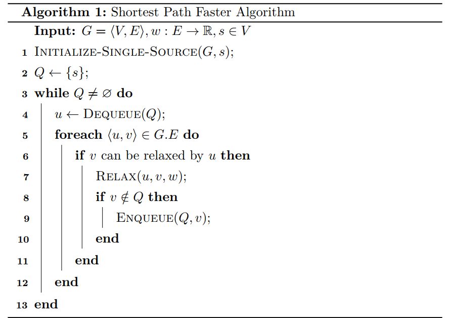

#### Analysis

时间复杂度：

- 平均情况下$O(M)$
- 最坏情况下$O(NM)$

#### SPFA求最短路C++实现

```c++
int n;
int h[N], e[N], e[N], ne[N], idx;
int dist[N];
bool visit[N];
int spfa()
{
    memset(dist, 0x3f, sizeof(dist));
    dist[1] = 0;
    queue<int> q;
    q.push(1);
    visit[1] = true;
    while(q.size())
    {
        auto t = q.front();
        q.pop();
        visit[t] = false;
        for(int i = h[t]; i != -1; i = ne[i])
        {
            int j = e[i];
            if(dist[j] > dist[t] + w[i])
            {
                dist[j] = dist[t] + w[i];
                if(!visit[j])
                {
                    q.push(j);
                    visit[j] = true;
                }
            }
        }
    }
    if(dist[n] == 0x3f3f3f3f) return -1;
    return dist[n];
}
```

### Dijsktra

#### basic information

对于没有负权边的图，dijkstra算法优于BF

#### Dijkstra算法伪代码

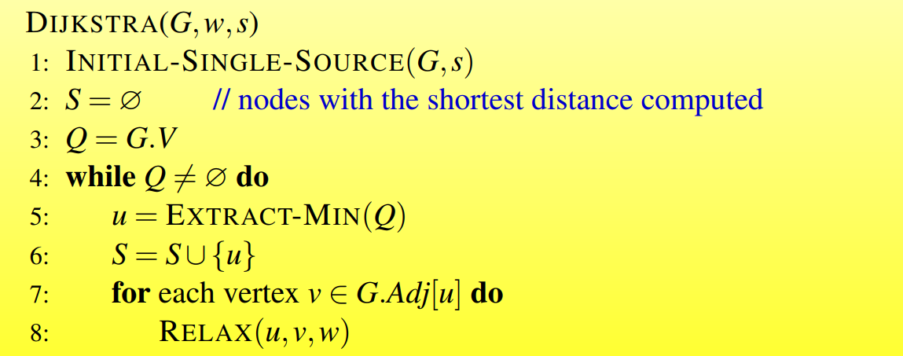

#### Analysis

##### Correstness of Dijkstra‘s algorithm

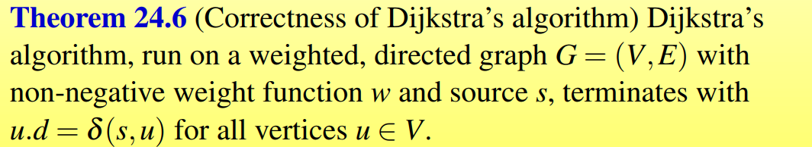

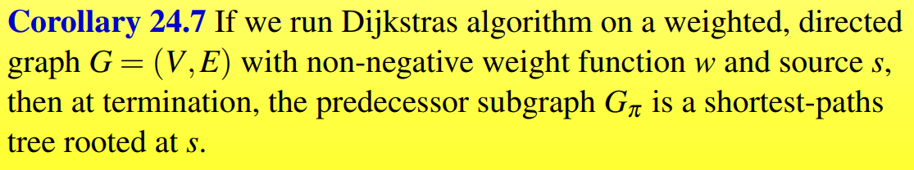

##### Time Complexity

$O(E+Vlog)$，优先队列和斐波那契堆优化

$O(E^2)$	朴素的Dijsktra

#### Implementation in C++

##### 朴素 Dijkstra

稠密度，邻接矩阵存储

```c++
#include<iostream>
#include<cstring>
#include<algorithm>
using namespace std;
const int N = 510;
int n, m;
int g[N][N];
int dist[N];
bool visit[N];
int dijkstra()
{
    memset(dist, 0x3f, sizeof(dist));
    dist[1] = 0;
    for(int i = 0; i < n -1; i++)
    {
        int t = -1;
        for(int j = 1; j <= n; j++)
        {
            if(!visit[j] && (t == -1 || dist[t] > dist[j]))
               	t = j;
        }
        visit[j] = true;
        for(int j = 1;j <= n; j++)
            dist[j] = min(dist[j], dist[t] + g[t][j]);
    }
    if(dist[n] == 0x3f3f3f3f) return -1;
    return dist[n];
}
int main(void)
{
    // initialize single source
    cin >> n >> m;
    memset(g, 0x3f, sizeof(g));
    while(m--)
    {
        int a, b, c;
        cin >> a >> b >> c;
        g[a][b] = min(g[a][b], c);	// 重边存一条
    }
    int t = dijkstra();
    cout << t << endl;
    return 0;
}
```

##### 堆优化的dijkstra

```c++
#include<iostream>
#include<cstring>
#include<algorithm>
#include<queue>
using namespace std;
typedef pair<int, int> PII;
const int N = 2e5 + 10;
int h[N], e[N], w[N], ne[N],idx;
bool visit[N];
int n, m;
int dist[N];
void add(int a, int b, int w)
{
    e[idx] = b, w[idx] = w, ne[idx] = h[a], h[a] = idx++;
}
int dijkstra()
{
    memset(dist, 0x3f ,sizeof(dist));
    dist[1] = 0;
    priority_queue<PII, vector<PII, greater<PII>> heap;
    heap.push({0, 1});
    while(heap.size())
    {
        auto t = heap.top();
        heap.pop();
        int vertice = t.second, distance = t.first;
        if(visit[vertice]) continue;
        for(int i = h[vertice]; i != -1 ; i = ne[i])
        {
            int j = e[i];
            if(dist[j] > distance + w[i])
            {
                dist[j] = distance + w[i];
                heap.push({dist[j], j});
            }
        }
    }
    if(dist[n] == 0x3f3f3f3f) return -1;
    return dist[n];
}
int main(void)
{
    cin >> n >> m;
    memset(h, -1, sizeof(h));
    while(m--)
    {
        int a, b, w;
        cin >> a >> b >> w;
        add(a, b, w);
    }
    cout << dijkstra() << endl;
    return 0;
}
```

## All-Pairs Shortest Paths

### The Floyd-Warshall algorithm

#### Basic information

是一个动态规划算法，可以处理负权边，但处理不了负权环

对i，j，k循环，dp[i]\[j][k]是一条从i到j的，只用到集合{1,2,...,k-1}个结点中的一条最短路径，如果k可以是i到j的一个中间结点，那么考虑是否更新

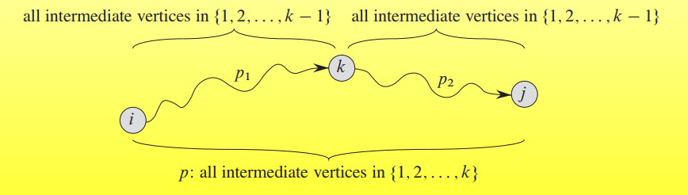

动态规划的状态转移方程为

$dp[i][j][k] = min(dp[i][k][k-1]+dp[k][j][k-1],dp[i][j][k-1])$

$dp[i][j][0] = w_{ij}$

#### 算法伪代码

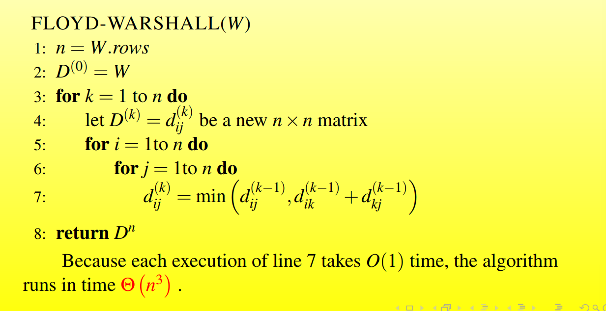

#### construct a shortest path

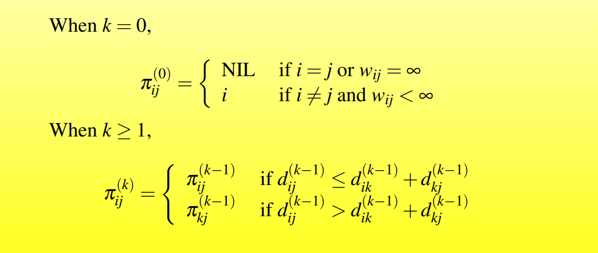

#### Transitive closure of a directed graph

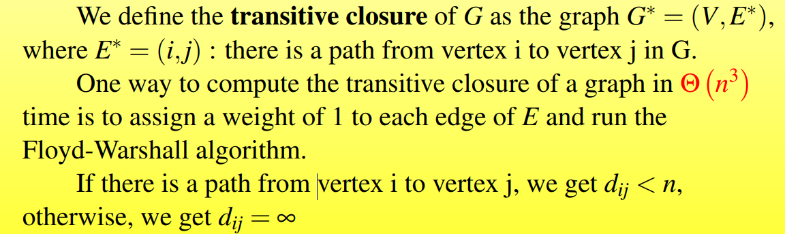

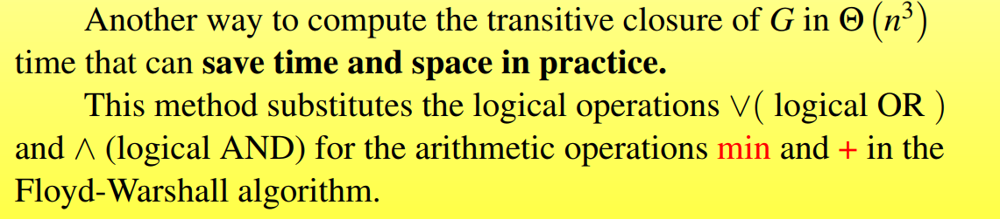

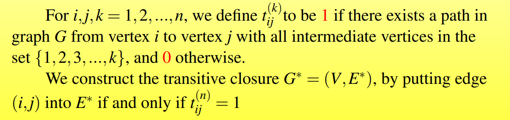

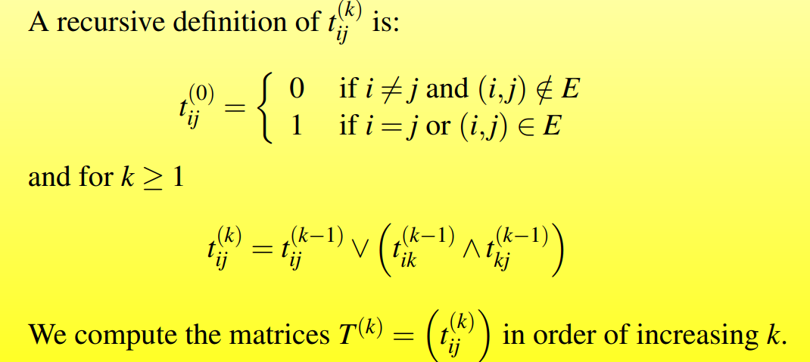

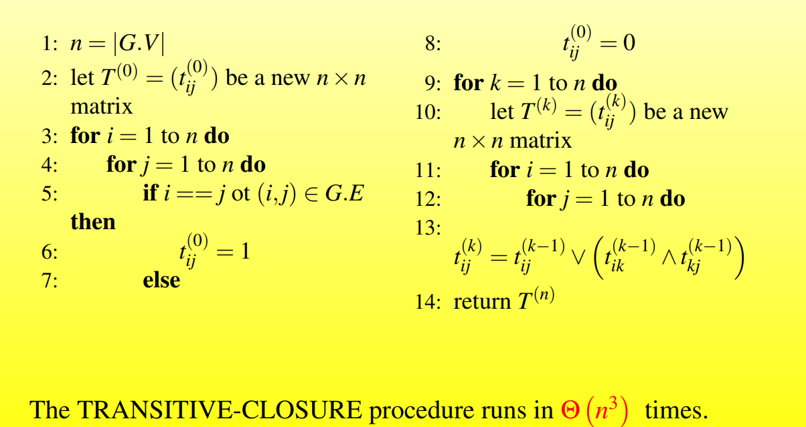
