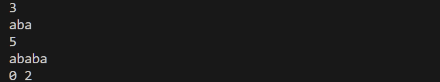
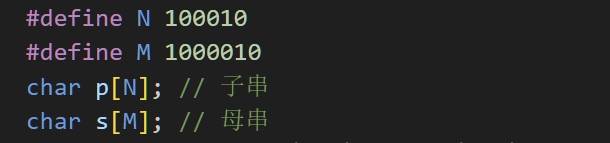
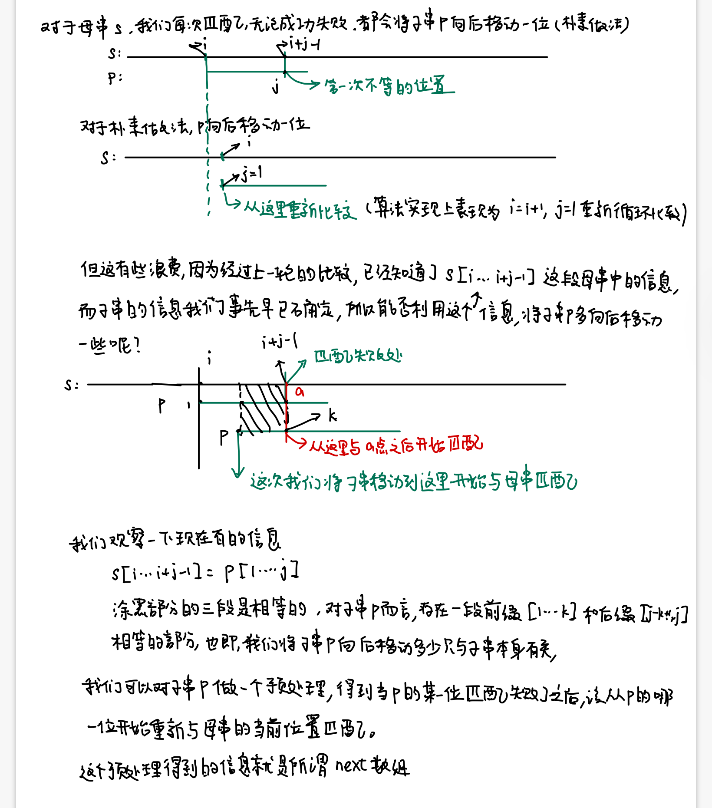
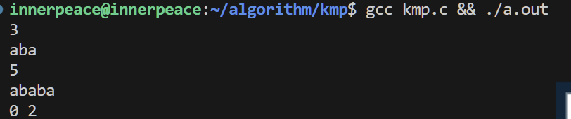

## 字符串匹配问题

### 问题描述

给定一个字符串S，和一个模式串P，所有字符串中只包含大小写字母以及阿拉伯数字

模式串P在字符串S中多次作为子串出现

求模式串P在字符串S中所有出现的位置的起始下标

#### 输入格式

第一行输入整数N，表示字符串P的长度

第二行输入字符串P（子串）

第三行输入整数M，表示字符串S的长度

第四行输入字符串S（母串）

#### 输出格式

共一行，输出所有出现位置的起始下标（下标从0开始计数），整数之间用空格隔开

#### 数据范围

$1 \leq N \leq 10^5$

$1 \leq M \leq 10^6$

#### 样例

输入样例

````
3
aba
5
ababa
````

输出样例

```
0 2
```

### 暴力做法（朴素）

对于母串的每一个位置，都用子串从头开始匹配，如果子串没有遍历到头的情况下遇到字符不等的情况，说明匹配失败，再从母串的下一个位置开始匹配

代码实现如下

```c
#include <stdio.h>
const int N = 1e5 + 10;
const int M = 1e6 + 10;
char p[N]; // 子串
char s[M]; // 母串
int n, m;  // n是子串长度，m是母串长度
int main(void)
{
    // input
    scanf("%d", &n);
    scanf("%s", p + 1); // p + 1表示字符串从p[1]开始，不使用0, 便于处理一些边界问题
    scanf("%d", &m);
    scanf("%s", s + 1);
    // 匹配
    // 对母串的每个位置
    for (int i = 1; i <= m; i++)
    {
        int flag = 1; // 表示匹配是否成功
        for (int j = 1; j <= n; j++)
        {
            if (s[i + j - 1] != p[j])
            {
                flag = 0;
                break;
            }
        }
        // flag = 1说明母串中从i开始的位置有一个子串
        if (flag)
        {
            printf("%d ", i - 1); // 题目要求下标从0开始，所以i - 1就是子串在母串的起始位置
        }
    }
    puts("");
    return 0;
}
```

样例运行结果如下



>理论上来讲在C语言这么写会报错，因为C语言不会认为const int 是一个常量，只是一个只读类型的变量，不能作为一个数组的长度或者初值，C++这样写是可以的。
>
>如果报错可以把const int N,M修改成相应的宏定义就可以了
>
>

#### 分析

最坏情况下，我们需要比较 m *n 次，也就是说，算法运行的时间复杂度是 $O(nm)$的

- n是子串长度
- m是模版串长度

想象一下我们要在10亿数据量级的dna碱基对序列中找某个特定的dna片段，如果这个片段是$10^5$级别的，那么我们需要$10^{14}$这个量级的比较次数，这对时间是一种较大的浪费。

因此，我们需要对朴素的匹配算法做一个优化

### kmp算法



#### next数组的含义

next[i] = j表示

对于子串p从起点1到某一个点i这一段中

最多有一个长度为j的后缀和这一段的前缀相等

.PNG)

对子串p的每一个位置i，都需要预处理一个next[i]这样的结果，便于后续在于母串匹配的时候使用

有了next数组之后，当我们开始匹配，母串的第i-1个位置和子串第j个位置匹配成功，但是母串第i个位置和子串p的第j+1个位置匹配不成功的时候，我们就需要重新调整子串p的位置j = next[j]，让母串第i个位置与子串第next[j]个位置开始比较

>因为这时子串p[1~next[j]] = p [j - next[j] + 1, j] = s[i-next[j], i-1],子串从1到next[j]-1已经和对应母串的位置匹配上了，只需要往后比较就可以了
>
>这里最好有个动图，但是我不会做（）

如果匹配成功接下来再比较母串的i+1和子串p的next[j] + 1，然后依次往后匹配直到成功或者失败

如果后续又出现了一次匹配失败，比如此时子串p第j‘个位置和母串i'匹配不成功，那就令 j‘ = next[j']，再用next[j']和母串i'的位置去匹配。

我们可以发现，在这个过程中，我们始终没有回退母串i这个指针，只是当某次失败的时候，将子串向前移动，使新的j和i进行匹配，这样就减少了很多匹配的次数，从而加快了算法。

#### 算法实现

重点是两部分

- 第一部分是怎么预处理子串p，从而求出每个位置的next数组
- 第二部分是，如何利用next数组加快匹配

```c
#include <stdio.h>
#define N 100010
#define M 1000010
int next[N];     // next数组
char p[N], s[M]; // p是子串字符串数组，s是模版串字符数组
int n, m;        // n 是子串的长度,m 是模版串的长度
int main(void)
{
    // 输入子串长度和输入子串,数组下标用p[1]开始，不用p[0]
    scanf("%d%s", &n, p + 1);
    // 输入模版串长度和输入模版串，数组下标用s[1]开始，不用s[0]
    scanf("%d%s", &m, s + 1);
    // 求next数组，求next数组的逻辑和匹配的逻辑比较像，当前p[i] != p[j+1]的时候，说明需要将j回退到next[j]的位置
    next[1] = 0; // p[1] = p[1]，没啥可退的
    for (int i = 2, j = 0; i <= n; i++)
    {
        // 找到一个可以匹配成功的位置，或者一直没找到，重新开始从头开始匹配
        while (j && p[i] != p[j + 1])
            j = next[j];
        // 最终找到了一个合适位置j+1与第i个字符匹配成功
        if (p[i] == p[j + 1])
            j++;
        next[i] = j;
    }
    //  利用next数组进行匹配
    for (int i = 1, j = 0; i <= m; i++)
    {
        while (j && s[i] != p[j + 1])
            j = next[j];
        if (s[i] == p[j + 1])
            j++;
        // j = n说明子串遍历到头了，整体匹配成功，输出子串在母串中的起始位置
        if (j == n)
        {
            printf("%d ", i - n); // 母串中对应的起始位置是i - n，因为这里是s[i-n...i]与子串p[1...n]匹配成功了
            j = next[j];          // 下一次重新从next[j]的位置与母串匹配
        }
    }
    puts("");
    return 0;
}
```

测试结果

