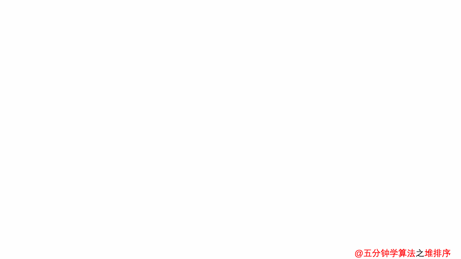

## 排序问题（Probleming of Sorting)

### 1.0 问题描述

- input：n个数的一个序列:$<a_1,a_2,...,a_{n-1},a_n>$

- output：n个数的一个排列$<a_1^`,a_2^`,...,a_{n-1}^`,a_n^`>$

  这个排列是有序的

  - 升序：$a_1^` \leq a_2^` \leq ... \leq a_{n-1}^` \leq a_n^`$
  - 降序： $a_1^` \geq a_2^` \geq ... \geq a_{n-1}^` \geq a_n^`$

  如果这里改成严格的>和<，那么就是严格有序的


#### 1.0.1 排序的一些基本概念

##### 排序算法的稳定性（Stability）

拥有相同关键字值的元素在排序的过程中相对位次不会发生改变

>比如 2 2* 1这样的一个序列，如果排序后变成了 1 2 2 *,那么就可以说这个排序算法是不稳定的，因为2和 2\*虽然有着相同的数值，但是相对顺序改变了

##### 时间复杂度（Time Complexity）

由数据被比较的次数和数据移动的次数决定排序算法的时间复杂度

比如一组n个数据的排序，在排序的过程中有$n^2$次数据的比较，那么我们认为它的时间复杂的度是 $O(n^2)$的

##### 就地排序（Inplace sorting）

只有常数个元素被存储在输入数组之外的排序是in-place的

比如归并排序需要一个额外n空间的数组作为输入，所以归并排序不是in-place的

#### 1.0.2 排序的分类

##### 比较排序（comparison sorts）

这类排序的原理根本上是通过比较两个数的大小来确定相对位次的，所以统称为比较排序

有$O(n^2)$的，也有$O(nlgn)$的

###### Simple sorting algorithms

简单排序算法，通常这类排序的时间复杂度是$O(n^2)$的，比较慢，但是实现比较简单

有

- 插入排序（insertion sort）
- 选择排序（selection sort）
- 冒泡排序（Bubble sort）

###### Efficient Sorting Algorithms

相对有效的排序算法，通常这类排序的平均时间复杂度是$O(nlgn)$的

有

- 归并排序（mergesort）
- 快速排序（quicksort）
- 堆排序（heapsort）
- 希尔排序（shellsort）

##### Linear Time sort

线性时间复杂度的排序，$O(n)$的，但是对输入数据有要求，必须是某一类的输入数据

有

- 计数排序（Counting sort）
- 基数排序（Radix sort）
- 桶排序（Bucket sort）

### 1.1 简单排序算法

#### 1.1.1 插入排序（insertion sort）

##### 原理

维护两个序列$L_1,L_2$，一个是已经有序的$L_1$，一个是待排序的$L_2$

不断的从待排序的序列$L_2$中取元素x插入到有序序列$L_1$的一个合适位置

重复这个插入的过程，直到所有的数都在有序序列$L_1$中

演示动画如下（所有的动画都来自白嫖）


##### 实现代码

###### 直接插入排序

还有许多别的实现方式，这种可能比较直观？

```c
#include <stdio.h>
/*
input arugments:
    unsorted array a[]
    length of array a: n
function:
    after sorting, the array a is in ascending order
*/
void insertion_sort(int a[], int n)
{
    // unsorted part from 1 to n, as the first value 0 is already sorted
    for (int i = 1; i < n; i++)
    {
        // sorted part, find a place to insert x
        int x = a[i];
        for (int j = i - 1; j >= 0; j--)
        {
            // find the right place
            if (x > a[j])
            {
                a[j + 1] = x;
                break;
            }
            // not the right place, and now x < current value, just move the a[j] to higher place
            else
            {
                a[j + 1] = a[j];
            }
            // if x is smaller than all the values , put it in the first place
            if (j == 0)
            {
                a[j] = x;
            }
        }
    }
}
int main(void)
{
    // test the insertion sort;
    int a[] = {23, 534, 2354, 653, 76, 24, 5623, 7, 42, 3};
    int size = sizeof(a) / sizeof(a[0]);
    insertion_sort(a, size);
    for (int i = 0; i < size; i++)
        printf("%d ", a[i]);
    puts("");
    return 0;
}
```

###### 折半插入排序（Binary insertionn sort）

对插入排序的一种优化，主要是查找插入元素的位置时，可以用二分查找降低时间复杂度

```c
#include <stdio.h>
/*
input arugments:
    unsorted array a[]
    length of array a: n
function:
    after sorting, the array a is in ascending order
*/
void binary_insertion_sort(int a[], int n)
{
    int l, r, mid;
    for (int i = 1; i < n; i++)
    {
        // 用二分查找在区间[0, i-1]找到一个合适的位置插入x
        int x = a[i]; // 待插入元素
        l = 0;
        r = i - 1;
        while (l <= r)
        {
            mid = l + r >> 1;
            if (x < a[mid])
            {
                r = mid - 1;
            }
            else
                l = mid + 1;
        }
        // find the right place is r
        for (int j = i - 1; j > r; j--)
            a[j + 1] = a[j];
        a[r + 1] = x;
    }
}
int main(void)
{
    // test the insertion sort;
    int a[] = {23, 534, 2354, 653, 76, 24, 5623, 7, 42, 3};
    int size = sizeof(a) / sizeof(a[0]);
    binary_insertion_sort(a, size);
    for (int i = 0; i < size; i++)
        printf("%d ", a[i]);
    puts("");
    return 0;
}
```

##### 算法分析

时间复杂度：$O(n^2)$

最好情况：$O(n)$，输入完全有序

最坏情况：$O(n^2)$

空间复杂度：$O(1)$

排序方式：In-place

稳定性：稳定

#### 1.1.2 选择排序(section sort)

##### 原理

在一组要排序的数中，选出最小（或最大）的数与第1个数交换位置，然后在剩下的数中继续找min(max)，与第二个数交换位置，重复n-1次，则序列排序完毕

因为这种比较的过程类似打擂台，有的书上会叫它打擂台算法（）


##### 实现代码

简单的选择排序

```c
#include<stdio.h>
void swap(int *a, int *b)
{
    int temp = *a;
    *a = *b;
    *b = temp;
}
/*
input arugments:
    unsorted array a[]
    length of array a: n
function:
    after sorting, the array a is in descending order
*/
void section_sort(int a[], int n)
{
    for(int i = 0; i < n-1 ;i++)
    {
        int max = a[i];
        int max_index = i;
        for(int j = i + 1; j < n; j++)
        {
            if(a[j] > max) 
            {
                max = a[j];
                max_index = j;
            }
        }
        swap(&a[i], &a[max_index]);
    }
}
int main(void)
{
    // test the section sort;
    int a[] = {23, 534, 2354, 653, 76, 24, 5623, 7, 42, 3};
    int size = sizeof(a) / sizeof(a[0]);
    section_sort(a, size);
    for (int i = 0; i < size; i++)
        printf("%d ", a[i]);
    puts("");
    return 0;
}
```

##### 算法分析

时间复杂度：$O(n^2)$

最好情况：$O(n^2)$

最坏情况：$O(n^2)$

空间复杂度：$O(1)$

排序方式：In-place

稳定性：不稳定

>如何使选择排序稳定呢？
>
>很多种思路，比如加一个外部数组，每次选择只有在>或者<的时候才更新max，然后插入到新数组中，这样保证了相同元素的相对次序不变
>
>或者用链表实现等等

#### 1.1.3 冒泡排序（bubble sort）

##### 原理

两两比较元素，顺序不同则交换，直到有序

像吐泡泡一样，最小/最大的元素逐渐从a[0]浮到最上面，然后第二的元素再浮上去

##### 实现代码

```c
#include <stdio.h>
void swap(int *a, int *b)
{
    int temp = *a;
    *a = *b;
    *b = temp;
}
/*
input arugments:
    unsorted array a[]
    length of array a: n
function:
    after sorting, the array a is in ascending order
*/
void bubble_sort(int a[], int n)
{
    for (int i = 0; i < n - 1; i++)
    {
        for (int j = 0; j < n - i - 1; j++)
        {
            if (a[j] > a[j + 1])
                swap(&a[j], &a[j + 1]);
        }
    }
}
int main(void)
{
    // test the bubble sort;
    int a[] = {23, 534, 2354, 653, 76, 24, 5623, 7, 42, 3, 24};
    int size = sizeof(a) / sizeof(a[0]);
    bubble_sort(a, size);
    for (int i = 0; i < size; i++)
        printf("%d ", a[i]);
    puts("");
    return 0;
}
```

##### 算法分析

时间复杂度：$O(n^2)$

最好情况：$O(n)$，数组已经有序了（每次比较的结果都是不交换）

最坏情况：$O(n^2)$

空间复杂度：$O(1)$

排序方式：In-place

稳定性：稳定（因为只有在严格不等号的时候才交换，所以是稳定的，如果>=就交换，也可能不稳定）

### 1.2 有效排序算法

#### 1.2.1 归并排序（mergesort）

##### 原理

采用分治的思想，将若干个已经排好序的子序列合并成有序的序列。

首先是拆分，把序列拆分成若干个子序列，比如可以一次性拆成相同长度的两部分，然后在递归的堆子序列拆分，直到最简单的情况下，每个序列只有1个元素

然后合并，合并两个有序序列，可以从两个序列头开始，两两拿出来比较，如果想要升序的结果，就每次把较小的插入，然后取出元素的序列下标前移，直到这两个子序列的所有元素都被插入到一个大的序列，子序列合并完成

不断向上合并，直到最终的序列完全有序

##### 实现代码

###### 简单的归并排序

```c
#include <stdio.h>
/*
input arugments:
    unsorted array a[]
    left index of a[]: l
    right index of a[]: r
    temp array to store the merge result : temp[]
function:
    after sorting, the array a is in ascending order
*/
void merge_sort(int a[], int l, int r, int temp[])
{
    // 子序列太小(为1)，直接返回
    if (l >= r)
        return;
    int mid = l + r >> 1;
    // 递归排序所有子序列
    merge_sort(a, l, mid, temp);
    merge_sort(a, mid + 1, r, temp);
    int i = l, j = mid + 1;
    int k = 0;
    // 合并
    while (i <= mid && j <= r)
    {
        if (a[i] < a[j])
            temp[k++] = a[i++];
        else
            temp[k++] = a[j++];
    }
    // 前半剩下的
    while (i <= mid)
    {
        temp[k++] = a[i++];
    }
    //  后半剩下的
    while (j <= r)
    {
        temp[k++] = a[j++];
    }
    // 把合并的结果写回a数组
    for (int i = l, k = 0; i <= r; i++, k++)
    {
        a[i] = temp[k];
    }
}
int main(void)
{
    // test the merge sort;
    int a[] = {23, 534, 2354, 653, 76, 24, 5623, 7, 42, 3, 24};
    int size = sizeof(a) / sizeof(a[0]);
    int temp[size];
    merge_sort(a, 0, size - 1, temp);
    for (int i = 0; i < size; i++)
        printf("%d ", a[i]);
    puts("");
    return 0;
}
```

###### 多路归并排序

懒得写（）

##### 算法分析

时间复杂度：$O(nlgn)$

最好情况：$O(nlgn)$

最坏情况：$O(nlgn)$

空间复杂度：$O(n)$

排序方式：out-place

稳定性：稳定(这必须在内循环让a[i] < a[j])，不能有等号，不然不稳定

#### 1.2.2 快速排序（quicksort）

##### 原理

随便找一个基准值x

把未排好序的数组分成两部分，<x的在一边，>x在另一边

然后递归的排序这两边


##### 实现代码

```c
#include <stdio.h>
void swap(int *a, int *b)
{
    int temp = *a;
    *a = *b;
    *b = temp;
}
/*
input arugments:
    unsorted array a[]
    left index of a[]: l
    right index of a[]: r
function:
    after sorting, the array a is in ascending order
*/
void quick_sort(int a[], int l, int r)
{
    if (l >= r)
        return;
    int i = l - 1, j = r + 1;
    // 基准值x
    int x = a[l + r >> 1];
    while (i < j)
    {
        do
            i++;
        while (x > a[i]);
        do
            j--;
        while (x < a[j]);
        if (i < j)
            swap(&a[i], &a[j]);
    }
    quick_sort(a, l, j);
    quick_sort(a, j + 1, r);
}
int main(void)
{
    // test the quick sort;
    int a[] = {23, 534, 2354, 653, 76, 24, 5623, 7, 42, 3, 24};
    int size = sizeof(a) / sizeof(a[0]);
    quick_sort(a, 0, size - 1);
    for (int i = 0; i < size; i++)
        printf("%d ", a[i]);
    puts("");
    return 0;
}
```


##### 算法分析

时间复杂度：$O(nlgn)$

- 一般的划分可以把数组分成$\lfloor n/2 \rfloor$和$\lceil n/2 \rceil - 1$两个大小的子数组，这时候用主定理可以求解递推式的时间复杂为$\Theta(nlgn)$
- 对于一般的划分，也可以严格证明是$\Theta(nlgn)$的

最好情况：$O(nlgn)$

最坏情况：$O(n^2)$

- 当基准x把两侧划分成1个和n-1个的时候，是最坏的情况，这时候可以由递归式得到时间复杂度为$\Theta(n^2)$

空间复杂度：$O(log n)$ on average, worst case space complexity is $O(n)$

排序方式：in-place

稳定性：有稳定的可能


#### 1.2.3 堆排序（heapsort）

##### 原理

堆是一种数据结构。

它是一个完全二叉树：

- 每个结点的值都大于等于其左右孩子结点的值-> 大根堆
- 每个结点的值都小于等于其左右孩子结点的值-> 小根堆

我们将待排序的序列构造成一个小根堆，然后整个序列最小值就是堆的根节点，然后取出这个元素，再把它与末尾元素交换，将剩下n-1个元素重新构造成一个小根堆，这么反复重复操作，每次取出的元素就是递增的，我们就得到了一个有序的序列



一个大根堆的例子


##### 实现代码

```c
#include <stdio.h>
// h是堆数组，存储堆中的值，h[1]是堆顶,x的左孩子是2x，右孩子是2x+1
// h是一个小根堆，也就是说，h[1]的元素是最小的，左孩子右孩子的值都比它大
int h[100010], cnt;
void swap(int *a, int *b)
{
    int temp = *a;
    *a = *b;
    *b = temp;
}
/*
输入一个堆的结点的位置下标，然后不断将这个数下沉，找到一个合适的位置
*/
void down(int u)
{
    int t = u;
    // 左孩子比根节点更小
    if (2 * u <= cnt && h[2 * u] < h[t])
        t = 2 * u;
    // 右孩子比根节点更小
    if (2 * u + 1 <= cnt && h[2 * u + 1] < h[t])
        t = 2 * u + 1;
    // 发生了更新
    if (u != t)
    {
        swap(&h[u], &h[t]);
        // 继续向下下降t,直到找到一个合适位置建堆完成
        down(t);
    }
}
int main(void)
{
    int n;
    // n是待排序元素的个数
    scanf("%d", &n);
    // 输入h中的元素，先存入堆中
    cnt = n;
    for (int i = 1; i <= n; i++)
        scanf("%d", &h[i]);
    // 开始建堆，只需要从n/2的位置，不断将元素下沉（调用down)函数，直到找到该元素的一个合适位置
    for (int i = n / 2; i; i--)
        down(i);
    while (n--)
    {
        printf("%d ", h[1]);
        h[1] = h[cnt--];
        down(1);
    }
    puts("");
    return 0;
}

```


##### 算法分析

时间复杂度：$O(nlgn)$

最好情况：$O(nlgn)$

最坏情况：$O(nlgn)$

空间复杂度：$O(1)$ 

排序方式：in-place

稳定性：不稳定

#### 1.2.4 Shellsort（希尔排序）

##### 原理

选择一个降序的gap sequence （比如D = [5,3,2,1]这样子）

每次循环中，每隔D个元素的数据放在一组

每组数组调用插入排序

令D长度下降，持续排序直到结束


##### 实现代码

```c
#include <stdio.h>
/*
input arugments:
    unsorted array a[]
    array length: n
function:
    after sorting, the array a is in ascending order
*/
void shell_sort(int a[], int n)
{
    int gap = n / 2;
    while (gap >= 1)
    {
        for (int i = gap; i < n; i++)
        {
            // 待插入的值
            int x = a[i];
            // 思路和插入排序是一样的，唯一的区别就是每次迭代的量从本来只有1变成了gap
            for (int j = i - gap; j >= 0; j -= gap)
            {
                if (x > a[j])
                {
                    a[j + gap] = x;
                    break;
                }
                else
                    a[j + gap] = a[j];
                // 注意这里，当j - gap < 0 的时候，说明x比所有的值都要小，就放在当前j的位置就可以
                if (j - gap < 0)
                {
                    a[j] = x;
                }
            }
        }
        // gap长度减半
        gap /= 2;
    }
}
int main(void)
{
    // test the shell sort;
    int a[] = {23, 534, 2354, 653, 76, 24, 5623, 7, 42, 3};
    int size = sizeof(a) / sizeof(a[0]);
    shell_sort(a, size);
    for (int i = 0; i < size; i++)
        printf("%d ", a[i]);
    puts("");
    return 0;
}
```


##### 算法分析

所有的时间复杂度都取决于gap sequence

example:


时间复杂度：$O(nlgn)$

最好情况：$O(nlg^2n)$

最坏情况：$O(nlg^2n)$

空间复杂度：$O(1)$ 

排序方式：in-place

稳定性：不稳定

### 1.3 线性时间的排序算法

#### 1.3.1 计数排序（counting sort）

##### 原理

对输入有要求，要求所有的n个输入的整数都必须满足范围在[0,k]之间

对每个输入的x，对比x小的数计数

需要两个额外的数组B[1...n]和C[1...n]分别存储排序的结果，和一个临时值存储


##### 实现代码

```c
#include <stdio.h>
int c[1001];
/*
a是输入的序列数组
b是排序完成的序列数组
k是每个数据的范围，不能大于k
size是数组a和b的长度
*/
void counting_sort(int a[], int b[], int k, int size)
{
    // 初始化c数组
    for (int i = 1; i <= k; i++)
        c[i] = 0;
    // 比如a[j] = 100, 那么对应c[100]的位置就应该+1，先把所有a数组中的元素计数到合适的位置
    for (int i = 0; i < size; i++)
        c[a[i]]++;
    // 从头到尾更新c数组的值，这时候c[a[i]]里存的就是a[i]这个元素在数组中的位置应该是多少
    for (int i = 1; i <= k; i++)
        c[i] = c[i] + c[i - 1];
    // 将所有a数组中的数据放到b中对应的排序位置,放一个之后,c[a[j]]--,保证重复元素的处理
    for (int i = size - 1; i >= 0; i--)
    {
        b[c[a[i]] - 1] = a[i];
        c[a[i]]--;
    }
}
int main(void)
{
    int a[] = {123, 342, 64, 234, 6, 23, 123, 6, 42, 342, 5, 234, 123, 54, 32, 34, 654, 232, 34, 21};
    int size = sizeof(a) / sizeof(a[0]);
    int b[size];
    // 规定 所有值在1000以内,且是正整数(或者我们可以找出数组a中的最大值，然后c数组的长度就是最大值+1)
    int max = -1;
    for (int i = 0; i < size; i++)
        if (a[i] > max)
            max = a[i];
    counting_sort(a, b, max + 1, size);
    for (int i = 0; i < size; i++)
        printf("%d ", b[i]);
    puts("");
    return 0;
}

```

##### 算法分析

时间复杂度：$O(n + k)$

最好情况：$O(n + k)$

最坏情况：$O(n + k)$

空间复杂度：$O(k)$ 

排序方式：out-place

稳定性：稳定

#### 1.3.2 基数排序（radix sort）

##### 原理

假设所有的n个输入都有d个数位，从第1位（个位）到第d位

只需要从对每一位排序，这时候选择的排序方式可以任意


按每一位的大小去排序，因为一位数的范围是0-9，就将每一位的数字提出来然后依次放入固定的十个桶子里，一次是个十百千位的顺序


##### 实现代码

```c
#include <stdio.h>
// 获取一个数组中的最大数位
int get_max_digit(int a[], int size)
{
    int max = a[0];
    int i = 0;
    for (int i = 1; i < size; i++)
    {
        if (max < a[i])
            max = a[i];
    }
    int bits = 0;
    while (max > 0)
    {
        max = max / 10;
        bits++;
    }
    return bits;
}
// 基数排序，输入一个数组和数组的长度
void radix_sort(int a[], int size)
{
    // d是最大数位，比如1234的数位是4
    int d = get_max_digit(a, size);
    int temp[size];
    // 用于提取每一位符号
    int radix = 1;
    for (int i = 0; i < d; i++)
    {
        int cnt[10] = {0};
        // 计数排序
        for (int j = 0; j < size; j++)
        {
            int tail_number = (a[j] / radix) % 10; // 获取末尾数字
            cnt[tail_number]++;
        }
        for (int j = 1; j < 10; j++)
            cnt[j] = cnt[j] + cnt[j - 1];
        for (int j = size - 1; j >= 0; j--)
        {
            int tail_number = (a[j] / radix) % 10;
            temp[cnt[tail_number] - 1] = a[j];
            cnt[tail_number]--;
        }
        // 更新数组顺序
        for (int j = 0; j < size; j++)
        {
            a[j] = temp[j];
        }
        radix *= 10;
    }
}
int main(void)
{
    // 假设所有的输入数据都是3位的
    int a[] = {123, 234, 342, 543, 234, 644, 653, 366, 542, 764};
    int size = sizeof(a) / sizeof(a[0]);
    radix_sort(a, size);
    for (int i = 0; i < size; i++)
        printf("%d ", a[i]);
    puts("");
    return 0;
}
```


##### 算法分析

对n个d位的数据，每一位数据有k个值，那么基数排序的时间复杂度为$\Theta(d(n+k))$


an in-place such as quicksort may be preferable

时间复杂度：$O(n \times k)$

最好情况：$O(n \times  k)$

最坏情况：$O(n \times  k)$

空间复杂度：$O(n +k)$ 

排序方式：out-place

稳定性：稳定

#### 1.3.3 桶排序（bucket sort）

##### 原理


待排序数组A[1...n]内的元素是随机分布在[0,1)区间内的的浮点数。辅助排序数组B[0....n-1]的每一个元素都连接一个链表.将A内每个元素乘以N(数组规模)取底,并以此为索引插入(插入排序)数组B的对应位置的连表中. 最后将所有的链表依次连接起来就是排序结果.

- 设置一个定量数组作空桶
- 寻访序列，并把项目一个一个放到对应桶子
- 对每个不是空的桶进行排序
- 从不是空的桶把项目再放回原来的序列

对整数也可以类似排序，比如1-1000的所有整数，可以设置10个桶子，比如1号桶子存1-100这样子，然后再排序

例子


##### 实现代码

一个非常垃圾的桶排序，甚至没用链表处理数据，写累了，下次再写

```c
#include <stdio.h>
void bucket_sort(int a[], int n)
{
    int buckets[10]; // 空桶集合
    for (int i = 0; i < 10; i++)
    {
        buckets[i] = 0;
    }
    for (int i = 0; i < n; i++)
    {
        buckets[a[i]]++;
    }
    for (int i = 0, j = 0; i < 10; i++)
    {
        while (buckets[i] != 0)
        {
            a[j] = i;
            j++;
            buckets[i]--;
        }
    }
}
int main(void)
{
    // 要求 输入数据在0到10之间
    int a[] = {8, 4, 2, 3, 5, 1, 6, 9, 0, 7};
    int size = sizeof(a) / sizeof(a[0]);
    bucket_sort(a, size);
    for (int i = 0; i < size; i++)
    {
        printf("%d ", a[i]);
    }
    puts("");
    return 0;
}
```


##### 算法分析

时间复杂度：$O(n + k)$

最好情况：$O(n + k)$

最坏情况：$O(n^2)$

空间复杂度：$O(n+k)$ 

排序方式：out-place

稳定性：稳定