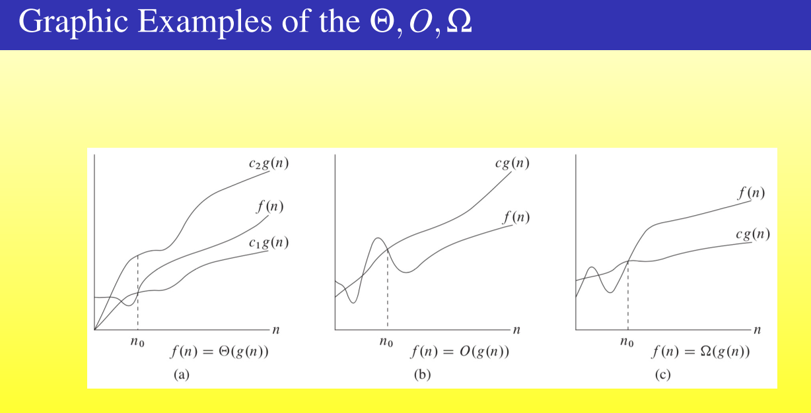
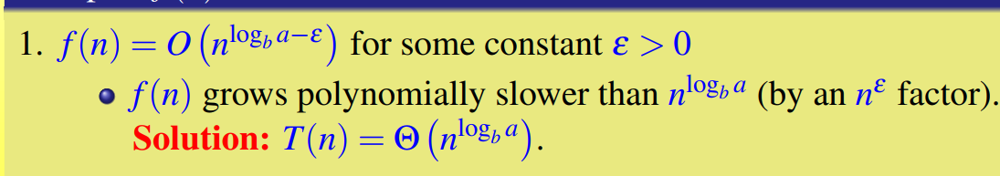

## Lecture 2

### Asymptotic Notation（渐进符号）

#### $O-notation$: upper bounds

##### def

找到一个函数g（n）能盖住f（n），图像上显示为，超过某一点后一直在f（x）上方

Example: 

$2n^2 = O(n^3) ~(c=1,n_0 = 2)$

#### $\Omega-notation$

##### def

找到一个函数g(n)，使得超过n0后，f(n)一直在g(n)图像之上，这样保证了一个f(n)的下界（不严格的）

Example: $\sqrt{n} = \Omega(lgn)$

#### $\Theta-notation$

找到一个函数g(n)使得f(n)的函数数量级和f(n)是一样的，只是有常数倍的区别

Example：

 $\frac{1}{2}n^2-2n = \Theta(n^2)$

#### theorem:

the leading constant and low order terms do not matter.

#### other asymptotic notations

##### $o-notation$ 

严格上界

$\omega-notation$

严格下界

#### A helpful analogy

##### Transitivity

渐进符号具有传递性

##### Reflexivity

渐进符号具有自反性

##### Symmetry & Transpose Symmetry

#### Non-completeness

也就是说，a和b的函数关系并不是只有三种，存在震荡的情况。

### Standard Notations and Common Functions

#### Floors and Ceilings

#### Modular Arithmetic

#### Exponentials

#### Logarithms

#### Factorials

#### Functional iteration

Example：$ if f(n) = 2n, then f^{(i)}(n) = 2^in$

the iterated logarithm function

#### Fibonacci Numbers

### Recurrences

to solve recurrences

核心来讲，就是一个公式 $ T(n) = a\times T(\frac{n}{b})+f(n)$

#### Substituion Method

- 只适用于猜答案
- 只有在确定上下界的时候发挥作用

#### Recursion-tree Method

#### The Master Method

compare f(n) with $n^{log_b^a}$

