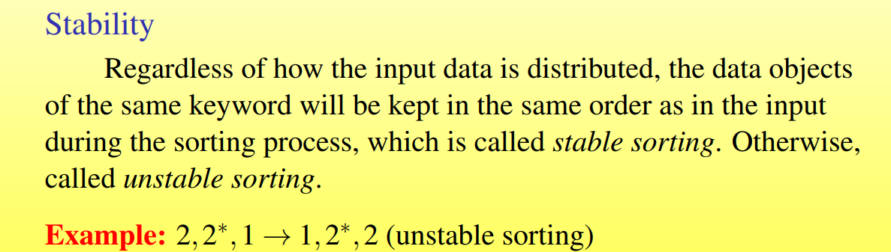
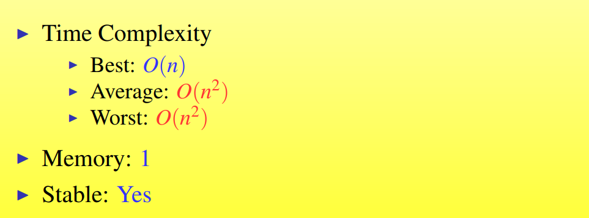
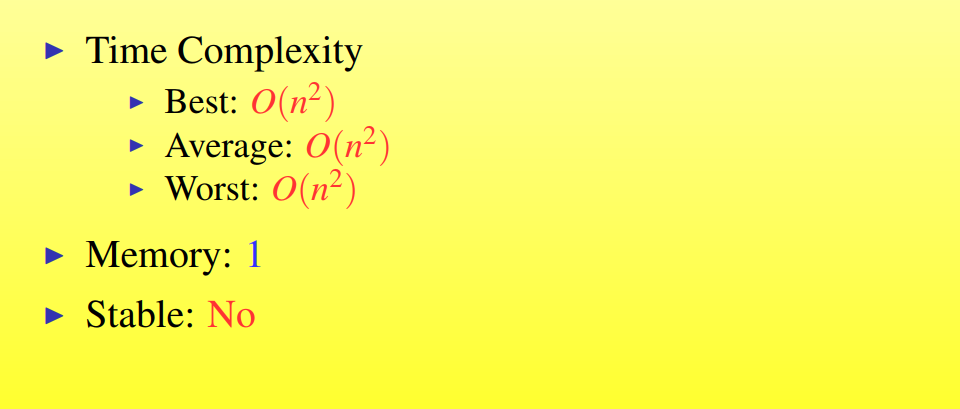
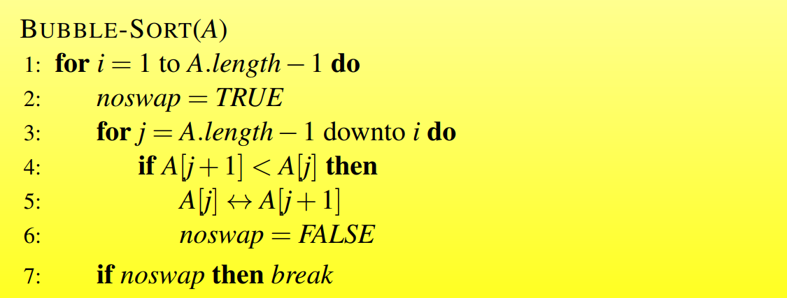
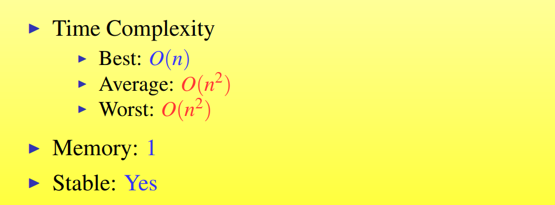
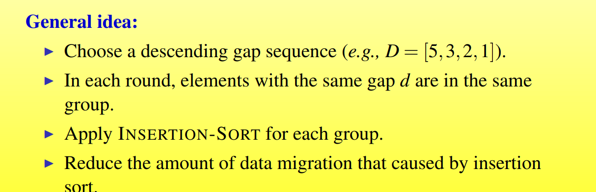
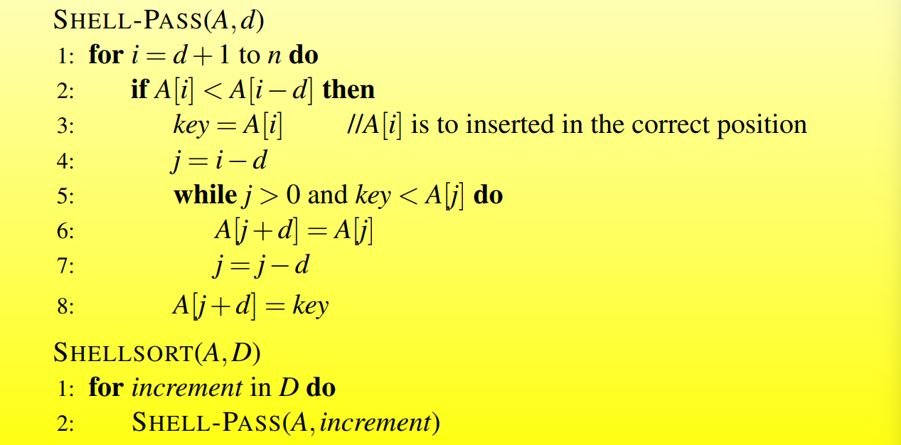

## Topic 3  Comparsion Based Sorting Algorithms

### Basic Concepts

#### Stability



#### Time Complexity

Usually measured by the number  of data comparisons and the number of data movements in the algorithm execution.

#### In-place Sorting 

**Only a constant** of elements are **stored outside the input array**.

### Simple Sorting Algorithms

#### Insertion Sort

```c
insertion-sort(A)
{
    for j =2 to A.length do
        key = A[j]
        i = j-1
        while i >0 and A[i] > key do
            A[i + 1] = A[i]
            i = i-1
        A[i+1] = key
}
```



#### Selection Sort

Select and remove the smallest element from unsorted set

```
selection-sort(A)
{
	for i = 1 to A.length - 1 do
		k = i
		for j = i+1 to A.length do
			if A[j] < A[k] then
				k = j
		if k != i then
			A[i] <-> A[k]
}
```



Stable sorting: How to revise the selection sorting to make it stable?

#### Bubble Sort

From the back to the front, if some elements are smaller than their predecessor, then swap them.





### Efficient Sorting Algorithms

#### Shellsort






#### Heapsort

#### Quicksort

### Summary