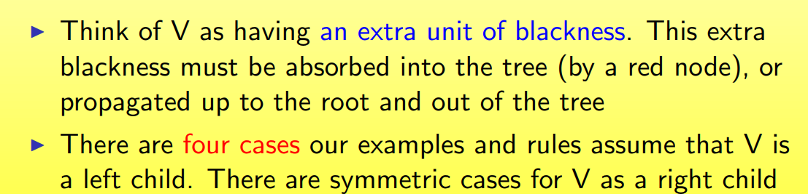

## Advanced Data Structures I

### 5.1 Binary Search Trees

### 5.2 Red-Black Trees

#### 5.2.1 Overview

- 红黑树是二叉搜索树的变种，但是他是平衡树

- 红黑树的树高为稳定的$O(lgn)$,n是结点的数量

- 每个操作最坏时间复杂度为$O(lg n)$

Binary search tree + 1 bit per node: 

- color域:red or black
- key，left，right，p，这些域都是从BST继承来的
- 所有的叶子结点的color是黑色的
- 用一个nil，表示所有的叶子结点 color[nil] = black
- root的parent也是nil

一个红黑树的例子

#### 5.2.2 Red-Black 属性

1. 每个结点要么是红色的，要么是黑色的

2. 根节点是黑色的

3. 所有的leaf都是黑色的
   - 所有的real node 都有两个孩子结点

4. 如果一个结点是红色的，那它的孩子结点都是黑色的
   - 不能有连续两个结点是红色的

5. 对每个结点而言，从当前节点到它最底下的叶子节点包含相同数量的黑色结点

#### 5.2.3 红黑树的高度

height of a node：

- number of edges in a longest path tp a leaf

black-height of a node x，bh（x）：

- 一条从x到leaf中黑色结点的数量

红黑树的black-height是根节点的黑高 

##### 证明：高度边界

#### 5.2.4 Worst-Case Time

红黑树的树高为$O(lgn)$

以下这些方法都花费$O(lgn)$时间

- minimum()
- maximum()
- successor()
- predecessor()
- search()
- insert() and delete()
  - 需要特殊关注，因为它们修改了红黑树

##### 旋转（rotation）

#### 5.2.5 红黑树的insertion（）

##### the basic idea:

- 将结点x插入红黑树，颜色标为red
- 性质2可能被打破（如果x是根节点且为红色的话），如果如此，别的性质没有打破的情况下，把x涂成black
- 性质4可能被打破（父结点可能也是红色的），如果如此，调整颜色后上浮，直到可以调整好所有的位置
- 总时间可以是$O(lgn)$的

##### 伪代码pseudocode I

- Case 1：

  

- Case 2：

  

- case 3:

  

#### 5.2.6  Delete

##### BST Delete

##### Bottom-Up Deletion

##### Fixing the problem

##### Terminology

##### RB Delete: Case 1

##### RB Delete: Case 2

##### RB Delete: Case 3

##### RB Delete: Case 4

