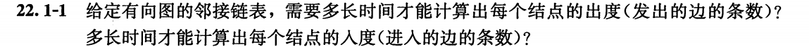
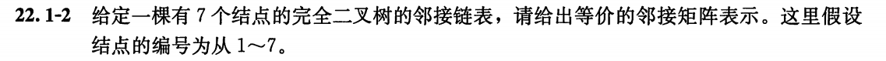
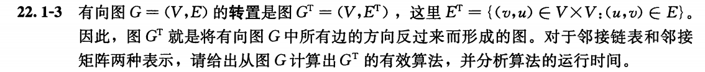
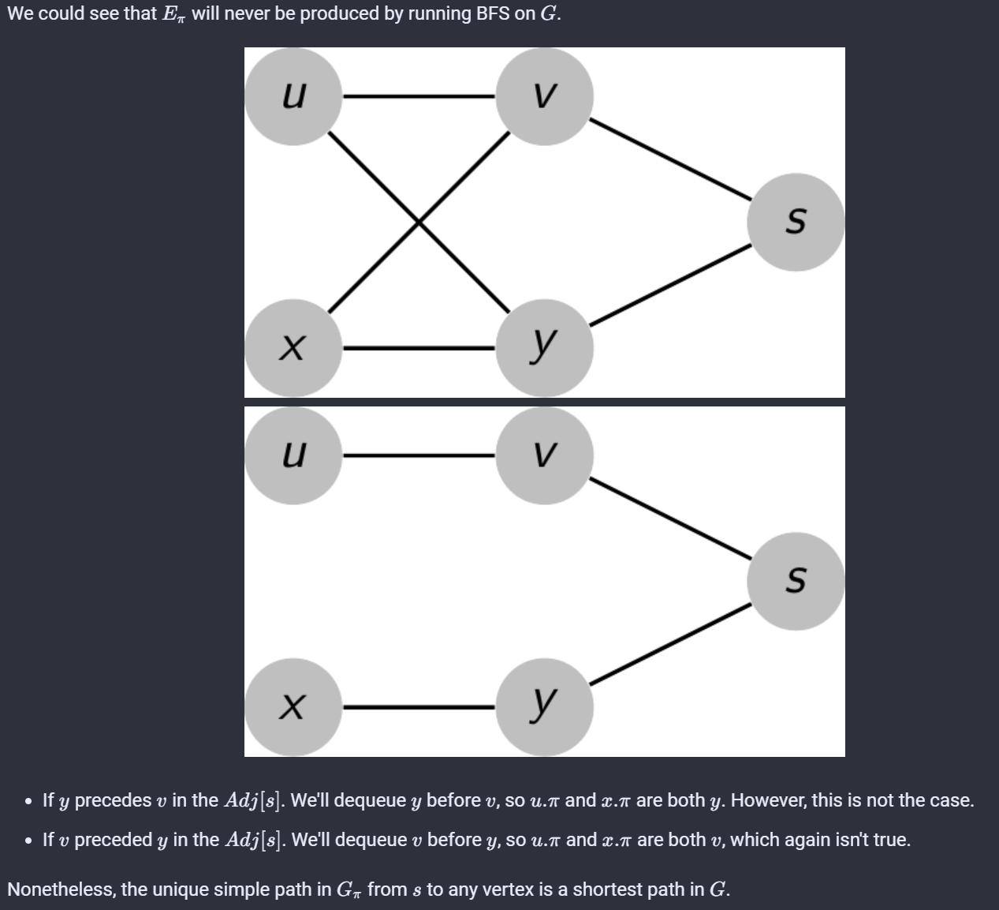
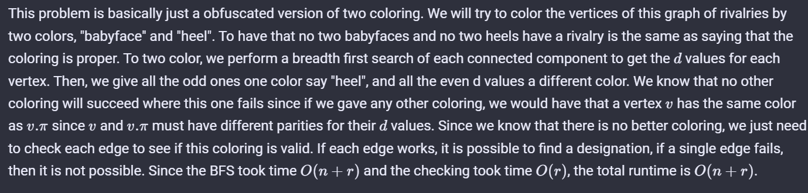
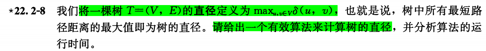
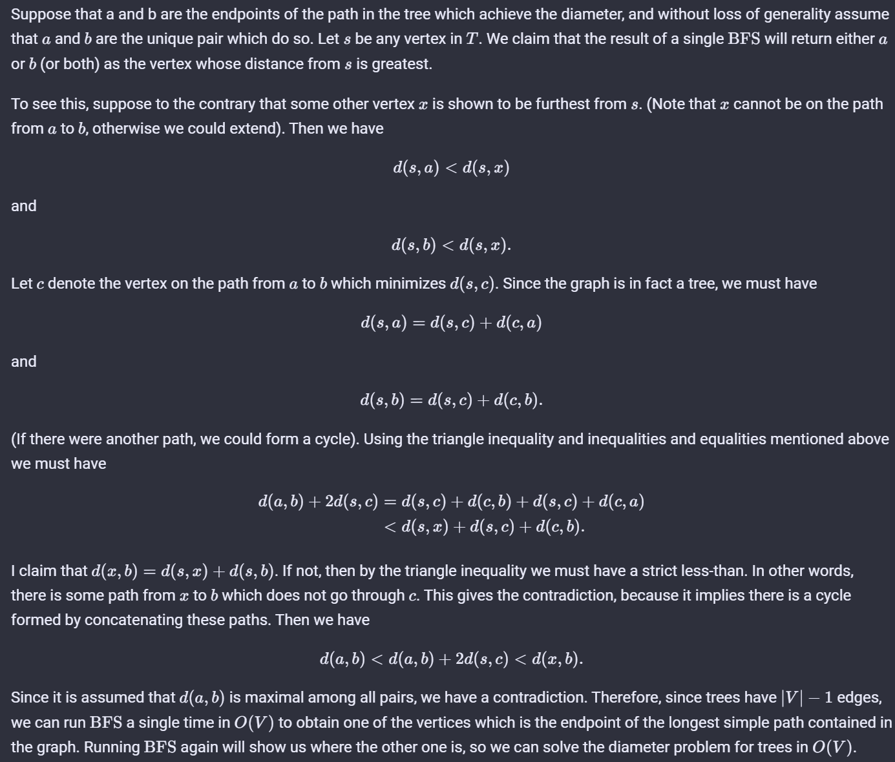
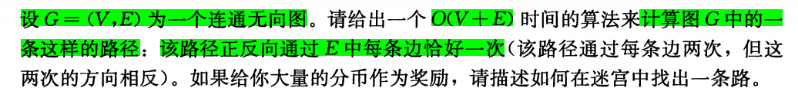
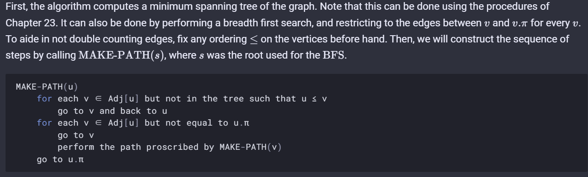

# chapter 22 基本的图算法

## 22.1

### 22.1-1

#### Question：



#### Answer：

设顶点数为 $V$，边的个数为 $E$

出度：$\sum_{v \in V} (out\_degree(v)) = O(|V|+|E|)$

入度：$\sum_{v \in V} (in\_degree(v)) = O(|V|+|E|)$

### 22.1-2

#### Question：



#### Answer：

.PNG)

### 22.1-3

#### Question：



#### Answer：

邻接表：

```c++
let Adj'[1...|V|] be a new adjacency list of the transposed G^T
for each vertex u in G.V
    for each v in Adj[u]
        Insert(Adj'[v],u)
```

时间复杂度为 $O(|E| + |V|)$

邻接矩阵：

做一个矩阵转置操作

时间复杂度为 $O(|V|^2)$

### 22.1-4

#### Question：


#### Answer：

### 22.1-6

### 22.2 广度优先搜索

#### 22.2.6




这题的意思是说，对于一个图的任意一颗生成树和某个确定的源点s，并不是通过从s的BFS得到一棵相应的生成树

#### 22.2.7


问题抽象成 一个n个顶点，r条边的图，找到一种二染色方案



>本质上是以一个顶点为起点跑一次BFS，得到一棵BFS生成树，对奇数层次染一种颜色，偶数层染另一个颜色，然后对每一条边进行检查

#### 22.2.8



从树上任意点u开始(BFS)遍历图，得到距离u最远的结点v,然后从v点开始BFS遍历图，得到距离v最远的结点w， 则v、w之间的距离就是树的直径。



#### 22.2.9




