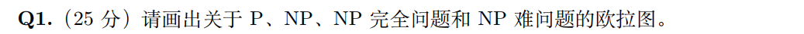
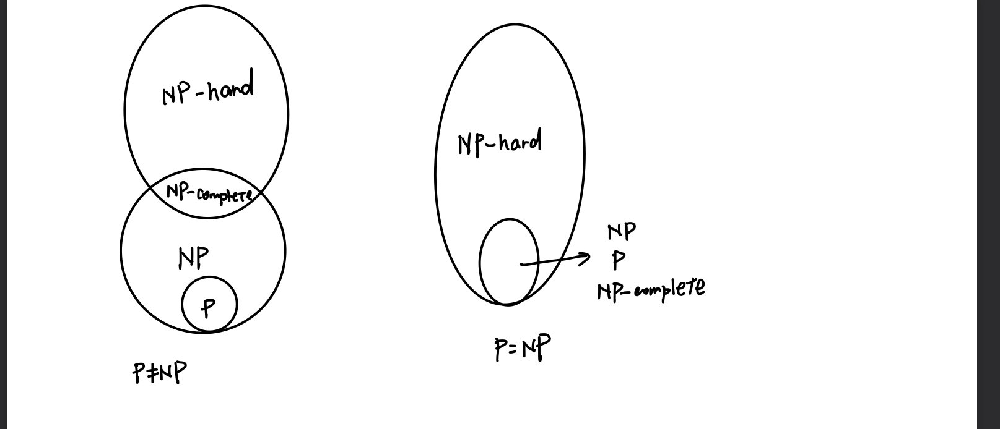
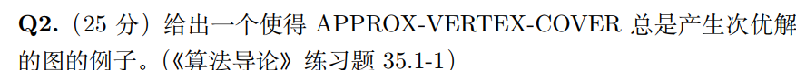
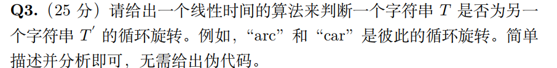
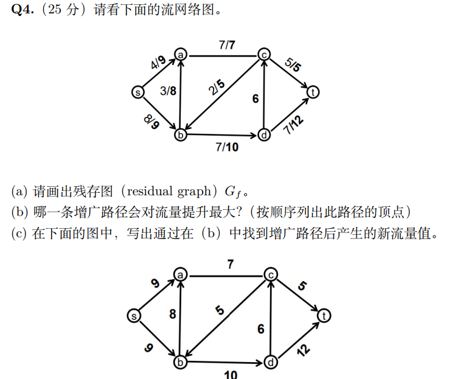
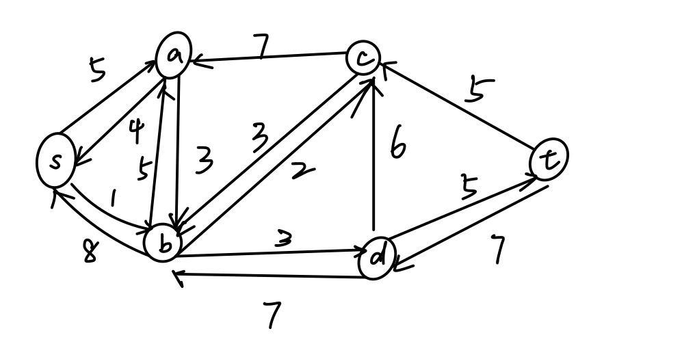
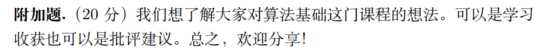

## HW10

### Q1

#### Question：

#### Answer：

### Q2

#### Question：

#### Answer：

.PNG)

无论算法选择 (a,b)还是(b,c)都是一个次优解，最优解是选择 {b}

### Q3

#### Question：

#### Answer：

首先比较字符串T和字符串$T'$的长度，长度不等则T不是T‘的循环旋转

如果T.length = T'.length

- 将T’与另一个T‘拼接为S
- 用kmp算法判断T是否是S的子串，这一步的时间复杂度为 $O(2n + n) = O(n)$的

因此这是一个线性时间的算法可以判断字符串T是否为T’的循环旋转

### Q4

#### Question:

#### Answer:

##### (1)

##### (2)

$s\rightarrow a \rightarrow b \rightarrow d \rightarrow t$

提升最大为3

##### (3)

.PNG)

### 附加题

#### Question：

#### Answer：

收获蛮大的，尤其是可以从作业的选做题中自学到很多知识，比如tarjan算法等等，认真完成一次作业虽然耗时比较久，但付出的时间与收获是成正比的。

挺喜欢必做+选做，满分100这样的形式，既可以保证一个作业的分数，也可以自学到很多东西

建议是：

算法oj有些少，有很多课本上的算法挺值得C++实现一遍的，只是知道算法原理和伪代码而没有实现有些缺憾，如果oj能多一点，上一些实验课讲讲一些算法实现的板子和细节会更好

感谢助教们一学期的付出
