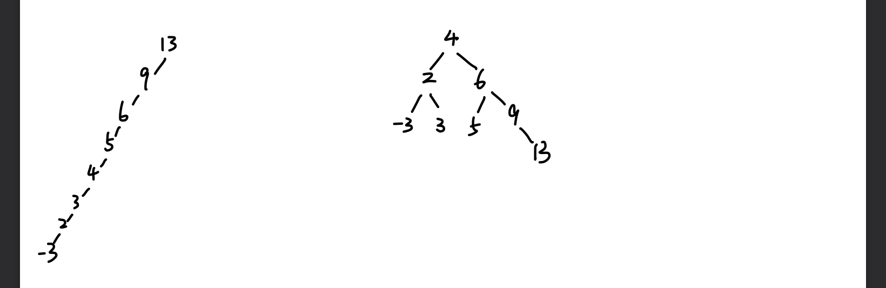
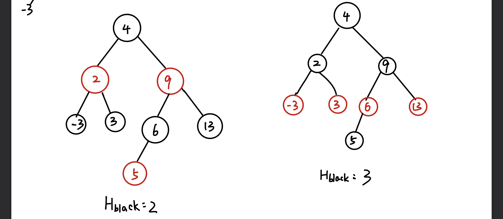
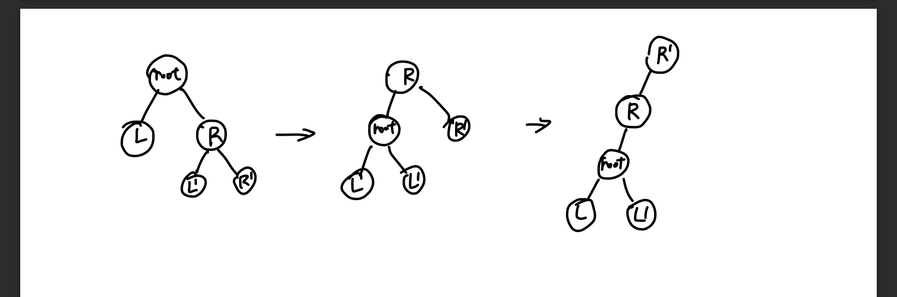
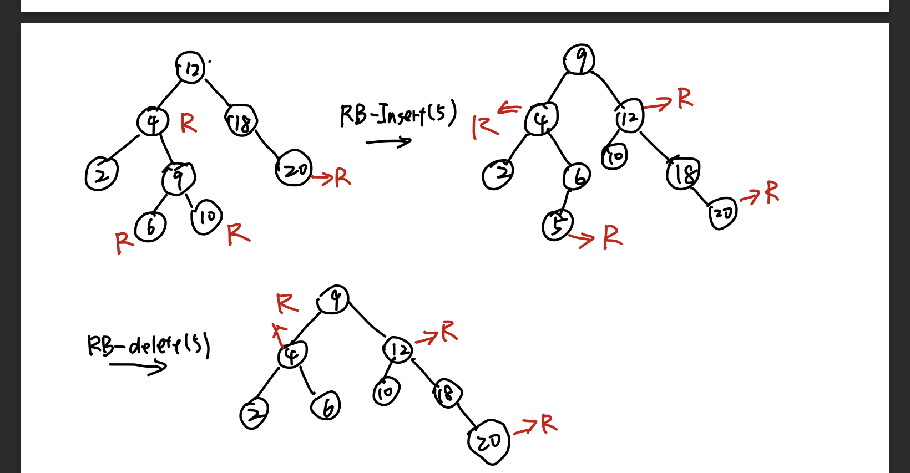
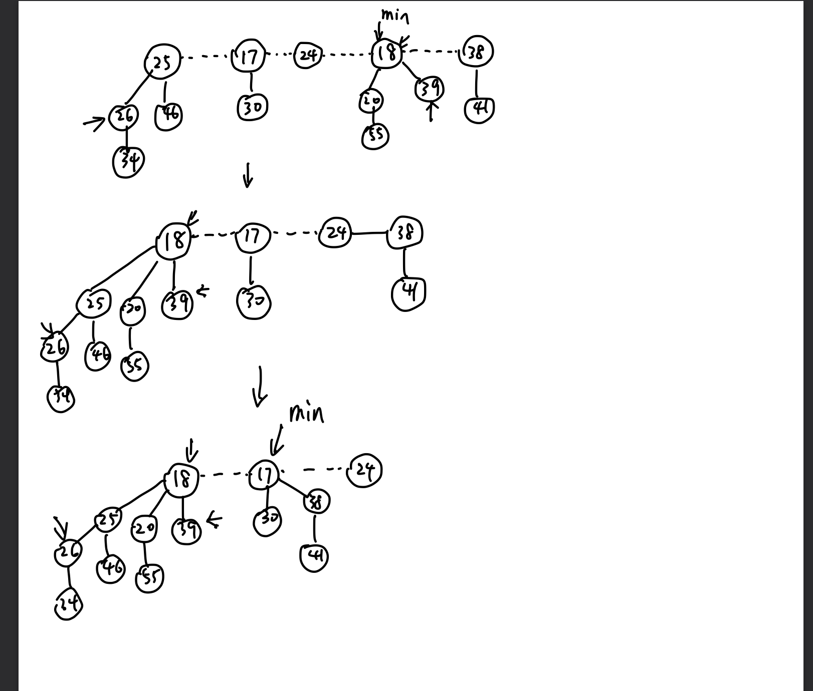

### Q1

#### 1.

$H_{max} = 7, H_{min} = 3$



#### 2.



### Q2

#### 1.

$$
InOrderTreeWalk\_leaf(x)\\
if ~x != NIL~then\\
bool~lnil = left[x] == NIL,rnil = right[x] == NIL\\
if(!lnil)~InOrderTreeWalk\_leaf(left[x])\\
if(lnil\&\&rnil)~print~key[x]\\
if(!rnil)~InOrderWalk\_leaf(right[x])\\
$$


#### 2.

```
TreeSearch_Set(x, k)
{
	if(x!=NIL) then
		temp =visit(x)
		if(k == temp) return
		if(k < temp) then
			if(right!= NIL) Sright = InorderTreeWalk(right[x])
			TreeSearch_Set(left[x], x)
		else then
			if(left!= NIL) sleft = InorderTreeWalk(left[x])
			TreeSearch_Set(right[x], x)
}
```


#### 3.

$$
时间复杂度为\Theta(n),每个点都被访问了一次
$$


#### 4.

$$
命题1:\\
正确\\
若\exist a\in S_{left},s.t. a > b\\
对a调用TreeSearch\_Set算法，将此时a的Spath集合和Spath集合取交集\\
a和k在路径最后结点的两个不同子树中，此时a在右子树，而b在左子树中，与a\in S_{left} 矛盾\\
命题2:\\
正确\\
若\exist a\in S_{left},s.t. a > k\\
对a调用TreeSearch\_Set算法，将此时a的Spath集合和Spath集合取交集\\
a和k在路径最后结点的两个不同子树中，此时a在右子树，而k在左子树中，与a\in S_{left} 矛盾\\
命题3:\\
错误\\
只需要找一个根节点为10，其右子树的所有结点可以都大于10，这个根节点没有左子树，则这时候S_{left}集合中的所有元素都大于根节点10，而10在S_{path}中
$$


### Q3

$$
如果任何一棵n结点的二叉搜索树可以经过\Theta(n)次旋转变成单链的二叉树(高度为n-1)\\
那么只需要重复两次\Theta(n)的旋转就可以得到任何一棵另外的n结点的二叉搜索树\\
$$


$$
任何一棵如上子树形式可以通过2次旋转得到只含左子树的形式\\
再次左旋root可以得到单链形式\\
因此，只需要\Theta(n)就可以得到单链形式的二叉搜索树，再次逆向旋转就可以得到目标
$$


### Q4

不一样



### Q5

