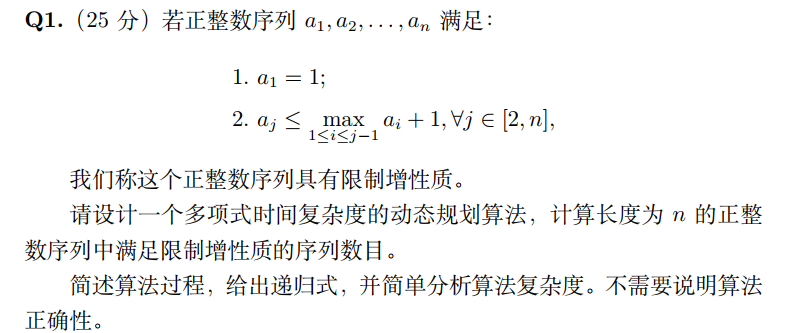
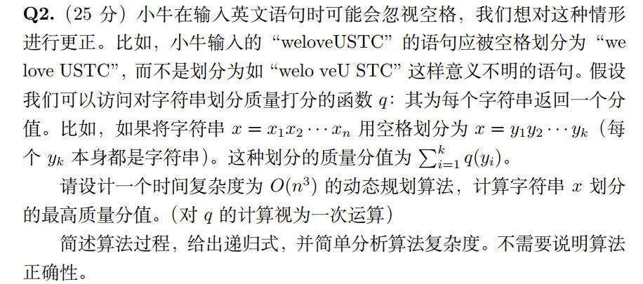
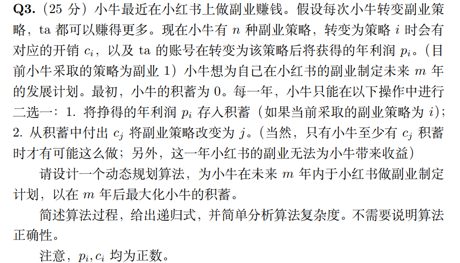
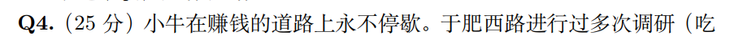
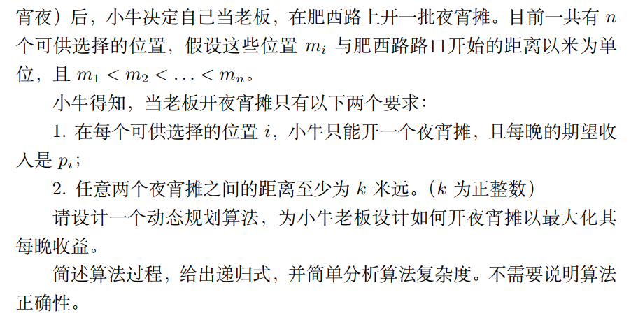

## HW4

### Q1

#### question：



#### answer：

数组dp[i]\[j]表示长度为i，这段序列中最大值为j的合法方案的个数

状态转移方程为

$dp[i][j] = dp[i-1][j-1] + j *dp[i-1][j]$

伪代码实现如下

```c
// 初始化
for i = 1 to n
    dp[i][1] = 1
for i = 1 to n
    for j = 1 to max{a1,...a_n}
		dp[i+1][j] += j * dp[i][j]
        dp[i+1][j+1] += dp[i][j]
```

时间复杂度为$\Theta(n^2)$

空间复杂度为$\Theta(n^2)$


### Q2

#### question：



#### answer：

数组dp[i]\[j]表示在$x_i$到$x_j$之间的所有划分的这个集合，其中划分的分值质量最高的值存入dp[i]\[j]

状态转移方程

$dp[i][j] = max\{q(x[i..k])+dp[k+1][j]\}, k=i,...,j$

伪代码如下

```c
dp(x[i...j])
   	if(i > j) return 0;
	if(dp[i+1][j].empty()) dp[i+1][j] = dp(x[i+1..j])
    max = q(x[i..i]) + dp[i+1][j];	//初始化
	for k = i+1 to j
        if(dp[k+1][j].empty()) dp[k+1][j] = dp(x[k+1...n])
        if(q(x[i...k]) + dp[k+1][j] > max)
            max = q(x[i...k]) + dp[k+1][j]
   	return max
```

最大值就是调用dp（x[1....n]）

递归式同上状态转移方程

时间复杂度为 $\Theta(n^2)$

空间复杂度也为$\Theta(n^2)$


### Q3

#### question：



#### answer：

用一个二维数组dp[i,j] 表示第i年，当前策略为j时的最大积蓄, 并将i年后的副业记为method[i]\[j]

递归式同循环内

```c
// initialization
let dp[1..m,1...n] be a new array
for j = 1 to n
	dp[1][j] = p[j]
	method[1][j] = j
for i = 2 to m
    for j = 1 to n
        for s = 1 to n
            for t = 1 to i-1
                temp = dp[t][j] - c[s]
                if(temp >= 0)
                    origin = dp[i][j]
                    dp[i][j] = max(dp[i][j], temp+dp[i-t-1, method[t][j]]
                   	if(dp[i][j] != origin)
                       method[i][j] = method[i-t-1, method[t][j]]
       	dp[i][j] = max(dp[i-1][j] + p[method[i-1][j]], dp[i][j]
```

时间复杂度为$\Theta(m^2n^2)$，空间复杂度为$\Theta(mn)$

### Q4

#### question:





#### answer:

用二维数组dp[i,j]表示在$m_i$和$m_j$之间开夜宵摊的最大收益，待求即为dp[1]\[n]

```c
let dp[0 ...n + 1, 1 ...n + 1]
for i = 0 to n + 1
    for j = 0 to n + 1
        if(i == j)
            dp[i][j] = p[i]
         else
            dp[i][j] = 0
for i = 2 to n
    for j = 1 to n - i + 1
        l = i + j - 1
        current_value = 0
        for t = i to l - 1
            for index1 = t - 1 to 1
                if(m[t] - m[index1] > k)
                    break
           	for index2 = t + 1 to n
                if(m[index2] - m[t] > k)
                    break
            if(dp[j][index1] + w[index2][l] + p[t] > current_value)
                current_value = dp[j][index1] + dp[index2][l] + p[t]
        dp[i][j] = current_value
return dp[1][n]
         
```

递归式

$dp[i][j] = 0,m_j - m_i < k~or~j=0~or~i = n+ 1$

$dp[i][j]=max\{dp[i][t-1]+dp[t+1][j]\}$ 

时间复杂度为$O(n^3)$的

