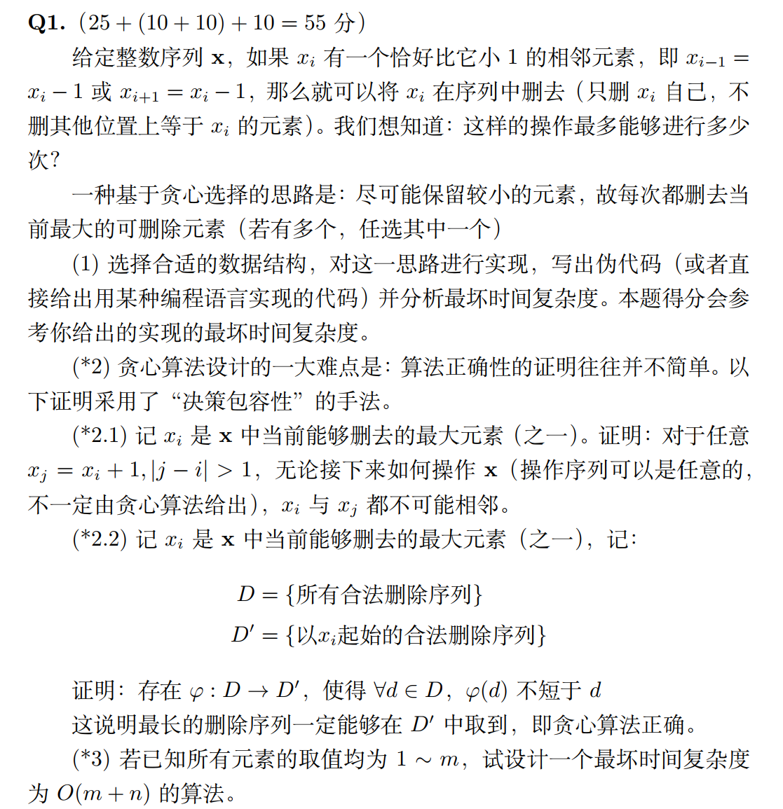
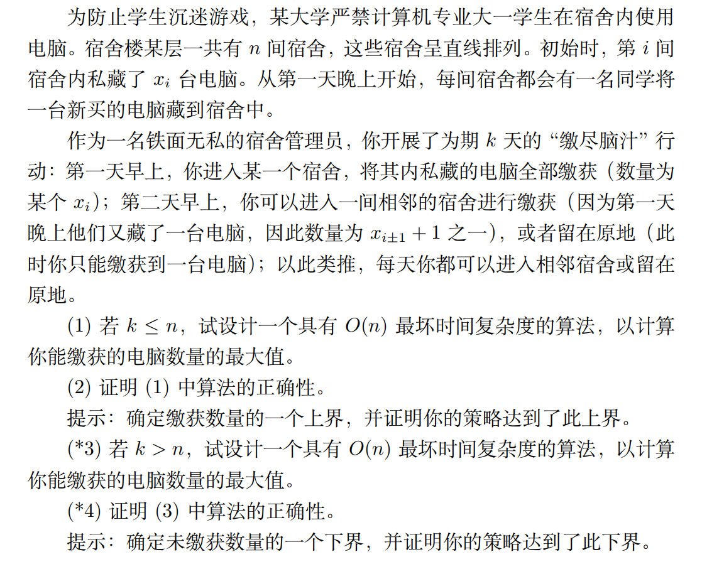
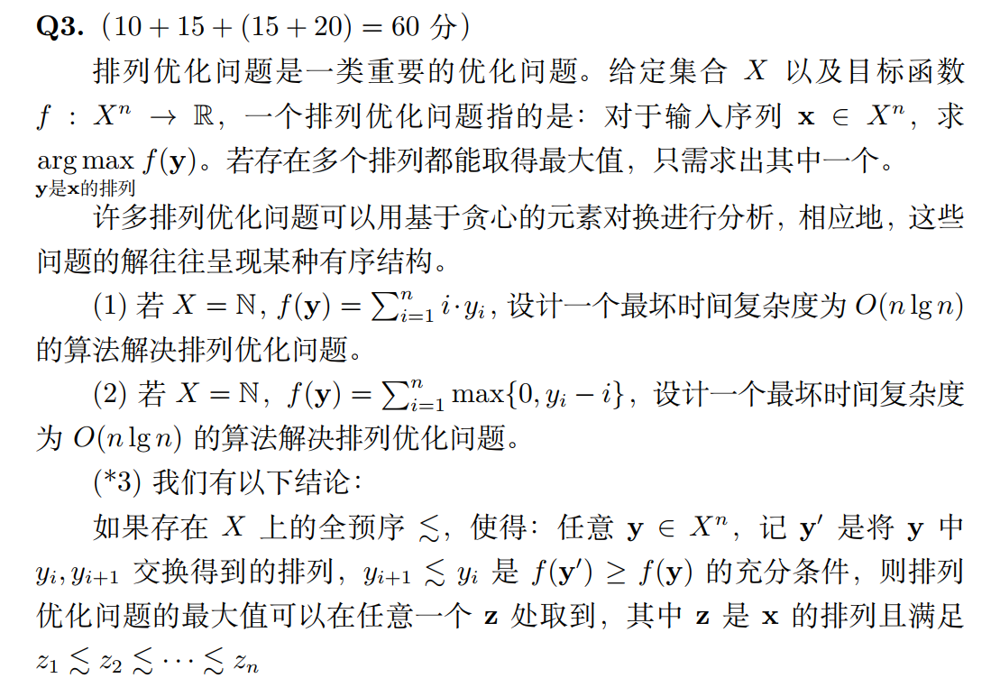
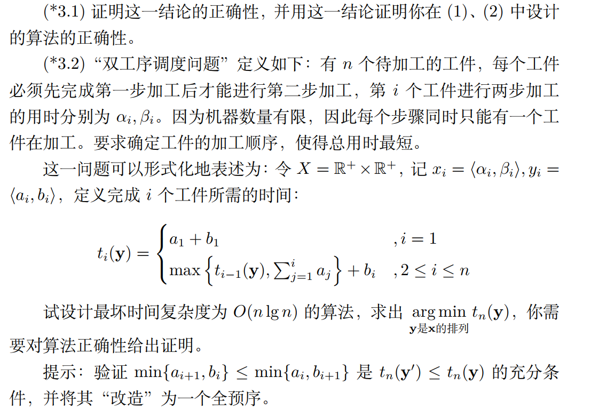
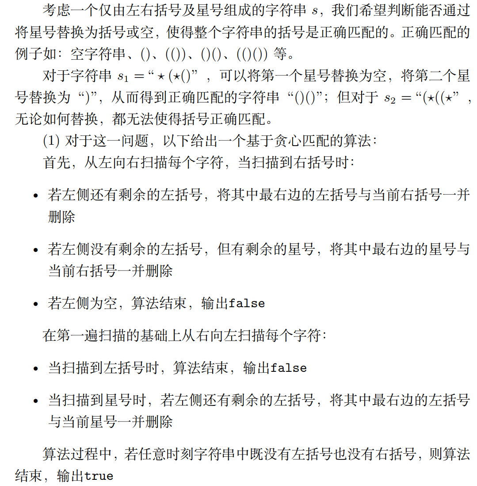
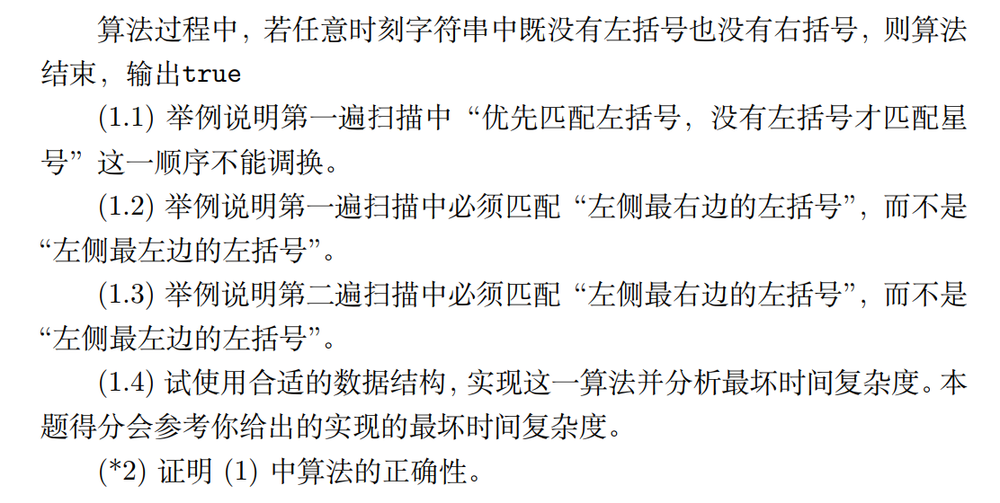

## Hw 5

### Q1

#### Question:



#### Answer:

##### (1)

```
deletions_cnt = 0 // 删除操作的次数
array x[] 	// 给定的整数序列X
while(n--)
{
	x = max(array x[])
	i = location of x in array[]
	if(x[i] = x[i-1] + 1)
		delete x in array x
		deletions_cnt ++
	else
		delete x in array x
}
return deletions_cnt
	
```

```c++
#include <iostream>
#include <vector>
#include <algorithm>
using namespace std;
int main(void)
{
    vector<int> x = {8, 9, 20, 21, 18, 7, 9, 10, 11, 20, 21};
    int deletions_cnt = 0;
    int n = x.size();
    cout << n << endl;
    while (n--)
    {
        auto index = max_element(x.begin(), x.end());
        int i = distance(x.begin(), index);
        cout << i << " " << deletions_cnt << endl;
        if (x[i] == x[i - 1] + 1)
        {
            deletions_cnt++;
            x.erase(x.begin() + i);
        }
        else
            x.erase(x.begin() + i);
    }
    cout << deletions_cnt << endl;
}
```

最坏时间复杂度为$O(n^2)$的

##### (2)

###### (2.1)

j - i > 1 时，即j位于当前能够删去的最大元素之后，假设经历若干次删除操作后，$x_j$与$x_i$相邻，即$x_j$ 刚好位于$x_i$之后，则根据删除规则，要将i与j之间的所有元素删除，而紧邻在$x_i$之后的元素$x_{i+1}$只有当$x_{i+1} = x_i + 1$时才会删除，这时候$x_{i+1} > x_i$，并不满足$x_i$是当前能够删去的最大元素（之一），所以$x_j$不能位于$x_i$之后

j - i < -1时，即j位于当前能够删去的最大元素之前，删除$x_{j+1}$的条件是$x_{j+1} = x_j + 1$，此时$x_j$是比$x_i$更大的能够删去的最大元素，矛盾，因此$x_j$不能位于$x_i$之前

综上所述，$x_i$与$x_j$不可能相邻

###### (2.2)

假设存在一个删除序列$D_1$比所有以$x_i$为起始的删除序列都长，则存在一个比$x_i$更大的元素$x_j$可以加入删除序列

由2.1知，无论经历多少次删除操作，不可能使得一个更大的元素$x_j = x_i + 1$经过若干次删除后与$x_i$相邻，使得可以将$x_j$加入删除序列，矛盾

因此最长的删除序列一定能够在$D'$中取到，即贪心算法正确

##### (3)

先跑一遍计数排序，用一个键值对<value, location> 存储所有元素的位置，对value使用计数排序，这样得到一个升序数组和其中所有元素在原数组中的位置，这里的最坏时间复杂度为$O(m+n)$

从最大元素开始判断是否满足删除条件（原数组位置已知），如果满足计数器cnt++，并把相应元素在原数组设置为null，否则将相应元素直接设置为null，遍历一遍，时间复杂度为$O(n)$

总时间复杂度为$O(m+n)$的

### Q2

#### Question：



#### Answer：

##### (1)

因为选择的区间一定是一个连续区间

伪代码实现如下

```
// 选择一个初始区间
for i = 1 to k
	computers += x[i]
for i = 1 to n - k
	computers = computers - x[i] + x[i+k]
	sum = max(computers, sum)
sum += k*(k-1)/2
return sum
```

##### (2)

在第i天，新增电脑最多能取i-1台，将长度k的区间从头到尾便利，可以取得k(k-1)/2台，得到最多的新增电脑数量

同时我们选择的这个长度k的区间是连续k个和最大的区间，也达到上界

因此算法(1)是正确的

##### (3)

要遍历所有的n个宿舍，然后考虑每一步是选择原地或者重复进入宿舍，可以在一个起始房间，第一个房间或者最后一个宿舍重复k-n天，然后走遍剩下的n个宿舍，这样可以得到一个电脑数量的最大值，是O（n）的

##### (4)

原先的n个宿舍的所有电脑都被缴获，只需要考虑剩下新增的电脑中没有被缴获的，每步停留必定导致无法收割在剩余时间内无法到达的宿舍新增的电脑，因此k-n次重复后遍历所有房间可以收割个新增的$\sum_{i=n-k}^{k}i$个电脑达到最大值

### Q3

#### Question：





#### Answer：

##### (1)

设计一个升序的排序算法，时间复杂度为$O(nlgn)$就可以了

比如选择快速排序

```c++
void merge_sort(int a[], int l, int r, int temp[])
{
    // 子序列太小(为1)，直接返回
    if (l >= r)
        return;
    int mid = l + r >> 1;
    // 递归排序所有子序列
    merge_sort(a, l, mid, temp);
    merge_sort(a, mid + 1, r, temp);
    int i = l, j = mid + 1;
    int k = 0;
    // 合并
    while (i <= mid && j <= r)
    {
        if (a[i] < a[j])
            temp[k++] = a[i++];
        else
            temp[k++] = a[j++];
    }
    // 前半剩下的
    while (i <= mid)
    {
        temp[k++] = a[i++];
    }
    //  后半剩下的
    while (j <= r)
    {
        temp[k++] = a[j++];
    }
    // 把合并的结果写回a数组
    for (int i = l, k = 0; i <= r; i++, k++)
    {
        a[i] = temp[k];
    }
}
```

调用函数quick_sort(y, 0, n-1,temp)

然后对新排序的y数组求和$\sum_{i=1}^{n}i\cdot y_i$

##### (2)

设计一个降序的排序算法，将较大的元素和较小的位次i结合就可以

比如选择快速排序

```c++
void merge_sort(int a[], int l, int r, int temp[])
{
    // 子序列太小(为1)，直接返回
    if (l >= r)
        return;
    int mid = l + r >> 1;
    // 递归排序所有子序列
    merge_sort(a, l, mid, temp);
    merge_sort(a, mid + 1, r, temp);
    int i = l, j = mid + 1;
    int k = 0;
    // 合并
    while (i <= mid && j <= r)
    {
        if (a[i] > a[j])
            temp[k++] = a[i++];
        else
            temp[k++] = a[j++];
    }
    // 前半剩下的
    while (i <= mid)
    {
        temp[k++] = a[i++];
    }
    //  后半剩下的
    while (j <= r)
    {
        temp[k++] = a[j++];
    }
    // 把合并的结果写回a数组
    for (int i = l, k = 0; i <= r; i++, k++)
    {
        a[i] = temp[k];
    }
}
```

调用函数quick_sort(y, 0, n-1, temp)

然后对新排序的y数组求和$\sum_{i=1}^{n}max\{0,y_i-i\}$

### Q4

#### Question:





#### Answer:

##### (1.1)

（（**）））

如果优先匹配星号，这个字符串的结果是false，但把两个*分别替换成(和空白，是可以满足匹配的

##### (1.2)

(*()，如果优先匹配左侧最左边的左括号，这个字符串的结果是false，但把\*替换成)，是可以满足匹配的

##### (1.3)

(\*(\*，如果优先匹配左侧最左边的左括号，这个字符串的结果是false，但是把\*替换成)\*替换成)，是可以满足匹配的

##### (1.4)

可以设计一个$O(n)$的算法，使用栈做匹配

```
judge = true
for i = 0 to n - 1
	if(s[i] == '(')
		left_stack[++left_stack[0]] = i
	else if(s[i] == '*') 
		star_stacck[++star_stack[0]] = i
	else if(s[i] == ')')
		if(left_stack[0]) 
			left_stack[0]--
		else if(star_stack[0])
			s[star_stack[0]] = '('
			star_stack[0]--
		else
			judge = false
			break
while(star_stack[0] && left_stack[0])
	if(left_stack[left_stack[0]] < star_stack[star_stack[0]])
		s[star_stack[star_stack[0]]] = ')'
		star_stack[0]--
		left_stack[0]--
	else
		break
if(left_stack[0]) judge = false
return judge
```

