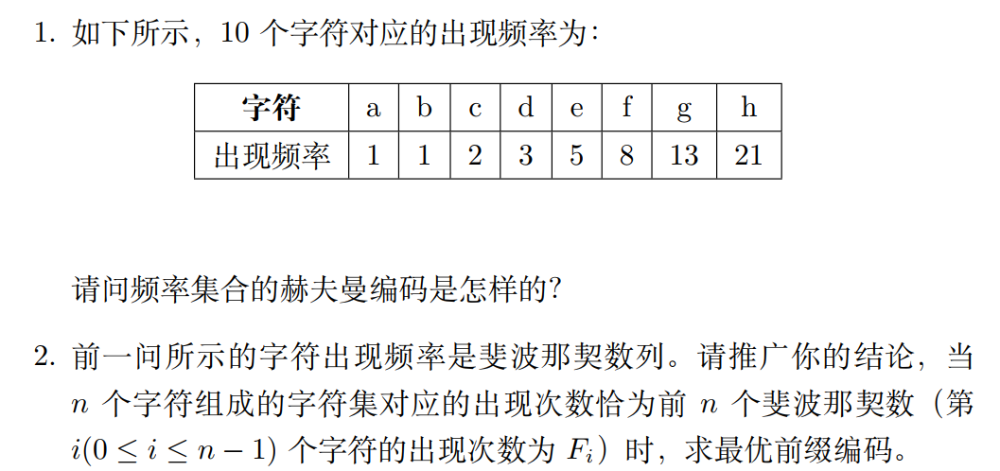
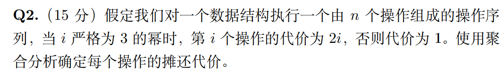
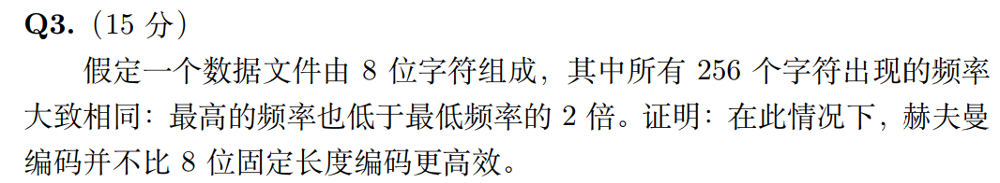
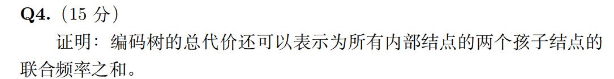
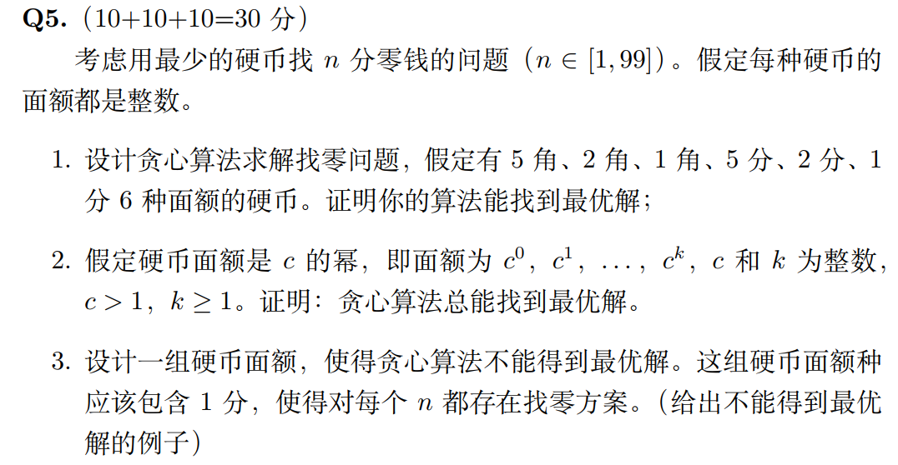

## Hw 6 

### Q1

#### Question：

#### Answer：

##### 1.

a: 1111111

b: 1111110

c: 111110

d: 11110

e: 1110

f: 110

g: 10

h: 0

##### 2.

第i个数的最优前缀编码为

$0 (i = n)$

$1...1(共n-i个)0 ( 1\leq i \leq n-1)$

$1...1(共n个)(i = 0)$

### Q2

#### Question：

#### Answer：

设 $3^{k} \leq n < 3^{k+1}$

由aggregate analysis

总代价为

$2\sum _{i=1}^{\lceil log_3 n\rceil} 3^i + (n-k - 1) \cdot 1 \leq 2 \cdot 3^{log_3 n +1} + n-1 \leq 3n = O(n)$

摊还代价为$\frac{O(n)}{n}  =O(1)$

### Q3

#### Question：

#### Answer：

由于任意两个字符的频率之和是大于其他所有单个字符的频率的，因此huffman coding算法先得到了一个128个子树，每个子树有两个叶子

同理，这128个子树的根节点也满足，任意两个频率之和大于其他所有单个根节点的频率

因此运行huffman coding会得到一棵高度为8的完全二叉树，所有的编码格式均为长度为8的01串，与8位固定长度编码相同

因此在这种情况下，huffman coding并不比8位固定长度编码更高效

### Q4

#### Question：

#### Answer：

假设编码树是一棵满二叉树有n个叶子结点

由归纳假设，

n = 2时，根节点为z，两个孩子结点（也是叶子）为x和y
$$
B(T) = f(x)d_T(x) + f(y)d_T(y)\\
=f(x) + f(y)\\
=f(z的左孩子) + f(z的右孩子)
$$
满足总代价为所有内部结点的两个孩子结点的联合频率之和

假设对编码树有n-1个叶子时结论成立，

$c_1和c_2$是T中拥有相同父节点p的两个叶子，$T'$是通过删除$c_1$和$c_2$得到的一棵编码树

由归纳假设
$$
B(T') = \sum_{叶子 l' \in T'}f(l')d_T(l')\\
=\sum_{内部结点 i' \in T'} f(i'的左孩子) + f(i'的右孩子)
$$
对拥有n个叶子的编码树T而言
$$
B(T) = \sum_{叶子l \in T} f(l)d_T(l)\\
=\sum_{l \ne c_1,c_2} f(l)d_T(l) + f(c_1)(d_T(c_1) -1) +f(c_2)(d_T(c_2)-1) + f(c_1) +f(c_2)\\
=\sum_{内部结点i' \in T'} f(i'的左孩子)+f(i'的右孩子) + f(c_1) + f(c_2)\\
= \sum_{内部结点 i \in T} f(i的左孩子) +f(i的右孩子)
$$
归纳假设成立

### Q5

#### Question：

#### Answer：

##### 1.

每次尝试用面额最大的硬币去找零，如果失败，依次尝试降序面额的硬币，找到一个合适的时候，n  = n - 相应的面额，重复过程直到n = 0

##### 2.

设一个最优解为$(x_0,x_1,...,x_k),x_i为面额为c_i的硬币的个数$

先证$x_i < c对所有i<k成立$

如果存在$x_i \geq c$，可以令$x_i = x_i - c, x_{i+1} = x_{i+1}+1$，得到一个硬币个数更少的解，与最优解假设矛盾，因此$x_i < c$

这种解的结构与贪心算法的解结构相同，对总价值为V的零钱，当我们选择了$x_k = \lfloor \frac{V}{c^k} \rfloor$，对所有的$i <k $，$x_i = \frac{V~mod~c^{i+1}}{c^i}$，这种选择满足最优解$x_i <c$的形式，因此贪心算法总能找到最优解

##### 3.

硬币面额为{1分，3分,   4分}，当n = 6时，贪心算法的结果为{4分，1分，1分}，但最优解应该为{3分，3分}