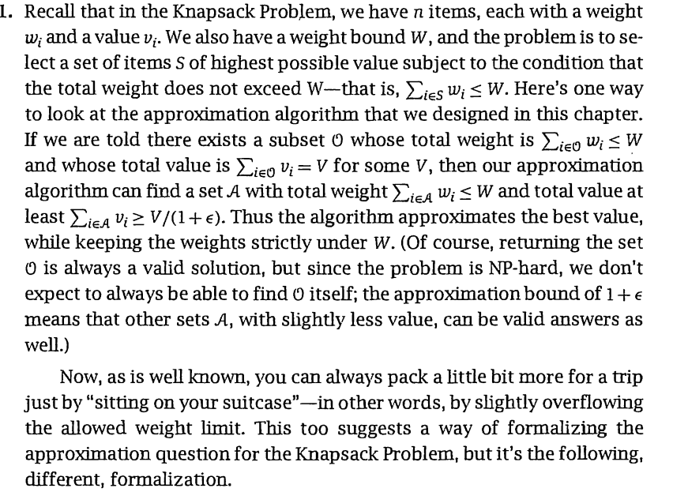
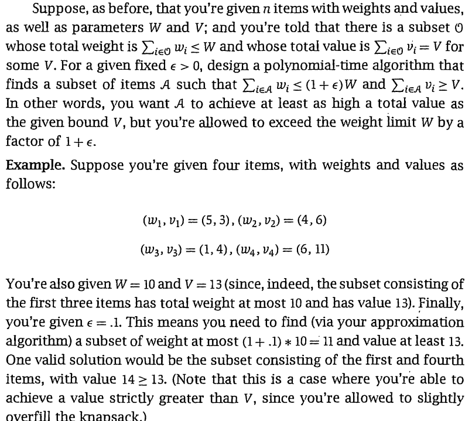
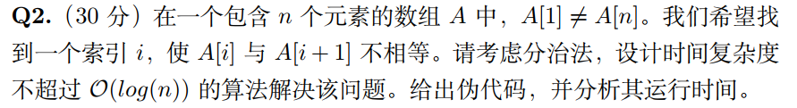
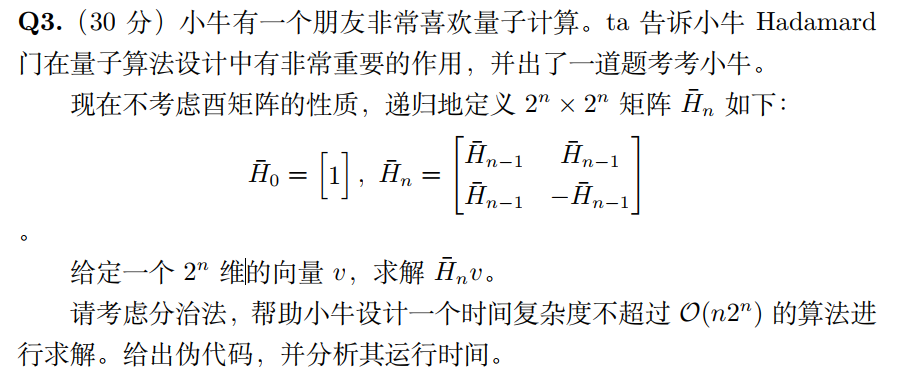
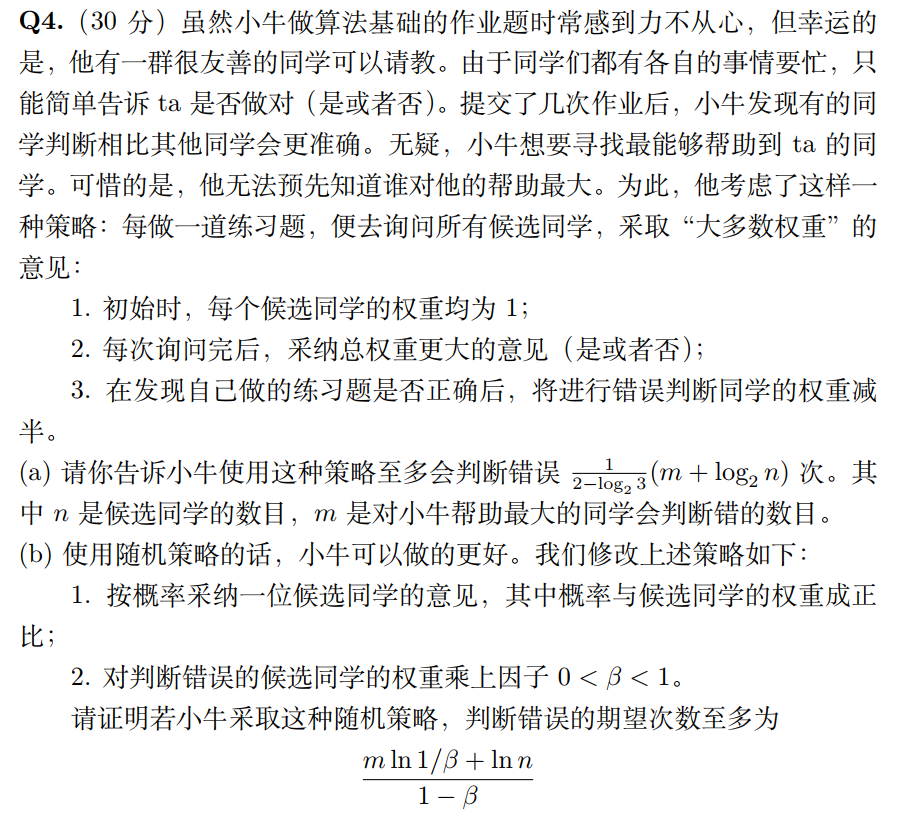

## hw7

### Q1

#### Question：





#### Answer：

首先对所有待选物品，如果$w_i > W$，将这件物品移除，不考虑，同时由于目前的$\sum_{i \in A} v_i = V$的选法是一定不包括这些要被移除的物品，因此可以移除不影响新的选法解和原问题的解的比较

对于剩下的n件物品，如果其$w_i \leq \frac{\epsilon W}{n}$, 则令$w'_i = 0$，对其他情况，令$w_i' = w_i - \frac{\epsilon W}{n}$

对于剩下的n件物品和新的二元组$<w_i',v_i>$，重新跑一遍0-1背包问题的动态规划算法要求总重量为W（是O（nV）的）

这样得到的最优解的总价值一定是$\geq V$的，同时假设这个解选中了至少k件物品$k \leq n$

总重量是$\sum w_i' = \sum w_i + k \times \frac{\epsilon W}{n} \leq \sum w_i + n \times \frac{\epsilon W}{n} = W(1+\epsilon)$

因此这是一个多项式时间的，满足条件的算法

### Q2

#### Question：



#### Answer：

```c++
bineary_find(A, low, high)
    if low > high
        return -1
    mid = (high + low) / 2
    if A[mid] != A[mid + 1]
       	return mid
   	left = bineary_find(A, low, mid - 1)
    if left != -1
        return left
    return bineary_find(A, mid, high)
```

调用bineary_find(A, 1, n)

递归式为 $T(n) = T(n/2) + O(1)$

由主定理得，时间复杂度为 $T(n) = O(lgn)$

### Q3

#### Question：



#### Answer：

$$  \begin{bmatrix}  H_{n-1}&H_{n-1} \\ H_{n-1} & -H_{n-1} \end{bmatrix} \tag{1}  \times \begin{bmatrix} V_1 \\ V_2 \end{bmatrix} = \begin{bmatrix} H_{n-1}V_1+H_{n-1}V_2 \\ H_{n-1}V_1 - H_{n-1}V_2 \end{bmatrix}$$


```
function(matrix H_n, vector v)
	divide vector v into v1 and v2 each has 2^{n-1} dimension
	result1 = function(H_{n-1}, v1)
	result2 = function(H_{n-1}, v2)
	res1 = add(result1 , result2)
	res2 = sub(result1 , result2)
	let res1 and res2 to be a 2^n dimensions vector as res
	return res
```

递归式为$ T(m) = 2T(m/2) + O(m)$，这里的$m = 2^n$

由主定理得 $T(m) = O(mlgm) = O(n2^n)$

### Q4

#### Question：



#### Answer：

##### （a）

由于每次判断都是选择总权重更大的意见，是第i次判断的总权重为$w_i$，则意见权重更大的那一方的总权重$ \geq \frac{w_i}{2}$

如果判断错误，第i+1次判断的总权重$ \leq \frac{w_i}{2} \times \frac{1}{2} + \frac{w_i}{2} = \frac{3w_i}{4}$

因此，每判断错误一次，总权重会缩小为原来的$\frac{3}{4}$

设当前每个人判断错误的次数为 $x_i$ 

则当前总权重为 $\sum_{i=1}^n {2^{-x_i}}$

经过若干次判断之后，除了帮助最大的同学判断正确m次以外，其他人无限次判断错误，这时候总权重 $\sum_{i=1}^n {2^{-x_i}} = 2^{-m}$

小牛判断错误的次数即 $log_{\frac{3}{4}}\frac{2^{-m}}{n} = \frac{1}{2-log_23}(m+log_2n)$

此后小牛会选择帮助最大的同学，不会犯错误

##### （b）

假设在一次选择中，判断正确和错误的权重分别为a和b

这次选择，a有$\frac{b}{a+b}$的概率出错，权重变为$a+\beta b$

b有$\frac{a}{a+b}$的概率出错，权重变为$a\beta + b$

在选错的情况下，权重下降后比值的期望为

$E = \frac{\frac{b}{(a+ b)} \times (a+b \beta) + \frac{a}{a+b} \times(a\beta +b)}{a+b} = 1 + (\beta -1) \frac{\frac{a}{b}+\frac{b}{a}}{\frac{a}{b}+\frac{b}{a}+2} \leq e^{\beta - 1}$

由$n \times E^x = \beta^m$

$x = log_E \frac{\beta^m}{n} = \frac{ln \frac{n}{\beta^m}}{ln e^{1-\beta}} = \frac{-ln \beta +ln n }{1-\beta}$