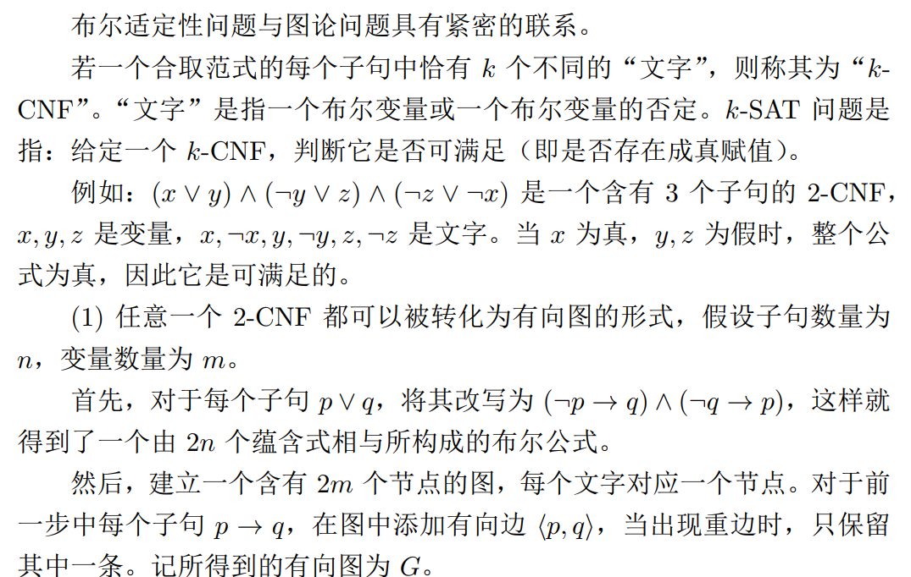

# HW8

## Q1

### (1)


#### (1.1)


由数学归纳法，

当v = s时，s到v的最短路径长度能够在第1轮确定，此时$\varphi(s,s) = 2$, 结论成立

设v的所有前驱结点集合为S，假设s到S的任意结点v‘， 都有s到v’的最短路径的长度能够在不超过第$\varphi(s,v')-1$轮确定

对所有$v'\rightarrow v$的边做一遍松弛操作，取能够更新的边对应$v'$的集合设为$S'$，此时确定了s到v的最短路径长度，设s经过$v'$到达v所含的节点数最少，由归纳假设知，第$\varphi(s,v')-1$轮已经确定了s到v的最短路径长度，边$v'\rightarrow v$会在$\varphi(s,v')$轮，或$\varphi(s,v')- 1$轮中进行relax，并确定s到v的最短路径长度

由$\varphi(s,v') = \varphi(s,v)  -1$

因此s到v的最短路径长度能够在不超过$\varphi(s,v)-1$轮中被确定

#### (1.2)


取$k = \frac{n}{2}$，对source = 1，$1 \rightarrow k+1$先入队的情况下，支配节点k+1会入队k次，也就是至少要做k轮循环遍历 即$\Theta(n)$轮，这时$T(n,m) = \Omega(nm)$

### (2)


#### (2.1)


原始Dijkstra算法无法处理负权边的原因是，dijkstra是基于贪心的策略，如果已经找到$u \rightarrow v$的最短边，会将v结点入队，这只是一种局部最优，若存在 $u \rightarrow w,w \rightarrow v$，虽然$u \rightarrow w$的权值比$u \rightarrow v$更大，但由于$w \rightarrow v$可以是负权边，因此可能后者是一个全局最优的策略，这时候dijkstra算法跑不出正确的结果。

算法2，对所有可以被松弛边<u, v>，如果v已经入队时，重新入队，也就是v可以被再访问一遍，因此可以更新负权边

.PNG)

如上图，对于原始dijkstra，当$u\rightarrow v$之后，v被标记为访问，无法用$w\rightarrow v$去更新，如果采用算法2，这时候v会重新入队，因此可以被更新。

#### (2.2)


所有有边权为2的边的顶顶点分别入队2,4,8, ..., $2^{n-1}$次，因此$T(n) = \Omega(2^n)$

## Q2

### (1)


#### (1.1)

对图3深度优先遍历

各结点的dfn值如下

$dfn[1] = 1,dfn[2] = 2, dfn[3] = 5,dfn[4] = 6,dfn[5]=9$

$dfn[6]=7,dfn[7]=8,dfn[8]=4.dfn[9]=3$

各结点的low值如下

$low[1] = 1, low[2] = 1, low[3] = 1,low[4] = 6,low[5]=6$

$low[6] = 1, low[7] = 7,low[8]=1,low[9]=1$

边的类型

$1\rightarrow 2:树边, 1\rightarrow 9:前向边,1\rightarrow 3:树边,1\rightarrow 7:树边$

$2\rightarrow9:树边$

$3\rightarrow 6:树边,3\rightarrow4:树边$

$5\rightarrow 4:横向边$

$6\rightarrow 1:后向边$

$7\rightarrow6:横向边$

$8\rightarrow 1:后向边$

$9\rightarrow8:树边$


#### (1.2)


dfn如下

$dfn[1] =1,dfn[2]=2,dfn[3]=5,dfn[4]=6,dfn[5]=7$

$dfn[6]=8,dfn[7]=9,dfn[8]=4,dfn[9]=3$

low如下

$low[1] = 1,low[2]=1,low[3] = 1,low[4] = 6,low[5] = 7$

$low[6]= 1,low[7] = 1,low[8] = 1, low[9] = 1$

树边：

$(1,2),(2,9),(9,8),(1,3),(3,4),(4,5),(3,6),(6,7)$

后向边：

$(1,9),(1,8),(1,6),(1,7)$

割点：1，3，4

桥：$(3,4), (4,5)$

### (2)


```c++
void tarjan(int u)
{
    dfn[u] = low[u] = ++timestamp;
    stk[++top] = u, in_stk[u] = true;
    for(int i = h[u]; i != -1; i = ne[i])
    {
        int j = e[i];
        if(!dfn[j])
        {
            tarjan(j);
            low[u] = min(low[u], low[j]);
        }
        else if(in_stk[j])
        {
            low[u] = min(low[u], dfn[j]);
        }
    }
}
```

邻接表存储一个图，用stk模拟栈实现DFS，同时in_stk表示是否访问过

对于low数组，其值等于所有它所有可达结点中low和本身dfn最小的，因此可以在dfs的过程中回溯的时候更新

### (3)


#### (3.1)

结点u搜索完毕后，如果low[u] = dfn[u]，说明以u为根节点的所有字数上以及栈中在u内的元素构成了一个强联通分量

删除这些栈上元素，重复操作就可以得到所有强联通分量

```c++
if(dfn[u] == low[u])
{
    int y;
    ++scc_cnt;
    do{
        y = stk[top--];
        in_stk[y] = false;
        id[y] = scc_cnt;
    }while(y != u)
}
```


#### (3.2)

对于一个结点u，子结点v，如果$low(v) \geq dfn(u)$，说明u是一个割点

特殊的，对于根节点，如果存在两个以上的子结点，则u是割点

#### (3.3)

边(u,v)为桥当且仅当$low(v) > dfn(u)$,（u，v）是一个树边

## Q3


### (2)


#### (2.1)

遍历所有s的入边<t,s>，对于每一条入边，由dijkstra算法求解s到t的最短路径，将入边权值与这条最短路径相加，求所有和中的最小值即可

dijkstra算法在用priority_queue优化的情况下时间复杂度是O（ElogV）的，一共要遍历O(E)次，因此时间复杂度为$O(E^2logV)$

#### (2.2)

在每次调用dijsktra算法的时候，删除<t,s>再调用，求出相应的入边权和最短路径和之后取最小值

## Q4

### (1)



#### (1.1)


### (2)


#### (2.1)


.PNG)

#### (2.2)


$(\lnot x \lor y \lor z)$中的$\lnot x$

$(x \lor \lnot y \lor z)$中的$\lnot y$

$(\lnot x \lor y \lor \lnot z)$中的$\lnot z$

令$\lnot x = \lnot y = \lnot z = 1，即x = y = z = 0$

是原公式的一个成真赋值

