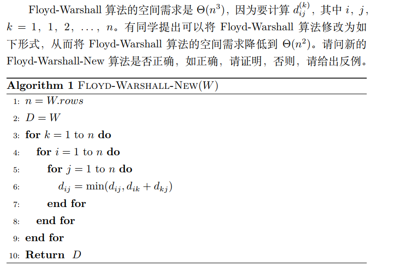
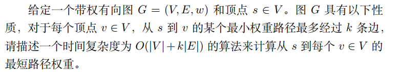
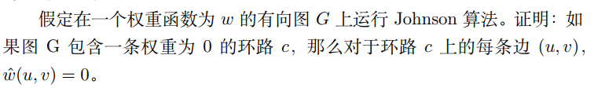
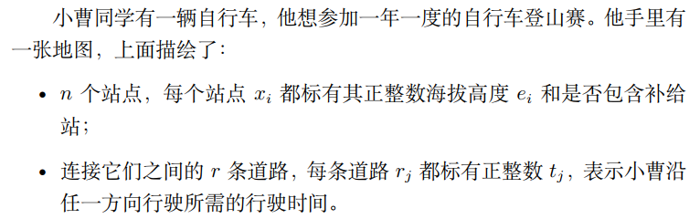
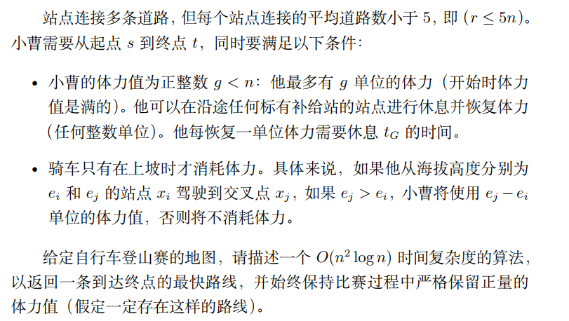

## hw9

### Q1

#### Question：



#### Answer：

正确

由Floyed算法的动态规划转移方程

$dp[i][j][k] = min(dp[i][j][k-1], dp[i][k][k-1]+dp[k][j][k-1])$

$dp[i][j][0] = w_{ij}$

在伪代码中$d_{ij}$即为转移方程中的dp，dp[i]\[j][k]表示从节点i到节点j，中间结点只用前k个结点的最短路径长度

由转移方程，第k个状态可以完全由第k-1个状态计算获得，因此由压缩数组的思想，可以将三维dp空间降低为二维，dp[i]\[j]表示当前从i到j的最短路径长度，因此算法是正确的

C++实现如下

```c++
#include<iostream>
#include<cstring>
#include<algorithm>
using namespace std;
const int N = 210, INF = 1e9;
int g[N][N];
int n, m, Q;
void floyd()
{
    for(int k = 1; k <= n; k++)
    {
        for(int i = 1; i <= n; i++)
        {
            for(int j = 1; j <= n; j++)
                g[i][j] = min(g[i][j], g[i][k] + g[k][j]);
        }
    }
}
int main(void)
{
    cin >> n >> m >> Q;
    // 初始化
    for(int i = 1; i <= n; i++)
    {
        for(int j = 1; j <= n; j++)
        {
            if(i == j) g[i][j] = 0;
            else g[i][j] = INF;
        }
    }
    while(m--)
    {
        int a, b, c;
        cin >> a >> b >> c;
        g[a][b] = min(g[a][b], c);
    }
    floyed();
    for(int i = 0 ;i < Q; i++)
    {
        int a, b;
        cin >> a >> b;
        if(g[a][b] > INF / 2) puts("impossible");
        else cout << g[a][b] << endl;
    }
    return 0;
}
```

### Q2

#### Question：



#### Answer：

初始化一个距离数组dist，dist[i]表示从s到顶点i的最短距离，对所有除了s以外的顶点初始化为$\infty$，dist[s] = 0

```
for i = 1 to k do
	for each edge(u,v) in G.E do
		RELAX(u, v, w)
```

执行完k次迭代后，dist包含所有从s出发到其他顶点的最短路径权重，至多包含k条边

时间复杂度为 $O(V + kE)$

### Q3

#### Question：



#### Answer：

由Bellman-ford算法的运行结果，对环路c上的每条边(u,v)，有$h(u) = h(v)$

故$\hat{w}(u,v) = w(u,v) + h(u)- h(v) = w(u,v) = 0$

因此，如果图G包含一条权重为0的环路c，那么对于环路c上的每条边(u,v),$\hat{w}(u,v) = 0$

### Q4

#### Question：





#### Answer：

问题等价于找到路径p，使得 $\forall (x_i,x_j) \in p, e_j -e_i \leq g$

初始化一个优先队列，其中元素是三元组（时间、位置、体力值）。将（0，起点，g）添加到队列中，表示从七点开始，时间为0，体力值为g

初始化一个二维数组dist，dist[i]\[j]表示到达位置i，体力值为j时的最短时间。初始化dist[i]\[j]设置为无穷大，dist[起点]\[g]，将其设置为0

当队列不为空时，

- 取队头元素
- 如果位置是终点，返回时间
- 对于从当前位置出发的每条边，如果体力值$\geq$消耗的体力是， $g + e_j - e_i + t_G < dist[next\_index][g-e_j+e_i + t_G]$，进行一次松弛操作

队列优化的dijkstra算法对全源顶点的时间复杂度是$O(n^2 logn)$的