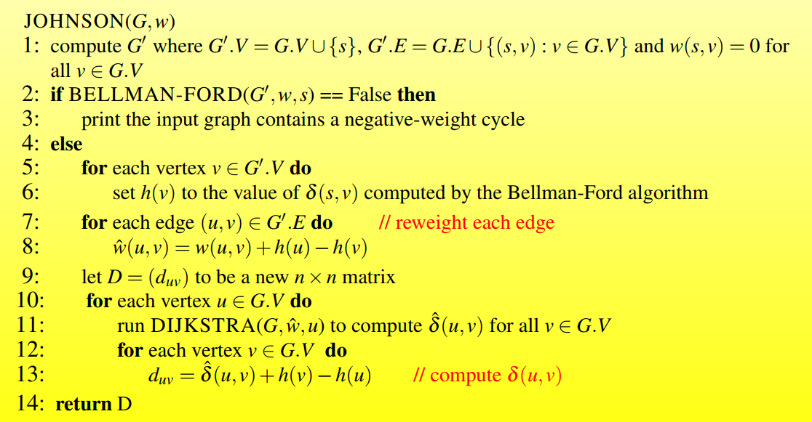
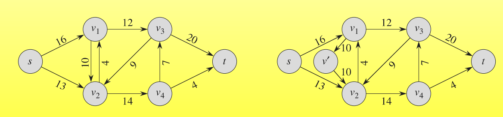
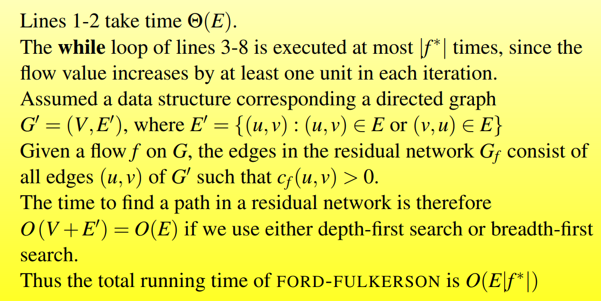

## 图论

### BFS

```text
BFS(G,s)
    // 初始化
	for each vertex u in G.V - {s}
		u.color = White
        u.d = infty
        u.pi = NULL
    // 起始节点s初始化
    s.color = Grey
    s.d = 0
    s.pi = NULL
    // 队列初始化
    Q = {}
    Enqueue(Q,s)
    while Q != {}
    	u = Dequeue(Q)
    	for each v in Adj[u]
    		if v.color = White
    			v.color = Grey
    			v.d = u.d + 1
    			v.pi = u
    			Enqueue(Q,v)
    	u.color = Black
```

### DFS


DFS的时间复杂度为 $\Theta(V+E)$

### 拓扑排序


### 强联通分量


### Kruskal算法


#### 时间复杂度


### Prim算法


#### 时间复杂度


### Bellman-Ford 算法

可以处理负权图，但是不能处理负权环，如果存在负权环，则返回false表明不存在一个最短路径方案


#### 时间复杂度

$O(VE)$

### Single-source Shortest Paths in DAGs


#### 时间复杂度

$O(V+ E)$

### Dijkstra算法

不能处理负权边，如果没有负权边，效率比BF要好


前驱子图是一个以s为起点的最短路径树


### All-Pairs Shorest Paths


#### The Floyed-Warshall algorithm


Floyed算法可以用来计算传递闭包，只需要将所有图中G的边赋予权重1，然后运行Floyed算法即可

一种优化传递闭包的方法：用or和and运算代替min和+运算


#### Johnsons algorithm for sparse graphs





### Maximum Flow


流网络建模


反平行边消除




多源多汇点问题的消除


#### FF method




##### EK算法


### String Matching


#### sliding window mechanism


#### The Naive Algorithm: Brute Force


	

#### The Rabin-Karp Algorithm


#### String matching with finite automata


#### KMP

